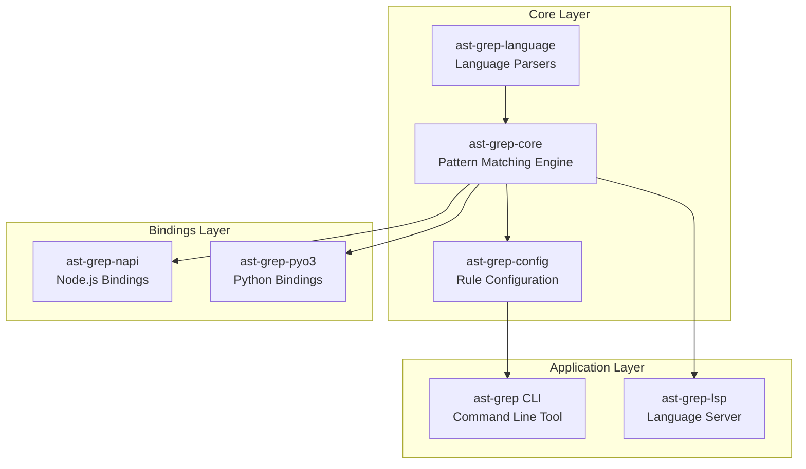

# ast-grep Architecture Documentation

> Scraped from https://deepwiki.com/ast-grep/ast-grep

This directory contains comprehensive architecture documentation for ast-grep, a fast and portable tool for code searching, linting, and rewriting using AST patterns.

## Overview

ast-grep is a code intelligence tool that leverages Abstract Syntax Trees (AST) for structural code search and transformation. Unlike traditional text-based search tools like grep, ast-grep understands the syntactic structure of code, enabling more precise and semantically meaningful pattern matching.

## Documentation Structure

### 1. Overview
- [Overview](./overview/1-overview.md) - Project overview and introduction
- [System Architecture](./overview/1.1-system-architecture.md) - High-level system design
- [Key Concepts](./overview/1.2-key-concepts.md) - Core concepts and terminology
- [Getting Started](./overview/1.3-getting-started.md) - Quick start guide

### 2. Core Library
- [Core Library](./core-library/2-core-library.md) - Core library overview
- [Node and Document API](./core-library/2.1-node-and-document-api.md) - Node traversal and document handling
- [Pattern Matching System](./core-library/2.2-pattern-matching-system.md) - Pattern matching algorithms
- [Meta-Variable System](./core-library/2.3-meta-variable-system.md) - Meta-variable capture and binding
- [Code Editing and Replacement](./core-library/2.4-code-editing-and-replacement.md) - Code transformation

### 3. Rule System
- [Rule System](./rule-system/3-rule-system.md) - Rule system overview
- [Rule Configuration Format](./rule-system/3.1-rule-configuration-format.md) - YAML rule configuration
- [Rule Components](./rule-system/3.2-rule-components.md) - Rule structure and components
- [Validation and Schema](./rule-system/3.3-validation-and-schema.md) - JSON schema validation
- [Testing Rules](./rule-system/3.4-testing-rules.md) - Rule testing framework
- [Project Configuration](./rule-system/3.5-project-configuration.md) - sgconfig.yml setup

### 4. Language Support
- [Language Support](./language-support/4-language-support.md) - Language support overview
- [Supported Languages](./language-support/4.1-supported-languages.md) - 25+ supported languages
- [Pattern Preprocessing](./language-support/4.2-pattern-preprocessing.md) - Language-specific preprocessing
- [Dynamic Language Loading](./language-support/4.3-dynamic-language-loading.md) - Custom parser loading
- [Language Injection](./language-support/4.4-language-injection.md) - Embedded language support

### 5. CLI Tool
- [CLI Tool](./cli-tool/5-cli-tool.md) - Command-line interface overview
- [Commands Overview](./cli-tool/5.1-commands-overview.md) - Available commands
- [Run Command](./cli-tool/5.2-run-command.md) - Pattern search command
- [Scan Command](./cli-tool/5.3-scan-command.md) - Rule-based scanning
- [New Command](./cli-tool/5.4-new-command.md) - Interactive rule creation
- [Output Formatting](./cli-tool/5.5-output-formatting.md) - Output formats and options
- [Interactive Mode](./cli-tool/5.6-interactive-mode.md) - Interactive REPL

### 6. Language Server Protocol
- [Language Server Protocol](./lsp/6-language-server-protocol.md) - LSP integration overview
- [LSP Architecture](./lsp/6.1-lsp-architecture.md) - LSP server implementation
- [Editor Integration](./lsp/6.2-editor-integration.md) - IDE/editor setup

### 7. Node.js Integration
- [Node.js Integration](./nodejs-integration/7-nodejs-integration.md) - JavaScript/TypeScript bindings
- [NAPI API Reference](./nodejs-integration/7.1-napi-api-reference.md) - API documentation
- [Package Structure](./nodejs-integration/7.2-package-structure.md) - npm package organization
- [Async Operations](./nodejs-integration/7.3-async-operations.md) - Async APIs
- [Language Modules](./nodejs-integration/7.4-language-modules.md) - Language-specific modules

### 8. Python Integration
- [Python Integration](./python-integration/8-python-integration.md) - Python bindings overview
- [Python API](./python-integration/8.1-python-api.md) - API documentation
- [Package Distribution](./python-integration/8.2-package-distribution.md) - PyPI distribution

### 9. Distribution and Packaging
- [Distribution and Packaging](./distribution/9-distribution-and-packaging.md) - Multi-platform distribution
- [npm CLI Wrapper](./distribution/9.1-npm-cli-wrapper.md) - npm package structure
- [Cross-Platform Builds](./distribution/9.2-cross-platform-builds.md) - Build matrix
- [Release Process](./distribution/9.3-release-process.md) - Release automation

### 10. Development
- [Development](./development/10-development.md) - Development setup
- [Workspace Structure](./development/10.1-workspace-structure.md) - Cargo workspace
- [Build System](./development/10.2-build-system.md) - Build configuration
- [CI/CD Pipeline](./development/10.3-cicd-pipeline.md) - GitHub Actions workflows
- [Development Tools](./development/10.4-development-tools.md) - xtask utility

## Key Features

- **AST-based Pattern Matching**: Structural code search that understands syntax
- **25+ Language Support**: JavaScript, TypeScript, Python, Rust, Go, and more
- **Meta-variable System**: Capture and transform code patterns
- **Rule-based Linting**: YAML configuration for reusable rules
- **Code Rewrite**: Automated code transformations
- **IDE Integration**: LSP support for VS Code, Neovim, and other editors
- **Multi-platform**: npm, PyPI, crates.io, and GitHub Releases

## Architecture Highlights

### 11. Performance Optimisations
- [Search Speed Optimisations](./search-speed-optimisations.md) - Eight architectural optimisations for the search pipeline

## Source

This documentation was scraped from [DeepWiki](https://deepwiki.com/ast-grep/ast-grep) on March 12, 2026.

- **Repository**: https://github.com/ast-grep/ast-grep
- **Last Indexed Commit**: [3ae01a](https://github.com/ast-grep/ast-grep/commits/3ae01aec)
- **Version**: 0.40.5
