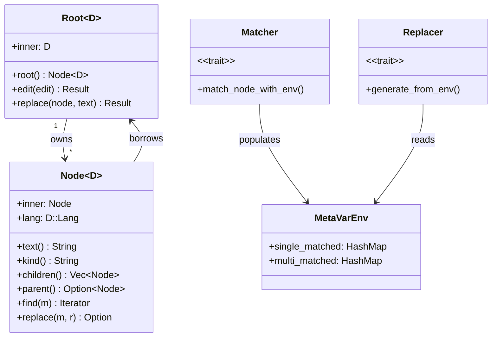
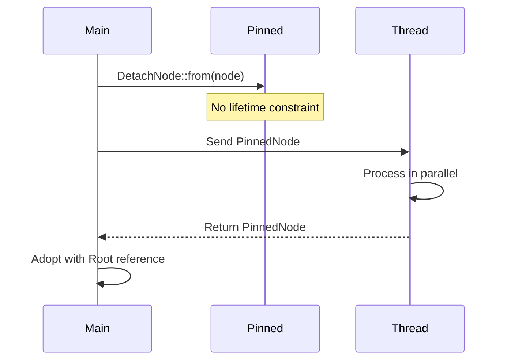
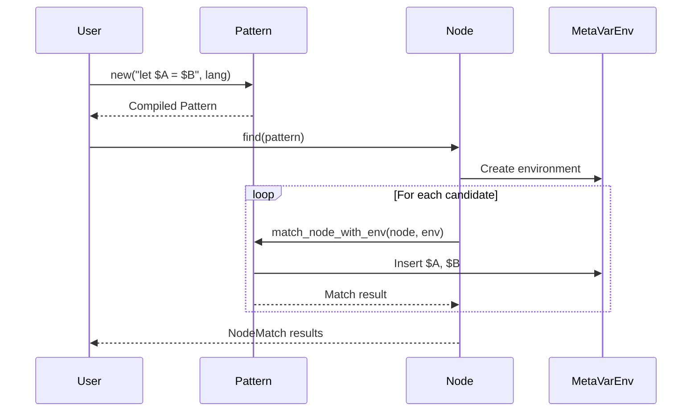
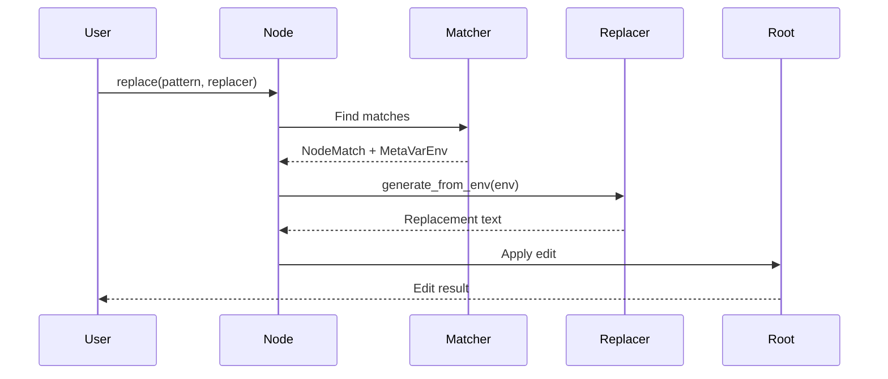
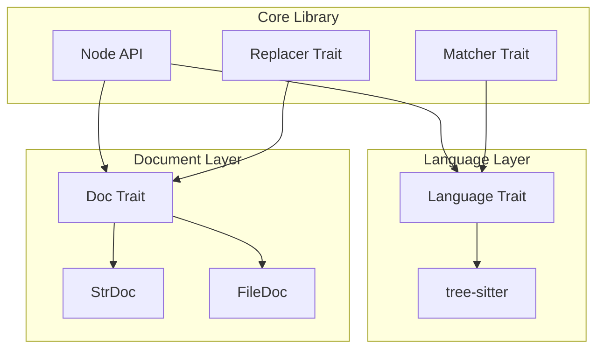

# Core Library

> **Source:** https://deepwiki.com/ast-grep/ast-grep/2-core-library

**Relevant source files:**

- [crates/core/src/lib.rs](https://github.com/ast-grep/ast-grep/blob/3ae01aec/crates/core/src/lib.rs)
- [crates/core/src/matcher.rs](https://github.com/ast-grep/ast-grep/blob/3ae01aec/crates/core/src/matcher.rs)
- [crates/core/src/meta_var.rs](https://github.com/ast-grep/ast-grep/blob/3ae01aec/crates/core/src/meta_var.rs)
- [crates/core/src/node.rs](https://github.com/ast-grep/ast-grep/blob/3ae01aec/crates/core/src/node.rs)
- [crates/core/src/replacer.rs](https://github.com/ast-grep/ast-grep/blob/3ae01aec/crates/core/src/replacer.rs)

The `ast-grep-core` crate provides the fundamental AST manipulation, pattern matching, and code replacement capabilities that power all ast-grep interfaces. This library implements the core algorithms for parsing source code into abstract syntax trees, searching for patterns, capturing meta-variables, and generating code modifications. All end-user interfaces (CLI, Node.js bindings, LSP, Python bindings) depend on this core library.

For information about how rules are defined and configured, see [Rule System](../rule-system/3-rule-system.md). For details on language support and parsers, see [Language Support](../language-support/4-language-support.md).

**Sources:** [crates/core/src/lib.rs1-32](https://github.com/ast-grep/ast-grep/blob/3ae01aec/crates/core/src/lib.rs#L1-L32)

## Architecture Overview

The core library is organized around several key abstractions that work together to enable AST-based code analysis and transformation:

### Core Type System

**Figure 1: Core Library Type System** - The ownership model separates document ownership (Root) from tree traversal (Node). Pattern matching populates MetaVarEnv with captured variables, which the Replacer uses to generate code modifications.



**Sources:** [crates/core/src/node.rs47-120](https://github.com/ast-grep/ast-grep/blob/3ae01aec/crates/core/src/node.rs#L47-L120) [crates/core/src/matcher.rs24-48](https://github.com/ast-grep/ast-grep/blob/3ae01aec/crates/core/src/matcher.rs#L24-L48) [crates/core/src/meta_var.rs14-21](https://github.com/ast-grep/ast-grep/blob/3ae01aec/crates/core/src/meta_var.rs#L14-L21) [crates/core/src/replacer.rs18-29](https://github.com/ast-grep/ast-grep/blob/3ae01aec/crates/core/src/replacer.rs#L18-L29)

### Generic Parameters

The core library is generic over two key types:

| Generic | Constraint | Purpose |
|---------|------------|---------|
| `D` | `Doc` | Document type (in-memory string, file-backed, UTF-16) |
| `'r` | Rust lifetime | Ensures nodes cannot outlive their root document |

The `Doc` trait abstracts over different source representations, allowing the same algorithms to work with strings, files, or different text encodings. The lifetime parameter `'r` enforces Rust's borrow checker rules to prevent dangling references.

**Sources:** [crates/core/src/source.rs](https://github.com/ast-grep/ast-grep/blob/3ae01aec/crates/core/src/source.rs) [crates/core/src/node.rs47-120](https://github.com/ast-grep/ast-grep/blob/3ae01aec/crates/core/src/node.rs#L47-L120)

## Type Relationships

**Figure 2: API Call Flow** - The library provides convenience implementations allowing strings to be used directly as matchers and replacers through trait implementations.

```rust
// Convenience: &str implements Matcher
node.matches("let $A = $B")  // equivalent to Pattern::new("let $A = $B")

// Convenience: &str implements Replacer
node.replace("let $A = $B", "const $A = $B")
```

**Sources:** [crates/core/src/lib.rs30-32](https://github.com/ast-grep/ast-grep/blob/3ae01aec/crates/core/src/lib.rs#L30-L32) [crates/core/src/matcher.rs73-87](https://github.com/ast-grep/ast-grep/blob/3ae01aec/crates/core/src/matcher.rs#L73-L87) [crates/core/src/replacer.rs31-35](https://github.com/ast-grep/ast-grep/blob/3ae01aec/crates/core/src/replacer.rs#L31-L35)

## Ownership and Borrowing Model

The core library uses Rust's ownership system to ensure memory safety without runtime overhead:

1. **Root<D>** owns the document and tree-sitter parse tree
2. **Node<'r, D>** borrows from Root with lifetime `'r`
3. Nodes can be cloned cheaply (they're just pointers + lifetime)
4. Traversal operations return new Node instances with the same lifetime

This design ensures that:

- The source text remains valid as long as nodes reference it
- Multiple nodes can reference the same document simultaneously
- The borrow checker prevents use-after-free at compile time

### Example Ownership Pattern

```rust
// Root owns the parsed document
let root = Root::new("let x = 1", TypeScript)?;

// Nodes borrow from root with lifetime 'r
let node = root.root();

// Can traverse and clone cheaply
let first_child = node.children().next().unwrap();
let cloned = first_child.clone(); // just copies pointer

// Compile error: cannot outlive root
// let dangling = node; // if root dropped here
```

**Sources:** [crates/core/src/node.rs47-112](https://github.com/ast-grep/ast-grep/blob/3ae01aec/crates/core/src/node.rs#L47-L112) [crates/core/src/lib.rs44-50](https://github.com/ast-grep/ast-grep/blob/3ae01aec/crates/core/src/lib.rs#L44-L50)

## Module Organization

The core library is divided into several modules:

| Module | Purpose | Key Types |
|--------|---------|-----------|
| `node` | Tree structure and traversal | `Root<D>`, `Node<'r, D>`, `Position` |
| `matcher` | Pattern matching | `Matcher` trait, `Pattern`, `KindMatcher`, `RegexMatcher` |
| `meta_var` | Variable capture and storage | `MetaVarEnv`, `MetaVariable` enum |
| `replacer` | Code generation | `Replacer` trait, `TemplateFix`, `Edit` |
| `source` | Document abstraction | `Doc` trait, `Content` trait, `Edit` struct |
| `language` | Parser interface | `Language` trait |
| `ops` | Relational operators | `Op` enum for composing matchers |

**Sources:** [crates/core/src/lib.rs9-17](https://github.com/ast-grep/ast-grep/blob/3ae01aec/crates/core/src/lib.rs#L9-L17)

## Threading Model

**Figure 3: Threading and Pinned Data** - The `pinned` module provides types that can be safely sent across threads by detaching nodes from their lifetime, then re-adopting them with the correct Root reference.



**Sources:** [crates/core/src/pinned.rs](https://github.com/ast-grep/ast-grep/blob/3ae01aec/crates/core/src/pinned.rs) [crates/core/src/node.rs106-111](https://github.com/ast-grep/ast-grep/blob/3ae01aec/crates/core/src/node.rs#L106-L111)

## Common Usage Patterns

### Pattern Matching Flow

**Figure 4: Pattern Matching Sequence** - The matching process creates a Pattern from a string, attempts to match it against nodes, and captures meta-variables in MetaVarEnv.



**Sources:** [crates/core/src/node.rs319-321](https://github.com/ast-grep/ast-grep/blob/3ae01aec/crates/core/src/node.rs#L319-L321) [crates/core/src/matcher.rs54-68](https://github.com/ast-grep/ast-grep/blob/3ae01aec/crates/core/src/matcher.rs#L54-L68) [crates/core/src/meta_var.rs32-39](https://github.com/ast-grep/ast-grep/blob/3ae01aec/crates/core/src/meta_var.rs#L32-L39)

### Replacement Flow

**Figure 5: Code Replacement Sequence** - Replacement finds a match, generates replacement text from the captured variables, and applies the edit to the document.



**Sources:** [crates/core/src/node.rs341-345](https://github.com/ast-grep/ast-grep/blob/3ae01aec/crates/core/src/node.rs#L341-L345) [crates/core/src/replacer.rs18-29](https://github.com/ast-grep/ast-grep/blob/3ae01aec/crates/core/src/replacer.rs#L18-L29)

## Integration Points

The core library is designed to be language-agnostic through the `Language` and `Doc` traits:

**Figure 6: Language and Document Abstraction** - The generic design allows the core library to work with any language parser (via Language trait) and any document representation (via Doc trait).



**Sources:** [crates/core/src/language.rs](https://github.com/ast-grep/ast-grep/blob/3ae01aec/crates/core/src/language.rs) [crates/core/src/source.rs](https://github.com/ast-grep/ast-grep/blob/3ae01aec/crates/core/src/source.rs) [crates/core/src/tree_sitter.rs](https://github.com/ast-grep/ast-grep/blob/3ae01aec/crates/core/src/tree_sitter.rs)

## Error Handling

The core library uses `Result<T, String>` for operations that can fail:

| Operation | Error Condition | Example |
|-----------|-----------------|---------|
| `Pattern::new()` | Invalid pattern syntax | Missing closing parenthesis |
| `Root::edit()` | Edit out of bounds | Position > document length |
| `Root::replace()` | Edit application fails | Concurrent modifications |
| `RegexMatcher::new()` | Invalid regex | Unclosed character class |

Most matching operations return `Option<T>` rather than `Result`, with `None` indicating "no match found" rather than an error condition.

**Sources:** [crates/core/src/matcher.rs](https://github.com/ast-grep/ast-grep/blob/3ae01aec/crates/core/src/matcher.rs) [crates/core/src/node.rs71-74](https://github.com/ast-grep/ast-grep/blob/3ae01aec/crates/core/src/node.rs#L71-L74) [crates/core/src/replacer.rs](https://github.com/ast-grep/ast-grep/blob/3ae01aec/crates/core/src/replacer.rs)

## Performance Characteristics

The core library is designed for performance:

| Operation | Time Complexity | Notes |
|-----------|-----------------|-------|
| `root()` | O(1) | Creates borrowed view |
| `find()` | O(n) | DFS traversal |
| `find_all()` | O(n) | DFS with filtering |
| `replace()` | O(n + m) | Find match + generate replacement |
| `children()` | O(1) | Iterator creation |
| `text()` | O(n) | May require UTF-8 validation |

Where n = number of nodes, m = size of replacement text.

**Sources:** [crates/core/src/node.rs216-337](https://github.com/ast-grep/ast-grep/blob/3ae01aec/crates/core/src/node.rs#L216-L337)
