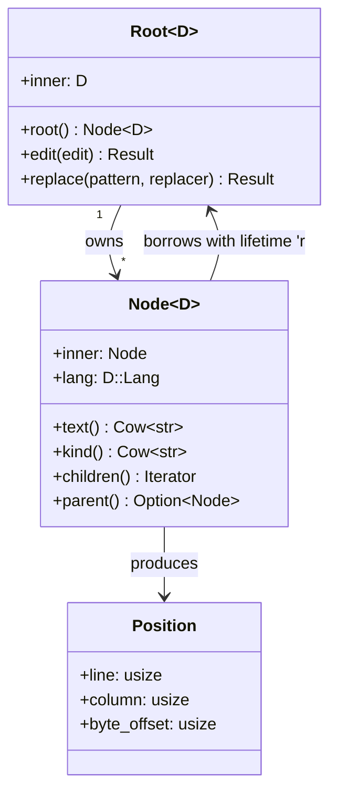

# Node and Document API

> **Source:** https://deepwiki.com/ast-grep/ast-grep/2.1-node-and-document-api

**Relevant source files:**

- [crates/core/src/lib.rs](https://github.com/ast-grep/ast-grep/blob/3ae01aec/crates/core/src/lib.rs)
- [crates/core/src/matcher.rs](https://github.com/ast-grep/ast-grep/blob/3ae01aec/crates/core/src/matcher.rs)
- [crates/core/src/meta_var.rs](https://github.com/ast-grep/ast-grep/blob/3ae01aec/crates/core/src/meta_var.rs)
- [crates/core/src/node.rs](https://github.com/ast-grep/ast-grep/blob/3ae01aec/crates/core/src/node.rs)
- [crates/core/src/replacer.rs](https://github.com/ast-grep/ast-grep/blob/3ae01aec/crates/core/src/replacer.rs)

This document describes the fundamental types for representing and manipulating Abstract Syntax Trees in ast-grep-core: `Root<D>` and `Node<'r, D>`. These types provide the primary interface for inspecting AST structure, traversing trees, and performing code transformations.

For pattern matching capabilities built on top of nodes, see [Pattern Matching System](./2.2-pattern-matching-system.md). For code editing and replacement operations, see [Code Editing and Replacement](./2.4-code-editing-and-replacement.md).

---

## Purpose and Scope

The Node and Document API defines the core data structures that represent parsed code and provide methods to navigate, query, and modify Abstract Syntax Trees. The design uses Rust's ownership system to ensure that AST nodes cannot outlive their source document, preventing use-after-free errors while enabling efficient tree traversal without copying.

**Sources:** [crates/core/src/node.rs1-573](https://github.com/ast-grep/ast-grep/blob/3ae01aec/crates/core/src/node.rs#L1-L573) [crates/core/src/lib.rs1-96](https://github.com/ast-grep/ast-grep/blob/3ae01aec/crates/core/src/lib.rs#L1-L96)

---

## Type System and Ownership Model

### Core Types



**Sources:** [crates/core/src/node.rs47-120](https://github.com/ast-grep/ast-grep/blob/3ae01aec/crates/core/src/node.rs#L47-L120) [crates/core/src/node.rs115-120](https://github.com/ast-grep/ast-grep/blob/3ae01aec/crates/core/src/node.rs#L115-L120)

### Root<D>: Document Owner

The `Root<D>` type owns both the source text and the parsed tree-sitter AST. It is generic over the `Doc` trait, allowing different document implementations (in-memory strings, file-backed sources, etc.).

| Method | Signature | Purpose |
|--------|-----------|---------|
| `doc(doc: D)` | `Self` | Construct from a `Doc` implementation |
| `root()` | `Node<'_, D>` | Get the root node of the AST |
| `lang()` | `&D::Lang` | Access the language implementation |
| `edit(&mut self, edit: Edit<D>)` | `Result<&mut Self, String>` | Apply an edit to the document |
| `replace(&mut self, pattern, replacer)` | `Result<bool, String>` | Find and replace pattern matches |
| `adopt(&self, inner: D::Node<'r>)` | `Node<'r, D>` | Wrap a tree-sitter node |

**Example usage pattern:**

```rust
// Parse source code
let root = Root::new("let x = 1", TypeScript)?;

// Get root node for traversal
let node = root.root();

// Access document content
println!("Source: {}", node.text());
```

The `Root<D>` type ensures exclusive ownership of the document, allowing safe in-place modifications through the `edit()` method.

**Sources:** [crates/core/src/node.rs47-112](https://github.com/ast-grep/ast-grep/blob/3ae01aec/crates/core/src/node.rs#L47-L112) [crates/core/src/lib.rs30-32](https://github.com/ast-grep/ast-grep/blob/3ae01aec/crates/core/src/lib.rs#L30-L32)

### Node<'r, D>: Borrowed AST View

The `Node<'r, D>` type represents a borrowed reference to an AST node. The lifetime parameter `'r` ties the node to its owning `Root`, ensuring nodes cannot outlive the document.

```rust
pub struct Node<'r, D: Doc> {
    inner: Node<'r>,
    lang: D::Lang,
}
```

Key characteristics:
- Cheap to clone (just copies a pointer)
- Lifetime-bound to root document
- Supports tree traversal, matching, and replacement

**Sources:** [crates/core/src/node.rs115-120](https://github.com/ast-grep/ast-grep/blob/3ae01aec/crates/core/src/node.rs#L115-L120)

---

## Node Inspection API

The inspection API provides read-only access to node properties without traversing the tree structure.

### Basic Properties

| Method | Return Type | Description |
|--------|-------------|-------------|
| `kind()` | `Cow<'r, str>` | AST node type (e.g., "function_declaration") |
| `kind_id()` | `u16` | Numeric kind identifier |
| `is_named()` | `bool` | Is this a named node? |
| `is_leaf()` | `bool` | Has no children |
| `is_error()` | `bool` | Represents a parse error |
| `text()` | `Cow<'r, str>` | Source text for this node |
| `node_id()` | `usize` | Unique identifier |

**Sources:** [crates/core/src/node.rs124-188](https://github.com/ast-grep/ast-grep/blob/3ae01aec/crates/core/src/node.rs#L124-L188)

### Position and Range

The `Position` struct represents a location in source code using zero-based line and column offsets. Unlike tree-sitter's byte-based positions, the `column()` method returns character offsets.

| Field/Method | Type | Description |
|--------------|------|-------------|
| `line` | `usize` | Zero-based line number |
| `byte_column` | `usize` | Zero-based byte offset within line |
| `byte_offset` | `usize` | Absolute byte offset in document |
| `column<D>(&self, node: &Node<D>)` | `usize` | **Character** column (O(n) operation) |

**Node position methods:**

- `start_pos() → Position` - Starting position of the node
- `end_pos() → Position` - Ending position of the node
- `range() → Range<usize>` - Byte range in the document

**Important:** Accessing `column()` is an O(n) operation because it must decode UTF-8 characters from the start of the line to compute the character-based column offset.

**Sources:** [crates/core/src/node.rs11-45](https://github.com/ast-grep/ast-grep/blob/3ae01aec/crates/core/src/node.rs#L11-L45) [crates/core/src/node.rs157-175](https://github.com/ast-grep/ast-grep/blob/3ae01aec/crates/core/src/node.rs#L157-L175)

---

## Tree Traversal API

The traversal API provides methods for navigating the AST hierarchy and iterating over related nodes.

### Hierarchical Navigation

| Method | Return Type | Description |
|--------|-------------|-------------|
| `parent()` | `Option<Node<'r, D>>` | Direct parent |
| `ancestors()` | `impl Iterator` | All ancestors up to root |
| `child(n)` | `Option<Node<'r, D>>` | Nth child (0-indexed) |
| `children()` | `impl Iterator` | All direct children |
| `next()` | `Option<Node<'r, D>>` | Next sibling |
| `prev()` | `Option<Node<'r, D>>` | Previous sibling |
| `next_all()` | `impl Iterator` | All following siblings |
| `prev_all()` | `impl Iterator` | All preceding siblings |

**Sources:** [crates/core/src/node.rs216-337](https://github.com/ast-grep/ast-grep/blob/3ae01aec/crates/core/src/node.rs#L216-L337)

### Field Access

Tree-sitter grammars define named fields for node children (e.g., a class declaration may have `name` and `body` fields). The Node API provides both string-based and ID-based field access:

```rust
// Access named field
if let Some(name) = node.field("name") {
    println!("Name: {}", name.text());
}

// Access body field
if let Some(body) = node.field("body") {
    for stmt in body.children() {
        process(stmt);
    }
}
```

| Method | Return Type | Description |
|--------|-------------|-------------|
| `field(name)` | `Option<Node>` | Get named field |
| `field_children()` | `impl Iterator` | All field children |

**Sources:** [crates/core/src/node.rs242-264](https://github.com/ast-grep/ast-grep/blob/3ae01aec/crates/core/src/node.rs#L242-L264)

### Depth-First Search

The `dfs()` method returns an iterator that traverses the entire subtree rooted at the current node in depth-first order:

```rust
// Visit every node in the tree
for node in root.root().dfs() {
    println!("{}: {}", node.kind(), node.text());
}
```

This is the foundation for `find()` and `find_all()` methods, which search for pattern matches within the subtree.

**Sources:** [crates/core/src/node.rs311-316](https://github.com/ast-grep/ast-grep/blob/3ae01aec/crates/core/src/node.rs#L311-L316)

---

## Pattern Matching Integration

Nodes integrate directly with the `Matcher` trait to support pattern-based queries and relational predicates.

### Finding Matches

```rust
// Find first match
if let Some(m) = node.find(&pattern) {
    println!("Found: {}", m.text());
}

// Find all matches
for m in node.find_all(&pattern) {
    println!("Match at {:?}", m.range());
}
```

**Sources:** [crates/core/src/node.rs319-337](https://github.com/ast-grep/ast-grep/blob/3ae01aec/crates/core/src/node.rs#L319-L337)

### Relational Predicates

The Node API provides relational query methods that test spatial relationships between nodes:

| Method | Description |
|--------|-------------|
| `matches(m)` | Tests if the node itself matches `m` |
| `inside(m)` | Tests if any ancestor matches `m` |
| `has(m)` | Tests if any descendant matches `m` |
| `precedes(m)` | Tests if any following sibling matches `m` |
| `follows(m)` | Tests if any preceding sibling matches `m` |

**Implementation details:**

- `inside(m)` searches ancestors until the root
- `has(m)` performs DFS on descendants (skipping self)
- `precedes(m)` searches following siblings in order
- `follows(m)` searches preceding siblings in reverse order

**Example usage:**

```rust
// Check if function is inside a class
if node.inside(&KindMatcher::new("class_declaration")) {
    println!("Method found");
}

// Check if node has a return statement
if node.has(&KindMatcher::new("return_statement")) {
    println!("Has return");
}
```

These correspond to the rule combinators `inside`, `has`, `precedes`, and `follows` used in YAML rules.

**Sources:** [crates/core/src/node.rs190-213](https://github.com/ast-grep/ast-grep/blob/3ae01aec/crates/core/src/node.rs#L190-L213)

---

## Tree Manipulation API

The manipulation API creates `Edit` objects that describe text modifications. These edits can be applied to a `Root<D>` to transform the document.

### Edit Operations

| Method | Description |
|--------|-------------|
| `replace<M, R>(&self, matcher: M, replacer: R)` | Generate edit for replacement |
| `make_edit(&self, text: D::Source)` | Create edit from text |

**Sources:** [crates/core/src/node.rs340-381](https://github.com/ast-grep/ast-grep/blob/3ae01aec/crates/core/src/node.rs#L340-L381)

### Edit Structure

The `Edit<D>` type represents a single text modification:

```rust
pub struct Edit<D: Doc> {
    position: usize,        // Byte offset where edit starts
    deleted_length: usize,  // Number of bytes to delete
    inserted_text: D::Source, // Text to insert
}
```

**Example: Node removal**

```rust
// Remove a node by replacing with empty string
let edit = node.make_edit("");
root.edit(edit)?;
```

**Sources:** [crates/core/src/node.rs373-380](https://github.com/ast-grep/ast-grep/blob/3ae01aec/crates/core/src/node.rs#L373-L380) [crates/core/src/source.rs](https://github.com/ast-grep/ast-grep/blob/3ae01aec/crates/core/src/source.rs)

### Applying Edits

Edits created by node methods must be applied through the `Root<D>` owner:

```rust
// Method 1: High-level replace
root.replace(&pattern, &replacer)?;

// Method 2: Low-level edit
let edit = Edit {
    position: 10,
    deleted_length: 5,
    inserted_text: "new_text".into(),
};
root.edit(&edit)?;
```

**Sources:** [crates/core/src/node.rs71-89](https://github.com/ast-grep/ast-grep/blob/3ae01aec/crates/core/src/node.rs#L71-L89)

---

## Generic Document Abstraction

The `Doc` trait abstracts over different document implementations, allowing the Node API to work with various source representations without coupling to specific types.

```rust
pub trait Doc: Debug {
    type Source;
    type Lang: Language;
    
    fn get_lang(&self) -> &Self::Lang;
    fn get_source(&self) -> &Self::Source;
}
```

**Key trait methods:**

- `get_lang() → &Self::Lang` - Access the language parser
- `get_source() → &Self::Source` - Access the underlying text
- `root_node() → Self::Node<'_>` - Get the AST root
- `do_edit(&mut self, edit: &Edit<Self::Source>)` - Apply a text edit

This abstraction allows `Node<'r, D>` to work uniformly across different document types while maintaining type safety and zero-cost abstractions.

**Sources:** [crates/core/src/node.rs3-6](https://github.com/ast-grep/ast-grep/blob/3ae01aec/crates/core/src/node.rs#L3-L6) [crates/core/src/lib.rs28](https://github.com/ast-grep/ast-grep/blob/3ae01aec/crates/core/src/lib.rs#L28-L28)

---

## Ownership and Safety Guarantees

The Node API leverages Rust's type system to prevent common errors in AST manipulation:

### Borrow Checker Integration

```rust
// Compile-time safety: nodes cannot outlive root
let root = Root::new(source, lang);
let node = root.root();

// This would fail to compile if root was dropped:
// let dangling = node; // Error: root does not live long enough
```

**Sources:** [crates/core/src/node.rs115-120](https://github.com/ast-grep/ast-grep/blob/3ae01aec/crates/core/src/node.rs#L115-L120) [crates/core/src/node.rs76-89](https://github.com/ast-grep/ast-grep/blob/3ae01aec/crates/core/src/node.rs#L76-L89)

### Adoption Pattern

The `adopt()` method wraps a raw tree-sitter node with a `Node<'r, D>`, establishing the lifetime relationship:

```rust
// Wrap a raw node with proper lifetime
let node = root.adopt(ts_node);
```

The `check_lineage()` debug assertion verifies that the inner node is actually a descendant of this root, catching misuse in development builds.

**Sources:** [crates/core/src/node.rs91-104](https://github.com/ast-grep/ast-grep/blob/3ae01aec/crates/core/src/node.rs#L91-L104)

---

## Summary Tables

### Node Inspection Methods

| Category | Methods | Return Type |
|----------|---------|-------------|
| **Type information** | `kind()`, `kind_id()`, `is_named()` | `Cow<str>`, `u16`, `bool` |
| **State checks** | `is_leaf()`, `is_named_leaf()`, `is_error()`, `is_missing()` | `bool` |
| **Content access** | `text()`, `range()` | `Cow<'r, str>`, `Range<usize>` |
| **Position** | `start_pos()`, `end_pos()` | `Position` |
| **Identity** | `node_id()` | `usize` |

### Node Traversal Methods

| Direction | Single Node | Iterator |
|-----------|-------------|----------|
| **Upward** | `parent()` | `ancestors()` |
| **Downward** | `child(n)`, `field(name)` | `children()`, `field_children()`, `dfs()` |
| **Horizontal** | `next()`, `prev()` | `next_all()`, `prev_all()` |

### Root Methods

| Method | Parameters | Returns | Purpose |
|--------|------------|---------|---------|
| `root()` | none | `Node<'_, D>` | Get root node |
| `edit()` | `Edit<D>` | `Result<&mut Self>` | Apply single edit |
| `replace()` | `Matcher`, `Replacer` | `Result<bool>` | Find and replace |
| `adopt()` | `D::Node<'r>` | `Node<'r, D>` | Wrap tree-sitter node |

**Sources:** [crates/core/src/node.rs124-381](https://github.com/ast-grep/ast-grep/blob/3ae01aec/crates/core/src/node.rs#L124-L381)
