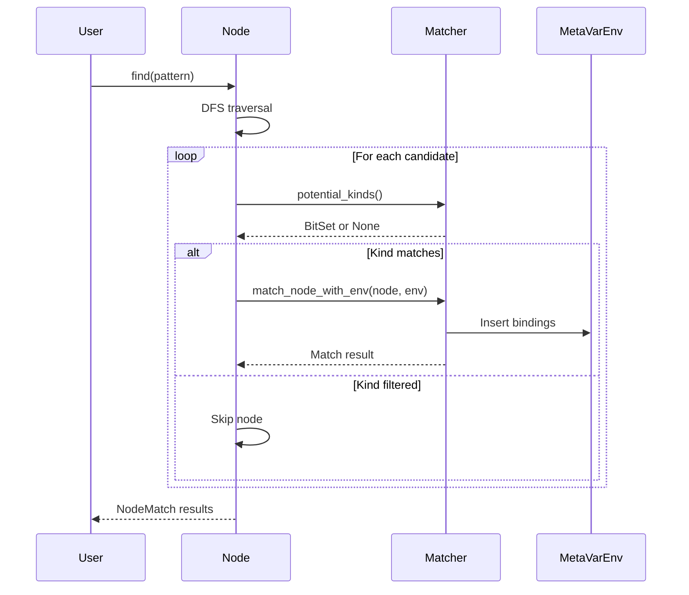

# Pattern Matching System

> **Source:** https://deepwiki.com/ast-grep/ast-grep/2.2-pattern-matching-system

**Relevant source files:**

- [crates/core/src/lib.rs](https://github.com/ast-grep/ast-grep/blob/3ae01aec/crates/core/src/lib.rs)
- [crates/core/src/matcher.rs](https://github.com/ast-grep/ast-grep/blob/3ae01aec/crates/core/src/matcher.rs)
- [crates/core/src/meta_var.rs](https://github.com/ast-grep/ast-grep/blob/3ae01aec/crates/core/src/meta_var.rs)
- [crates/core/src/node.rs](https://github.com/ast-grep/ast-grep/blob/3ae01aec/crates/core/src/node.rs)
- [crates/core/src/replacer.rs](https://github.com/ast-grep/ast-grep/blob/3ae01aec/crates/core/src/replacer.rs)

The Pattern Matching System provides the core abstraction for identifying specific nodes within an Abstract Syntax Tree. This system enables ast-grep to locate code constructs using pattern-based queries, type filters, or regular expressions. For information about capturing and using matched meta-variables, see [Meta-Variable System](./2.3-meta-variable-system.md). For information about code modification using match results, see [Code Editing and Replacement](./2.4-code-editing-and-replacement.md).

## Matcher Trait

The `Matcher` trait defines the fundamental interface for all pattern matching operations in ast-grep. Any type implementing this trait can determine whether a tree-sitter node matches certain criteria and populate meta-variable bindings during the matching process.

```rust
pub trait Matcher<D: Doc> {
    fn match_node_with_env<'tree>(
        &self,
        node: Node<'tree, D>,
        env: Cow<MetaVarEnv<'tree, D>>,
    ) -> Option<Node<'tree, D>>;

    fn potential_kinds(&self) -> Option<BitSet> { None }
    fn get_match_len(&self, _node: &Node<D>) -> Option<usize> { None }
}
```

**Core Methods:**

| Method | Purpose | Return Value |
|--------|---------|--------------|
| `match_node_with_env` | Determines if a node matches and updates meta-variables | `Some(node)` on match, `None` on failure |
| `potential_kinds` | Returns node kind IDs this matcher could match | `None` = match any kind; `Some(BitSet)` = specific kinds only |
| `get_match_len` | Determines replacement length excluding trailing punctuation | Used during code replacement operations |

The `match_node_with_env` method accepts a `Cow<MetaVarEnv>` parameter, allowing efficient copy-on-write semantics when meta-variables are captured. If no variables need updating, the environment remains borrowed; otherwise, it's cloned for modification.

**Sources:** [crates/core/src/matcher.rs24-48](https://github.com/ast-grep/ast-grep/blob/3ae01aec/crates/core/src/matcher.rs#L24-L48)

## Pattern Implementation

`Pattern` is the primary matcher implementation that performs tree-structure-based matching. It compiles pattern strings into executable matchers using the tree-sitter grammar of the target language.

**Pattern Compilation Process:**

1. **Parsing:** Pattern strings are parsed using the same tree-sitter grammar as the target code
2. **Meta-variable extraction:** Variables like `$A`, `$$$ARGS` are identified and marked
3. **Node tree construction:** Creates a `PatternNode` tree representing the pattern structure
4. **Optimization:** Computes `potential_kinds` for efficient filtering during search

The `str` type implements `Matcher` by dynamically creating a `Pattern`:

```rust
impl<D: Doc> Matcher<D> for &str {
    fn match_node_with_env<'tree>(
        &self,
        node: Node<'tree, D>,
        env: Cow<MetaVarEnv<'tree, D>>,
    ) -> Option<Node<'tree, D>> {
        let pattern = Pattern::new(self, node.lang().clone()).ok()?;
        pattern.match_node_with_env(node, env)
    }
}
```

This allows pattern strings to be used directly as matchers throughout the codebase, e.g., `node.find("let $A = $B")`.

**Sources:** [crates/core/src/matcher.rs1-22](https://github.com/ast-grep/ast-grep/blob/3ae01aec/crates/core/src/matcher.rs#L1-L22) [crates/core/src/matcher.rs73-87](https://github.com/ast-grep/ast-grep/blob/3ae01aec/crates/core/src/matcher.rs#L73-L87)

## Matcher Implementations

### KindMatcher

`KindMatcher` filters nodes by their tree-sitter node type (kind). It provides type-based filtering without structural pattern matching.

```rust
pub struct KindMatcher {
    kind_id: u16,
    kind_matcher_id: u16,
}
```

**Characteristics:**

- **Efficient filtering:** Returns a `BitSet` from `potential_kinds()` containing only the target kind ID
- **No meta-variables:** Does not capture or modify `MetaVarEnv`
- **Used internally:** Optimizes searches by pre-filtering candidates before expensive pattern matching

### RegexMatcher

`RegexMatcher` matches nodes based on their textual content using regular expressions. Unlike `Pattern` which matches tree structure, `RegexMatcher` operates on the source text.

```rust
pub struct RegexMatcher {
    regex: Regex,
}
```

**Use Cases:**

- Content-based filtering where tree structure is not relevant
- Matching string literals or comments
- Complex text patterns not expressible in tree-sitter patterns

**Limitations:**

- Cannot capture meta-variables from regex groups
- Returns entire node on match, not regex match spans
- Less efficient than `KindMatcher` for type filtering

**Sources:** [crates/core/src/matcher.rs8-22](https://github.com/ast-grep/ast-grep/blob/3ae01aec/crates/core/src/matcher.rs#L8-L22)

### Utility Matchers

ast-grep provides two special-purpose matchers for edge cases:

| Matcher | Behavior | Use Case |
|---------|----------|----------|
| `MatchAll` | Matches every node | Default/fallback matching, testing |
| `MatchNone` | Matches no nodes | Placeholder, disabled rules |

Both implement `potential_kinds()` appropriately: `MatchAll` returns `None` (any kind), while `MatchNone` returns an empty `BitSet`.

**Sources:** [crates/core/src/matcher.rs110-140](https://github.com/ast-grep/ast-grep/blob/3ae01aec/crates/core/src/matcher.rs#L110-L140)

## NodeMatch Structure

`NodeMatch` represents a successful match result, combining the matched node with captured meta-variable bindings.

```rust
pub struct NodeMatch<'tree, D: Doc> {
    node: Node<'tree, D>,
    env: MetaVarEnv<'tree, D>,
}
```

**Key Methods:**

- `get_node()` - Returns the matched node
- `get_env()` - Returns reference to meta-variable environment
- `get_match(var)` - Retrieves a specific captured variable
- `range()` - Returns byte range of the match
- `make_edit(matcher, replacer)` - Generates an edit operation for replacement

The `NodeMatch` type bridges matching and replacement: after a successful match, it provides the context needed to generate code modifications.

**Sources:** [crates/core/src/matcher.rs20](https://github.com/ast-grep/ast-grep/blob/3ae01aec/crates/core/src/matcher.rs#L20-L20)

## MatcherExt Trait

`MatcherExt` extends the `Matcher` trait with convenience methods. It is automatically implemented for all `Matcher` types.

```rust
pub trait MatcherExt<D: Doc>: Matcher<D> {
    fn match_node<'tree>(&self, node: Node<'tree, D>) -> Option<NodeMatch<'tree, D>> { ... }
    fn find_node<'tree>(&self, node: Node<'tree, D>) -> Option<NodeMatch<'tree, D>> { ... }
}
```

**Method Differences:**

| Method | Behavior | Use Case |
|--------|----------|----------|
| `match_node` | Tests only the provided node | Checking if a specific node matches |
| `find_node` | DFS traversal to find first match | Searching within a subtree |

The `match_node` method creates an empty `MetaVarEnv`, calls `match_node_with_env`, and packages the result into a `NodeMatch`. The `find_node` method performs depth-first traversal, calling `match_node` on each node until a match is found.

**Sources:** [crates/core/src/matcher.rs50-71](https://github.com/ast-grep/ast-grep/blob/3ae01aec/crates/core/src/matcher.rs#L50-L71)

## Node Matching API

The `Node` type provides high-level matching methods that delegate to matchers internally.

**Matching Methods:**

| Method | Purpose | Returns |
|--------|---------|---------|
| `matches(m)` | Tests if this node matches | `bool` |
| `find(m)` | Finds first descendant match | `Option<NodeMatch>` |
| `find_all(m)` | Finds all descendant matches | `Iterator<NodeMatch>` |

**Relational Methods:**

| Method | Search Scope | Returns |
|--------|--------------|---------|
| `inside(m)` | Ancestors | `true` if any ancestor matches |
| `has(m)` | Descendants (excluding self) | `true` if any descendant matches |
| `precedes(m)` | Following siblings | `true` if any following sibling matches |
| `follows(m)` | Previous siblings | `true` if any previous sibling matches |

The `find_all` method uses `potential_kinds()` optimization when available:

```rust
fn find_all<'tree, M: Matcher<D> + ?Sized>(
    &'tree self,
    matcher: &'tree M,
) -> impl Iterator<Item = NodeMatch<'tree, D>> + 'tree {
    let kinds = matcher.potential_kinds();
    self.dfs().filter_map(move |node| {
        if let Some(k) = &kinds {
            if !k.contains(node.kind_id()) {
                return None;
            }
        }
        matcher.match_node(node)
    })
}
```

This pre-filters candidates by kind before expensive pattern matching, significantly improving search performance.

**Sources:** [crates/core/src/node.rs190-337](https://github.com/ast-grep/ast-grep/blob/3ae01aec/crates/core/src/node.rs#L190-L337)

## Pattern Matching Flow



**Matching Process Steps:**

1. **Initialization:** User calls a matching method (`find`, `matches`, etc.) with a matcher
2. **Traversal:** Node performs DFS traversal to locate candidate nodes
3. **Filtering:** If `potential_kinds()` is available, pre-filter by node kind
4. **Pattern compilation:** String matchers are compiled into `Pattern` objects
5. **Tree matching:** Pattern AST is matched against candidate node's subtree
6. **Variable capture:** Meta-variables are populated in `MetaVarEnv` during matching
7. **Result packaging:** On success, create `NodeMatch` combining node and environment
8. **Iteration/Return:** Return first match or continue searching for all matches

**Sources:** [crates/core/src/node.rs319-336](https://github.com/ast-grep/ast-grep/blob/3ae01aec/crates/core/src/node.rs#L319-L336) [crates/core/src/matcher.rs54-68](https://github.com/ast-grep/ast-grep/blob/3ae01aec/crates/core/src/matcher.rs#L54-L68)

## Pattern Optimization

The pattern matching system includes several optimizations for performance:

### Kind-Based Filtering

The `potential_kinds()` method enables early rejection of impossible matches:

```rust
// Before: Check every node
for node in root.dfs() {
    if matcher.match_node(node).is_some() {
        results.push(node);
    }
}

// After: Filter by kind first
let kinds = matcher.potential_kinds();
for node in root.dfs() {
    if let Some(k) = &kinds {
        if !k.contains(node.kind_id()) {
            continue; // Skip early
        }
    }
    if matcher.match_node(node).is_some() {
        results.push(node);
    }
}
```

For example, searching for `console.log($ARG)`:

- `potential_kinds()` returns `{call_expression}`
- DFS traversal skips all non-call nodes
- Pattern matching only runs on call expression nodes

### Pattern Caching

Pattern compilation is expensive. The `str` implementation of `Matcher` creates a new `Pattern` on each call, but higher-level code can cache compiled patterns:

```rust
// Cache compiled pattern for repeated use
let pattern = Pattern::new("let $A = $B", lang)?;
for node in root.root().find_all(&pattern) {
    // Process matches
}
```

**Sources:** [crates/core/src/node.rs323-336](https://github.com/ast-grep/ast-grep/blob/3ae01aec/crates/core/src/node.rs#L323-L336) [crates/core/src/matcher.rs37-41](https://github.com/ast-grep/ast-grep/blob/3ae01aec/crates/core/src/matcher.rs#L37-L41)

## Reference Implementation

The blanket implementation for `&T` where `T: Matcher` enables borrowed matchers:

```rust
impl<D: Doc, T: Matcher<D> + ?Sized> Matcher<D> for &T {
    fn match_node_with_env<'tree>(
        &self,
        node: Node<'tree, D>,
        env: Cow<MetaVarEnv<'tree, D>>,
    ) -> Option<Node<'tree, D>> {
        (**self).match_node_with_env(node, env)
    }

    fn potential_kinds(&self) -> Option<BitSet> {
        (**self).potential_kinds()
    }
}
```

This allows matchers to be passed by reference without cloning, which is critical for performance when the same pattern is used repeatedly.

**Sources:** [crates/core/src/matcher.rs89-108](https://github.com/ast-grep/ast-grep/blob/3ae01aec/crates/core/src/matcher.rs#L89-L108)
