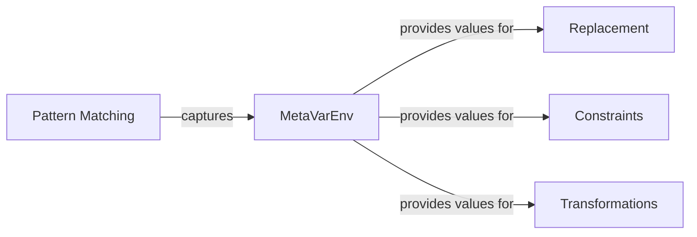
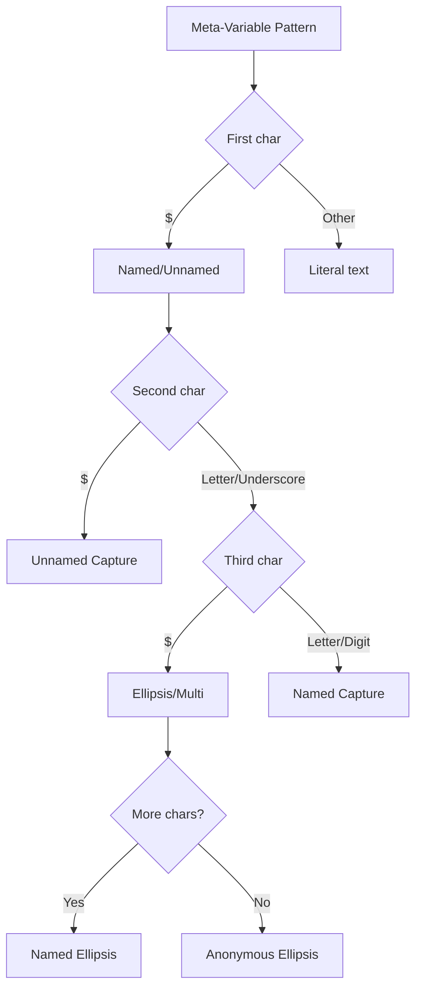
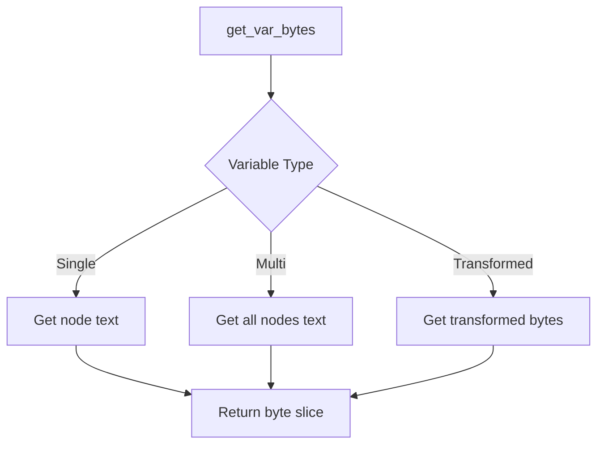
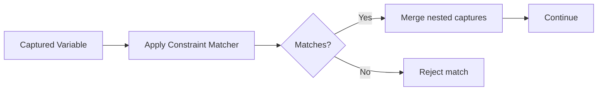
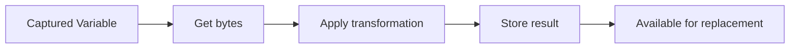
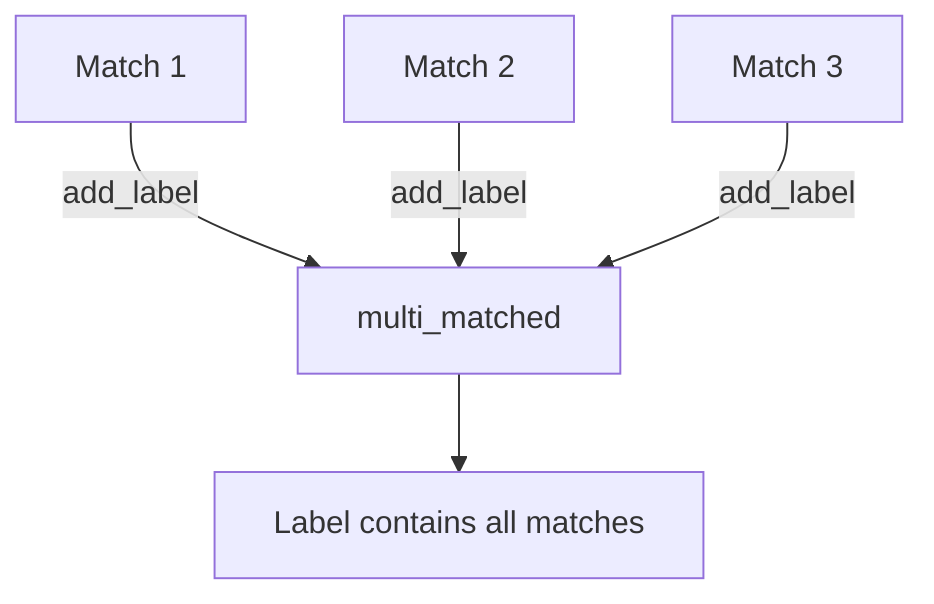
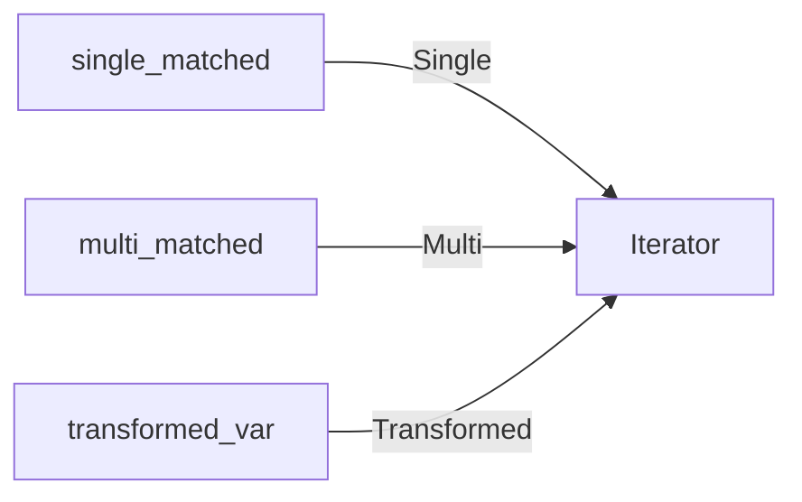
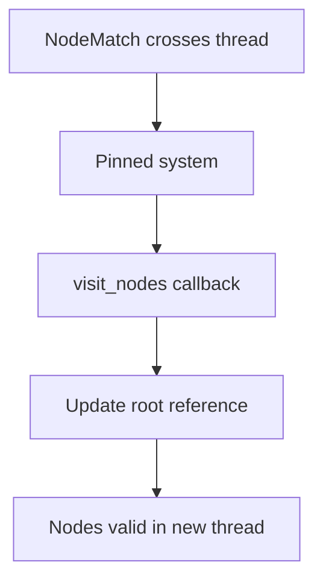

> **Source:** https://deepwiki.com/ast-grep/ast-grep/2.3-meta-variable-system

# Meta-Variable System

This document covers the meta-variable system in the `ast-grep-core` crate. Meta-variables are placeholders that capture parts of matched code during pattern matching and enable their reuse in replacements, constraints, and transformations. The system is implemented primarily through the `MetaVarEnv<'tree, D>` type and the `MetaVariable` enum.

For information about how patterns match nodes, see [Pattern Matching System](/ast-grep/ast-grep/2.2-pattern-matching-system). For information about how meta-variables are used in code replacement, see [Code Editing and Replacement](/ast-grep/ast-grep/2.4-code-editing-and-replacement).

## Meta-Variable Overview

Meta-variables are placeholders in patterns that match and capture portions of the abstract syntax tree. When a pattern like `const $NAME = $VALUE` matches code like `const x = 42`, the meta-variables `$NAME` and `$VALUE` capture the corresponding AST nodes (`x` and `42`). These captured nodes can then be referenced in replacements, constraints, and transformations.

### Meta-Variable Workflow



**Capture and Substitution Flow**

The pattern matching phase (via `Matcher::match_node_with_env`) captures AST nodes into `MetaVarEnv`. The replacement phase (via `Replacer::generate_replacement`) substitutes captured nodes back into the output. This separation enables reuse of captured values across multiple operations (constraints, transformations, fixes).

Sources: [crates/core/src/meta_var.rs1-30](https://github.com/ast-grep/ast-grep/blob/3ae01aec/crates/core/src/meta_var.rs#L1-L30) [crates/core/src/matcher.rs24-48](https://github.com/ast-grep/ast-grep/blob/3ae01aec/crates/core/src/matcher.rs#L24-L48)

## Meta-Variable Syntax

ast-grep supports four categories of meta-variables, each with distinct semantics and syntax patterns.

### Meta-Variable Types

| Type | Syntax | Example | Description |
|------|--------|---------|-------------|
| **Named Capture** | `$VAR` | `$NAME`, `$VALUE` | Captures a single node and stores it by name |
| **Unnamed Capture** | `$$VAR` | `$$NAME` | Captures but doesn't make the variable accessible |
| **Dropped Capture** | `$_`, `$_123` | `$_` | Matches without capturing (anonymous) |
| **Ellipsis** | `$$$` | `$$$` | Matches zero or more nodes (unnamed multi-capture) |
| **Named Ellipsis** | `$$$VAR` | `$$$ARGS` | Captures multiple nodes as a sequence |

### Syntax Recognition Diagram



**Meta-Variable Character**

The meta-variable prefix character is typically `$`, but ast-grep uses different characters for languages where `$` is already a valid identifier character. For such languages, the pattern preprocessing system (see [Pattern Preprocessing](/ast-grep/ast-grep/4.2-pattern-preprocessing)) replaces `$` with an alternative character like `µ` or `𐀀`.

Sources: [crates/core/src/meta_var.rs223-271](https://github.com/ast-grep/ast-grep/blob/3ae01aec/crates/core/src/meta_var.rs#L223-L271)

### Valid Identifier Rules

Meta-variable names must follow these constraints:

1. First character must be `A-Z` or `_` (uppercase ASCII letters or underscore)
2. Subsequent characters can be `A-Z`, `_`, or `0-9` (uppercase letters, underscore, or digits)
3. Names starting with `_` indicate dropped captures (not stored in environment)

The validation is performed by `is_valid_first_char` and `is_valid_meta_var_char` functions.

Sources: [crates/core/src/meta_var.rs273-281](https://github.com/ast-grep/ast-grep/blob/3ae01aec/crates/core/src/meta_var.rs#L273-L281)

## MetaVarEnv Structure

The `MetaVarEnv<'tree, D>` type stores all captured meta-variables during pattern matching. It maintains three internal hash maps for different types of captures.

### MetaVarEnv Data Structure

```rust
pub struct MetaVarEnv<'tree, D: Doc> {
    /// Single node captures: $VAR
    single_matched: HashMap<String, Node<'tree, D>>,
    /// Multi-node captures: $$$VAR and labels
    multi_matched: HashMap<String, Vec<Node<'tree, D>>>,
    /// Transformed variables
    transformed_var: HashMap<String, Underlying<D>>,
}
```

### Storage Categories

| Field | Type | Purpose | Example Usage |
|-------|------|---------|---------------|
| `single_matched` | `HashMap<String, Node<'tree, D>>` | Stores single-node captures from `$VAR` | Pattern `$NAME = $VALUE` captures two single nodes |
| `multi_matched` | `HashMap<String, Vec<Node<'tree, D>>>` | Stores multi-node captures from `$$$VAR` and labels | Pattern `fn($$$ARGS)` captures all arguments |
| `transformed_var` | `HashMap<String, Underlying<D>>` | Stores transformed meta-variables | Transform `uppercase` on `$NAME` stores result |

**Lifetime Constraint**

All stored `Node<'tree, D>` instances share the same lifetime `'tree` tied to the source document. This ensures captured nodes remain valid throughout the matching and replacement process.

Sources: [crates/core/src/meta_var.rs14-30](https://github.com/ast-grep/ast-grep/blob/3ae01aec/crates/core/src/meta_var.rs#L14-L30)

## Capturing Meta-Variables

Pattern matchers populate the `MetaVarEnv` during the matching process through the `match_node_with_env` method defined by the `Matcher` trait.

### Matcher Integration

```rust
pub trait Matcher<D: Doc> {
    fn match_node_with_env<'tree>(
        &self,
        node: Node<'tree, D>,
        env: &mut Cow<MetaVarEnv<'tree, D>>,
    ) -> Option<NodeMatch<'tree, D>>;
}
```

**Cow Optimization**

The environment is passed as `&mut Cow<MetaVarEnv<'tree, D>>` to enable copy-on-write semantics. If no new captures are made, the borrowed reference remains unchanged. When a new capture is added, the environment is cloned only if necessary.

Sources: [crates/core/src/matcher.rs27-35](https://github.com/ast-grep/ast-grep/blob/3ae01aec/crates/core/src/matcher.rs#L27-L35) [crates/core/src/meta_var.rs32-48](https://github.com/ast-grep/ast-grep/blob/3ae01aec/crates/core/src/meta_var.rs#L32-L48)

### Insert Methods

The `MetaVarEnv` provides two primary methods for capturing meta-variables:

```rust
// Insert a single-node capture
pub fn insert(&mut self, var: String, node: Node<'tree, D>) -> bool;

// Insert a multi-node capture (for ellipsis)
pub fn insert_multi(&mut self, var: String, nodes: Vec<Node<'tree, D>>) -> bool;
```

**Consistency Validation**

Both methods validate that the capture is consistent with any existing value for the same variable name. If variable `$NAME` has already been captured, subsequent captures must match exactly (same AST node). This ensures that patterns like `if ($A) { $A }` only match code where both occurrences are identical.

Sources: [crates/core/src/meta_var.rs32-48](https://github.com/ast-grep/ast-grep/blob/3ae01aec/crates/core/src/meta_var.rs#L32-L48)

## Meta-Variable Validation

When a meta-variable appears multiple times in a pattern, all occurrences must match identical AST nodes. This consistency is enforced through exact node matching during capture.

### Exact Matching Algorithm

```rust
fn does_node_match_exactly(n1: &Node<D>, n2: &Node<D>) -> bool {
    n1.kind_id() == n2.kind_id()
        && n1.text() == n2.text()
        && n1.children().len() == n2.children().len()
        && n1.children().zip(n2.children()).all(|(c1, c2)| does_node_match_exactly(&c1, &c2))
}
```

**Node Identity Check**

The `does_node_match_exactly` function compares two nodes by checking:

1. Kind (node type) equality
2. Text content equality
3. Structural equality of all children

This ensures that `if ($X) { $X }` only matches code where both `$X` occurrences represent the exact same expression.

Sources: [crates/core/src/meta_var.rs89-94](https://github.com/ast-grep/ast-grep/blob/3ae01aec/crates/core/src/meta_var.rs#L89-L94) [crates/core/src/match_tree.rs](https://github.com/ast-grep/ast-grep/blob/3ae01aec/crates/core/src/match_tree.rs)

### Multi-Variable Consistency

For multi-capture variables (`$$$VAR`), consistency checking compares sequences of nodes, ignoring unnamed nodes:

```rust
fn is_multi_var_consistent(
    existing: &[Node<D>],
    candidate: &[Node<D>],
) -> bool {
    let existing_named: Vec<_> = existing.iter().filter(|n| n.is_named()).collect();
    let candidate_named: Vec<_> = candidate.iter().filter(|n| n.is_named()).collect();
    
    existing_named.len() == candidate_named.len()
        && existing_named.iter().zip(candidate_named.iter())
            .all(|(e, c)| does_node_match_exactly(e, c))
}
```

**Sequence Matching**

The validation filters both existing and candidate node lists to only named nodes, then performs pairwise exact matching. This allows patterns like `[$$$ITEMS]` to match array literals consistently across multiple occurrences.

Sources: [crates/core/src/meta_var.rs95-118](https://github.com/ast-grep/ast-grep/blob/3ae01aec/crates/core/src/meta_var.rs#L95-L118)

## Retrieving Captured Variables

The `MetaVarEnv` provides methods to access captured meta-variables after pattern matching completes.

### Retrieval Methods

| Method | Return Type | Purpose |
|--------|-------------|---------|
| `get_match(&self, var: &str)` | `Option<&Node<'t, D>>` | Retrieves a single captured node |
| `get_multiple_matches(&self, var: &str)` | `Vec<Node<'t, D>>` | Retrieves a sequence of captured nodes |
| `get_transformed(&self, var: &str)` | `Option<&Underlying<D>>` | Retrieves transformed variable bytes |
| `get_var_bytes(&self, var: &MetaVariable)` | `Option<&[Underlying]>` | Retrieves byte representation |

### Variable Retrieval Flow



**Byte Representation**

The `get_var_bytes` method provides unified access to variable content as byte slices. For single captures, it returns the node's text bytes. For multi-captures, it returns the byte range spanning all captured nodes.

Sources: [crates/core/src/meta_var.rs50-68](https://github.com/ast-grep/ast-grep/blob/3ae01aec/crates/core/src/meta_var.rs#L50-L68) [crates/core/src/meta_var.rs155-161](https://github.com/ast-grep/ast-grep/blob/3ae01aec/crates/core/src/meta_var.rs#L155-L161) [crates/core/src/meta_var.rs181-215](https://github.com/ast-grep/ast-grep/blob/3ae01aec/crates/core/src/meta_var.rs#L181-L215)

## Meta-Variable Constraints

After capturing meta-variables, additional matchers can be applied to validate them through the constraint system.

### Constraint Matching

The `match_constraints` method applies matchers to already-captured variables, potentially capturing additional nested meta-variables.

```rust
pub fn match_constraints<'t>(
    &mut self,
    constraints: &Constraints<D>,
    roots: impl Iterator<Item = Node<'t, D>>,
) -> Option<()>;
```

### Constraint Evaluation Flow



**Nested Capture**

Constraint matchers can capture additional meta-variables from the constrained node. These new captures are merged into the environment, allowing patterns like:

- Pattern: `$VAR` with constraint `$VAR: { regex: "^get" }`
- This matches variables whose name starts with "get"

Sources: [crates/core/src/meta_var.rs120-136](https://github.com/ast-grep/ast-grep/blob/3ae01aec/crates/core/src/meta_var.rs#L120-L136)

### Example Constraint Usage

When a rule defines `constraints: { VAR: { kind: identifier } }`, the constraint matcher is applied to the captured `$VAR` node. If the constraint fails, the entire match is rejected.

Sources: [crates/core/src/meta_var.rs333-364](https://github.com/ast-grep/ast-grep/blob/3ae01aec/crates/core/src/meta_var.rs#L333-L364)

## Meta-Variable Transformations

The transformation system allows modifying captured meta-variables before using them in replacements. Transformations are stored separately from the original captures.

### Transformation Storage

```rust
pub fn insert_transformed(
    &mut self,
    label: String,
    kind: Transformation,
    root: &Root<D>,
    source: &StrDoc<D>,
) {
    let bytes = self.get_var_bytes(&kind.encrypted_var()?)?;
    let transformed = apply_transformation(kind, bytes)?;
    self.transformed_var.insert(label, transformed);
}
```

The transformation result is stored in the `transformed_var` hash map under a new name, preserving the original capture.

### Transformation Process Diagram



**Indentation Adjustment**

The `formatted_slice` function adjusts the indentation of transformed content to match the target context. This ensures that multi-line transformed content maintains proper formatting when inserted.

Sources: [crates/core/src/meta_var.rs138-150](https://github.com/ast-grep/ast-grep/blob/3ae01aec/crates/core/src/meta_var.rs#L138-L150) [crates/core/src/replacer.rs6](https://github.com/ast-grep/ast-grep/blob/3ae01aec/crates/core/src/replacer.rs#L6-L6)

### Accessing Transformations

Transformed variables are retrieved using the transformation name:

```rust
pub fn get_transformed(&self, var: &str) -> Option<&Underlying<D>> {
    self.transformed_var.get(var)
}
```

In replacement templates, transformed variables are referenced using their transformation name, not the original capture name.

Sources: [crates/core/src/meta_var.rs152-154](https://github.com/ast-grep/ast-grep/blob/3ae01aec/crates/core/src/meta_var.rs#L152-L154)

## Label System

The label system provides an alternative way to capture multiple nodes that doesn't require explicit meta-variable syntax in patterns.

### Label Operations

Labels accumulate nodes in the `multi_matched` hash map. Unlike captured ellipsis variables, labels can be added incrementally from different parts of the matching process.

```rust
pub fn add_label(&mut self, label: &str, node: Node<'tree, D>) {
    self.multi_matched
        .entry(label.to_string())
        .or_insert_with(Vec::new)
        .push(node);
}
```

### Label Storage Mechanism



**Label Use Cases**

Labels are primarily used by the rule system to track all matches for reporting purposes. When a rule matches multiple locations, each match can be added to a label for aggregate reporting.

Sources: [crates/core/src/meta_var.rs58-68](https://github.com/ast-grep/ast-grep/blob/3ae01aec/crates/core/src/meta_var.rs#L58-L68)

## Variable Enumeration

The `MetaVarEnv` provides iteration over all captured variables:

```rust
pub fn iter(&self) -> impl Iterator<Item = MetaVariable> + '_ {
    self.single_matched
        .keys()
        .map(|s| MetaVariable::Single(s.clone()))
        .chain(
            self.multi_matched
                .keys()
                .map(|s| MetaVariable::Multi(s.clone())),
        )
        .chain(
            self.transformed_var
                .keys()
                .map(|s| MetaVariable::Transformed(s.clone())),
        )
}
```

This method returns an iterator that yields `MetaVariable` enum variants for all captured single variables, transformed variables, and multi-captured variables.

### Variable Iterator Composition



**Conversion to HashMap**

The `From<MetaVarEnv>` trait implementation converts the environment to `HashMap<String, String>` for serialization. Multi-captures are formatted as comma-separated lists in brackets.

Sources: [crates/core/src/meta_var.rs70-87](https://github.com/ast-grep/ast-grep/blob/3ae01aec/crates/core/src/meta_var.rs#L70-L87) [crates/core/src/meta_var.rs283-299](https://github.com/ast-grep/ast-grep/blob/3ae01aec/crates/core/src/meta_var.rs#L283-L299)

## Thread Safety and Node Adoption

When `NodeMatch` instances are sent across threads, the captured nodes must be "readopted" to reference the correct `Root<D>` in the target thread.

### Node Readoption

The `visit_nodes` method provides internal access to all captured nodes, allowing the pinned system to update their root references.

```rust
pub(crate) fn visit_nodes<F>(&self, mut f: F)
where
    F: FnMut(&Node<'tree, D>),
{
    for node in self.single_matched.values() {
        f(node);
    }
    for nodes in self.multi_matched.values() {
        for node in nodes {
            f(node);
        }
    }
}
```

### Readoption Process



**Safety Constraint**

This operation is marked as internal (`pub(crate)`) because incorrect usage could create invalid node references. The pinned system ensures that readoption only occurs when safe.

Sources: [crates/core/src/meta_var.rs163-179](https://github.com/ast-grep/ast-grep/blob/3ae01aec/crates/core/src/meta_var.rs#L163-L179) [crates/core/src/pinned.rs](https://github.com/ast-grep/ast-grep/blob/3ae01aec/crates/core/src/pinned.rs)

## Traversal Method Reference

### Complete Node Traversal API

The following table summarizes all traversal methods available on `Node<'r, D>`:

| Category | Method | Return Type | Description |
|----------|--------|-------------|-------------|
| **Parent** | `parent()` | `Option<Node>` | Immediate parent node |
| **Children** | `children()` | `ExactSizeIterator<Node>` | All direct children |
| | `child(nth)` | `Option<Node>` | Nth child by index |
| **Fields** | `field(name)` | `Option<Node>` | First child with field name |
| | `child_by_field_id(id)` | `Option<Node>` | Child by numeric field ID |
| | `field_children(name)` | `Iterator<Node>` | All children with field name |
| **Ancestors** | `ancestors()` | `Iterator<Node>` | All ancestor nodes (up to root) |
| **Siblings** | `next()` | `Option<Node>` | Next sibling |
| | `prev()` | `Option<Node>` | Previous sibling |
| | `next_all()` | `Iterator<Node>` | All following siblings |
| | `prev_all()` | `Iterator<Node>` | All previous siblings |
| **DFS** | `dfs()` | `Iterator<Node>` | Depth-first traversal of subtree |
| **Search** | `find(matcher)` | `Option<NodeMatch>` | First matching descendant |
| | `find_all(matcher)` | `Iterator<NodeMatch>` | All matching descendants |
| **Relational** | `matches(matcher)` | `bool` | Does current node match? |
| | `inside(matcher)` | `bool` | Is inside matching ancestor? |
| | `has(matcher)` | `bool` | Contains matching descendant? |
| | `precedes(matcher)` | `bool` | Has matching following sibling? |
| | `follows(matcher)` | `bool` | Has matching previous sibling? |

### Iterator Characteristics

All iterator-returning methods in the traversal API are lazy. They compute nodes on-demand as the iterator is consumed, enabling efficient early termination and chaining with standard iterator methods like `filter()`, `take()`, `skip()`, and `collect()`.

Sources: [crates/core/src/node.rs215-337](https://github.com/ast-grep/ast-grep/blob/3ae01aec/crates/core/src/node.rs#L215-L337)
