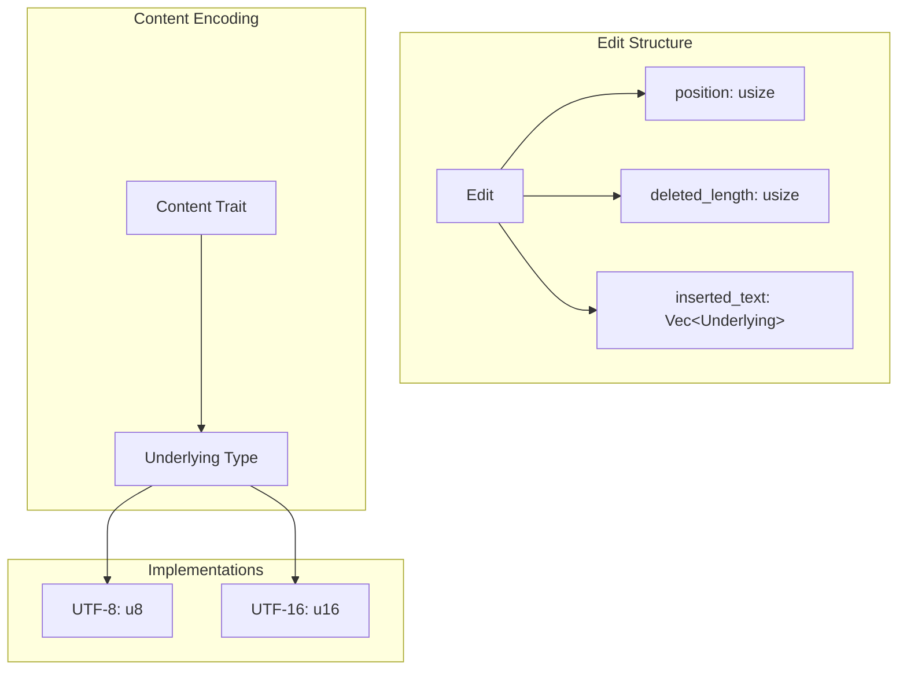
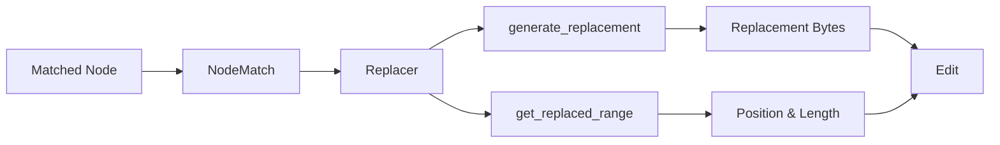
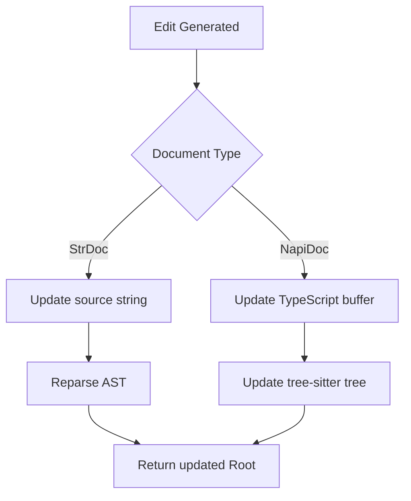

> **Source:** https://deepwiki.com/ast-grep/ast-grep/2.4-code-editing-and-replacement

# Code Editing and Replacement

This page documents how ast-grep modifies source code through the `Edit` structure and `Replacer` trait. The editing system works with the [Pattern Matching](/ast-grep/ast-grep/2.2-pattern-matching-system) and [AST Traversal](/ast-grep/ast-grep/2.3-meta-variable-system) systems to enable precise code transformations based on AST structure.

## The Edit Structure

The fundamental data structure for code modifications is `Edit<S: Content>`, which represents a single atomic change to source code.

### Edit Structure Components

| Field | Type | Purpose |
|-------|------|---------|
| `position` | `usize` | Byte offset where the edit starts |
| `deleted_length` | `usize` | Number of bytes to delete |
| `inserted_text` | `Vec<S::Underlying>` | New content to insert (encoding-specific) |

The `Edit` structure is generic over the `Content` trait's `Underlying` type, which allows it to work with different text encodings (UTF-8 for CLI, UTF-16 for Node.js, etc.).

Sources: [crates/core/src/source.rs18-24](https://github.com/ast-grep/ast-grep/blob/3ae01aec/crates/core/src/source.rs#L18-L24) [crates/core/src/node.rs7](https://github.com/ast-grep/ast-grep/blob/3ae01aec/crates/core/src/node.rs#L7-L7)

### Diagram: Edit Structure and Encoding



Sources: [crates/core/src/source.rs18-24](https://github.com/ast-grep/ast-grep/blob/3ae01aec/crates/core/src/source.rs#L18-L24) [crates/core/src/source.rs138-149](https://github.com/ast-grep/ast-grep/blob/3ae01aec/crates/core/src/source.rs#L138-L149) [crates/napi/src/doc.rs51-77](https://github.com/ast-grep/ast-grep/blob/3ae01aec/crates/napi/src/doc.rs#L51-L77)

## The Replacer Trait

The `Replacer` trait defines the interface for generating code replacements. It separates the logic of *what* to replace from *how* to generate the replacement.

### Replacer Trait Methods

```rust
pub trait Replacer<D: Doc> {
    /// Generate replacement text for the matched node
    fn generate_replacement(&self, node_match: &NodeMatch<D>) -> Option<Vec<Underlying<D>>>;
    
    /// Get the byte range that should be replaced
    fn get_replaced_range(&self, node_match: &NodeMatch<D>) -> Range<usize>;
}
```

Sources: [crates/core/src/node.rs1-3](https://github.com/ast-grep/ast-grep/blob/3ae01aec/crates/core/src/node.rs#L1-L3) [crates/config/src/fixer.rs172-194](https://github.com/ast-grep/ast-grep/blob/3ae01aec/crates/config/src/fixer.rs#L172-L194)

### Replacer Implementations

| Implementation | Input Type | Use Case |
|----------------|------------|----------|
| `&str` | String literal | Simple template-based replacement with meta-variables |
| `String` | Owned string | Template-based replacement |
| `Fixer` | Config-based | Rule-based fixes with expansion and transformations |

The string-based replacers use template syntax where `$VAR` references meta-variables captured during matching, and `$$$VAR` references multiple captured nodes.

Sources: [crates/core/src/node.rs76-89](https://github.com/ast-grep/ast-grep/blob/3ae01aec/crates/core/src/node.rs#L76-L89) [crates/config/src/fixer.rs68-100](https://github.com/ast-grep/ast-grep/blob/3ae01aec/crates/config/src/fixer.rs#L68-L100)

## Generating Edits

Edits are generated through a multi-step process that combines pattern matching with replacement logic.

### Diagram: Edit Generation Flow



Sources: [crates/core/src/node.rs319-336](https://github.com/ast-grep/ast-grep/blob/3ae01aec/crates/core/src/node.rs#L319-L336) [crates/core/src/node.rs341-345](https://github.com/ast-grep/ast-grep/blob/3ae01aec/crates/core/src/node.rs#L341-L345)

### Key Functions in Edit Generation

| Function | Location | Purpose |
|----------|----------|---------|
| `Node::replace()` | [crates/core/src/node.rs341-345](https://github.com/ast-grep/ast-grep/blob/3ae01aec/crates/core/src/node.rs#L341-L345) | Generates `Edit` from matcher and replacer |
| `NodeMatch::make_edit()` | Referenced in node.rs:343 | Creates `Edit` using replacer |
| `Replacer::generate_replacement()` | [crates/config/src/fixer.rs177-180](https://github.com/ast-grep/ast-grep/blob/3ae01aec/crates/config/src/fixer.rs#L177-L180) | Produces replacement bytes |
| `Replacer::get_replaced_range()` | [crates/config/src/fixer.rs181-193](https://github.com/ast-grep/ast-grep/blob/3ae01aec/crates/config/src/fixer.rs#L181-L193) | Determines byte range to replace |

### Meta-variable Substitution

When a replacer processes a template like `"let $A = $B"`, it:

1. Extracts meta-variable references (`$A`, `$B`) from the template
2. Looks up captured values in `NodeMatch::get_env()`
3. Substitutes each reference with the corresponding node's text
4. Returns the final replacement bytes

For multi-node captures (`$$$ARGS`), all captured nodes are concatenated with their original separators.

Sources: [crates/core/src/node.rs341-345](https://github.com/ast-grep/ast-grep/blob/3ae01aec/crates/core/src/node.rs#L341-L345) [crates/config/src/fixer.rs177-180](https://github.com/ast-grep/ast-grep/blob/3ae01aec/crates/config/src/fixer.rs#L177-L180)

## Applying Edits

Once an `Edit` is generated, it must be applied to transform the source code. The application process varies by document type and involves updating both the source text and the tree-sitter AST.

### Diagram: Edit Application Process



Sources: [crates/core/src/node.rs71-74](https://github.com/ast-grep/ast-grep/blob/3ae01aec/crates/core/src/node.rs#L71-L74) [crates/napi/src/doc.rs157-163](https://github.com/ast-grep/ast-grep/blob/3ae01aec/crates/napi/src/doc.rs#L157-L163) [crates/napi/src/doc.rs79-98](https://github.com/ast-grep/ast-grep/blob/3ae01aec/crates/napi/src/doc.rs#L79-L98)

### Root Edit Methods

| Method | Signature | Purpose |
|--------|-----------|---------|
| `Root::edit()` | `edit(&mut self, edit: Edit<D>) -> Result<&mut Self, String>` | Applies a single edit to the root |
| `Root::replace()` | `replace(&mut self, pattern: M, replacer: R) -> Result<bool, String>` | Finds match and applies replacement in one call |

### Node Manipulation Methods

The `Node` type provides convenience methods that generate `Edit` operations:

| Method | Returns | Description |
|--------|---------|-------------|
| `Node::replace()` | `Option<Edit<D>>` | Generates edit to replace matched code |
| `Node::remove()` | `Edit<D>` | Generates edit to delete the node |
| `Node::empty()` | `Option<Edit<D>>` | Generates edit to remove all children |

Sources: [crates/core/src/node.rs71-89](https://github.com/ast-grep/ast-grep/blob/3ae01aec/crates/core/src/node.rs#L71-L89) [crates/core/src/node.rs341-381](https://github.com/ast-grep/ast-grep/blob/3ae01aec/crates/core/src/node.rs#L341-L381)

### Example: Remove Node

```rust
let edit = node.remove();
// Edit {
//     position: node.start_pos(),
//     deleted_length: node.text().len(),
//     inserted_text: vec![]
// }
```

This creates an `Edit` that deletes the node by setting `deleted_length` to the node's size and providing empty `inserted_text`.

Sources: [crates/core/src/node.rs373-380](https://github.com/ast-grep/ast-grep/blob/3ae01aec/crates/core/src/node.rs#L373-L380) [crates/core/src/node.rs535-542](https://github.com/ast-grep/ast-grep/blob/3ae01aec/crates/core/src/node.rs#L535-L542)

## The Fixer System

The `Fixer` struct implements `Replacer` with additional configuration options for rule-based code fixes. It supports template-based replacement with range expansion.

### Fixer Structure

```rust
pub struct Fixer {
    template: String,
    expand_start: Option<Expansion>,
    expand_end: Option<Expansion>,
}

pub struct Expansion {
    regex: Option<Regex>,
    kind: Option<String>,
    regex_by: Option<String>,
    stop_by: StopBy,
}
```

Sources: [crates/config/src/fixer.rs68-73](https://github.com/ast-grep/ast-grep/blob/3ae01aec/crates/config/src/fixer.rs#L68-L73) [crates/config/src/fixer.rs48-65](https://github.com/ast-grep/ast-grep/blob/3ae01aec/crates/config/src/fixer.rs#L48-L65)

### Range Expansion

The `expand_start` and `expand_end` options allow a fixer to expand the replacement range beyond the matched node:

- `expand_start`: Searches backward using `node.prev()` / `node.prev_all()` to find a node matching `Expansion::matches`
- `expand_end`: Searches forward using `node.next()` / `node.next_all()` to find a node matching `Expansion::matches`
- `StopBy`: Controls search behavior (neighbor, end, or custom rule)

### Example: Expand to Include Trailing Comma

```yaml
rule:
  pattern: $ITEM
fix:
  template: ""
  expandEnd:
    regex: ","
    stopBy: neighbor
```

This configuration replaces the matched node and also removes a trailing comma if it's the next sibling.

Sources: [crates/config/src/fixer.rs181-226](https://github.com/ast-grep/ast-grep/blob/3ae01aec/crates/config/src/fixer.rs#L181-L226) [crates/config/src/fixer.rs262-329](https://github.com/ast-grep/ast-grep/blob/3ae01aec/crates/config/src/fixer.rs#L262-L329)

### Fixer Parsing

`SerializableFixer` deserializes from YAML in three forms:

| YAML Form | Type | Example |
|-----------|------|---------|
| String | Simple template | `fix: "let $A = $B"` |
| Object | Single fix with config | `fix: {template: "...", expandEnd: {...}}` |
| List | Multiple fix options | `fix: [{template: "...", title: "Fix 1"}, ...]` |

When a list is provided, each fix must have a `title` field to identify it.

Sources: [crates/config/src/fixer.rs14-46](https://github.com/ast-grep/ast-grep/blob/3ae01aec/crates/config/src/fixer.rs#L14-L46) [crates/config/src/fixer.rs103-132](https://github.com/ast-grep/ast-grep/blob/3ae01aec/crates/config/src/fixer.rs#L103-L132)

## Usage Examples

Here's how the replacement system is used in practice:

### 1. Basic string replacement:

```rust
let edit = node.replace("let $A = $B", &matcher)?;
```

### 2. Fixer with expanded range:

```yaml
rule:
  pattern: $VAR
fix:
  template: "renamed_$VAR"
  expandStart:
    kind: comment
    stopBy: neighbor
```

Sources: [crates/core/src/lib.rs52-64](https://github.com/ast-grep/ast-grep/blob/3ae01aec/crates/core/src/lib.rs#L52-L64) [crates/config/src/fixer.rs262-282](https://github.com/ast-grep/ast-grep/blob/3ae01aec/crates/config/src/fixer.rs#L262-L282)

## Implementation Details

### Edit Operation

The outcome of applying a Replacer is an `Edit` operation that describes:

1. The position to start replacement
2. The length of text to delete
3. The new text to insert

```rust
struct Edit {
    position: usize,
    deleted_length: usize,
    inserted_text: Vec<Underlying>,
}
```

Sources: [crates/core/src/node.rs520-556](https://github.com/ast-grep/ast-grep/blob/3ae01aec/crates/core/src/node.rs#L520-L556) [crates/core/src/replacer.rs8-9](https://github.com/ast-grep/ast-grep/blob/3ae01aec/crates/core/src/replacer.rs#L8-L9)

### Replacement Generation Process

1. A match is found using a Matcher
2. A NodeMatch is created, containing the matched node and captured meta-variables
3. A Replacer generates replacement text using the NodeMatch
4. The replacement range is determined
5. An Edit is created and applied to the source code

Sources: [crates/core/src/node.rs523-544](https://github.com/ast-grep/ast-grep/blob/3ae01aec/crates/core/src/node.rs#L523-L544) [crates/core/src/lib.rs52-64](https://github.com/ast-grep/ast-grep/blob/3ae01aec/crates/core/src/lib.rs#L52-L64)

### Meta-variable Processing

When processing meta-variables in replacements:

1. The system identifies meta-variables in the template (like `$A`)
2. It looks up the corresponding values in the MetaVarEnv
3. For single variables, it uses the node's text
4. For multiple variables, it concatenates their text
5. For transformed variables, it uses the transformed value

Sources: [crates/core/src/replacer.rs78-114](https://github.com/ast-grep/ast-grep/blob/3ae01aec/crates/core/src/replacer.rs#L78-L114) [crates/core/src/meta_var.rs74-212](https://github.com/ast-grep/ast-grep/blob/3ae01aec/crates/core/src/meta_var.rs#L74-L212)

## Integration with Rule System

The Fixer system integrates with ast-grep's rule system, allowing rules to define automated fixes for code issues:

```yaml
rule:
  id: no-var
  pattern: var $X = $Y
fix: let $X = $Y
```

When a rule matches code, its associated fix can be automatically applied to transform the code.

Sources: [crates/config/src/fixer.rs16-127](https://github.com/ast-grep/ast-grep/blob/3ae01aec/crates/config/src/fixer.rs#L16-127) [crates/config/src/rule/mod.rs31-96](https://github.com/ast-grep/ast-grep/blob/3ae01aec/crates/config/src/rule/mod.rs#L31-L96)
