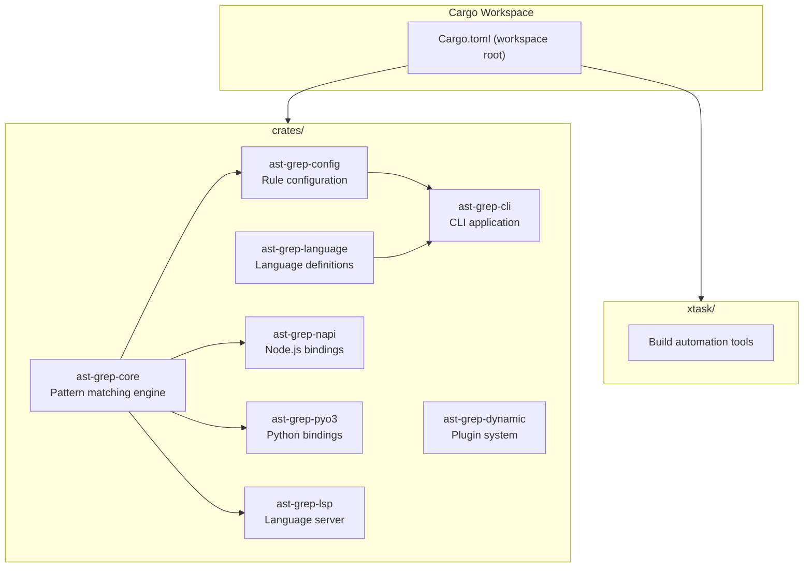
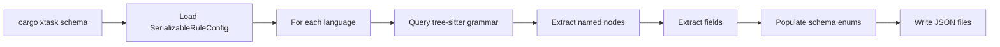
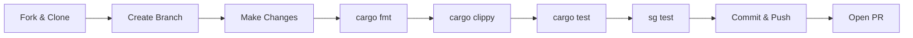

# Development

> Relevant source files:
> - [CHANGELOG.md](https://github.com/ast-grep/ast-grep/blob/3ae01aec/CHANGELOG.md)
> - [Cargo.lock](https://github.com/ast-grep/ast-grep/blob/3ae01aec/Cargo.lock)
> - [Cargo.toml](https://github.com/ast-grep/ast-grep/blob/3ae01aec/Cargo.toml)
> - [crates/cli/Cargo.toml](https://github.com/ast-grep/ast-grep/blob/3ae01aec/crates/cli/Cargo.toml)
> - [crates/config/Cargo.toml](https://github.com/ast-grep/ast-grep/blob/3ae01aec/crates/config/Cargo.toml)
> - [crates/core/Cargo.toml](https://github.com/ast-grep/ast-grep/blob/3ae01aec/crates/core/Cargo.toml)
> - [crates/lsp/Cargo.toml](https://github.com/ast-grep/ast-grep/blob/3ae01aec/crates/lsp/Cargo.toml)
> - [crates/napi/Cargo.toml](https://github.com/ast-grep/ast-grep/blob/3ae01aec/crates/napi/Cargo.toml)
> - [xtask/Cargo.toml](https://github.com/ast-grep/ast-grep/blob/3ae01aec/xtask/Cargo.toml)
> - [xtask/src/main.rs](https://github.com/ast-grep/ast-grep/blob/3ae01aec/xtask/src/main.rs)
> - [xtask/src/schema.rs](https://github.com/ast-grep/ast-grep/blob/3ae01aec/xtask/src/schema.rs)

This page provides guidance for contributors on setting up a development environment, building ast-grep from source, running tests, and understanding the development infrastructure. For information about the workspace structure and module organization, see [Workspace Structure](10.1-workspace-structure.md). For build system details including Cargo features and platform-specific builds, see [Build System](10.2-build-system.md). For continuous integration and deployment workflows, see [CI/CD Pipeline](10.3-cicd-pipeline.md).

## Prerequisites

To develop ast-grep, you need:

- **Rust toolchain** (version 1.79 or later, as specified in [Cargo.toml20](https://github.com/ast-grep/ast-grep/blob/3ae01aec/Cargo.toml#L20-L20))
- **Node.js and npm** (for NAPI bindings development)
- **Python 3.7+** (for PyO3 bindings development)
- **Cargo tools**: `cargo-llvm-cov` for coverage, `cargo-zigbuild` for cross-compilation

Sources: [Cargo.toml20](https://github.com/ast-grep/ast-grep/blob/3ae01aec/Cargo.toml#L20-L20) [crates/cli/Cargo.toml1-66](https://github.com/ast-grep/ast-grep/blob/3ae01aec/crates/cli/Cargo.toml#L1-L66)

## Workspace Organization

The project uses a Cargo workspace with multiple crates organized in a layered architecture. All crates are located in the `crates/` directory, with an additional `xtask` directory for build tools.

### Cargo Workspace Structure



Sources: [Cargo.toml1-40](https://github.com/ast-grep/ast-grep/blob/3ae01aec/Cargo.toml#L1-L40) [crates/cli/Cargo.toml1-66](https://github.com/ast-grep/ast-grep/blob/3ae01aec/crates/cli/Cargo.toml#L1-L66) [crates/napi/Cargo.toml1-37](https://github.com/ast-grep/ast-grep/blob/3ae01aec/crates/napi/Cargo.toml#L1-L37) [crates/lsp/Cargo.toml1-40](https://github.com/ast-grep/ast-grep/blob/3ae01aec/crates/lsp/Cargo.toml#L1-L40)

### Workspace Configuration

The workspace defines shared package metadata and dependencies:

| Field | Value | Location |
|---|---|---|
| `version` | 0.40.5 | [Cargo.toml13](https://github.com/ast-grep/ast-grep/blob/3ae01aec/Cargo.toml#L13-L13) |
| `rust-version` | 1.79 | [Cargo.toml20](https://github.com/ast-grep/ast-grep/blob/3ae01aec/Cargo.toml#L20-L20) |
| `edition` | 2021 | [Cargo.toml15](https://github.com/ast-grep/ast-grep/blob/3ae01aec/Cargo.toml#L15-L15) |
| `license` | MIT | [Cargo.toml16](https://github.com/ast-grep/ast-grep/blob/3ae01aec/Cargo.toml#L16-L16) |

Shared workspace dependencies are defined in `[workspace.dependencies]` at [Cargo.toml23-39](https://github.com/ast-grep/ast-grep/blob/3ae01aec/Cargo.toml#L23-L39) and include:

- `ast-grep-core`, `ast-grep-config`, `ast-grep-language`, etc. as path dependencies
- Common crates: `tree-sitter`, `serde`, `regex`, `anyhow`, `thiserror`

Sources: [Cargo.toml1-40](https://github.com/ast-grep/ast-grep/blob/3ae01aec/Cargo.toml#L1-L40)

## Building from Source

### Standard Build Commands

```bash
# Debug build (faster compilation)
cargo build

# Release build (optimized binary)
cargo build --release

# Build specific crate
cargo build -p ast-grep-cli

# Build with all features
cargo build --all-features
```

The CLI crate produces two binaries:

- `ast-grep` - main binary at [crates/cli/src/main.rs](https://github.com/ast-grep/ast-grep/blob/3ae01aec/crates/cli/src/main.rs)
- `sg` - alias binary at [crates/cli/src/bin/alias.rs](https://github.com/ast-grep/ast-grep/blob/3ae01aec/crates/cli/src/bin/alias.rs)

Sources: [crates/cli/Cargo.toml19-25](https://github.com/ast-grep/ast-grep/blob/3ae01aec/crates/cli/Cargo.toml#L19-L25)

### Release Profile Configuration

The workspace uses link-time optimization (LTO) for release builds:

```toml
[profile.release]
lto = true
codegen-units = 1
```

This reduces binary size and improves performance at the cost of longer compilation times.

Sources: [Cargo.toml9-10](https://github.com/ast-grep/ast-grep/blob/3ae01aec/Cargo.toml#L9-L10)

### Building NAPI Bindings

The NAPI crate builds Node.js native addons:

```bash
cd crates/napi
yarn install
yarn build:debug    # Debug build
yarn build          # Release build
```

The NAPI crate has a special build configuration:

- `crate-type = ["cdylib"]` for dynamic library output
- `napi-build` build dependency at [crates/napi/Cargo.toml36-37](https://github.com/ast-grep/ast-grep/blob/3ae01aec/crates/napi/Cargo.toml#L36-L37)
- `publish = false` to prevent accidental crates.io publishing

Sources: [crates/napi/Cargo.toml1-37](https://github.com/ast-grep/ast-grep/blob/3ae01aec/crates/napi/Cargo.toml#L1-L37)

## Development Workflow

### Running Tests

```bash
# Run all tests
cargo test

# Run tests for specific crate
cargo test -p ast-grep-core

# Run tests with output
cargo test -- --nocapture

# Run specific test
cargo test test_pattern_matching
```

The CLI crate uses `assert_cmd` for integration testing:

```rust
use assert_cmd::Command;

fn test_cli() {
    let mut cmd = Command::cargo_bin("sg").unwrap();
    cmd.arg("--help")
        .assert()
        .success();
}
```

Sources: [crates/cli/Cargo.toml56-59](https://github.com/ast-grep/ast-grep/blob/3ae01aec/crates/cli/Cargo.toml#L56-L59)

### Code Coverage

The project uses `cargo-llvm-cov` for code coverage:

```bash
# Install coverage tool
cargo install cargo-llvm-cov

# Generate coverage report
cargo llvm-cov --all-features --workspace --lcov --output-path lcov.info

# Open HTML report
cargo llvm-cov --open
```

Sources: [CHANGELOG.md432](https://github.com/ast-grep/ast-grep/blob/3ae01aec/CHANGELOG.md#L432-L432)

### Rule Testing

The CLI provides a specialized testing command for rule validation:

```bash
# Test rules with snapshots
sg test

# Test specific rule file
sg test -p path/to/rule.yaml
```

The test command uses:

- `TestHarness` for parallel test execution
- `SnapshotCollection` for expected results comparison
- `Reporter` for output formatting

Sources: [crates/cli/Cargo.toml1-66](https://github.com/ast-grep/ast-grep/blob/3ae01aec/crates/cli/Cargo.toml#L1-L66)

## Schema Generation

### XTask Schema Generator

The `xtask` crate generates JSON schemas for rule configuration files by interrogating tree-sitter grammars:



Sources: [xtask/src/schema.rs1-204](https://github.com/ast-grep/ast-grep/blob/3ae01aec/xtask/src/schema.rs#L1-L204)

### Running Schema Generation

The generator:

1. Creates a base schema from `SerializableRuleConfig` using `schemars`
2. For each language, extracts named nodes via `get_named_nodes()` at [xtask/src/schema.rs128-143](https://github.com/ast-grep/ast-grep/blob/3ae01aec/xtask/src/schema.rs#L128-L143)
3. Extracts field names via `get_fields()` at [xtask/src/schema.rs145-156](https://github.com/ast-grep/ast-grep/blob/3ae01aec/xtask/src/schema.rs#L145-L156)
4. Populates `kind` and `field` enums in the schema
5. Outputs to `schemas/rule.json` and `schemas/{lang}_rule.json`

```bash
cargo xtask schema
```

Sources: [xtask/src/schema.rs16-60](https://github.com/ast-grep/ast-grep/blob/3ae01aec/xtask/src/schema.rs#L16-L60) [xtask/src/schema.rs128-156](https://github.com/ast-grep/ast-grep/blob/3ae01aec/xtask/src/schema.rs#L128-L156)

## Development Tools

### XTask Commands

The `xtask` crate provides build automation:

| Command | Purpose |
|---|---|
| `cargo xtask schema` | Generate JSON schemas for rule configuration |
| `cargo xtask <version>` | Initiate release process |

The xtask pattern is a Rust convention for project-specific tooling without external dependencies.

Sources: [Cargo.toml4](https://github.com/ast-grep/ast-grep/blob/3ae01aec/Cargo.toml#L4-L4) [xtask/src/schema.rs1-204](https://github.com/ast-grep/ast-grep/blob/3ae01aec/xtask/src/schema.rs#L1-L204)

### Common Development Commands

| Command | Purpose |
|---|---|
| `cargo build` | Build all crates |
| `cargo test` | Run all tests |
| `cargo clippy` | Lint code |
| `cargo fmt` | Format code |
| `cargo doc --open` | Generate and open documentation |
| `cargo xtask schema` | Generate JSON schemas |
| `sg test` | Test rules with snapshots |

### Dependency Management

Check for outdated dependencies:

```bash
cargo outdated
```

Audit for security vulnerabilities:

```bash
cargo audit
```

Sources: [Cargo.lock1](https://github.com/ast-grep/ast-grep/blob/3ae01aec/Cargo.lock#L1-LNaN)

## Testing Infrastructure

### Test Types

1. **Unit Tests**: Located within each crate's `src/` directory
2. **Integration Tests**: In `tests/` directories (CLI uses `assert_cmd`)
3. **Documentation Tests**: In doc comments (tested via `cargo test --doc`)
4. **Rule Tests**: YAML-based snapshot tests via `sg test`

### Test Dependencies

The CLI crate uses specialized testing dependencies:

| Dependency | Purpose | Location |
|---|---|---|
| `assert_cmd` | CLI testing | [crates/cli/Cargo.toml57](https://github.com/ast-grep/ast-grep/blob/3ae01aec/crates/cli/Cargo.toml#L57-L57) |
| `predicates` | Assertion helpers | [crates/cli/Cargo.toml58](https://github.com/ast-grep/ast-grep/blob/3ae01aec/crates/cli/Cargo.toml#L58-L58) |
| `tempfile` | Temporary files | [crates/cli/Cargo.toml59](https://github.com/ast-grep/ast-grep/blob/3ae01aec/crates/cli/Cargo.toml#L59-L59) |

Sources: [crates/cli/Cargo.toml56-59](https://github.com/ast-grep/ast-grep/blob/3ae01aec/crates/cli/Cargo.toml#L56-L59)

## Contributing Workflow

### Standard Development Cycle



Sources: [CHANGELOG.md1](https://github.com/ast-grep/ast-grep/blob/3ae01aec/CHANGELOG.md#L1-LNaN) (showing development history)

### Pre-commit Checklist

Before committing changes:

1. **Format code**: `cargo fmt`
2. **Lint**: `cargo clippy`
3. **Run tests**: `cargo test`
4. **Test rules**: `sg test` (if applicable)
5. **Update schemas**: `cargo xtask schema` (if rule format changed)
6. **Update docs**: If API changed

### Version Bumping

The version is managed centrally in [Cargo.toml13](https://github.com/ast-grep/ast-grep/blob/3ae01aec/Cargo.toml#L13-L13):

```toml
[workspace.package]
version = "0.40.5"
```

All crates inherit this version via `version.workspace = true`.

Sources: [Cargo.toml12-21](https://github.com/ast-grep/ast-grep/blob/3ae01aec/Cargo.toml#L12-L21)
