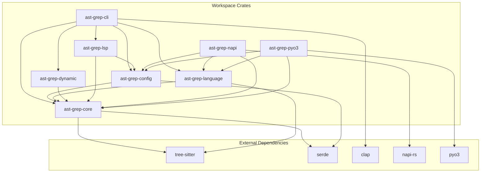

# Workspace Structure

> Relevant source files:
> - [CHANGELOG.md](https://github.com/ast-grep/ast-grep/blob/3ae01aec/CHANGELOG.md)
> - [Cargo.lock](https://github.com/ast-grep/ast-grep/blob/3ae01aec/Cargo.lock)
> - [Cargo.toml](https://github.com/ast-grep/ast-grep/blob/3ae01aec/Cargo.toml)
> - [crates/cli/Cargo.toml](https://github.com/ast-grep/ast-grep/blob/3ae01aec/crates/cli/Cargo.toml)
> - [crates/config/Cargo.toml](https://github.com/ast-grep/ast-grep/blob/3ae01aec/crates/config/Cargo.toml)
> - [crates/core/Cargo.toml](https://github.com/ast-grep/ast-grep/blob/3ae01aec/crates/core/Cargo.toml)
> - [crates/lsp/Cargo.toml](https://github.com/ast-grep/ast-grep/blob/3ae01aec/crates/lsp/Cargo.toml)
> - [crates/napi/Cargo.toml](https://github.com/ast-grep/ast-grep/blob/3ae01aec/crates/napi/Cargo.toml)

This document describes the Cargo workspace organization of the ast-grep repository, including crate structure, dependency relationships, and workspace-level configuration. For information about the build system and compilation features, see [Build System](10.2-build-system.md). For CI/CD pipeline details, see [CI/CD Pipeline](10.3-cicd-pipeline.md).

## Workspace Organization

The repository uses Cargo's workspace feature to manage multiple related crates from a single repository. The workspace is defined in the root `Cargo.toml` file.

**Workspace members** are defined in [Cargo.toml2-6](https://github.com/ast-grep/ast-grep/blob/3ae01aec/Cargo.toml#L2-L6):

- `members = ["crates/*", "xtask"]` - All crates in the `crates/` directory plus the `xtask` utility
- `default-members = ["crates/*"]` - Excludes `xtask` from default build targets
- `resolver = "2"` - Uses Cargo's newer dependency resolver

Sources: [Cargo.toml1-7](https://github.com/ast-grep/ast-grep/blob/3ae01aec/Cargo.toml#L1-L7)

## Workspace Configuration

The workspace defines shared package metadata and dependencies to ensure version consistency across all crates.

### Shared Package Metadata

All workspace crates inherit common metadata from [Cargo.toml12-21](https://github.com/ast-grep/ast-grep/blob/3ae01aec/Cargo.toml#L12-L21):

| Field | Value | Description |
|---|---|---|
| `version` | `0.40.5` | Synchronized version across all crates |
| `authors` | `["Herrington Darkholme <...>"]` | Project maintainers |
| `edition` | `2021` | Rust edition |
| `license` | `MIT` | Software license |
| `rust-version` | `1.79` | Minimum supported Rust version (MSRV) |
| `documentation` | `https://ast-grep.github.io/...` | Documentation URL |
| `homepage` | `https://ast-grep.github.io/` | Project homepage |
| `repository` | `https://github.com/ast-grep/ast-grep` | Source repository |

Crates reference these using the `.workspace = true` syntax, e.g., in [crates/core/Cargo.toml7-14](https://github.com/ast-grep/ast-grep/blob/3ae01aec/crates/core/Cargo.toml#L7-L14):

```toml
[package]
name = "ast-grep-core"
version.workspace = true
authors.workspace = true
edition.workspace = true
license.workspace = true
rust-version.workspace = true
```

Sources: [Cargo.toml12-21](https://github.com/ast-grep/ast-grep/blob/3ae01aec/Cargo.toml#L12-L21) [crates/core/Cargo.toml7-14](https://github.com/ast-grep/ast-grep/blob/3ae01aec/crates/core/Cargo.toml#L7-L14)

### Shared Dependencies

Common dependencies are defined centrally to prevent version conflicts. From [Cargo.toml23-40](https://github.com/ast-grep/ast-grep/blob/3ae01aec/Cargo.toml#L23-L40):

| Dependency | Version | Features | Purpose |
|---|---|---|---|
| `ast-grep-core` | `0.40.5` | `default-features = false` | Core AST engine |
| `ast-grep-config` | `0.40.5` | - | Rule configuration |
| `ast-grep-dynamic` | `0.40.5` | - | Dynamic language loading |
| `ast-grep-language` | `0.40.5` | - | Language parsers |
| `ast-grep-lsp` | `0.40.5` | - | LSP server |
| `tree-sitter` | `0.26.3` | - | Parsing engine |
| `serde` | `1.0.200` | `derive` | Serialization |
| `serde_yaml` | `0.9.33` | - | YAML parsing |
| `regex` | `1.10.4` | - | Regular expressions |
| `bit-set` | `0.8.0` | - | Efficient bit sets |
| `ignore` | `0.4.22` | - | Gitignore-style filtering |
| `thiserror` | `2.0.0` | - | Error handling |
| `schemars` | `1.0.0` | - | JSON schema generation |
| `anyhow` | `1.0.82` | - | Error context |
| `dashmap` | `6.0.0` | - | Concurrent hashmaps |

Internal crates use relative paths (e.g., `path = "crates/core"`) to reference each other.

Sources: [Cargo.toml23-40](https://github.com/ast-grep/ast-grep/blob/3ae01aec/Cargo.toml#L23-L40)

## Crate Dependency Graph

The following diagram shows the dependency relationships between workspace crates and their external dependencies:



Sources: [crates/cli/Cargo.toml27-54](https://github.com/ast-grep/ast-grep/blob/3ae01aec/crates/cli/Cargo.toml#L27-L54) [crates/napi/Cargo.toml15-26](https://github.com/ast-grep/ast-grep/blob/3ae01aec/crates/napi/Cargo.toml#L15-L26) [crates/lsp/Cargo.toml19-27](https://github.com/ast-grep/ast-grep/blob/3ae01aec/crates/lsp/Cargo.toml#L19-L27) [crates/config/Cargo.toml17-26](https://github.com/ast-grep/ast-grep/blob/3ae01aec/crates/config/Cargo.toml#L17-L26) [crates/core/Cargo.toml16-20](https://github.com/ast-grep/ast-grep/blob/3ae01aec/crates/core/Cargo.toml#L16-L20)

## Individual Crate Details

### ast-grep-core

**Location:** `crates/core/`  
**Type:** Library  
**Purpose:** Core AST manipulation engine implementing pattern matching, node traversal, and code replacement.

- **Name:** `ast-grep-core`
- **Categories:** `["command-line-utilities", "development-tools", "parsing"]`
- **Features:**
  - `default = ["tree-sitter"]` - Tree-sitter support enabled by default
  - Tree-sitter is optional to support alternative parsing backends

Sources: [crates/core/Cargo.toml1-26](https://github.com/ast-grep/ast-grep/blob/3ae01aec/crates/core/Cargo.toml#L1-L26)

### ast-grep-config

**Location:** `crates/config/`  
**Type:** Library  
**Purpose:** Rule definition, YAML parsing, validation, and configuration management.

- **Name:** `ast-grep-config`
- **Features:**
  - `default = ["tree-sitter"]` - Inherits core's tree-sitter feature
  - `tree-sitter = ["ast-grep-core/tree-sitter"]` - Feature forwarding

Sources: [crates/config/Cargo.toml1-29](https://github.com/ast-grep/ast-grep/blob/3ae01aec/crates/config/Cargo.toml#L1-L29)

### ast-grep-language

**Location:** `crates/language/`  
**Type:** Library  
**Purpose:** Language-specific tree-sitter parser integration supporting 20+ programming languages.

The crate uses feature flags to control which language parsers are included. Language parsers include: bash, c, c-sharp, cpp, css, elixir, go, haskell, html, java, javascript, json, kotlin, lua, nix, php, python, ruby, rust, scala, solidity, swift, typescript, yaml.

Sources: [Cargo.lock179-212](https://github.com/ast-grep/ast-grep/blob/3ae01aec/Cargo.lock#L179-L212)

### ast-grep (CLI)

**Location:** `crates/cli/`  
**Type:** Binary + Library  
**Purpose:** Command-line interface with commands: `run`, `scan`, `test`, `new`, `lsp`, `completions`.

- **Name:** `ast-grep`
- **Binaries:**
  - `ast-grep` - Main binary
  - `sg` - Alias binary
- **Dependencies:** All core crates, clap, crossterm, termimad, inquire, tokio

Sources: [crates/cli/Cargo.toml1-66](https://github.com/ast-grep/ast-grep/blob/3ae01aec/crates/cli/Cargo.toml#L1-L66)

### ast-grep-napi

**Location:** `crates/napi/`  
**Type:** cdylib (C dynamic library)  
**Purpose:** Node.js native bindings via N-API.

- **Name:** `ast-grep-napi`
- **Publish:** `false` - Not published to crates.io (distributed via npm instead)
- **Library type:** `crate-type = ["cdylib"]` - Creates a native Node.js module

Sources: [crates/napi/Cargo.toml1-37](https://github.com/ast-grep/ast-grep/blob/3ae01aec/crates/napi/Cargo.toml#L1-L37)

### ast-grep-lsp

**Location:** `crates/lsp/`  
**Type:** Library  
**Purpose:** Language Server Protocol implementation for IDE integration.

- **Name:** `ast-grep-lsp`
- **Dependencies:** ast-grep-core, ast-grep-config, tower-lsp-server, dashmap, serde

Sources: [crates/lsp/Cargo.toml1-40](https://github.com/ast-grep/ast-grep/blob/3ae01aec/crates/lsp/Cargo.toml#L1-L40)

## Build Profiles

The workspace defines a release profile optimization in [Cargo.toml9-10](https://github.com/ast-grep/ast-grep/blob/3ae01aec/Cargo.toml#L9-L10):

```toml
[profile.release]
lto = true
codegen-units = 1
```

**Link-Time Optimization (LTO)** is enabled for release builds to:

- Reduce binary size
- Improve runtime performance
- Enable cross-crate inlining optimizations

Sources: [Cargo.toml9-10](https://github.com/ast-grep/ast-grep/blob/3ae01aec/Cargo.toml#L9-L10)

## Version Management

All workspace crates share a single version number (`0.40.5`) synchronized through the workspace metadata. This simplifies:

1. **Release coordination** - All crates are released together
2. **Dependency tracking** - Internal dependencies always match the current version
3. **User expectations** - Clear versioning across all distribution channels (npm, PyPI, crates.io)

The version is updated by the `xtask` utility during the release process, which modifies:

- Root `Cargo.toml` workspace version
- All workspace dependency version references
- Package manifest versions (npm, Python)

Sources: [Cargo.toml13](https://github.com/ast-grep/ast-grep/blob/3ae01aec/Cargo.toml#L13-L13) [CHANGELOG.md1-640](https://github.com/ast-grep/ast-grep/blob/3ae01aec/CHANGELOG.md#L1-L640)
