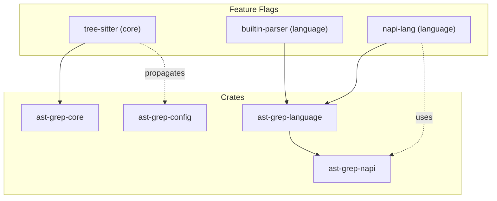

# Build System

> Relevant source files:
> - [CHANGELOG.md](https://github.com/ast-grep/ast-grep/blob/3ae01aec/CHANGELOG.md)
> - [Cargo.lock](https://github.com/ast-grep/ast-grep/blob/3ae01aec/Cargo.lock)
> - [Cargo.toml](https://github.com/ast-grep/ast-grep/blob/3ae01aec/Cargo.toml)
> - [crates/cli/Cargo.toml](https://github.com/ast-grep/ast-grep/blob/3ae01aec/crates/cli/Cargo.toml)
> - [crates/config/Cargo.toml](https://github.com/ast-grep/ast-grep/blob/3ae01aec/crates/config/Cargo.toml)
> - [crates/core/Cargo.toml](https://github.com/ast-grep/ast-grep/blob/3ae01aec/crates/core/Cargo.toml)
> - [crates/language/Cargo.toml](https://github.com/ast-grep/ast-grep/blob/3ae01aec/crates/language/Cargo.toml)
> - [crates/lsp/Cargo.toml](https://github.com/ast-grep/ast-grep/blob/3ae01aec/crates/lsp/Cargo.toml)
> - [crates/napi/Cargo.toml](https://github.com/ast-grep/ast-grep/blob/3ae01aec/crates/napi/Cargo.toml)

This document describes the build system architecture for ast-grep, covering Cargo workspace organization, build profiles, feature flags, the NAPI-RS native module compilation process, and development tooling. For information about CI/CD workflows and release automation, see [CI/CD Pipeline](10.3-cicd-pipeline.md). For workspace structure and crate organization, see [Workspace Structure](10.1-workspace-structure.md).

## Cargo Workspace Configuration

ast-grep uses a Cargo workspace to manage multiple related crates. The workspace root defines shared metadata and dependency versions that member crates inherit.

**Workspace Members and Resolver**

The workspace includes all crates under `crates/*` and the `xtask` development tool:

```toml
[workspace]
members = ["crates/*", "xtask"]
default-members = ["crates/*"]
resolver = "2"
```

The `resolver = "2"` setting enables the new feature resolver that provides better handling of feature unification across dependency graphs.

Sources: [Cargo.toml1-40](https://github.com/ast-grep/ast-grep/blob/3ae01aec/Cargo.toml#L1-L40)

## Build Profiles

**Release Optimization**

The release profile enables Link-Time Optimization (LTO) to reduce binary size and improve performance:

```toml
[profile.release]
lto = true
codegen-units = 1
```

LTO performs whole-program analysis and optimization at link time, which significantly reduces the final binary size (important for distribution across npm, PyPI, and cargo) but increases compilation time.

**Binary Distribution Metadata**

The CLI crate includes metadata for `cargo-binstall` support, enabling direct binary installation without compilation:

```toml
[package.metadata.binstall]
pkg-url = "{repo}/releases/download/v{version}/app-{target}.zip"
pkg-fmt = "zip"
```

Sources: [Cargo.toml9-10](https://github.com/ast-grep/ast-grep/blob/3ae01aec/Cargo.toml#L9-L10) [crates/cli/Cargo.toml62-66](https://github.com/ast-grep/ast-grep/blob/3ae01aec/crates/cli/Cargo.toml#L62-L66)

## Feature Flags and Conditional Compilation

### Feature Dependency Graph



### Core Features: `tree-sitter`

The `ast-grep-core` crate defines a `tree-sitter` feature that controls inclusion of tree-sitter parsing functionality:

```toml
[features]
default = ["tree-sitter"]
tree-sitter = ["dep:tree-sitter"]

[dependencies]
tree-sitter = { version = "0.26.3", optional = true }
```

This feature is enabled by default but can be disabled with `default-features = false`.

Sources: [crates/core/Cargo.toml16-24](https://github.com/ast-grep/ast-grep/blob/3ae01aec/crates/core/Cargo.toml#L16-L24)

### Config Features: Dependency Propagation

The `ast-grep-config` crate also defines a `tree-sitter` feature that propagates to `ast-grep-core`:

```toml
[features]
default = ["tree-sitter"]
tree-sitter = ["ast-grep-core/tree-sitter"]
```

This ensures that enabling tree-sitter support in the config layer automatically enables it in the core layer.

Sources: [crates/config/Cargo.toml13-15](https://github.com/ast-grep/ast-grep/blob/3ae01aec/crates/config/Cargo.toml#L13-L15)

### Language Features: Parser Selection

The `ast-grep-language` crate defines two primary feature flags for controlling which tree-sitter parsers are compiled:

**builtin-parser Feature**

The `builtin-parser` feature enables all 23 supported language parsers:

```toml
[features]
default = ["builtin-parser"]
builtin-parser = [
  "tree-sitter-bash",
  "tree-sitter-c",
  "tree-sitter-c-sharp",
  # ... all other parsers
]
```

**napi-lang Feature**

The `napi-lang` feature is used when building Node.js bindings, enabling only web-related languages to reduce the native module size:

```toml
napi-lang = [
  "tree-sitter-css",
  "tree-sitter-html",
  "tree-sitter-javascript",
  "tree-sitter-typescript",
]
```

The NAPI crate uses this feature:

```toml
[dependencies]
ast-grep-language = { workspace = true, features = ["napi-lang"], default-features = false }
```

Sources: [crates/language/Cargo.toml46-80](https://github.com/ast-grep/ast-grep/blob/3ae01aec/crates/language/Cargo.toml#L46-L80) [crates/napi/Cargo.toml18](https://github.com/ast-grep/ast-grep/blob/3ae01aec/crates/napi/Cargo.toml#L18-L18)

## NAPI Build System

### Platform Target Matrix

The NAPI bindings support 9 platform targets defined in `package.json`:

| Target | OS | Architecture | libc |
|---|---|---|---|
| `x86_64-apple-darwin` | macOS | x64 | - |
| `aarch64-apple-darwin` | macOS | ARM64 | - |
| `x86_64-pc-windows-msvc` | Windows | x64 | MSVC |
| `i686-pc-windows-msvc` | Windows | x86 | MSVC |
| `aarch64-pc-windows-msvc` | Windows | ARM64 | MSVC |
| `x86_64-unknown-linux-gnu` | Linux | x64 | glibc |
| `x86_64-unknown-linux-musl` | Linux | x64 | musl |
| `aarch64-unknown-linux-gnu` | Linux | ARM64 | glibc |
| `aarch64-unknown-linux-musl` | Linux | ARM64 | musl |

### NAPI Build Commands

**Build Script Configuration**

| Script | Command | Purpose |
|---|---|---|
| `build` | `napi build --no-const-enum --dts ignore.d.ts --platform --release` | Release build for current platform |
| `build:debug` | `napi build --no-const-enum --dts ignore.d.ts --platform` | Debug build for development |
| `artifacts` | `napi artifacts` | Collect built artifacts |
| `prepublishOnly` | `napi prepublish -t npm --no-gh-release` | Prepare package for npm publish |

**Cargo Build Configuration**

The Rust side defines NAPI dependencies:

```toml
[lib]
crate-type = ["cdylib"]

[dependencies]
napi = { version = "2", features = ["serde-json", "napi4", "error_anyhow"] }
napi-derive = "2"

[build-dependencies]
napi-build = "2"
```

Sources: [crates/napi/package.json22-54](https://github.com/ast-grep/ast-grep/blob/3ae01aec/crates/napi/package.json#L22-L54) [crates/napi/Cargo.toml15-37](https://github.com/ast-grep/ast-grep/blob/3ae01aec/crates/napi/Cargo.toml#L15-L37)

## Tree-Sitter Parser Integration

### Conditional Language Implementation

The `ast-grep-language` crate uses conditional compilation macros to selectively include tree-sitter parser implementations based on feature flags.

**conditional_lang! Macro**

The `conditional_lang!` macro in [crates/language/src/parsers.rs7-21](https://github.com/ast-grep/ast-grep/blob/3ae01aec/crates/language/src/parsers.rs#L7-L21) wraps parser imports with conditional compilation:

```rust
macro_rules! conditional_lang {
  ($parser:ident, $feature:expr) => {
    cfg_if::cfg_if! {
      if #[cfg(feature = $feature)] {
        pub fn language() -> TSLanguage {
          $parser::LANGUAGE.into()
        }
      } else {
        pub fn language() -> TSLanguage {
          unimplemented!()
        }
      }
    }
  };
}
```

### Language Implementation Macros

**impl_lang! Macro**

The `impl_lang!` macro in [crates/language/src/lib.rs64-90](https://github.com/ast-grep/ast-grep/blob/3ae01aec/crates/language/src/lib.rs#L64-L90) implements the `Language` and `LanguageExt` traits for stub languages.

**impl_lang_expando! Macro**

The `impl_lang_expando!` macro in [crates/language/src/lib.rs115-147](https://github.com/ast-grep/ast-grep/blob/3ae01aec/crates/language/src/lib.rs#L115-L147) extends `impl_lang!` with pattern preprocessing for languages that don't accept `$`:

| Language | Struct | Expando Char | Rationale |
|---|---|---|---|
| C/C++ | `C`, `Cpp` | `'𐀀'` | Unicode identifier support |
| C# | `CSharp` | `'µ'` | Unicode letter numbers accepted |
| Python | `Python` | `'µ'` | `:XID_Start:` unicode range |
| Rust | `Rust` | `'µ'` | `:XID_Start:` unicode range |
| Go | `Go` | `'µ'` | Unicode letters accepted |
| CSS | `Css` | `'_'` | Underscore allowed |
| Nix | `Nix` | `'_'` | `$` used for string interpolation |

Sources: [crates/language/src/lib.rs64-147](https://github.com/ast-grep/ast-grep/blob/3ae01aec/crates/language/src/lib.rs#L64-L147) [crates/language/src/parsers.rs7-111](https://github.com/ast-grep/ast-grep/blob/3ae01aec/crates/language/src/parsers.rs#L7-L111)

## Development Tooling

### xtask: Development Tasks

The `xtask` directory contains a Rust binary for running development tasks, following the Cargo xtask pattern. The primary task is schema generation, which introspects tree-sitter grammars to produce JSON schemas for rule validation.

```bash
cargo xtask schema  # Generate JSON schemas
cargo xtask 0.41.0  # Release automation
```

Sources: [Cargo.toml1-6](https://github.com/ast-grep/ast-grep/blob/3ae01aec/Cargo.toml#L1-L6)

### Build Verification

**Linting and Formatting**

The NAPI package uses multiple linters:

- `oxlint`: Fast JavaScript/TypeScript linter
- `dprint`: Code formatter for JavaScript, TypeScript, JSON, Markdown

**Testing Infrastructure**

The NAPI tests use AVA with TypeScript support:

```json
{
  "ava": {
    "extensions": ["ts"],
    "require": ["@omni-door/ts-node"],
    "workerThreads": false
  }
}
```

Sources: [crates/napi/package.json51-80](https://github.com/ast-grep/ast-grep/blob/3ae01aec/crates/napi/package.json#L51-L80)
