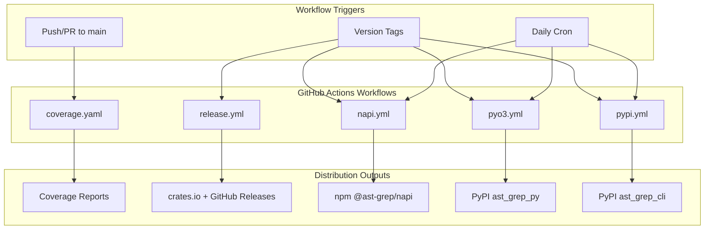
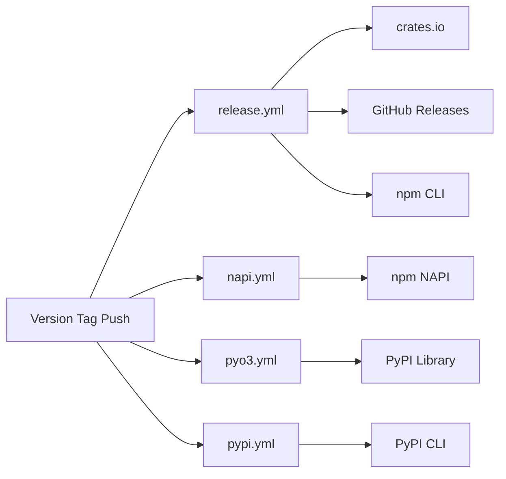

# CI/CD Pipeline

> Relevant source files:
> - [.github/workflows/coverage.yaml](https://github.com/ast-grep/ast-grep/blob/3ae01aec/.github/workflows/coverage.yaml)
> - [.github/workflows/napi.yml](https://github.com/ast-grep/ast-grep/blob/3ae01aec/.github/workflows/napi.yml)
> - [.github/workflows/pyo3.yml](https://github.com/ast-grep/ast-grep/blob/3ae01aec/.github/workflows/pyo3.yml)
> - [.github/workflows/pypi.yml](https://github.com/ast-grep/ast-grep/blob/3ae01aec/.github/workflows/pypi.yml)
> - [.github/workflows/release.yml](https://github.com/ast-grep/ast-grep/blob/3ae01aec/.github/workflows/release.yml)
> - [rust-toolchain.toml](https://github.com/ast-grep/ast-grep/blob/3ae01aec/rust-toolchain.toml)

## Purpose and Scope

This document details the GitHub Actions-based continuous integration and continuous deployment (CI/CD) pipeline for ast-grep. The pipeline orchestrates testing, linting, multi-platform binary compilation, and coordinated publishing to four package ecosystems (crates.io, npm, PyPI, GitHub Releases).

For information about the release automation tools that trigger these workflows, see [Development Tools](10.4-development-tools.md). For details about the distribution packages produced by these workflows, see [Distribution and Packaging](../distribution/9-distribution-and-packaging.md).

## Workflow Architecture

The CI/CD system consists of five primary GitHub Actions workflows, each with a distinct responsibility:



### Workflow Responsibilities

| Workflow | Trigger | Primary Purpose | Artifacts Produced |
|---|---|---|---|
| `coverage.yaml` | Push/PR to main | Code quality checks, test coverage | Coverage reports (codecov.io) |
| `release.yml` | Version tags | Rust ecosystem + GitHub releases + npm CLI | crates.io packages, GitHub binaries, npm CLI packages |
| `napi.yml` | Version tags, daily cron | Node.js native bindings | npm `@ast-grep/napi` packages |
| `pyo3.yml` | Version tags, daily cron | Python library bindings | PyPI `ast_grep_py` wheels |
| `pypi.yml` | Version tags, daily cron | Python CLI wrapper | PyPI `ast_grep_cli` wheels |

Sources: [.github/workflows/coverage.yaml1-63](https://github.com/ast-grep/ast-grep/blob/3ae01aec/.github/workflows/coverage.yaml#L1-L63) [.github/workflows/release.yml1-123](https://github.com/ast-grep/ast-grep/blob/3ae01aec/.github/workflows/release.yml#L1-L123) [.github/workflows/napi.yml1-162](https://github.com/ast-grep/ast-grep/blob/3ae01aec/.github/workflows/napi.yml#L1-L162)

## Quality Gates (coverage.yaml)

The `coverage.yaml` workflow runs on every push to `main` and on all pull requests, serving as the primary quality gate before code is merged.

### Coverage Job

Generates code coverage metrics using `cargo-llvm-cov`:

```yaml
- name: Collect coverage
  run: cargo llvm-cov --all-features --workspace --lcov --output-path lcov.info
- name: Upload coverage
  uses: codecov/codecov-action@v4
```

### Check Job

Enforces code formatting and linting standards:

```yaml
- name: Format check
  run: cargo fmt --all -- --check
- name: Clippy check
  run: cargo clippy --all-targets --all-features --workspace --release --locked -- -D clippy::all
```

### NAPI Linting Job

Validates the Node.js bindings code quality:

```yaml
- name: Install dependencies
  run: cd crates/napi && yarn install
- name: Lint check
  run: cd crates/napi && yarn lint
```

Sources: [.github/workflows/coverage.yaml11-63](https://github.com/ast-grep/ast-grep/blob/3ae01aec/.github/workflows/coverage.yaml#L11-L63)

## Release Workflow (release.yml)

The `release.yml` workflow is triggered by pushing version tags matching the pattern `[0-9]+.*`. It coordinates publishing to three destinations: crates.io, GitHub Releases, and npm (CLI wrapper).

### Crates.io Publishing

The `push_crates_io` job publishes all workspace crates to the Rust package registry:

```yaml
- name: Publish crates-io
  uses: katyo/publish-crates@v2
  with:
    registry-token: ${{ secrets.CARGO_REGISTRY_TOKEN }}
    args: --allow-dirty
    publish-delay: 5000
```

### Binary Upload Matrix

The `upload-assets` job builds native binaries for 7 platform combinations:

| Target Triple | OS Runner | Architectures |
|---|---|---|
| `x86_64-pc-windows-msvc` | `windows-latest` | x64 |
| `i686-pc-windows-msvc` | `windows-latest` | x86 (32-bit) |
| `aarch64-pc-windows-msvc` | `windows-latest` | ARM64 |
| `x86_64-apple-darwin` | `macos-latest` | x64 |
| `aarch64-apple-darwin` | `macos-latest` | ARM64 (M1/M2) |
| `x86_64-unknown-linux-gnu` | `ubuntu-22.04` | x64 |
| `aarch64-unknown-linux-gnu` | `ubuntu-22.04` | ARM64 |

### npm CLI Publishing

The `release-npm` job depends on `upload-assets` completing and repackages the GitHub Release binaries into npm packages.

Sources: [.github/workflows/release.yml1-123](https://github.com/ast-grep/ast-grep/blob/3ae01aec/.github/workflows/release.yml#L1-L123)

## NAPI Workflow (napi.yml)

The `napi.yml` workflow builds Node.js native bindings using `napi-rs` for 9 platform combinations. It runs on version tags, daily at 9 AM UTC, and supports manual dispatch.

### Build Matrix

| Target | Build Strategy | Test |
|---|---|---|
| `x86_64-apple-darwin` | Native | ✓ |
| `aarch64-apple-darwin` | Native | ✓ |
| `x86_64-pc-windows-msvc` | Native | ✓ |
| `i686-pc-windows-msvc` | Native | ✗ |
| `aarch64-pc-windows-msvc` | Cross-compile | ✗ |
| `x86_64-unknown-linux-gnu` | napi-cross | ✓ |
| `x86_64-unknown-linux-musl` | cargo-zigbuild | ✗ |
| `aarch64-unknown-linux-gnu` | napi-cross | ✓ |
| `aarch64-unknown-linux-musl` | cargo-zigbuild | ✗ |

### Publishing Logic

The `publish` job uses Git commit message parsing to determine whether to publish:

- Version like `0.40.5` → stable release (`latest` tag)
- Version like `0.40.5-beta.1` → pre-release (`next` tag)

Sources: [.github/workflows/napi.yml1-162](https://github.com/ast-grep/ast-grep/blob/3ae01aec/.github/workflows/napi.yml#L1-L162)

## PyO3 Workflow (pyo3.yml)

The `pyo3.yml` workflow builds Python library bindings (`ast_grep_py`) using `maturin` and PyO3. It supports Python versions 3.10-3.14.

### Platform Matrix

| OS | Architectures | manylinux |
|---|---|---|
| Linux | x64, ARM64 | `2_28` |
| Windows | x64, x86 | - |
| macOS | x64, ARM64 | - |

### manylinux Configuration

Linux builds use `manylinux: "2_28"` instead of the default to ensure tree-sitter C code compiles correctly.

Sources: [.github/workflows/pyo3.yml1-167](https://github.com/ast-grep/ast-grep/blob/3ae01aec/.github/workflows/pyo3.yml#L1-L167)

## PyPI CLI Workflow (pypi.yml)

The `pypi.yml` workflow builds the Python CLI wrapper (`ast_grep_cli`) which bundles the ast-grep binary with a Python interface. Unlike `pyo3.yml`, this produces abi3 wheels compatible across Python versions.

### Platform Matrix

| OS | Targets |
|---|---|
| macOS | x64, universal2 |
| Windows | x64, x86, ARM64 |
| Linux | x64, ARM64 |

### Build Configuration

| Platform | Environment | Purpose |
|---|---|---|
| Linux | `CFLAGS: "-std=c11"` `CXXFLAGS: "-std=c++11"` | C/C++ standard compliance |
| Windows | `XWIN_VERSION: "16"` | cargo-xwin version for cross-compilation |

Sources: [.github/workflows/pypi.yml1-196](https://github.com/ast-grep/ast-grep/blob/3ae01aec/.github/workflows/pypi.yml#L1-L196)

## Trigger Mechanisms

### Version Tag Pattern

All release workflows trigger on Git tags matching the pattern `[0-9]+.*`:

```yaml
push:
  tags: ["[0-9]+.*"]
```

### Daily Cron

The Python and Node.js workflows run daily at 9 AM UTC to catch dependency-related issues early:

```yaml
schedule:
  - cron: "0 9 * * *"
```

### Manual Dispatch

The `workflow_dispatch` trigger allows manual workflow execution with optional `need_release` input.

## Toolchain Configuration

The project uses a stable Rust toolchain with required components defined in `rust-toolchain.toml`:

```toml
[toolchain]
channel = "stable"
components = ["rustfmt", "clippy"]
```

## Publishing Coordination

The complete release flow requires coordination across four workflows:



All workflows execute in parallel when triggered by a version tag, with `release-npm` depending on `upload-assets` completing first.
