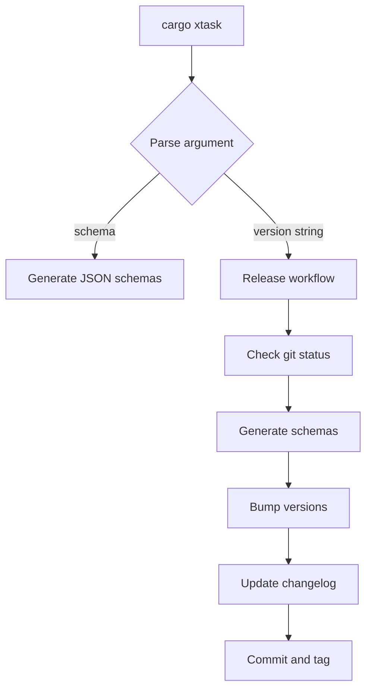
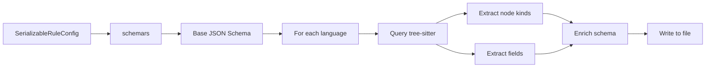
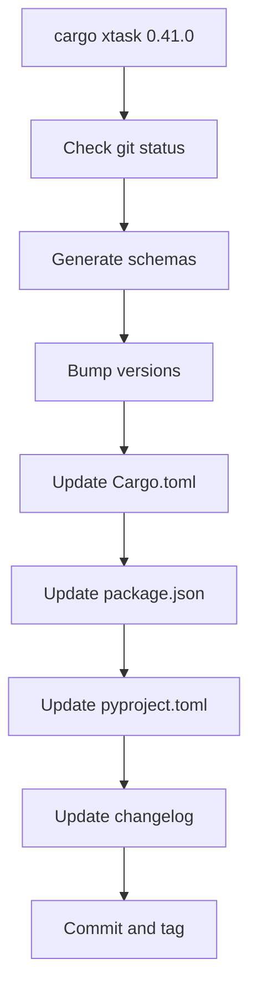

# Development Tools

> Relevant source files:
> - [xtask/Cargo.toml](https://github.com/ast-grep/ast-grep/blob/3ae01aec/xtask/Cargo.toml)
> - [xtask/src/main.rs](https://github.com/ast-grep/ast-grep/blob/3ae01aec/xtask/src/main.rs)
> - [xtask/src/schema.rs](https://github.com/ast-grep/ast-grep/blob/3ae01aec/xtask/src/schema.rs)

This document covers the `xtask` utility crate, a development tool for maintaining the ast-grep project itself. The `xtask` crate provides automation for JSON schema generation and cross-ecosystem release management. For information about CI/CD workflows and GitHub Actions, see [CI/CD Pipeline](10.3-cicd-pipeline.md). For information about the package distribution strategy, see [Distribution and Packaging](../distribution/9-distribution-and-packaging.md).

## Overview

The `xtask` crate is a Cargo workspace utility that automates two critical development tasks:

1. **Schema Generation**: Produces JSON schemas for rule configuration files, including language-specific schemas with valid node kinds and fields
2. **Release Automation**: Orchestrates version bumping across multiple package ecosystems (Rust, npm, PyPI) and Git operations

The `xtask` pattern is a common Rust idiom for project-specific automation tools. It runs via `cargo xtask <command>`, where the `xtask` binary is built as part of the workspace but not published to crates.io.

**Key Dependencies:**

- `ast-grep-core`, `ast-grep-config`, `ast-grep-language` for schema introspection
- `schemars` for JSON Schema generation
- `serde_json` for JSON manipulation
- `toml_edit` for TOML file editing

Sources: [xtask/Cargo.toml1-17](https://github.com/ast-grep/ast-grep/blob/3ae01aec/xtask/Cargo.toml#L1-L17) [xtask/src/main.rs1-30](https://github.com/ast-grep/ast-grep/blob/3ae01aec/xtask/src/main.rs#L1-L30)

## Task Dispatch

The `xtask` binary supports two primary commands dispatched through the `Task` enum:

```rust
enum Task {
  Schema,
  Release(String),
}
```

**Task Dispatch Flow**



Sources: [xtask/src/main.rs10-30](https://github.com/ast-grep/ast-grep/blob/3ae01aec/xtask/src/main.rs#L10-L30)

## JSON Schema Generation

The schema generation system produces JSON schemas for rule configuration files, enabling IDE autocompletion and validation when writing ast-grep rules.

### Schema Architecture



### Schema Output

The schema generation produces 23 files in the `schemas/` directory:

| File | Content |
|---|---|
| `rule.json` | Generic schema with placeholder language |
| `bash_rule.json` | Bash-specific with bash node kinds/fields |
| `c_rule.json` | C-specific with C node kinds/fields |
| `cpp_rule.json` | C++-specific with C++ node kinds/fields |
| ... | One per supported language |
| `yaml_rule.json` | YAML-specific with YAML node kinds/fields |

Each language-specific schema includes:

- Valid node kinds for the `kind` field (e.g., `"function_definition"`, `"if_statement"`)
- Valid field names for the `field` selector (e.g., `"name"`, `"body"`, `"condition"`)
- Language aliases for the `language` field (e.g., `["js", "javascript", "ecmascript"]`)

Sources: [xtask/src/schema.rs16-156](https://github.com/ast-grep/ast-grep/blob/3ae01aec/xtask/src/schema.rs#L16-L156)

## Release Automation

The release automation workflow coordinates version bumping across four package ecosystems and Git operations.

### Release Workflow



### Version Bumping Strategy

The `bump_version` function updates version numbers in multiple file formats across the workspace:

**npm Package Updates:**
- Edit `npm/package.json`: update `version` and all `optionalDependencies` versions
- Edit `npm/platforms/*/package.json`: update `version` in each platform package

**NAPI Package Updates:**
- Edit `crates/napi/package.json`: update `version`
- Edit `crates/napi/npm/*/package.json`: update `version` in each platform package

**Python Package Updates:**
- Edit `pyproject.toml`: update `project.version`
- Edit `crates/pyo3/pyproject.toml`: update `project.version`

**Rust Crate Updates:**
- Edit `Cargo.toml`: update `workspace.package.version` and all `workspace.dependencies.ast-grep-*` versions

**Cargo.lock Update:**
- Run `cargo build` to regenerate lock file with new versions

Sources: [xtask/src/main.rs32-192](https://github.com/ast-grep/ast-grep/blob/3ae01aec/xtask/src/main.rs#L32-L192)

### Git Commit and Tag

The `commit_and_tag` function creates a tagged release commit:

**Commit Message Format:**

```
<version>
bump version
```

The two-line format with version on the first line is required by the NAPI workflow, which parses the first line to determine the npm tag (stable vs. pre-release).

**Git Operations:**

1. `git commit -am "<version>\nbump version"` - Commits all version file changes
2. `git tag <version>` - Creates an annotated tag

Sources: [xtask/src/main.rs158-180](https://github.com/ast-grep/ast-grep/blob/3ae01aec/xtask/src/main.rs#L158-L180)

## Usage Examples

### Generate JSON Schemas

```bash
cargo xtask schema
```

This generates:
- `schemas/rule.json` - Generic rule schema
- `schemas/bash_rule.json`, `schemas/rust_rule.json`, etc. - Language-specific schemas

### Release New Version

```bash
cargo xtask 0.40.6
git push origin main --tags
```

This automates:

1. Verifies clean Git working directory
2. Regenerates JSON schemas
3. Updates version in 40+ files across npm, PyPI, and Cargo manifests
4. Runs `auto-changelog` to update `CHANGELOG.md`
5. Creates commit with message `0.40.6\nbump version`
6. Creates Git tag `0.40.6`

After running `cargo xtask`, the developer pushes the tag:

```bash
git push origin main --tags
```

This triggers the GitHub Actions workflows (see [CI/CD Pipeline](10.3-cicd-pipeline.md)) which build and publish to crates.io, npm, and PyPI.

Sources: [xtask/src/main.rs25-39](https://github.com/ast-grep/ast-grep/blob/3ae01aec/xtask/src/main.rs#L25-L39)

## Testing

The schema generation includes a test case that verifies schema generation succeeds:

```rust
#[test]
fn test_schema_generation() {
  let _ = create_root_schema(); // Should not panic
}
```

This test runs during `cargo test` and ensures the schema generation process can complete without errors.

Sources: [xtask/src/schema.rs194-203](https://github.com/ast-grep/ast-grep/blob/3ae01aec/xtask/src/schema.rs#L194-L203)
