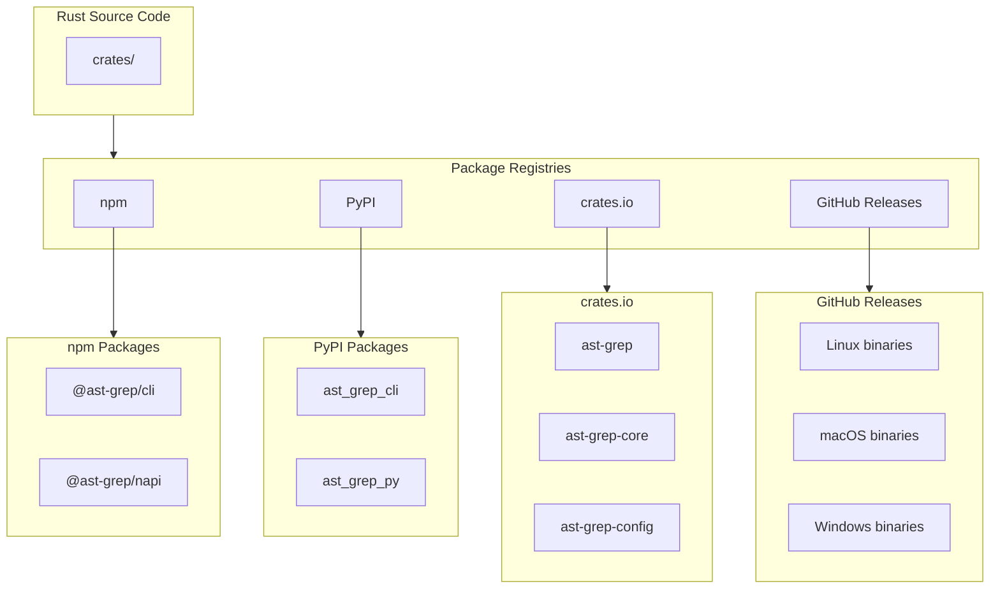
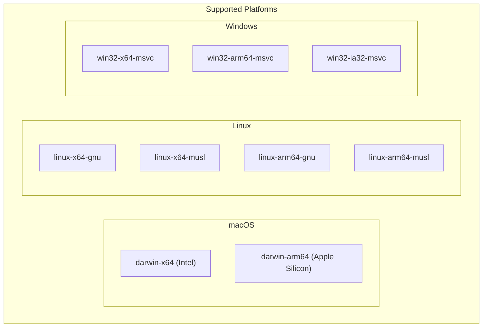
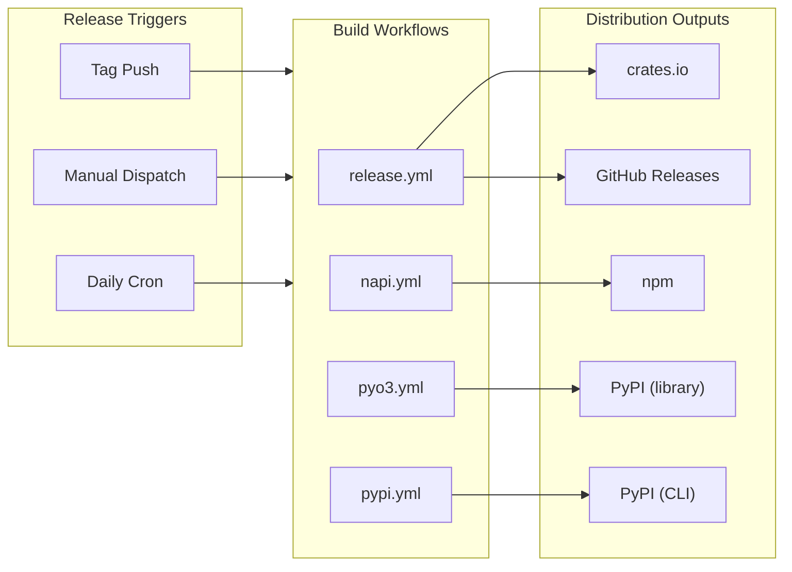

# Distribution and Packaging

> Relevant source files:
> - [.github/workflows/coverage.yaml](https://github.com/ast-grep/ast-grep/blob/3ae01aec/.github/workflows/coverage.yaml)
> - [.github/workflows/napi.yml](https://github.com/ast-grep/ast-grep/blob/3ae01aec/.github/workflows/napi.yml)
> - [.github/workflows/pyo3.yml](https://github.com/ast-grep/ast-grep/blob/3ae01aec/.github/workflows/pyo3.yml)
> - [.github/workflows/pypi.yml](https://github.com/ast-grep/ast-grep/blob/3ae01aec/.github/workflows/pypi.yml)
> - [.github/workflows/release.yml](https://github.com/ast-grep/ast-grep/blob/3ae01aec/.github/workflows/release.yml)
> - [npm/package.json](https://github.com/ast-grep/ast-grep/blob/3ae01aec/npm/package.json)
> - [npm/platforms/darwin-arm64/package.json](https://github.com/ast-grep/ast-grep/blob/3ae01aec/npm/platforms/darwin-arm64/package.json)
> - [npm/platforms/darwin-x64/package.json](https://github.com/ast-grep/ast-grep/blob/3ae01aec/npm/platforms/darwin-x64/package.json)
> - [npm/platforms/linux-x64-gnu/package.json](https://github.com/ast-grep/ast-grep/blob/3ae01aec/npm/platforms/linux-x64-gnu/package.json)
> - [npm/platforms/win32-x64-msvc/package.json](https://github.com/ast-grep/ast-grep/blob/3ae01aec/npm/platforms/win32-x64-msvc/package.json)
> - [rust-toolchain.toml](https://github.com/ast-grep/ast-grep/blob/3ae01aec/rust-toolchain.toml)

This document explains ast-grep's multi-platform distribution strategy, which delivers pre-compiled binaries and library bindings to four distinct package ecosystems (npm, PyPI, crates.io, and GitHub Releases) from a single Rust codebase. The page covers the overall distribution architecture, package organization, build infrastructure, and platform support matrix. For specific implementation details, see [npm CLI Wrapper](9.1-npm-cli-wrapper.md), [Cross-Platform Builds](9.2-cross-platform-builds.md), and [Release Process](9.3-release-process.md).

## Distribution Ecosystems

ast-grep publishes to multiple package registries to serve different developer communities. Each ecosystem has distinct packaging requirements and distribution strategies.

### Package Registry Architecture

**Sources:** [.github/workflows/release.yml](https://github.com/ast-grep/ast-grep/blob/3ae01aec/.github/workflows/release.yml) [.github/workflows/napi.yml](https://github.com/ast-grep/ast-grep/blob/3ae01aec/.github/workflows/napi.yml) [.github/workflows/pyo3.yml](https://github.com/ast-grep/ast-grep/blob/3ae01aec/.github/workflows/pyo3.yml) [.github/workflows/pypi.yml](https://github.com/ast-grep/ast-grep/blob/3ae01aec/.github/workflows/pypi.yml)

### Package Categories

ast-grep distributes three types of packages across the ecosystems:

| Package Type | crates.io | npm | PyPI | GitHub Releases |
|---|---|---|---|---|
| **CLI Binary** | `ast-grep` | `@ast-grep/cli` | `ast_grep_cli` | Direct downloads |
| **Library Bindings** | `ast-grep-core` | `@ast-grep/napi` | `ast_grep_py` | N/A |
| **Platform Variants** | N/A | 7 platform packages | Wheels per platform | 7 platform archives |

**CLI Binary Packages**: Provide the `sg` and `ast-grep` command-line tools. The Rust crate publishes source code that users compile locally via `cargo install`. The npm and PyPI wrappers bundle or download pre-compiled binaries.

**Library Bindings**: Enable programmatic use of ast-grep from JavaScript/TypeScript and Python. The `@ast-grep/napi` package provides Node.js bindings via napi-rs, while `ast_grep_py` provides Python bindings via PyO3.

**Platform Variants**: The npm CLI uses optional dependencies for platform-specific packages ([npm/package.json31-38](https://github.com/ast-grep/ast-grep/blob/3ae01aec/npm/package.json#L31-L38)), while PyPI uses platform-specific wheels built by maturin.

**Sources:** [npm/package.json](https://github.com/ast-grep/ast-grep/blob/3ae01aec/npm/package.json) [.github/workflows/release.yml13-22](https://github.com/ast-grep/ast-grep/blob/3ae01aec/.github/workflows/release.yml#L13-L22) [.github/workflows/napi.yml](https://github.com/ast-grep/ast-grep/blob/3ae01aec/.github/workflows/napi.yml) [.github/workflows/pyo3.yml](https://github.com/ast-grep/ast-grep/blob/3ae01aec/.github/workflows/pyo3.yml)

## Platform Support Matrix

ast-grep builds binaries for multiple operating systems, architectures, and C library variants to maximize platform compatibility.

### Supported Platform Combinations

**Sources:** [.github/workflows/release.yml36-52](https://github.com/ast-grep/ast-grep/blob/3ae01aec/.github/workflows/release.yml#L36-L52) [.github/workflows/napi.yml24-55](https://github.com/ast-grep/ast-grep/blob/3ae01aec/.github/workflows/napi.yml#L24-L55) [.github/workflows/pypi.yml51-163](https://github.com/ast-grep/ast-grep/blob/3ae01aec/.github/workflows/pypi.yml#L51-L163) [.github/workflows/pyo3.yml32-129](https://github.com/ast-grep/ast-grep/blob/3ae01aec/.github/workflows/pyo3.yml#L32-L129)

### Platform Details by Ecosystem

**npm CLI** (`@ast-grep/cli`): Publishes 7 platform-specific packages as optional dependencies. The main package detects the platform at install time and uses the appropriate binary.

Platform packages:
- `@ast-grep/cli-win32-x64-msvc` ([npm/platforms/win32-x64-msvc/package.json1-30](https://github.com/ast-grep/ast-grep/blob/3ae01aec/npm/platforms/win32-x64-msvc/package.json#L1-L30))
- `@ast-grep/cli-win32-ia32-msvc`
- `@ast-grep/cli-win32-arm64-msvc`
- `@ast-grep/cli-darwin-x64` ([npm/platforms/darwin-x64/package.json1-30](https://github.com/ast-grep/ast-grep/blob/3ae01aec/npm/platforms/darwin-x64/package.json#L1-L30))
- `@ast-grep/cli-darwin-arm64` ([npm/platforms/darwin-arm64/package.json1-30](https://github.com/ast-grep/ast-grep/blob/3ae01aec/npm/platforms/darwin-arm64/package.json#L1-L30))
- `@ast-grep/cli-linux-x64-gnu` ([npm/platforms/linux-x64-gnu/package.json1-33](https://github.com/ast-grep/ast-grep/blob/3ae01aec/npm/platforms/linux-x64-gnu/package.json#L1-L33))
- `@ast-grep/cli-linux-arm64-gnu`

**npm NAPI** (`@ast-grep/napi`): Builds 9 platform variants including musl-based Linux for Alpine containers ([.github/workflows/napi.yml24-55](https://github.com/ast-grep/ast-grep/blob/3ae01aec/.github/workflows/napi.yml#L24-L55)).

**PyPI CLI** (`ast_grep_cli`): Distributes 7 platform wheels using maturin, with special handling for macOS universal2 binaries that support both x86_64 and ARM64 ([.github/workflows/pypi.yml72-91](https://github.com/ast-grep/ast-grep/blob/3ae01aec/.github/workflows/pypi.yml#L72-L91)).

**PyPI Library** (`ast_grep_py`): Publishes 5 platform wheels (Linux x64/ARM64, Windows x64/x86, macOS x64/ARM64) plus a source distribution ([.github/workflows/pyo3.yml31-146](https://github.com/ast-grep/ast-grep/blob/3ae01aec/.github/workflows/pyo3.yml#L31-L146)).

**GitHub Releases**: Uploads 7 platform archives as release assets. The npm CLI wrapper can optionally download binaries from here during postinstall ([.github/workflows/release.yml35-70](https://github.com/ast-grep/ast-grep/blob/3ae01aec/.github/workflows/release.yml#L35-L70)).

**Sources:** [npm/package.json31-38](https://github.com/ast-grep/ast-grep/blob/3ae01aec/npm/package.json#L31-L38) [.github/workflows/release.yml35-70](https://github.com/ast-grep/ast-grep/blob/3ae01aec/.github/workflows/release.yml#L35-L70) [.github/workflows/napi.yml24-55](https://github.com/ast-grep/ast-grep/blob/3ae01aec/.github/workflows/napi.yml#L24-L55) [.github/workflows/pypi.yml51-163](https://github.com/ast-grep/ast-grep/blob/3ae01aec/.github/workflows/pypi.yml#L51-L163) [.github/workflows/pyo3.yml32-129](https://github.com/ast-grep/ast-grep/blob/3ae01aec/.github/workflows/pyo3.yml#L32-L129)

## Build Infrastructure

Four separate GitHub Actions workflows handle the different distribution targets. Each workflow triggers on version tags and runs in parallel to build platform-specific artifacts.

### Workflow Organization

**Sources:** [.github/workflows/release.yml6-11](https://github.com/ast-grep/ast-grep/blob/3ae01aec/.github/workflows/release.yml#L6-L11) [.github/workflows/napi.yml6-13](https://github.com/ast-grep/ast-grep/blob/3ae01aec/.github/workflows/napi.yml#L6-L13) [.github/workflows/pyo3.yml15-26](https://github.com/ast-grep/ast-grep/blob/3ae01aec/.github/workflows/pyo3.yml#L15-L26) [.github/workflows/pypi.yml3-14](https://github.com/ast-grep/ast-grep/blob/3ae01aec/.github/workflows/pypi.yml#L3-L14)

### Workflow Responsibilities

**`release.yml`**: Primary release workflow that:
1. Publishes Rust crates to crates.io ([.github/workflows/release.yml13-22](https://github.com/ast-grep/ast-grep/blob/3ae01aec/.github/workflows/release.yml#L13-L22))
2. Creates GitHub Release with changelog ([.github/workflows/release.yml24-33](https://github.com/ast-grep/ast-grep/blob/3ae01aec/.github/workflows/release.yml#L24-L33))
3. Uploads platform binaries to GitHub Releases ([.github/workflows/release.yml35-70](https://github.com/ast-grep/ast-grep/blob/3ae01aec/.github/workflows/release.yml#L35-L70))
4. Downloads binaries from GitHub Releases, extracts them, and publishes npm platform packages and CLI wrapper ([.github/workflows/release.yml71-116](https://github.com/ast-grep/ast-grep/blob/3ae01aec/.github/workflows/release.yml#L71-L116))

**`napi.yml`**: Builds Node.js native bindings:
1. Builds `.node` files for 9 platforms using napi-rs ([.github/workflows/napi.yml19-111](https://github.com/ast-grep/ast-grep/blob/3ae01aec/.github/workflows/napi.yml#L19-L111))
2. Aggregates artifacts, generates TypeScript types, and publishes to npm ([.github/workflows/napi.yml112-162](https://github.com/ast-grep/ast-grep/blob/3ae01aec/.github/workflows/napi.yml#L112-L162))
3. Uses `cargo-zigbuild` for musl targets ([.github/workflows/napi.yml87-97](https://github.com/ast-grep/ast-grep/blob/3ae01aec/.github/workflows/napi.yml#L87-L97))

**`pyo3.yml`**: Builds Python library (`ast_grep_py`):
1. Creates wheels for Linux (manylinux 2_28), Windows, and macOS ([.github/workflows/pyo3.yml32-129](https://github.com/ast-grep/ast-grep/blob/3ae01aec/.github/workflows/pyo3.yml#L32-L129))
2. Builds source distribution (sdist) ([.github/workflows/pyo3.yml131-145](https://github.com/ast-grep/ast-grep/blob/3ae01aec/.github/workflows/pyo3.yml#L131-L145))
3. Uploads to PyPI with trusted publishing ([.github/workflows/pyo3.yml147-167](https://github.com/ast-grep/ast-grep/blob/3ae01aec/.github/workflows/pyo3.yml#L147-L167))

**`pypi.yml`**: Builds Python CLI (`ast_grep_cli`):
1. Creates ABI3 wheels for broad Python version compatibility ([.github/workflows/pypi.yml22](https://github.com/ast-grep/ast-grep/blob/3ae01aec/.github/workflows/pypi.yml#L22-L22))
2. Builds macOS universal2 binaries for both Intel and Apple Silicon ([.github/workflows/pypi.yml72-91](https://github.com/ast-grep/ast-grep/blob/3ae01aec/.github/workflows/pypi.yml#L72-L91))
3. Uses manylinux 2_28 for Linux compatibility ([.github/workflows/pypi.yml152](https://github.com/ast-grep/ast-grep/blob/3ae01aec/.github/workflows/pypi.yml#L152-L152))
4. Uploads to PyPI using `uv publish` ([.github/workflows/pypi.yml189-190](https://github.com/ast-grep/ast-grep/blob/3ae01aec/.github/workflows/pypi.yml#L189-L190))

**Sources:** [.github/workflows/release.yml](https://github.com/ast-grep/ast-grep/blob/3ae01aec/.github/workflows/release.yml) [.github/workflows/napi.yml](https://github.com/ast-grep/ast-grep/blob/3ae01aec/.github/workflows/napi.yml) [.github/workflows/pyo3.yml](https://github.com/ast-grep/ast-grep/blob/3ae01aec/.github/workflows/pyo3.yml) [.github/workflows/pypi.yml](https://github.com/ast-grep/ast-grep/blob/3ae01aec/.github/workflows/pypi.yml)

### Cross-Compilation Tooling

Different platforms require specialized build tools:

| Target Platform | Tooling | Workflow |
|---|---|---|
| **Linux musl** | cargo-zigbuild + Zig 0.14.1 | [napi.yml87-97](https://github.com/ast-grep/ast-grep/blob/3ae01aec/napi.yml#L87-L97) |
| **Windows ARM64** | cargo-xwin (XWIN_VERSION: "16") | [pypi.yml112-114](https://github.com/ast-grep/ast-grep/blob/3ae01aec/pypi.yml#L112-L114) |
| **macOS ARM64** | Native cross-compilation | [release.yml45-46](https://github.com/ast-grep/ast-grep/blob/3ae01aec/release.yml#L45-L46) |
| **Linux ARM64** | napi-cross or native runner | [napi.yml46-49](https://github.com/ast-grep/ast-grep/blob/3ae01aec/napi.yml#L46-L49) |
| **manylinux** | manylinux 2_28 container | [pyo3.yml52](https://github.com/ast-grep/ast-grep/blob/3ae01aec/pyo3.yml#L52-L52) [pypi.yml152](https://github.com/ast-grep/ast-grep/blob/3ae01aec/pypi.yml#L152-L152) |

**Sources:** [.github/workflows/napi.yml87-97](https://github.com/ast-grep/ast-grep/blob/3ae01aec/.github/workflows/napi.yml#L87-L97) [.github/workflows/pypi.yml112-114](https://github.com/ast-grep/ast-grep/blob/3ae01aec/.github/workflows/pypi.yml#L112-L114) [.github/workflows/pyo3.yml52](https://github.com/ast-grep/ast-grep/blob/3ae01aec/.github/workflows/pyo3.yml#L52-L52) [.github/workflows/pypi.yml152](https://github.com/ast-grep/ast-grep/blob/3ae01aec/.github/workflows/pypi.yml#L152-L152)

## Version Synchronization

All packages across different ecosystems share the same version number to maintain consistency. For example, version `0.40.5` applies to:

- Rust crates: `ast-grep = "0.40.5"`
- npm packages: `@ast-grep/cli@0.40.5`, `@ast-grep/napi@0.40.5`
- PyPI packages: `ast-grep-cli==0.40.5`, `ast-grep-py==0.40.5`
- GitHub Release tag: `0.40.5`

The version is defined in multiple manifest files:

- `Cargo.toml` for Rust crates
- `crates/napi/package.json` for npm packages
- `crates/pyo3/Cargo.toml` and `crates/pyproject.toml` for Python packages
- `npm/package.json` for the npm CLI wrapper ([npm/package.json3](https://github.com/ast-grep/ast-grep/blob/3ae01aec/npm/package.json#L3-L3))

Each platform-specific npm package also maintains the synchronized version ([npm/platforms/darwin-arm64/package.json3](https://github.com/ast-grep/ast-grep/blob/3ae01aec/npm/platforms/darwin-arm64/package.json#L3-L3) [npm/platforms/win32-x64-msvc/package.json3](https://github.com/ast-grep/ast-grep/blob/3ae01aec/npm/platforms/win32-x64-msvc/package.json#L3-L3) [npm/platforms/linux-x64-gnu/package.json3](https://github.com/ast-grep/ast-grep/blob/3ae01aec/npm/platforms/linux-x64-gnu/package.json#L3-L3)).

The release process (detailed in [Release Process](9.3-release-process.md)) automates version bumping across all these files to ensure consistency.

**Sources:** [npm/package.json3](https://github.com/ast-grep/ast-grep/blob/3ae01aec/npm/package.json#L3-L3) [npm/platforms/darwin-arm64/package.json3](https://github.com/ast-grep/ast-grep/blob/3ae01aec/npm/platforms/darwin-arm64/package.json#L3-L3) [npm/platforms/win32-x64-msvc/package.json3](https://github.com/ast-grep/ast-grep/blob/3ae01aec/npm/platforms/win32-x64-msvc/package.json#L3-L3) [npm/platforms/linux-x64-gnu/package.json3](https://github.com/ast-grep/ast-grep/blob/3ae01aec/npm/platforms/linux-x64-gnu/package.json#L3-L3)

## Workflow Triggers and Publishing

Workflows trigger on three types of events:

### Tag-Based Releases

When a version tag matching the pattern `[0-9]+.*` is pushed (e.g., `0.40.5`, `1.2.3-beta.1`), all four workflows trigger automatically ([.github/workflows/release.yml9-11](https://github.com/ast-grep/ast-grep/blob/3ae01aec/.github/workflows/release.yml#L9-L11) [.github/workflows/napi.yml8-10](https://github.com/ast-grep/ast-grep/blob/3ae01aec/.github/workflows/napi.yml#L8-L10) [.github/workflows/pyo3.yml21-23](https://github.com/ast-grep/ast-grep/blob/3ae01aec/.github/workflows/pyo3.yml#L21-L23) [.github/workflows/pypi.yml9-11](https://github.com/ast-grep/ast-grep/blob/3ae01aec/.github/workflows/pypi.yml#L9-L11)).

Publishing to registries only occurs when the tag matches:

- **crates.io**: Publishes when `startsWith(github.event.ref, 'refs/tags')` ([.github/workflows/release.yml15](https://github.com/ast-grep/ast-grep/blob/3ae01aec/.github/workflows/release.yml#L15-L15))
- **npm**: Publishes stable version for exact semantic version tag (regex `^[0-9]+\.[0-9]+\.[0-9]+$`), or `next` tag otherwise ([.github/workflows/napi.yml148-159](https://github.com/ast-grep/ast-grep/blob/3ae01aec/.github/workflows/napi.yml#L148-L159))
- **PyPI**: Publishes when tag starts with `refs/tags` or manual trigger input is set ([.github/workflows/pyo3.yml150](https://github.com/ast-grep/ast-grep/blob/3ae01aec/.github/workflows/pyo3.yml#L150-L150) [.github/workflows/pypi.yml175](https://github.com/ast-grep/ast-grep/blob/3ae01aec/.github/workflows/pypi.yml#L175-L175))

### Manual Workflow Dispatch

All workflows support manual triggering via `workflow_dispatch`. The PyPI workflows include a `need_release` boolean input to control whether artifacts are uploaded or just built ([.github/workflows/pyo3.yml16-20](https://github.com/ast-grep/ast-grep/blob/3ae01aec/.github/workflows/pyo3.yml#L16-L20) [.github/workflows/pypi.yml4-8](https://github.com/ast-grep/ast-grep/blob/3ae01aec/.github/workflows/pypi.yml#L4-L8)).

### Scheduled Builds

The npm NAPI, PyPI library, and PyPI CLI workflows run daily at 9 AM UTC via cron schedule ([.github/workflows/napi.yml11-13](https://github.com/ast-grep/ast-grep/blob/3ae01aec/.github/workflows/napi.yml#L11-L13) [.github/workflows/pyo3.yml24-26](https://github.com/ast-grep/ast-grep/blob/3ae01aec/.github/workflows/pyo3.yml#L24-L26) [.github/workflows/pypi.yml12-14](https://github.com/ast-grep/ast-grep/blob/3ae01aec/.github/workflows/pypi.yml#L12-L14)). This ensures dependencies and build infrastructure remain functional even between releases.

**Sources:** [.github/workflows/release.yml6-11](https://github.com/ast-grep/ast-grep/blob/3ae01aec/.github/workflows/release.yml#L6-L11) [.github/workflows/napi.yml6-13](https://github.com/ast-grep/ast-grep/blob/3ae01aec/.github/workflows/napi.yml#L6-L13) [.github/workflows/pyo3.yml15-26](https://github.com/ast-grep/ast-grep/blob/3ae01aec/.github/workflows/pyo3.yml#L15-L26) [.github/workflows/pypi.yml3-14](https://github.com/ast-grep/ast-grep/blob/3ae01aec/.github/workflows/pypi.yml#L3-L14)

## Quality Assurance

The `coverage.yaml` workflow runs on every push and pull request to the `main` branch ([.github/workflows/coverage.yaml2-8](https://github.com/ast-grep/ast-grep/blob/3ae01aec/.github/workflows/coverage.yaml#L2-L8)), performing:

1. **Code Coverage**: Generates LCOV coverage report using `cargo-llvm-cov` and uploads to codecov.io ([.github/workflows/coverage.yaml11-29](https://github.com/ast-grep/ast-grep/blob/3ae01aec/.github/workflows/coverage.yaml#L11-L29))
2. **Linting**: Runs `cargo clippy` on all targets and features ([.github/workflows/coverage.yaml30-50](https://github.com/ast-grep/ast-grep/blob/3ae01aec/.github/workflows/coverage.yaml#L30-L50))
3. **Formatting**: Verifies code formatting with `cargo fmt --check` ([.github/workflows/coverage.yaml47-48](https://github.com/ast-grep/ast-grep/blob/3ae01aec/.github/workflows/coverage.yaml#L47-L48))
4. **NAPI Linting**: Runs JavaScript/TypeScript linting for the Node.js bindings ([.github/workflows/coverage.yaml51-63](https://github.com/ast-grep/ast-grep/blob/3ae01aec/.github/workflows/coverage.yaml#L51-L63))

These checks serve as quality gates before code reaches the release workflows.

**Sources:** [.github/workflows/coverage.yaml](https://github.com/ast-grep/ast-grep/blob/3ae01aec/.github/workflows/coverage.yaml)

## Artifact Distribution Strategy

ast-grep employs three distinct strategies for distributing pre-compiled binaries:

### Bundled Binaries

**NAPI Platform Packages**: Each `@ast-grep/napi-*` package bundles the `.node` native addon file directly ([.github/workflows/napi.yml106-111](https://github.com/ast-grep/ast-grep/blob/3ae01aec/.github/workflows/napi.yml#L106-L111)). Users get the binary when they install the package.

**PyPI Wheels**: Python wheels include compiled extensions bundled within the package. Both `ast_grep_py` and `ast_grep_cli` distribute platform-specific wheels ([.github/workflows/pyo3.yml46-66](https://github.com/ast-grep/ast-grep/blob/3ae01aec/.github/workflows/pyo3.yml#L46-L66) [.github/workflows/pypi.yml60-70](https://github.com/ast-grep/ast-grep/blob/3ae01aec/.github/workflows/pypi.yml#L60-L70)).

### Optional Dependencies

**npm CLI Platform Packages**: The main `@ast-grep/cli` package declares platform-specific packages as optional dependencies ([npm/package.json31-38](https://github.com/ast-grep/ast-grep/blob/3ae01aec/npm/package.json#L31-L38)). npm automatically installs the appropriate package based on the system's OS, CPU architecture, and libc implementation.

Each platform package specifies constraints using `os`, `cpu`, and `libc` fields ([npm/platforms/linux-x64-gnu/package.json4-12](https://github.com/ast-grep/ast-grep/blob/3ae01aec/npm/platforms/linux-x64-gnu/package.json#L4-L12)).

### Post-Install Download

**npm CLI Fallback**: If the optional dependency installation fails (unsupported platform or network issue), the `postinstall.js` script can download binaries from GitHub Releases ([npm/package.json28-29](https://github.com/ast-grep/ast-grep/blob/3ae01aec/npm/package.json#L28-L29)). See [npm CLI Wrapper](9.1-npm-cli-wrapper.md) for details.

**Sources:** [npm/package.json28-38](https://github.com/ast-grep/ast-grep/blob/3ae01aec/npm/package.json#L28-L38) [npm/platforms/linux-x64-gnu/package.json4-12](https://github.com/ast-grep/ast-grep/blob/3ae01aec/npm/platforms/linux-x64-gnu/package.json#L4-L12) [.github/workflows/napi.yml106-111](https://github.com/ast-grep/ast-grep/blob/3ae01aec/.github/workflows/napi.yml#L106-L111) [.github/workflows/pyo3.yml46-66](https://github.com/ast-grep/ast-grep/blob/3ae01aec/.github/workflows/pyo3.yml#L46-L66) [.github/workflows/pypi.yml60-70](https://github.com/ast-grep/ast-grep/blob/3ae01aec/.github/workflows/pypi.yml#L60-L70)

## Environment Configuration

Workflows use consistent environment variables to configure builds:

**Python-specific**:
- `PACKAGE_NAME`: `ast_grep_py` ([.github/workflows/pyo3.yml4](https://github.com/ast-grep/ast-grep/blob/3ae01aec/.github/workflows/pyo3.yml#L4-L4)) or `ast_grep_cli` ([.github/workflows/pypi.yml21](https://github.com/ast-grep/ast-grep/blob/3ae01aec/.github/workflows/pypi.yml#L21-L21))
- `PYTHON_VERSION`: Specifies supported Python versions ([.github/workflows/pyo3.yml5](https://github.com/ast-grep/ast-grep/blob/3ae01aec/.github/workflows/pyo3.yml#L5-L5) [.github/workflows/pypi.yml22](https://github.com/ast-grep/ast-grep/blob/3ae01aec/.github/workflows/pypi.yml#L22-L22))

**NAPI-specific**:
- `APP_NAME`: `ast-grep-napi` ([.github/workflows/napi.yml4](https://github.com/ast-grep/ast-grep/blob/3ae01aec/.github/workflows/napi.yml#L4-L4))
- `MACOSX_DEPLOYMENT_TARGET`: `10.13` ([.github/workflows/napi.yml5](https://github.com/ast-grep/ast-grep/blob/3ae01aec/.github/workflows/napi.yml#L5-L5))

**Sources:** [.github/workflows/napi.yml2-5](https://github.com/ast-grep/ast-grep/blob/3ae01aec/.github/workflows/napi.yml#L2-L5) [.github/workflows/pyo3.yml3-9](https://github.com/ast-grep/ast-grep/blob/3ae01aec/.github/workflows/pyo3.yml#L3-L9) [.github/workflows/pypi.yml20-26](https://github.com/ast-grep/ast-grep/blob/3ae01aec/.github/workflows/pypi.yml#L20-L26)
