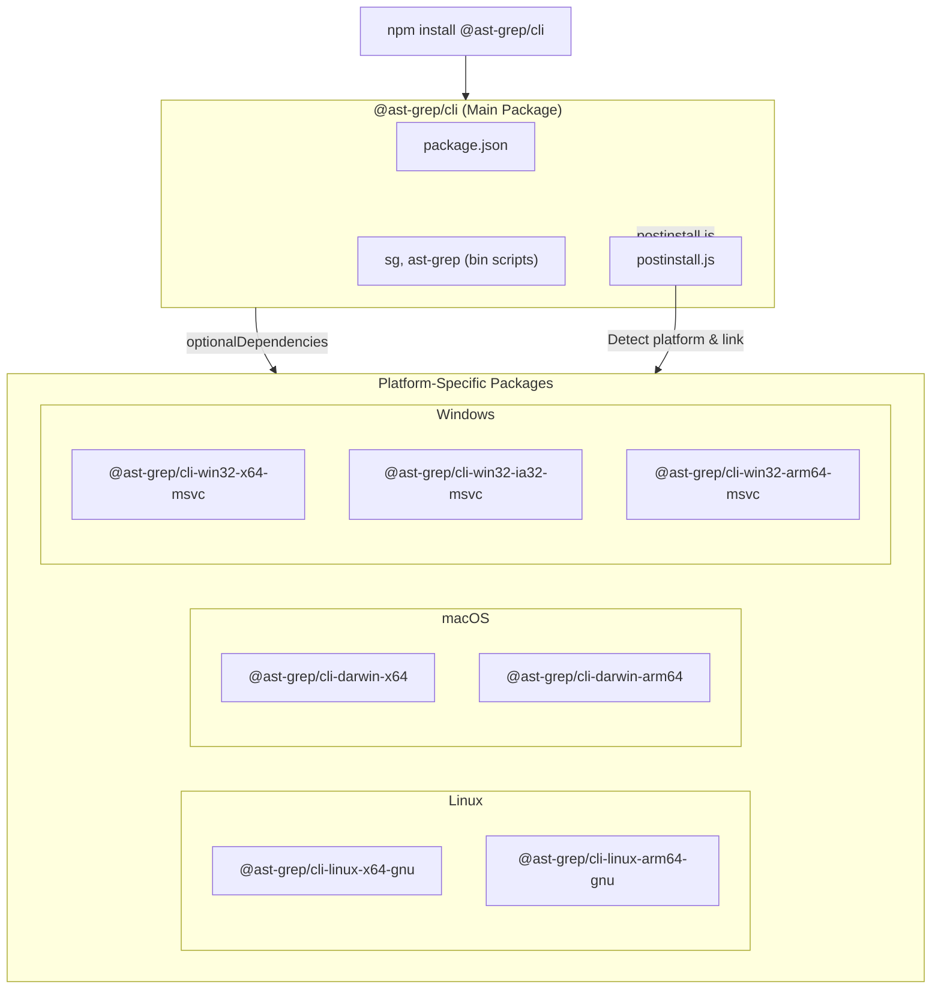
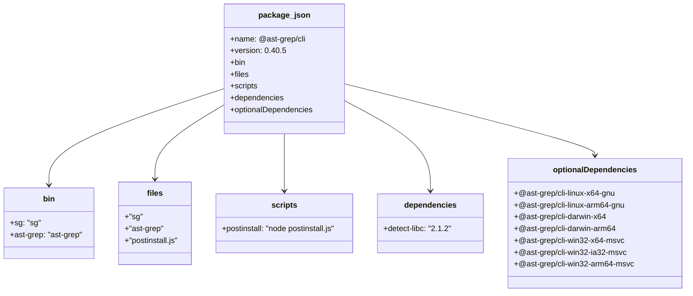
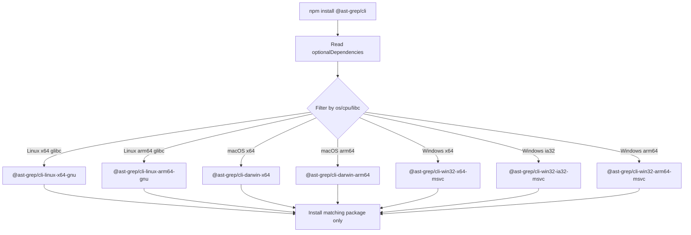
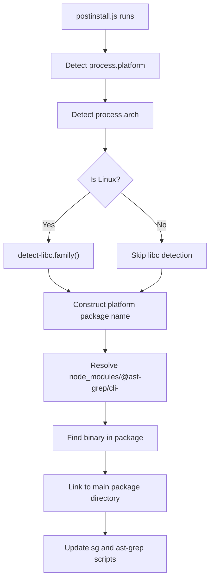

# npm CLI Wrapper

> Relevant source files:
> - [npm/package.json](https://github.com/ast-grep/ast-grep/blob/3ae01aec/npm/package.json)
> - [npm/platforms/darwin-arm64/package.json](https://github.com/ast-grep/ast-grep/blob/3ae01aec/npm/platforms/darwin-arm64/package.json)
> - [npm/platforms/darwin-x64/package.json](https://github.com/ast-grep/ast-grep/blob/3ae01aec/npm/platforms/darwin-x64/package.json)
> - [npm/platforms/linux-x64-gnu/package.json](https://github.com/ast-grep/ast-grep/blob/3ae01aec/npm/platforms/linux-x64-gnu/package.json)
> - [npm/platforms/win32-x64-msvc/package.json](https://github.com/ast-grep/ast-grep/blob/3ae01aec/npm/platforms/win32-x64-msvc/package.json)

The `@ast-grep/cli` npm package provides a cross-platform distribution mechanism for the native ast-grep CLI binary. It uses npm's `optionalDependencies` mechanism combined with a `postinstall` script to select and link the correct platform-specific binary package at installation time.

**Scope:**
- Package structure of `@ast-grep/cli` and its 7 platform-specific subpackages
- npm's `optionalDependencies` mechanism for platform selection
- `postinstall.js` script for binary linking
- `bin` field configuration for command exposure

**Related pages:**
- For CLI commands: see [Commands Overview](../cli-tool/5.1-commands-overview.md)
- For NAPI JavaScript API: see [NAPI API Reference](../nodejs-integration/7.1-napi-api-reference.md)
- For CI/CD build process: see [Cross-Platform Builds](9.2-cross-platform-builds.md)

---

## Package Architecture

The npm CLI wrapper consists of a main package (`@ast-grep/cli`) and 7 platform-specific binary packages. The main package declares all platform packages as `optionalDependencies`, allowing npm to install only the packages compatible with the user's system. A `postinstall` script then links the binary from the installed platform package.

This architecture enables:

- Zero-configuration installation across platforms
- No Rust toolchain required for end users
- Integration with npm scripts and `npx`
- Platform binaries as isolated, cacheable artifacts

**Sources:**  
[npm/package.json1-44](https://github.com/ast-grep/ast-grep/blob/3ae01aec/npm/package.json#L1-L44)

---

## Package Dependency Structure

### Diagram: npm Package Dependency Graph



**Sources:**  
[npm/package.json25-39](https://github.com/ast-grep/ast-grep/blob/3ae01aec/npm/package.json#L25-L39)  
[npm/platforms/linux-x64-gnu/package.json1-33](https://github.com/ast-grep/ast-grep/blob/3ae01aec/npm/platforms/linux-x64-gnu/package.json#L1-L33)  
[npm/platforms/darwin-arm64/package.json1-30](https://github.com/ast-grep/ast-grep/blob/3ae01aec/npm/platforms/darwin-arm64/package.json#L1-L30)  
[npm/platforms/darwin-x64/package.json1-30](https://github.com/ast-grep/ast-grep/blob/3ae01aec/npm/platforms/darwin-x64/package.json#L1-L30)  
[npm/platforms/win32-x64-msvc/package.json1-30](https://github.com/ast-grep/ast-grep/blob/3ae01aec/npm/platforms/win32-x64-msvc/package.json#L1-L30)

---

## Main Package Configuration

The main package [npm/package.json1-44](https://github.com/ast-grep/ast-grep/blob/3ae01aec/npm/package.json#L1-L44) uses several npm package.json fields to implement the wrapper pattern:

### package.json Field Structure

| Field | Value | Purpose |
|---|---|---|
| `name` | `"@ast-grep/cli"` | Published package identifier |
| `version` | `"0.40.5"` | Synchronized across all platform packages |
| `bin.sg` | `"sg"` | Exposes `sg` command in node_modules/.bin |
| `bin.ast-grep` | `"ast-grep"` | Exposes `ast-grep` command in node_modules/.bin |
| `files` | `["sg", "ast-grep", "postinstall.js"]` | Files included in published package |
| `scripts.postinstall` | `"node postinstall.js"` | Executed after package installation |
| `dependencies` | `{"detect-libc": "2.1.2"}` | Required for Linux libc detection |
| `optionalDependencies` | 7 platform packages | npm installs only compatible packages |

### Diagram: package.json Structure



**Sources:**  
[npm/package.json1-44](https://github.com/ast-grep/ast-grep/blob/3ae01aec/npm/package.json#L1-L44)

---

## Platform-Specific Binary Packages

Each platform package contains a single native binary and uses npm's platform filtering fields (`os`, `cpu`, `libc`) to ensure it only installs on compatible systems.

### Platform Package Structure

All platform packages share this structure:

- `name`: Platform-specific identifier (e.g., `@ast-grep/cli-linux-x64-gnu`)
- `version`: Matches main package version
- `os`: Array restricting to specific operating system(s)
- `cpu`: Array restricting to specific architecture(s)
- `libc`: (Linux only) Array restricting to specific C library implementation
- `files`: Array containing only the binary (e.g., `["ast-grep"]` or `["ast-grep.exe"]`)

### Platform Package Field Comparison

| Package Name | os | cpu | libc | Binary File |
|---|---|---|---|---|
| `@ast-grep/cli-linux-x64-gnu` | `["linux"]` | `["x64"]` | `["glibc"]` | `ast-grep` |
| `@ast-grep/cli-linux-arm64-gnu` | `["linux"]` | `["arm64"]` | `["glibc"]` | `ast-grep` |
| `@ast-grep/cli-darwin-x64` | `["darwin"]` | `["x64"]` | - | `ast-grep` |
| `@ast-grep/cli-darwin-arm64` | `["darwin"]` | `["arm64"]` | - | `ast-grep` |
| `@ast-grep/cli-win32-x64-msvc` | `["win32"]` | `["x64"]` | - | `ast-grep.exe` |
| `@ast-grep/cli-win32-ia32-msvc` | `["win32"]` | `["ia32"]` | - | `ast-grep.exe` |
| `@ast-grep/cli-win32-arm64-msvc` | `["win32"]` | `["arm64"]` | - | `ast-grep.exe` |

### Diagram: Platform Package Filtering Mechanism



**Sources:**  
[npm/package.json31-39](https://github.com/ast-grep/ast-grep/blob/3ae01aec/npm/package.json#L31-L39)  
[npm/platforms/linux-x64-gnu/package.json1-33](https://github.com/ast-grep/ast-grep/blob/3ae01aec/npm/platforms/linux-x64-gnu/package.json#L1-L33)  
[npm/platforms/darwin-arm64/package.json1-30](https://github.com/ast-grep/ast-grep/blob/3ae01aec/npm/platforms/darwin-arm64/package.json#L1-L30)  
[npm/platforms/darwin-x64/package.json1-30](https://github.com/ast-grep/ast-grep/blob/3ae01aec/npm/platforms/darwin-x64/package.json#L1-L30)  
[npm/platforms/win32-x64-msvc/package.json1-30](https://github.com/ast-grep/ast-grep/blob/3ae01aec/npm/platforms/win32-x64-msvc/package.json#L1-L30)

---

## Postinstall Binary Linking

The `postinstall.js` script executes after npm installs the package and its dependencies. Since npm's `optionalDependencies` mechanism already filters packages at install time, the script's job is to locate the installed platform package and link its binary.

### Postinstall Script Responsibilities

1. **Platform Detection**: Read `process.platform` and `process.arch` to determine the current system
2. **Libc Detection**: On Linux, use the `detect-libc` dependency to distinguish glibc from musl
3. **Package Resolution**: Construct the platform package name (e.g., `@ast-grep/cli-linux-x64-gnu`)
4. **Binary Location**: Find the installed package in `node_modules/@ast-grep/cli-<platform>/`
5. **Binary Linking**: Create symlinks or copies of `ast-grep` (or `ast-grep.exe`) in the main package directory
6. **Bin Script Creation**: Ensure `sg` and `ast-grep` wrapper scripts reference the linked binary

### Diagram: Postinstall Execution Flow



**Sources:**  
[npm/package.json20-30](https://github.com/ast-grep/ast-grep/blob/3ae01aec/npm/package.json#L20-L30)  
[npm/package.json40-43](https://github.com/ast-grep/ast-grep/blob/3ae01aec/npm/package.json#L40-L43)

---

## Command Exposure

After the postinstall script links the binary, npm's `bin` field mechanism makes the commands available to users.

### bin Field Mechanism

The `bin` field in [npm/package.json40-43](https://github.com/ast-grep/ast-grep/blob/3ae01aec/npm/package.json#L40-L43) defines two command aliases:

```json
{
  "bin": {
    "sg": "sg",
    "ast-grep": "ast-grep"
  }
}
```

npm processes this field by:

1. Creating wrapper scripts in `node_modules/.bin/` that reference the files `sg` and `ast-grep` in the package directory
2. Adding `node_modules/.bin/` to PATH when running package scripts
3. Making commands available to `npx` for direct invocation

### Command Invocation Paths

| Invocation Method | Command Path | Notes |
|---|---|---|
| `npm run script` | `node_modules/.bin/sg` | Available in package.json scripts |
| `npx sg` | Resolves to `node_modules/@ast-grep/cli/sg` | Direct execution |
| `./node_modules/.bin/sg` | Direct path | Manual invocation |
| Global install: `sg` | System PATH | After `npm install -g @ast-grep/cli` |

**Sources:**  
[npm/package.json40-43](https://github.com/ast-grep/ast-grep/blob/3ae01aec/npm/package.json#L40-L43)  
[npm/package.json20-24](https://github.com/ast-grep/ast-grep/blob/3ae01aec/npm/package.json#L20-L24)

---

## Version Synchronization

All packages use synchronized versioning to ensure compatibility. The version field must match exactly across:

- Main package: [npm/package.json3](https://github.com/ast-grep/ast-grep/blob/3ae01aec/npm/package.json#L3-L3)
- All 7 platform packages: e.g., [npm/platforms/linux-x64-gnu/package.json3](https://github.com/ast-grep/ast-grep/blob/3ae01aec/npm/platforms/linux-x64-gnu/package.json#L3-L3)
- All `optionalDependencies` version constraints: [npm/package.json31-39](https://github.com/ast-grep/ast-grep/blob/3ae01aec/npm/package.json#L31-L39)

### Version Consistency Requirements

| Package | Version Field | optionalDependencies Reference |
|---|---|---|
| `@ast-grep/cli` | `"0.40.5"` | - |
| `@ast-grep/cli-linux-x64-gnu` | `"0.40.5"` | `"@ast-grep/cli-linux-x64-gnu": "0.40.5"` |
| `@ast-grep/cli-darwin-arm64` | `"0.40.5"` | `"@ast-grep/cli-darwin-arm64": "0.40.5"` |
| ... | ... | ... |

This synchronization is enforced by the CI/CD publishing workflow (see [Cross-Platform Builds](9.2-cross-platform-builds.md)) which updates all package.json files atomically before publishing.

**Sources:**  
[npm/package.json3](https://github.com/ast-grep/ast-grep/blob/3ae01aec/npm/package.json#L3-L3)  
[npm/package.json31-39](https://github.com/ast-grep/ast-grep/blob/3ae01aec/npm/package.json#L31-L39)  
[npm/platforms/linux-x64-gnu/package.json3](https://github.com/ast-grep/ast-grep/blob/3ae01aec/npm/platforms/linux-x64-gnu/package.json#L3-L3)  
[npm/platforms/darwin-arm64/package.json3](https://github.com/ast-grep/ast-grep/blob/3ae01aec/npm/platforms/darwin-arm64/package.json#L3-L3)  
[npm/platforms/darwin-x64/package.json3](https://github.com/ast-grep/ast-grep/blob/3ae01aec/npm/platforms/darwin-x64/package.json#L3-L3)  
[npm/platforms/win32-x64-msvc/package.json3](https://github.com/ast-grep/ast-grep/blob/3ae01aec/npm/platforms/win32-x64-msvc/package.json#L3-L3)

---

## Summary

The npm CLI wrapper system enables Node.js users to install and use the ast-grep CLI tool in a cross-platform, dependency-free manner. It leverages npm's optional dependencies, platform-specific packages, and a postinstall script to deliver the correct native binary for each environment.

**Sources:**  
[npm/package.json1-44](https://github.com/ast-grep/ast-grep/blob/3ae01aec/npm/package.json#L1-L44)  
[npm/platforms/linux-x64-gnu/package.json1-33](https://github.com/ast-grep/ast-grep/blob/3ae01aec/npm/platforms/linux-x64-gnu/package.json#L1-L33)  
[npm/platforms/darwin-arm64/package.json1-30](https://github.com/ast-grep/ast-grep/blob/3ae01aec/npm/platforms/darwin-arm64/package.json#L1-L30)  
[npm/platforms/darwin-x64/package.json1-30](https://github.com/ast-grep/ast-grep/blob/3ae01aec/npm/platforms/darwin-x64/package.json#L1-L30)  
[npm/platforms/win32-x64-msvc/package.json1-30](https://github.com/ast-grep/ast-grep/blob/3ae01aec/npm/platforms/win32-x64-msvc/package.json#L1-L30)
