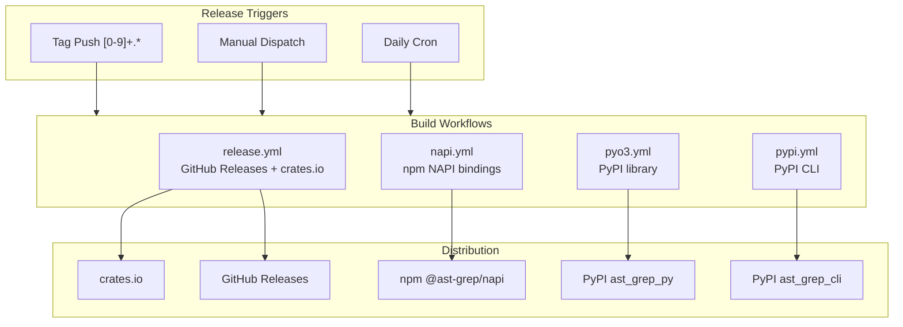

# Cross-Platform Builds

> Relevant source files:
> - [.github/workflows/coverage.yaml](https://github.com/ast-grep/ast-grep/blob/3ae01aec/.github/workflows/coverage.yaml)
> - [.github/workflows/napi.yml](https://github.com/ast-grep/ast-grep/blob/3ae01aec/.github/workflows/napi.yml)
> - [.github/workflows/pyo3.yml](https://github.com/ast-grep/ast-grep/blob/3ae01aec/.github/workflows/pyo3.yml)
> - [.github/workflows/pypi.yml](https://github.com/ast-grep/ast-grep/blob/3ae01aec/.github/workflows/pypi.yml)
> - [.github/workflows/release.yml](https://github.com/ast-grep/ast-grep/blob/3ae01aec/.github/workflows/release.yml)
> - [crates/napi/npm/darwin-arm64/package.json](https://github.com/ast-grep/ast-grep/blob/3ae01aec/crates/napi/npm/darwin-arm64/package.json)
> - [crates/napi/npm/darwin-x64/package.json](https://github.com/ast-grep/ast-grep/blob/3ae01aec/crates/napi/npm/darwin-x64/package.json)
> - [crates/napi/npm/linux-x64-gnu/package.json](https://github.com/ast-grep/ast-grep/blob/3ae01aec/crates/napi/npm/linux-x64-gnu/package.json)
> - [crates/napi/npm/win32-arm64-msvc/package.json](https://github.com/ast-grep/ast-grep/blob/3ae01aec/crates/napi/npm/win32-arm64-msvc/package.json)
> - [crates/napi/npm/win32-ia32-msvc/package.json](https://github.com/ast-grep/ast-grep/blob/3ae01aec/crates/napi/npm/win32-ia32-msvc/package.json)
> - [crates/napi/npm/win32-x64-msvc/package.json](https://github.com/ast-grep/ast-grep/blob/3ae01aec/crates/napi/npm/win32-x64-msvc/package.json)
> - [rust-toolchain.toml](https://github.com/ast-grep/ast-grep/blob/3ae01aec/rust-toolchain.toml)

This document describes the cross-platform build infrastructure that compiles ast-grep for multiple operating systems, CPU architectures, and C library variants. The build system produces native binaries and libraries for over 20 platform combinations across four parallel GitHub Actions workflows.

For information about the release coordination and version management, see [Release Process](9.3-release-process.md). For details on how the npm CLI wrapper consumes these builds, see [npm CLI Wrapper](9.1-npm-cli-wrapper.md).

## Build Matrix Overview

The ast-grep project builds for three major operating systems (Linux, macOS, Windows), three CPU architectures (x86_64, aarch64, i686), and multiple toolchain variants. The complete build matrix is distributed across four GitHub Actions workflows, each targeting different packaging ecosystems.

| Platform | Architecture | Toolchain/libc | NAPI | PyO3 | PyPI CLI | Release |
|---|---|---|---|---|---|---|
| macOS | x86_64 | Darwin | ✓ | ✓ | ✓ | ✓ |
| macOS | aarch64 | Darwin | ✓ | ✓ | universal2 | ✓ |
| Windows | x86_64 | MSVC | ✓ | ✓ | ✓ | ✓ |
| Windows | i686 | MSVC | ✓ | ✓ | ✓ | ✓ |
| Windows | aarch64 | MSVC | ✓ | - | ✓ | ✓ |
| Linux | x86_64 | glibc | ✓ | ✓ | ✓ | ✓ |
| Linux | x86_64 | musl | ✓ | - | - | - |
| Linux | aarch64 | glibc | ✓ | ✓ | ✓ | ✓ |
| Linux | aarch64 | musl | ✓ | - | - | - |

**Sources:** [.github/workflows/napi.yml24-55](https://github.com/ast-grep/ast-grep/blob/3ae01aec/.github/workflows/napi.yml#L24-L55) [.github/workflows/pyo3.yml32-106](https://github.com/ast-grep/ast-grep/blob/3ae01aec/.github/workflows/pyo3.yml#L32-L106) [.github/workflows/pypi.yml51-136](https://github.com/ast-grep/ast-grep/blob/3ae01aec/.github/workflows/pypi.yml#L51-L136) [.github/workflows/release.yml36-52](https://github.com/ast-grep/ast-grep/blob/3ae01aec/.github/workflows/release.yml#L36-L52)

## Workflow Architecture

The build system uses four parallel workflows that share common platform targets but serve different packaging ecosystems. Each workflow is triggered by version tags or manual dispatch.



**Sources:** [.github/workflows/napi.yml6-13](https://github.com/ast-grep/ast-grep/blob/3ae01aec/.github/workflows/napi.yml#L6-L13) [.github/workflows/pyo3.yml15-26](https://github.com/ast-grep/ast-grep/blob/3ae01aec/.github/workflows/pyo3.yml#L15-L26) [.github/workflows/pypi.yml3-14](https://github.com/ast-grep/ast-grep/blob/3ae01aec/.github/workflows/pypi.yml#L3-L14) [.github/workflows/release.yml6-11](https://github.com/ast-grep/ast-grep/blob/3ae01aec/.github/workflows/release.yml#L6-L11)

## NAPI Build Configuration

The NAPI workflow builds Node.js native addons using `napi-rs`. It produces 9 platform-specific `.node` binaries that are published as separate npm packages with `optionalDependencies`.

### Build Matrix

The NAPI build matrix is defined in [.github/workflows/napi.yml21-55](https://github.com/ast-grep/ast-grep/blob/3ae01aec/.github/workflows/napi.yml#L21-L55) Each matrix entry specifies:

- `host`: The GitHub Actions runner OS
- `target`: The Rust target triple
- `build`: The yarn build command with platform-specific flags
- `test`: Boolean indicating whether tests can run on this platform

**Sources:** [.github/workflows/napi.yml24-55](https://github.com/ast-grep/ast-grep/blob/3ae01aec/.github/workflows/napi.yml#L24-L55) [crates/napi/npm/darwin-arm64/package.json1-31](https://github.com/ast-grep/ast-grep/blob/3ae01aec/crates/napi/npm/darwin-arm64/package.json#L1-L31) [crates/napi/npm/linux-x64-gnu/package.json1-34](https://github.com/ast-grep/ast-grep/blob/3ae01aec/crates/napi/npm/linux-x64-gnu/package.json#L1-L34)

### Build Commands

The workflow uses different build strategies per platform:

- **Native builds**: Direct compilation on matching host/target
  - Command: `yarn build --target {target}`
  - Platforms: macOS x64, Windows x64, Windows i686
- **Cross-compilation with napi-cross**: Docker-based cross-compilation
  - Command: `yarn build --target {target} --use-napi-cross`
  - Platforms: Linux x64 glibc, Linux ARM64 glibc
  - Uses containerized build environment
- **Zig-based cross-compilation**: Uses `cargo-zigbuild` for musl targets
  - Command: `yarn build --target {target} -x`
  - Platforms: Linux x64 musl, Linux ARM64 musl
  - Requires Zig toolchain setup at [.github/workflows/napi.yml87-97](https://github.com/ast-grep/ast-grep/blob/3ae01aec/.github/workflows/napi.yml#L87-L97)

**Sources:** [.github/workflows/napi.yml27-52](https://github.com/ast-grep/ast-grep/blob/3ae01aec/.github/workflows/napi.yml#L27-L52) [.github/workflows/napi.yml87-97](https://github.com/ast-grep/ast-grep/blob/3ae01aec/.github/workflows/napi.yml#L87-L97)

### Artifact Naming

Each build uploads artifacts with platform-specific naming:

- Artifact name pattern: `bindings-{target}`
- Binary file pattern: `ast-grep-napi.*.node`
- Examples: `bindings-x86_64-apple-darwin`, `bindings-aarch64-unknown-linux-musl`

The publish job consolidates these artifacts and distributes them to platform-specific npm packages under `crates/napi/npm/` [.github/workflows/napi.yml135-145](https://github.com/ast-grep/ast-grep/blob/3ae01aec/.github/workflows/napi.yml#L135-L145)

**Sources:** [.github/workflows/napi.yml106-111](https://github.com/ast-grep/ast-grep/blob/3ae01aec/.github/workflows/napi.yml#L106-L111) [.github/workflows/napi.yml135-145](https://github.com/ast-grep/ast-grep/blob/3ae01aec/.github/workflows/napi.yml#L135-L145)

## PyO3 Build Configuration

The PyO3 workflow builds Python extension modules using `maturin`. It produces wheels for multiple Python versions (3.10-3.14) across different platforms.

### Platform Jobs

The workflow defines separate jobs for each operating system with platform-specific matrix configurations:

**Linux Job** ([.github/workflows/pyo3.yml32-66](https://github.com/ast-grep/ast-grep/blob/3ae01aec/.github/workflows/pyo3.yml#L32-L66)):
- Targets: `x86_64-unknown-linux-gnu`, `aarch64-unknown-linux-gnu`
- Uses `manylinux: "2_28"` for C11/C++11 compatibility with tree-sitter
- Builds for Python versions: 3.10, 3.11, 3.12, 3.13, 3.14

**Windows Job** ([.github/workflows/pyo3.yml68-100](https://github.com/ast-grep/ast-grep/blob/3ae01aec/.github/workflows/pyo3.yml#L68-L100)):
- Targets: `x64`, `x86` (i686 architecture)
- Uses separate Python installations per architecture
- Tests only on x64 target (x86 is cross-compiled)

**macOS Job** ([.github/workflows/pyo3.yml102-129](https://github.com/ast-grep/ast-grep/blob/3ae01aec/.github/workflows/pyo3.yml#L102-L129)):
- Targets: `x86_64`, `aarch64`
- Uses `--find-interpreter` to detect available Python versions
- Tests only on aarch64 (native Apple Silicon runners)

**Sources:** [.github/workflows/pyo3.yml32-129](https://github.com/ast-grep/ast-grep/blob/3ae01aec/.github/workflows/pyo3.yml#L32-L129)

### Maturin Build Arguments

The workflow uses different `maturin` arguments per platform:

- **Linux**: `--release --out dist -i ${{env.PYTHON_VERSION}}`
  - Environment variable `PYTHON_VERSION`: `'3.10 3.11 3.12 3.13 3.14'`
  - Explicit Python version list for multi-version wheels
- **Windows**: `--release --out dist -i ${{env.PYTHON_VERSION}}`
  - Requires separate Python installations per architecture via `actions/setup-python`
- **macOS**: `--release --out dist --find-interpreter`
  - Automatically discovers available Python installations

**Sources:** [.github/workflows/pyo3.yml4-5](https://github.com/ast-grep/ast-grep/blob/3ae01aec/.github/workflows/pyo3.yml#L4-L5) [.github/workflows/pyo3.yml46-53](https://github.com/ast-grep/ast-grep/blob/3ae01aec/.github/workflows/pyo3.yml#L46-L53) [.github/workflows/pyo3.yml85-90](https://github.com/ast-grep/ast-grep/blob/3ae01aec/.github/workflows/pyo3.yml#L85-L90) [.github/workflows/pyo3.yml113-118](https://github.com/ast-grep/ast-grep/blob/3ae01aec/.github/workflows/pyo3.yml#L113-L118)

### manylinux Configuration

The Linux builds use `manylinux: "2_28"` instead of the default older manylinux version. This is required because tree-sitter requires C11/C++11 features that are not available in older manylinux environments [.github/workflows/pyo3.yml50-52](https://github.com/ast-grep/ast-grep/blob/3ae01aec/.github/workflows/pyo3.yml#L50-L52)

**Sources:** [.github/workflows/pyo3.yml46-54](https://github.com/ast-grep/ast-grep/blob/3ae01aec/.github/workflows/pyo3.yml#L46-L54)

## PyPI CLI Build Configuration

The PyPI CLI workflow builds standalone Python executables with bundled binaries. Unlike PyO3 which builds extension modules, this workflow creates command-line tools distributed via PyPI as `ast_grep_cli`.

### Platform-Specific Jobs

**macOS Builds** ([.github/workflows/pypi.yml51-91](https://github.com/ast-grep/ast-grep/blob/3ae01aec/.github/workflows/pypi.yml#L51-L91)):
- Two separate jobs: `macos-x86_64` and `macos-universal`
- `macos-x86_64`: Builds x86_64-only wheel (cannot test on ARM runners)
- `macos-universal`: Builds `universal2-apple-darwin` wheel for both architectures
- Uses Python 3.13 for abi3 compatibility

**Windows Builds** ([.github/workflows/pypi.yml93-128](https://github.com/ast-grep/ast-grep/blob/3ae01aec/.github/workflows/pypi.yml#L93-L128)):
- Matrix with three targets:
  - `x86_64-pc-windows-msvc` (x64 arch)
  - `i686-pc-windows-msvc` (x86 arch)
  - `aarch64-pc-windows-msvc` (ARM64 arch)
- Tests skip aarch64 target (cross-compiled, no native runner)
- Sets `XWIN_VERSION: "16"` for cargo-xwin compatibility

**Linux Builds** ([.github/workflows/pypi.yml130-163](https://github.com/ast-grep/ast-grep/blob/3ae01aec/.github/workflows/pypi.yml#L130-L163)):
- Targets: `x86_64-unknown-linux-gnu`, `aarch64-unknown-linux-gnu`
- Uses `manylinux: "2_28"` with explicit `CFLAGS: "-std=c11"` and `CXXFLAGS: "-std=c++11"`
- Tests only on x86_64 (native runner architecture)

**Sources:** [.github/workflows/pypi.yml29-163](https://github.com/ast-grep/ast-grep/blob/3ae01aec/.github/workflows/pypi.yml#L29-L163)

### Universal Binary Strategy

The macOS universal builds use a two-step approach:

1. **x86_64-only wheel** ([.github/workflows/pypi.yml51-70](https://github.com/ast-grep/ast-grep/blob/3ae01aec/.github/workflows/pypi.yml#L51-L70)):
   - Built on `macos-latest` (ARM runners)
   - Uses `target: x86_64` explicitly
   - No testing (cannot run x86_64 on ARM)
   - Artifact: `wheels-macos-x86_64`
2. **Universal2 wheel** ([.github/workflows/pypi.yml72-91](https://github.com/ast-grep/ast-grep/blob/3ae01aec/.github/workflows/pypi.yml#L72-L91)):
   - Built on `macos-latest` (ARM runners)
   - Uses `--target universal2-apple-darwin`
   - Creates fat binary containing both x86_64 and aarch64 code
   - Tested on native ARM
   - Artifact: `wheels-aarch64-apple-darwin`

**Sources:** [.github/workflows/pypi.yml51-91](https://github.com/ast-grep/ast-grep/blob/3ae01aec/.github/workflows/pypi.yml#L51-L91)

## Release Binary Builds

The release workflow produces standalone executables for direct download from GitHub Releases. It builds both `sg` and `ast-grep` binaries for 7 platform targets.

### Upload Assets Matrix

The `upload-assets` job uses a simplified matrix focused on the most common platforms [.github/workflows/release.yml35-52](https://github.com/ast-grep/ast-grep/blob/3ae01aec/.github/workflows/release.yml#L35-L52):

| Target | Runner OS | Architecture | ABI |
|---|---|---|---|
| `x86_64-pc-windows-msvc` | windows-latest | x86_64 | MSVC |
| `i686-pc-windows-msvc` | windows-latest | i686 | MSVC |
| `aarch64-pc-windows-msvc` | windows-latest | aarch64 | MSVC |
| `aarch64-apple-darwin` | macos-latest | ARM64 | Darwin |
| `x86_64-apple-darwin` | macos-latest | x86_64 | Darwin |
| `x86_64-unknown-linux-gnu` | ubuntu-22.04 | x86_64 | glibc |
| `aarch64-unknown-linux-gnu` | ubuntu-22.04 | ARM64 | glibc |

Each target builds using `taiki-e/upload-rust-binary-action@v1` which handles cross-compilation and binary packaging [.github/workflows/release.yml54-70](https://github.com/ast-grep/ast-grep/blob/3ae01aec/.github/workflows/release.yml#L54-L70)

**Sources:** [.github/workflows/release.yml35-70](https://github.com/ast-grep/ast-grep/blob/3ae01aec/.github/workflows/release.yml#L35-L70)

### Binary Packaging

The upload action configuration:

- `bin: sg,ast-grep` - builds both binary names
- `tar: none` - disables tar archives
- `zip: all` - creates zip archives for all platforms
- `archive: app-$target` - naming pattern for artifacts

This produces artifacts like:

- `app-x86_64-pc-windows-msvc.zip`
- `app-aarch64-apple-darwin.zip`
- `app-x86_64-unknown-linux-gnu.zip`

**Sources:** [.github/workflows/release.yml56-65](https://github.com/ast-grep/ast-grep/blob/3ae01aec/.github/workflows/release.yml#L56-L65)

### npm CLI Integration

The `release-npm` job depends on `upload-assets` and consumes the binary artifacts to publish npm platform packages [.github/workflows/release.yml71-116](https://github.com/ast-grep/ast-grep/blob/3ae01aec/.github/workflows/release.yml#L71-L116):

1. Downloads all `*.zip` artifacts from GitHub Release using `robinraju/release-downloader@v1.12`
2. Unzips binaries into `npm/platforms/{platform}/` directories
3. Publishes each platform package individually to npm registry
4. Publishes the main `@ast-grep/cli` wrapper package

**Sources:** [.github/workflows/release.yml80-102](https://github.com/ast-grep/ast-grep/blob/3ae01aec/.github/workflows/release.yml#L80-L102)

## Platform-Specific Tooling

### musl Target Compilation

Both NAPI and PyPI workflows support musl libc targets for statically-linked Linux binaries. The builds use `cargo-zigbuild` with Zig compiler for cross-compilation [.github/workflows/napi.yml87-97](https://github.com/ast-grep/ast-grep/blob/3ae01aec/.github/workflows/napi.yml#L87-L97)

**Setup steps:**

1. Install Zig version 0.14.1 using `mlugg/setup-zig@v2`
2. Install `cargo-zigbuild` using `taiki-e/install-action@v2`
3. Build with `-x` flag to invoke cargo-zigbuild

The musl builds only appear in NAPI workflow, not in Python workflows, because:

- NAPI needs musl for maximum Linux compatibility
- Python wheels use manylinux2_28 which provides broader compatibility
- PyPI CLI focuses on common glibc distributions

**Sources:** [.github/workflows/napi.yml41-42](https://github.com/ast-grep/ast-grep/blob/3ae01aec/.github/workflows/napi.yml#L41-L42) [.github/workflows/napi.yml50-52](https://github.com/ast-grep/ast-grep/blob/3ae01aec/.github/workflows/napi.yml#L50-L52) [.github/workflows/napi.yml87-97](https://github.com/ast-grep/ast-grep/blob/3ae01aec/.github/workflows/napi.yml#L87-L97)

### Windows Cross-Compilation

Windows ARM64 builds use cross-compilation from x64 runners because GitHub Actions does not provide native ARM64 Windows runners.

**NAPI builds** ([.github/workflows/napi.yml53-55](https://github.com/ast-grep/ast-grep/blob/3ae01aec/.github/workflows/napi.yml#L53-L55)):
- Target: `aarch64-pc-windows-msvc`
- Host: `windows-latest` (x64)
- Build: `yarn build --target aarch64-pc-windows-msvc`
- No testing (requires native ARM runner)

**PyPI CLI builds** ([.github/workflows/pypi.yml102-103](https://github.com/ast-grep/ast-grep/blob/3ae01aec/.github/workflows/pypi.yml#L102-L103)):
- Target: `aarch64-pc-windows-msvc`
- Sets `XWIN_VERSION: "16"` environment variable for cargo-xwin
- Uses architecture `x64` for setup-python (build tooling, not target)

The `XWIN_VERSION` environment variable controls which Windows SDK version cargo-xwin uses for cross-compilation [.github/workflows/pypi.yml112-114](https://github.com/ast-grep/ast-grep/blob/3ae01aec/.github/workflows/pypi.yml#L112-L114)

**Sources:** [.github/workflows/napi.yml53-55](https://github.com/ast-grep/ast-grep/blob/3ae01aec/.github/workflows/napi.yml#L53-L55) [.github/workflows/pypi.yml102-103](https://github.com/ast-grep/ast-grep/blob/3ae01aec/.github/workflows/pypi.yml#L102-L103) [.github/workflows/pypi.yml112-114](https://github.com/ast-grep/ast-grep/blob/3ae01aec/.github/workflows/pypi.yml#L112-L114)

### macOS Universal Binaries

macOS universal binaries bundle both x86_64 and aarch64 architectures in a single executable. Only the PyPI CLI workflow produces universal binaries.

The build uses `maturin` with `--target universal2-apple-darwin` which:

- Compiles for both `x86_64-apple-darwin` and `aarch64-apple-darwin`
- Links both architectures into a fat binary using `lipo`
- Produces wheels that work on both Intel and Apple Silicon Macs

Testing occurs only on the native aarch64 side of the binary since GitHub macOS runners are Apple Silicon [.github/workflows/pypi.yml83-86](https://github.com/ast-grep/ast-grep/blob/3ae01aec/.github/workflows/pypi.yml#L83-L86)

**Sources:** [.github/workflows/pypi.yml72-91](https://github.com/ast-grep/ast-grep/blob/3ae01aec/.github/workflows/pypi.yml#L72-L91)

## Testing and Validation

### Test Execution Strategy

Not all platform builds can be tested due to cross-compilation and runner architecture constraints. The workflows use conditional testing based on platform compatibility:

**NAPI testing** ([.github/workflows/napi.yml103-105](https://github.com/ast-grep/ast-grep/blob/3ae01aec/.github/workflows/napi.yml#L103-L105)):
- Tests enabled via `matrix.settings.test: true`
- Tested platforms: macOS x64, Windows x64, Linux x64 glibc, Linux ARM64 glibc
- Skipped: macOS ARM (cross-compiled on x64), Windows i686/ARM (cross-compiled), Linux musl (different libc)

**PyO3 testing** ([.github/workflows/pyo3.yml](https://github.com/ast-grep/ast-grep/blob/3ae01aec/.github/workflows/pyo3.yml)):
- **Linux**: Tests only x86_64, skips aarch64 (cross-compiled)
- **Windows**: Tests both x64 and x86 (native runners support both)
- **macOS**: Tests only aarch64 (native Apple Silicon), skips x86_64 (cross-compiled)

**PyPI CLI testing** ([.github/workflows/pypi.yml](https://github.com/ast-grep/ast-grep/blob/3ae01aec/.github/workflows/pypi.yml)):
- **Linux**: Tests only x86_64 using `startsWith(matrix.target, 'x86_64')`
- **Windows**: Tests all except aarch64 using `!startsWith(matrix.platform.target, 'aarch64')`
- **macOS**: Tests universal2 binary (native aarch64)

**Sources:** [.github/workflows/napi.yml28-49](https://github.com/ast-grep/ast-grep/blob/3ae01aec/.github/workflows/napi.yml#L28-L49) [.github/workflows/pyo3.yml55-61](https://github.com/ast-grep/ast-grep/blob/3ae01aec/.github/workflows/pyo3.yml#L55-L61) [.github/workflows/pypi.yml118-123](https://github.com/ast-grep/ast-grep/blob/3ae01aec/.github/workflows/pypi.yml#L118-L123)

### Test Commands

Each workflow uses different test commands based on the packaging system:

**NAPI**: `yarn test`
- Runs JavaScript tests for Node.js bindings
- Located in [crates/napi](https://github.com/ast-grep/ast-grep/blob/3ae01aec/crates/napi)

**PyO3**: `pip install pytest && pip install --no-index --find-links=dist ast_grep_py --force-reinstall && pytest`
- Installs pytest and the built wheel
- Runs Python unit tests
- Located in [crates/pyo3](https://github.com/ast-grep/ast-grep/blob/3ae01aec/crates/pyo3)

**PyPI CLI**: `pip install dist/ast_grep_cli-*.whl --force-reinstall && sg --help`
- Smoke test only: verifies binary executes
- No comprehensive test suite (CLI functionality tested in main repo)

**Sources:** [.github/workflows/napi.yml104-105](https://github.com/ast-grep/ast-grep/blob/3ae01aec/.github/workflows/napi.yml#L104-L105) [.github/workflows/pyo3.yml58-61](https://github.com/ast-grep/ast-grep/blob/3ae01aec/.github/workflows/pyo3.yml#L58-L61) [.github/workflows/pypi.yml84-86](https://github.com/ast-grep/ast-grep/blob/3ae01aec/.github/workflows/pypi.yml#L84-L86)

## Artifact Management

### Artifact Upload Patterns

Each workflow uploads build artifacts with standardized naming conventions for later consolidation:

**NAPI artifacts** ([.github/workflows/napi.yml106-111](https://github.com/ast-grep/ast-grep/blob/3ae01aec/.github/workflows/napi.yml#L106-L111)):
- Name: `bindings-{target}`
- Path: `crates/napi/ast-grep-napi.*.node`
- Examples: `bindings-x86_64-apple-darwin`, `bindings-aarch64-unknown-linux-musl`

**PyO3 artifacts** ([.github/workflows/pyo3.yml62-66](https://github.com/ast-grep/ast-grep/blob/3ae01aec/.github/workflows/pyo3.yml#L62-L66)):
- Name: `wheels-{target}` or `wheels` (for sdist)
- Path: `crates/pyo3/dist`
- Contains `.whl` files for each Python version

**PyPI CLI artifacts** ([.github/workflows/pypi.yml67-70](https://github.com/ast-grep/ast-grep/blob/3ae01aec/.github/workflows/pypi.yml#L67-L70)):
- Name: `wheels-{platform}` or `wheels` (for sdist)
- Path: `dist`
- Contains `.whl` or `.tar.gz` files

**Release artifacts** ([.github/workflows/release.yml56-65](https://github.com/ast-grep/ast-grep/blob/3ae01aec/.github/workflows/release.yml#L56-L65)):
- Uploaded directly to GitHub Release
- Name: `app-{target}.zip`
- Contains `sg` and `ast-grep` binaries

**Sources:** [.github/workflows/napi.yml106-111](https://github.com/ast-grep/ast-grep/blob/3ae01aec/.github/workflows/napi.yml#L106-L111) [.github/workflows/pyo3.yml62-66](https://github.com/ast-grep/ast-grep/blob/3ae01aec/.github/workflows/pyo3.yml#L62-L66) [.github/workflows/pypi.yml46-49](https://github.com/ast-grep/ast-grep/blob/3ae01aec/.github/workflows/pypi.yml#L46-L49) [.github/workflows/release.yml56-65](https://github.com/ast-grep/ast-grep/blob/3ae01aec/.github/workflows/release.yml#L56-L65)

### Artifact Consolidation

Publish jobs download and merge artifacts before distribution:

**NAPI publish** ([.github/workflows/napi.yml135-145](https://github.com/ast-grep/ast-grep/blob/3ae01aec/.github/workflows/napi.yml#L135-L145)):

```yaml
- uses: actions/download-artifact@v7
  with:
    path: crates/napi/artifacts
- name: Move artifacts
  run: yarn artifacts
```

The `yarn artifacts` script reorganizes binaries into platform-specific npm package directories.

**PyO3 release** ([.github/workflows/pyo3.yml156-159](https://github.com/ast-grep/ast-grep/blob/3ae01aec/.github/workflows/pyo3.yml#L156-L159)):

```yaml
- uses: actions/download-artifact@v7
  with:
    pattern: wheels*
    merge-multiple: true
```

Downloads all `wheels-*` artifacts and merges into single directory.

**PyPI CLI upload** ([.github/workflows/pypi.yml184-188](https://github.com/ast-grep/ast-grep/blob/3ae01aec/.github/workflows/pypi.yml#L184-L188)):

```yaml
- uses: actions/download-artifact@v7
  with:
    pattern: wheels*
    merge-multiple: true
    path: wheels
```

Consolidates all wheel artifacts for batch upload to PyPI.

**Sources:** [.github/workflows/napi.yml135-145](https://github.com/ast-grep/ast-grep/blob/3ae01aec/.github/workflows/napi.yml#L135-L145) [.github/workflows/pyo3.yml156-167](https://github.com/ast-grep/ast-grep/blob/3ae01aec/.github/workflows/pyo3.yml#L156-L167) [.github/workflows/pypi.yml184-190](https://github.com/ast-grep/ast-grep/blob/3ae01aec/.github/workflows/pypi.yml#L184-L190)

## Build Environment Configuration

### Environment Variables

Each workflow sets environment variables for consistent build behavior:

**Common to all Python workflows:**
- `CARGO_INCREMENTAL: 0` - Disables incremental compilation for CI
- `CARGO_NET_RETRY: 10` - Retries network requests
- `CARGO_TERM_COLOR: always` - Forces colored output
- `RUSTUP_MAX_RETRIES: 10` - Retries rustup operations

**PyO3 specific** ([.github/workflows/pyo3.yml3-9](https://github.com/ast-grep/ast-grep/blob/3ae01aec/.github/workflows/pyo3.yml#L3-L9)):
- `PACKAGE_NAME: ast_grep_py` - Package name for PyPI (underscores, not hyphens)
- `PYTHON_VERSION: '3.10 3.11 3.12 3.13 3.14'` - Space-separated Python versions

**PyPI CLI specific** ([.github/workflows/pypi.yml20-26](https://github.com/ast-grep/ast-grep/blob/3ae01aec/.github/workflows/pypi.yml#L20-L26)):
- `PACKAGE_NAME: ast_grep_cli` - Different package name for CLI tool
- `PYTHON_VERSION: "3.13"` - Single version for abi3 wheels

**NAPI specific** ([.github/workflows/napi.yml2-5](https://github.com/ast-grep/ast-grep/blob/3ae01aec/.github/workflows/napi.yml#L2-L5)):
- `DEBUG: napi:*` - Enables debug output for NAPI tooling
- `APP_NAME: ast-grep-napi` - Base name for binary artifacts
- `MACOSX_DEPLOYMENT_TARGET: '10.13'` - Minimum macOS version for compatibility

**Sources:** [.github/workflows/pyo3.yml3-9](https://github.com/ast-grep/ast-grep/blob/3ae01aec/.github/workflows/pyo3.yml#L3-L9) [.github/workflows/pypi.yml20-26](https://github.com/ast-grep/ast-grep/blob/3ae01aec/.github/workflows/pypi.yml#L20-L26) [.github/workflows/napi.yml2-5](https://github.com/ast-grep/ast-grep/blob/3ae01aec/.github/workflows/napi.yml#L2-L5)

### Rust Toolchain

All workflows use the stable Rust toolchain as specified in [rust-toolchain.toml1-3](https://github.com/ast-grep/ast-grep/blob/3ae01aec/rust-toolchain.toml#L1-L3):

```toml
[toolchain]
channel = "stable"
```

The workflows install Rust using either:
- `dtolnay/rust-toolchain@stable` for NAPI builds
- Implicit rustup (pre-installed on GitHub runners) for Python builds

**Sources:** [rust-toolchain.toml1-3](https://github.com/ast-grep/ast-grep/blob/3ae01aec/rust-toolchain.toml#L1-L3) [.github/workflows/napi.yml68-71](https://github.com/ast-grep/ast-grep/blob/3ae01aec/.github/workflows/napi.yml#L68-L71)

### Caching Strategy

**NAPI workflow** implements multi-level caching:

1. **Cargo cache** ([.github/workflows/napi.yml72-81](https://github.com/ast-grep/ast-grep/blob/3ae01aec/.github/workflows/napi.yml#L72-L81)):
   - Registry index, cache, and git db
   - Target directory
   - Key: `{target}-cargo-registry`
2. **NPM cache** ([.github/workflows/napi.yml82-86](https://github.com/ast-grep/ast-grep/blob/3ae01aec/.github/workflows/napi.yml#L82-L86)):
   - Yarn cache directory
   - Key: `npm-cache-build-{target}-node@20`
3. **Node setup cache** ([.github/workflows/napi.yml60-66](https://github.com/ast-grep/ast-grep/blob/3ae01aec/.github/workflows/napi.yml#L60-L66)):
   - Uses built-in `actions/setup-node` caching
   - Cache path: yarn.lock

**Coverage workflow** also uses cargo caching ([.github/workflows/coverage.yaml38-46](https://github.com/ast-grep/ast-grep/blob/3ae01aec/.github/workflows/coverage.yaml#L38-L46)):
- Caches `~/.cargo/registry`, `~/.cargo/git`, and `target/`
- Key: `{runner.os}-{github.sha}`
- Restore keys: `{runner.os}-`

**Sources:** [.github/workflows/napi.yml72-86](https://github.com/ast-grep/ast-grep/blob/3ae01aec/.github/workflows/napi.yml#L72-L86) [.github/workflows/coverage.yaml38-46](https://github.com/ast-grep/ast-grep/blob/3ae01aec/.github/workflows/coverage.yaml#L38-L46)
