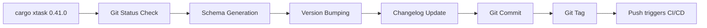
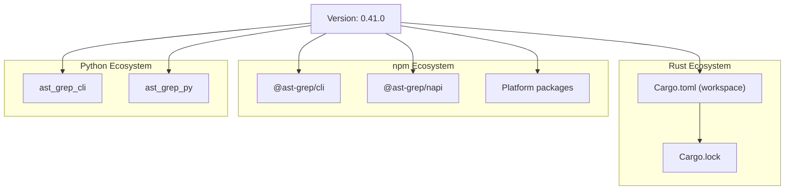
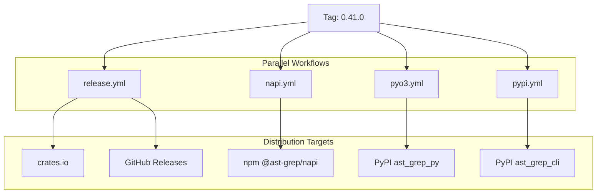

# Release Process

> Relevant source files:
> - [.github/workflows/coverage.yaml](https://github.com/ast-grep/ast-grep/blob/3ae01aec/.github/workflows/coverage.yaml)
> - [.github/workflows/napi.yml](https://github.com/ast-grep/ast-grep/blob/3ae01aec/.github/workflows/napi.yml)
> - [.github/workflows/pyo3.yml](https://github.com/ast-grep/ast-grep/blob/3ae01aec/.github/workflows/pyo3.yml)
> - [.github/workflows/pypi.yml](https://github.com/ast-grep/ast-grep/blob/3ae01aec/.github/workflows/pypi.yml)
> - [.github/workflows/release.yml](https://github.com/ast-grep/ast-grep/blob/3ae01aec/.github/workflows/release.yml)
> - [rust-toolchain.toml](https://github.com/ast-grep/ast-grep/blob/3ae01aec/rust-toolchain.toml)
> - [xtask/Cargo.toml](https://github.com/ast-grep/ast-grep/blob/3ae01aec/xtask/Cargo.toml)
> - [xtask/src/main.rs](https://github.com/ast-grep/ast-grep/blob/3ae01aec/xtask/src/main.rs)
> - [xtask/src/schema.rs](https://github.com/ast-grep/ast-grep/blob/3ae01aec/xtask/src/schema.rs)

## Purpose and Scope

This document describes the automated release process for ast-grep, which coordinates version bumping, changelog generation, multi-platform builds, and publishing to four package registries (crates.io, npm, PyPI, GitHub Releases) from a single Git tag. The process is orchestrated by the `xtask` utility and GitHub Actions workflows.

For information about the package structure and distribution strategy, see [Distribution and Packaging](9-distribution-and-packaging.md). For details about cross-platform build configurations, see [Cross-Platform Builds](9.2-cross-platform-builds.md). For CLI wrapper package details, see [npm CLI Wrapper](9.1-npm-cli-wrapper.md).

---

## Release Automation Tool

The release process is initiated through the `xtask` utility, a Cargo workspace member that automates version bumping and Git operations.

### Task Invocation

The `xtask` binary accepts two commands:

- `cargo xtask schema` - Generates JSON schemas for rule validation
- `cargo xtask <version>` - Initiates a full release with the specified version number

The task dispatcher is implemented in [xtask/src/main.rs15-23](https://github.com/ast-grep/ast-grep/blob/3ae01aec/xtask/src/main.rs#L15-L23):

```rust
enum Task {
  Schema,
  Release(String),
}

fn get_task() -> Result<Task> {
  let arg = args().nth(1).context(message)?;
  if arg == "schema" {
    Ok(Task::Schema)
  } else {
    Ok(Task::Release(arg))
  }
}
```

### Release Workflow Steps

When invoked with a version number, `xtask` executes the following sequence [xtask/src/main.rs32-39](https://github.com/ast-grep/ast-grep/blob/3ae01aec/xtask/src/main.rs#L32-L39):

1. **Git Status Check** - Verifies working directory is clean
2. **Schema Generation** - Updates JSON schemas for rules
3. **Version Bumping** - Updates all package manifests
4. **Changelog Update** - Generates CHANGELOG.md
5. **Git Commit** - Commits changes with version message
6. **Git Tag** - Creates version tag to trigger CI/CD

**Diagram: xtask Release Automation Flow**



Sources: [xtask/src/main.rs32-39](https://github.com/ast-grep/ast-grep/blob/3ae01aec/xtask/src/main.rs#L32-L39) [xtask/src/main.rs55-62](https://github.com/ast-grep/ast-grep/blob/3ae01aec/xtask/src/main.rs#L55-L62)

---

## Version Synchronization

The `bump_version()` function updates version numbers across all package ecosystems to maintain consistency [xtask/src/main.rs55-62](https://github.com/ast-grep/ast-grep/blob/3ae01aec/xtask/src/main.rs#L55-L62)

### npm Package Updates

The npm CLI wrapper and platform-specific packages are updated in [xtask/src/main.rs64-85](https://github.com/ast-grep/ast-grep/blob/3ae01aec/xtask/src/main.rs#L64-L85):

| Package Location | Updates |
|---|---|
| `npm/package.json` | Root version and `optionalDependencies` versions |
| `npm/platforms/*/package.json` | Platform-specific package versions |

The function iterates through all platform directories (`darwin-arm64`, `win32-x64-msvc`, etc.) and updates each `package.json` file.

### NAPI Package Updates

Node.js native bindings are updated in [xtask/src/main.rs95-107](https://github.com/ast-grep/ast-grep/blob/3ae01aec/xtask/src/main.rs#L95-L107):

| Package Location | Purpose |
|---|---|
| `crates/napi/package.json` | Main NAPI package version |
| `crates/napi/npm/*/package.json` | Platform-specific optional dependency versions |

### Python Package Updates

Both Python packages share version numbers updated via `pyproject.toml` files [xtask/src/main.rs139-148](https://github.com/ast-grep/ast-grep/blob/3ae01aec/xtask/src/main.rs#L139-L148):

- `pyproject.toml` - CLI package (`ast_grep_cli`)
- `crates/pyo3/pyproject.toml` - Library bindings (`ast_grep_py`)

The TOML documents are parsed using `toml_edit` and the `project.version` field is updated.

### Rust Crate Updates

The workspace root `Cargo.toml` is updated [xtask/src/main.rs109-129](https://github.com/ast-grep/ast-grep/blob/3ae01aec/xtask/src/main.rs#L109-L129) modifying:

- `workspace.package.version` - Inherited version for all workspace members
- `workspace.dependencies` - Versions for internal dependencies (`ast-grep-core`, `ast-grep-config`, etc.)

After updating the TOML file, `cargo build` is executed to regenerate `Cargo.lock` [xtask/src/main.rs150-156](https://github.com/ast-grep/ast-grep/blob/3ae01aec/xtask/src/main.rs#L150-L156)

**Diagram: Version Synchronization Across Package Ecosystems**



Sources: [xtask/src/main.rs55-156](https://github.com/ast-grep/ast-grep/blob/3ae01aec/xtask/src/main.rs#L55-L156)

---

## Git Operations

### Changelog Generation

The changelog is generated using the `auto-changelog` npm package [xtask/src/main.rs182-192](https://github.com/ast-grep/ast-grep/blob/3ae01aec/xtask/src/main.rs#L182-L192):

```rust
Command::new("auto-changelog")
  .arg("-p")
  .arg("npm/package.json")
  .arg("--breaking-pattern")
  .arg("BREAKING CHANGE")
```

This reads the npm package version and generates `CHANGELOG.md` based on Git commit history.

### Commit and Tag Creation

A Git commit and tag are created with specific formatting [xtask/src/main.rs158-180](https://github.com/ast-grep/ast-grep/blob/3ae01aec/xtask/src/main.rs#L158-L180):

```rust
let message = format!("{version}\nbump version");
Command::new("git")
  .arg("commit")
  .arg("-am")
  .arg(message)

Command::new("git")
  .arg("tag")
  .arg(version)
```

**Note:** The commit message format is critical. The NAPI workflow [.github/workflows/napi.yml149-159](https://github.com/ast-grep/ast-grep/blob/3ae01aec/.github/workflows/napi.yml#L149-L159) checks the commit message to determine npm tag (`latest` vs `next`):

- Exact match `^[0-9]+\.[0-9]+\.[0-9]+$` → Publish with `latest` tag
- Pattern match `^[0-9]+\.[0-9]+\.[0-9]+` → Publish with `next` tag
- Otherwise → Skip publish

Sources: [xtask/src/main.rs158-192](https://github.com/ast-grep/ast-grep/blob/3ae01aec/xtask/src/main.rs#L158-L192) [.github/workflows/napi.yml149-159](https://github.com/ast-grep/ast-grep/blob/3ae01aec/.github/workflows/napi.yml#L149-L159)

---

## GitHub Actions Workflows

Four parallel workflows are triggered when a version tag matching `[0-9]+.*` is pushed to the repository.

### Trigger Configuration

All workflows use the same tag pattern trigger:

```yaml
on:
  push:
    tags:
      - '[0-9]+.*'
```

Additionally, workflows support:
- `workflow_dispatch` for manual triggering
- `schedule` (daily 9 AM UTC) for testing builds

### Workflow Overview

**Diagram: GitHub Actions Workflow Architecture**



Sources: [.github/workflows/release.yml6-11](https://github.com/ast-grep/ast-grep/blob/3ae01aec/.github/workflows/release.yml#L6-L11) [.github/workflows/napi.yml6-13](https://github.com/ast-grep/ast-grep/blob/3ae01aec/.github/workflows/napi.yml#L6-L13) [.github/workflows/pyo3.yml15-26](https://github.com/ast-grep/ast-grep/blob/3ae01aec/.github/workflows/pyo3.yml#L15-L26) [.github/workflows/pypi.yml3-14](https://github.com/ast-grep/ast-grep/blob/3ae01aec/.github/workflows/pypi.yml#L3-L14)

---

## Release Workflow (`release.yml`)

This workflow handles Rust crates, GitHub Releases, and npm CLI packages.

### Job: `push_crates_io`

Publishes all workspace crates to crates.io using `katyo/publish-crates` action [.github/workflows/release.yml13-22](https://github.com/ast-grep/ast-grep/blob/3ae01aec/.github/workflows/release.yml#L13-L22):

```yaml
- name: Publish crates-io
  uses: katyo/publish-crates@v2
  with:
    registry-token: ${{ secrets.CARGO_REGISTRY_TOKEN }}
    args: --allow-dirty
- run: sleep 5s
```

The 5-second delay ensures dependency order is respected (e.g., `ast-grep-core` publishes before `ast-grep-config`).

### Job: `create-release`

Creates a GitHub Release with changelog [.github/workflows/release.yml24-33](https://github.com/ast-grep/ast-grep/blob/3ae01aec/.github/workflows/release.yml#L24-L33):

```yaml
- name: Create GitHub release
  uses: softprops/action-gh-release@v2
  with:
    body_path: CHANGELOG.md
```

### Job: `upload-assets`

Builds platform-specific binaries and uploads to GitHub Releases [.github/workflows/release.yml35-70](https://github.com/ast-grep/ast-grep/blob/3ae01aec/.github/workflows/release.yml#L35-L70):

| Platform | Target Triple |
|---|---|
| Windows x64 | `x86_64-pc-windows-msvc` |
| Windows x86 | `i686-pc-windows-msvc` |
| Windows ARM64 | `aarch64-pc-windows-msvc` |
| macOS x64 | `x86_64-apple-darwin` |
| macOS ARM64 | `aarch64-apple-darwin` |
| Linux x64 | `x86_64-unknown-linux-gnu` |
| Linux ARM64 | `aarch64-unknown-linux-gnu` |

The `taiki-e/upload-rust-binary-action@v1` builds both `sg` and `ast-grep` binaries and packages them as `.zip` archives named `app-{target}.zip`.

### Job: `release-npm`

Publishes npm CLI wrapper packages [.github/workflows/release.yml71-116](https://github.com/ast-grep/ast-grep/blob/3ae01aec/.github/workflows/release.yml#L71-L116):

1. Downloads binary artifacts from `upload-assets` job using `robinraju/release-downloader`
2. Unzips binaries into platform-specific directories under `npm/platforms/`
3. Publishes each platform package and the main `@ast-grep/cli` package to npm

Sources: [.github/workflows/release.yml1-123](https://github.com/ast-grep/ast-grep/blob/3ae01aec/.github/workflows/release.yml#L1-L123)

---

## Quality Assurance

### Coverage Workflow

The `coverage.yaml` workflow runs on every push and pull request [.github/workflows/coverage.yaml1-9](https://github.com/ast-grep/ast-grep/blob/3ae01aec/.github/workflows/coverage.yaml#L1-L9):

```yaml
on:
  push:
    branches: [main]
  pull_request:
    branches: [main]
```

It performs three checks:

#### Code Coverage [.github/workflows/coverage.yaml11-29](https://github.com/ast-grep/ast-grep/blob/3ae01aec/.github/workflows/coverage.yaml#L11-L29)

Uses `cargo-llvm-cov` to generate coverage reports:

```bash
cargo llvm-cov --all-features --workspace --lcov --output-path lcov.info
```

#### Linting and Formatting [.github/workflows/coverage.yaml30-50](https://github.com/ast-grep/ast-grep/blob/3ae01aec/.github/workflows/coverage.yaml#L30-L50)

Runs `cargo fmt` and `cargo clippy`:

```bash
cargo fmt --all -- --check
cargo clippy --all-targets --all-features --workspace --release --locked -- -D clippy::all
```

#### NAPI Linting [.github/workflows/coverage.yaml51-63](https://github.com/ast-grep/ast-grep/blob/3ae01aec/.github/workflows/coverage.yaml#L51-L63)

Validates TypeScript/JavaScript code in the NAPI package:

```bash
cd crates/napi && yarn install && yarn lint
```

Sources: [.github/workflows/coverage.yaml1-63](https://github.com/ast-grep/ast-grep/blob/3ae01aec/.github/workflows/coverage.yaml#L1-L63)

---

## Release Checklist

For maintainers performing a release:

### Pre-Release

1. Ensure `main` branch is stable and all tests pass
2. Review merged pull requests since last release
3. Verify no uncommitted changes in working directory
4. Update documentation if API changes exist

### Release Execution

```bash
cargo xtask 0.41.0
git push origin main --tags
```

### Post-Release Verification

Monitor GitHub Actions workflows:

| Workflow | Expected Outcome | Check |
|---|---|---|
| `release.yml` | Crates published to crates.io | https://crates.io/crates/ast-grep |
| `release.yml` | Binaries on GitHub Releases | GitHub Releases page |
| `release.yml` + `napi.yml` | npm packages published | https://npmjs.com/package/@ast-grep/cli |
| `pyo3.yml` | Python bindings on PyPI | https://pypi.org/project/ast-grep-py |
| `pypi.yml` | Python CLI on PyPI | https://pypi.org/project/ast-grep-cli |

### Version Number Format

Valid version patterns [.github/workflows/napi.yml149-159](https://github.com/ast-grep/ast-grep/blob/3ae01aec/.github/workflows/napi.yml#L149-L159):

- **Stable Release**: `0.41.0` (exact semver) → npm `latest` tag
- **Pre-release**: `0.41.0-beta.1` (contains semver prefix) → npm `next` tag
- **Other**: Does not publish to npm

### Troubleshooting

Common issues:

| Issue | Cause | Resolution |
|---|---|---|
| Workflow skips publish | Not a version tag | Ensure tag matches `[0-9]+.*` pattern |
| Duplicate PyPI upload | Wheel already exists | Normal, `--skip-existing` flag prevents errors |
| musl build failure | tree-sitter incompatibility | Ensure `manylinux: "2_28"` is set |
| NAPI test failure | Architecture mismatch | Cross-compiled builds don't run tests |

Sources: [xtask/src/main.rs32-192](https://github.com/ast-grep/ast-grep/blob/3ae01aec/xtask/src/main.rs#L32-L192) [.github/workflows/napi.yml149-159](https://github.com/ast-grep/ast-grep/blob/3ae01aec/.github/workflows/napi.yml#L149-L159) [.github/workflows/pyo3.yml147-167](https://github.com/ast-grep/ast-grep/blob/3ae01aec/.github/workflows/pyo3.yml#L147-L167)
