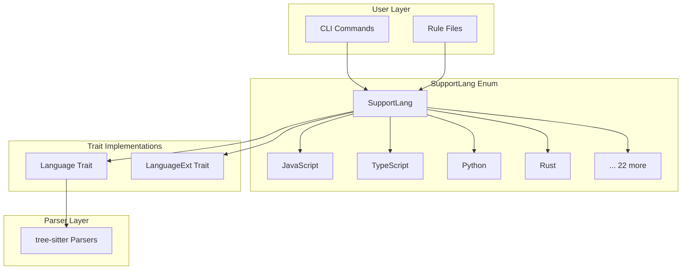
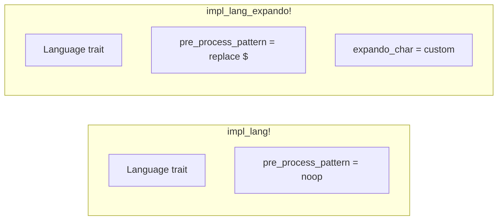
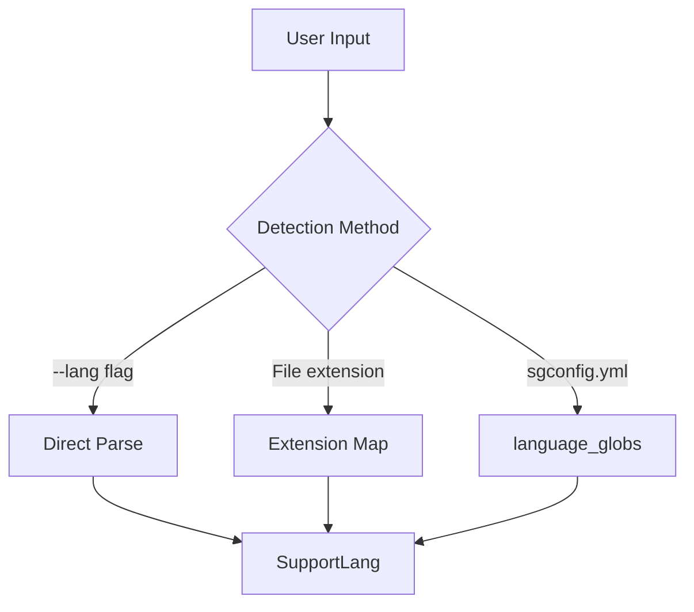
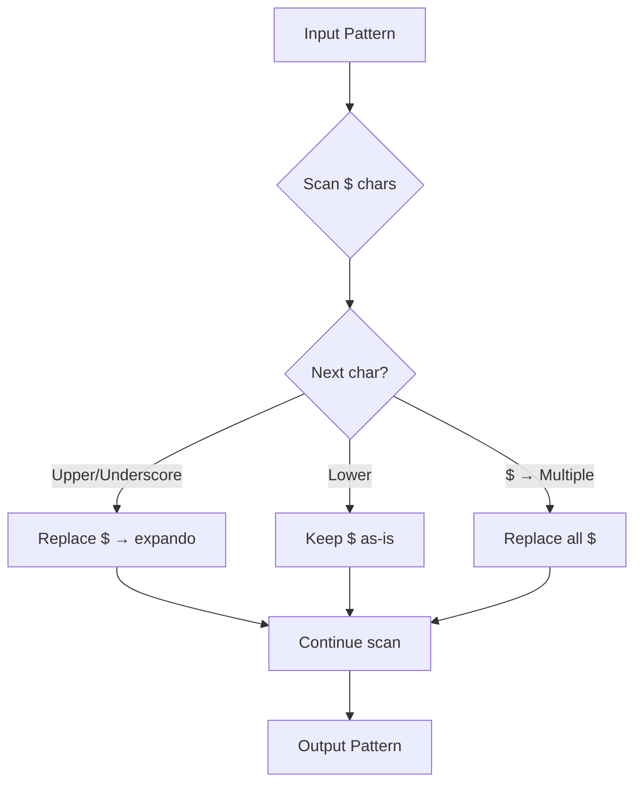
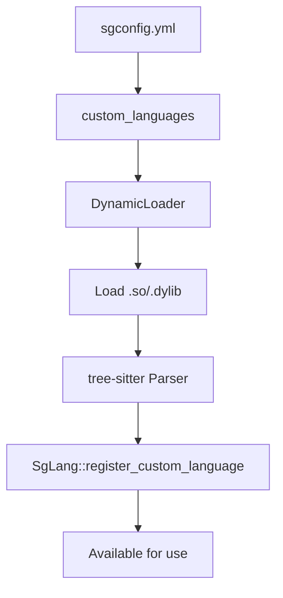
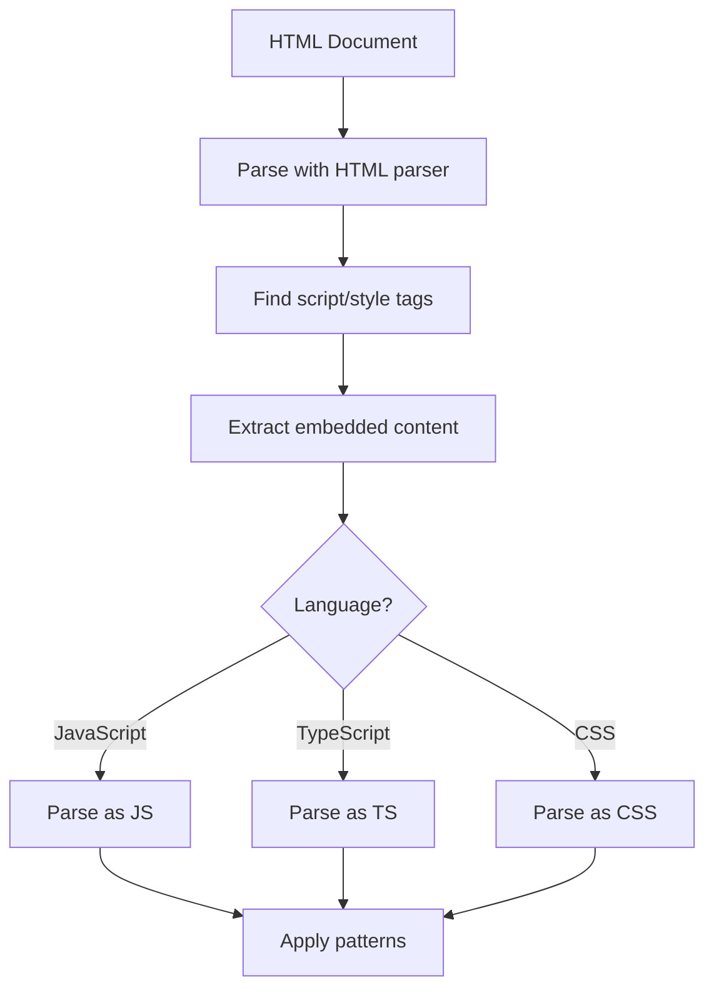
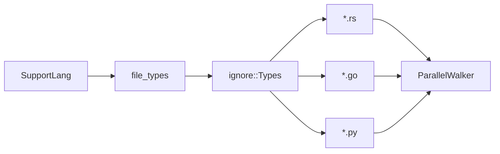

> **Source:** https://deepwiki.com/ast-grep/ast-grep/4-language-support

# Language Support

The `ast-grep-language` crate provides multi-language support by integrating tree-sitter parsers for over 20 programming languages. This crate implements the `Language` and `LanguageExt` traits for each supported language, handles pattern preprocessing to normalize meta-variable syntax across different languages, and manages conditional compilation of parsers via feature flags.

For information about using languages in CLI commands, see [CLI Tool](/ast-grep/ast-grep/5-cli-tool). For details on the core `Language` trait definition, see [Core Library](/ast-grep/ast-grep/2-core-library).

## Language Architecture

The language support system consists of three main layers: the `SupportLang` enum that enumerates all supported languages, language-specific implementations (either stub or expando types), and the underlying tree-sitter parsers that are conditionally compiled.

**Language System Architecture**



**Sources:** [crates/language/src/lib.rs254-283](https://github.com/ast-grep/ast-grep/blob/3ae01aec/crates/language/src/lib.rs#L254-L283) [crates/language/src/lib.rs456-483](https://github.com/ast-grep/ast-grep/blob/3ae01aec/crates/language/src/lib.rs#L456-L483)

### Implementation Macros

The crate uses macros to reduce boilerplate when implementing languages. The `impl_lang!` macro defines stub languages where `$` is already a valid identifier character, while `impl_lang_expando!` defines languages that require pattern preprocessing.

```rust
// Stub language (no preprocessing needed)
impl_lang!(Js, "JavaScript", lang_js(), ["js", "jsx", "javascript"]);

// Expando language (requires preprocessing)
impl_lang_expando!(Rust, "Rust", lang_rs(), ["rs", "rust"], 'µ');
```

**Language Implementation Strategy**



**Sources:** [crates/language/src/lib.rs64-90](https://github.com/ast-grep/ast-grep/blob/3ae01aec/crates/language/src/lib.rs#L64-L90) [crates/language/src/lib.rs115-147](https://github.com/ast-grep/ast-grep/blob/3ae01aec/crates/language/src/lib.rs#L115-L147) [crates/language/src/lib.rs241-250](https://github.com/ast-grep/ast-grep/blob/3ae01aec/crates/language/src/lib.rs#L241-L250)

## Supported Languages

The `SupportLang` enum lists all 26 built-in languages. Each language has associated aliases for user-friendly naming and file extensions for automatic language detection.

### Language Catalog

| Language | Aliases | File Extensions | Expando Char | Category |
|----------|---------|-----------------|--------------|----------|
| Bash | `bash` | `.bash`, `.sh`, `.zsh`, `.ksh` | `$` (native) | Stub |
| C | `c` | `.c`, `.h` | `𐀀` | Expando |
| Cpp | `cc`, `c++`, `cpp`, `cxx` | `.cc`, `.cpp`, `.hpp`, `.cxx` | `𐀀` | Expando |
| CSharp | `cs`, `csharp` | `.cs` | `µ` | Expando |
| Css | `css` | `.css`, `.scss` | `_` | Expando |
| Elixir | `ex`, `elixir` | `.ex`, `.exs` | `µ` | Expando |
| Go | `go`, `golang` | `.go` | `µ` | Expando |
| Haskell | `hs`, `haskell` | `.hs` | `µ` | Expando |
| Hcl | `hcl` | `.hcl` | `µ` | Expando |
| Html | `html` | `.html`, `.htm`, `.xhtml` | `$` (native) | Injectable |
| Java | `java` | `.java` | `$` (native) | Stub |
| JavaScript | `javascript`, `js`, `jsx` | `.js`, `.cjs`, `.mjs`, `.jsx` | `$` (native) | Stub |
| Json | `json` | `.json` | `$` (native) | Stub |
| Kotlin | `kotlin`, `kt` | `.kt`, `.ktm`, `.kts` | `µ` | Expando |
| Lua | `lua` | `.lua` | `$` (native) | Stub |
| Nix | `nix` | `.nix` | `_` | Expando |
| Php | `php` | `.php` | `µ` | Expando |
| Python | `py`, `python` | `.py`, `.py3`, `.pyi`, `.bzl` | `µ` | Expando |
| Ruby | `rb`, `ruby` | `.rb`, `.rbw`, `.gemspec` | `µ` | Expando |
| Rust | `rs`, `rust` | `.rs` | `µ` | Expando |
| Scala | `scala` | `.scala`, `.sc`, `.sbt` | `$` (native) | Stub |
| Solidity | `sol`, `solidity` | `.sol` | `$` (native) | Stub |
| Swift | `swift` | `.swift` | `µ` | Expando |
| Tsx | `tsx` | `.tsx` | `$` (native) | Stub |
| TypeScript | `ts`, `typescript` | `.ts`, `.cts`, `.mts` | `$` (native) | Stub |
| Yaml | `yaml`, `yml` | `.yaml`, `.yml` | `$` (native) | Stub |

**Sources:** [crates/language/src/lib.rs254-283](https://github.com/ast-grep/ast-grep/blob/3ae01aec/crates/language/src/lib.rs#L254-L283) [crates/language/src/lib.rs370-397](https://github.com/ast-grep/ast-grep/blob/3ae01aec/crates/language/src/lib.rs#L370-L397) [crates/language/src/lib.rs485-517](https://github.com/ast-grep/ast-grep/blob/3ae01aec/crates/language/src/lib.rs#L485-L517)

### Language Detection

The system supports multiple pathways for identifying the target language:

**Language Detection Mechanisms**



The `FromStr` implementation enables parsing language names like `"rust"`, `"rs"`, `"Python"`, or `"py"` into the corresponding `SupportLang` variant through case-insensitive alias matching.

**Sources:** [crates/language/src/lib.rs400-412](https://github.com/ast-grep/ast-grep/blob/3ae01aec/crates/language/src/lib.rs#L400-L412) [crates/language/src/lib.rs522-528](https://github.com/ast-grep/ast-grep/blob/3ae01aec/crates/language/src/lib.rs#L522-L528) [crates/language/src/lib.rs544-550](https://github.com/ast-grep/ast-grep/blob/3ae01aec/crates/language/src/lib.rs#L544-L550)

### Feature Flags

Languages are conditionally compiled using Cargo features to reduce binary size for specific deployment scenarios. The `builtin-parser` feature enables all parsers, while individual language features allow selective compilation.

| Feature Flag | Purpose | Languages Included |
|--------------|---------|-------------------|
| `builtin-parser` | Default - all languages | All 26 languages |
| `napi-lang` | Node.js bindings subset | CSS, HTML, JavaScript, TypeScript |
| `tree-sitter-*` | Individual language | One specific language |

The WebAssembly deployment uses selective features to minimize bundle size, while the CLI tool uses the full `builtin-parser` feature set.

**Sources:** [crates/language/Cargo.toml46-79](https://github.com/ast-grep/ast-grep/blob/3ae01aec/crates/language/Cargo.toml#L46-L79) [crates/language/src/parsers.rs7-21](https://github.com/ast-grep/ast-grep/blob/3ae01aec/crates/language/src/parsers.rs#L7-L21)

## Pattern Preprocessing

Pattern preprocessing solves a critical challenge: ast-grep uses `$VAR` syntax for meta-variables, but not all languages accept `$` as a valid identifier character. The preprocessing system transparently replaces `$` with a language-specific "expando character" during pattern compilation.

### Expando Character Selection

Each language that requires preprocessing uses a carefully chosen expando character that is valid in its identifier syntax but unlikely to appear in normal code:

**Expando Character Strategy by Language**

| Expando Char | Languages | Rationale |
|--------------|-----------|-----------|
| `µ` | Rust, Python, Ruby, Go, Swift, C#, Kotlin, Elixir, Haskell, Hcl, PHP | Unicode char valid in identifiers |
| `𐀀` | C, C++ | Linear B character, valid in identifiers |
| `_` | CSS, Nix | Underscore prefix common in these languages |

**Sources:** [crates/language/src/lib.rs202-237](https://github.com/ast-grep/ast-grep/blob/3ae01aec/crates/language/src/lib.rs#L202-L237) [crates/language/src/lib.rs131-136](https://github.com/ast-grep/ast-grep/blob/3ae01aec/crates/language/src/lib.rs#L131-L136)

### Preprocessing Algorithm

The `pre_process_pattern()` function transforms patterns by replacing `$` sequences with the appropriate expando character based on context:

**Pattern Preprocessing Flow**



The algorithm recognizes three contexts requiring replacement:

1. Named meta-variables: `$NAME` where NAME starts with uppercase or underscore
2. Anonymous multiple: `$$$` for matching multiple nodes
3. Anonymous single: `$$` for matching a single node (when count is appropriate)

Example transformations for Rust (expando `µ`):

| Original Pattern | Preprocessed Pattern | Explanation |
|-----------------|---------------------|-------------|
| `fn $NAME() {}` | `fn µNAME() {}` | Named variable |
| `$$$BODY` | `µµµBODY` | Anonymous multiple |
| `$a + $b` | `$a + $b` | Lowercase - no change |
| `$A.foo()` | `µA.foo()` | Uppercase variable |

**Sources:** [crates/language/src/lib.rs92-111](https://github.com/ast-grep/ast-grep/blob/3ae01aec/crates/language/src/lib.rs#L92-L111) [crates/language/src/lib.rs134-136](https://github.com/ast-grep/ast-grep/blob/3ae01aec/crates/language/src/lib.rs#L134-L136)

### Stub vs Expando Languages

Languages are categorized based on whether they accept `$` in identifiers:

**Stub Languages** (no preprocessing needed):
- Bash, Java, JavaScript, Json, Lua, Scala, Solidity, Tsx, TypeScript, Yaml
- Already accept `$` as valid identifier character
- Pattern preprocessing is a no-op
- Example: In JavaScript, `$VAR` is already a valid identifier

**Expando Languages** (preprocessing required):
- C, Cpp, CSharp, Css, Elixir, Go, Haskell, Hcl, Kotlin, Nix, Php, Python, Ruby, Rust, Swift
- Do not accept `$` in identifiers
- Pattern preprocessing replaces `$` with expando character
- Example: In Python, `µVAR` is valid but `$VAR` is not

**Sources:** [crates/language/src/lib.rs5-7](https://github.com/ast-grep/ast-grep/blob/3ae01aec/crates/language/src/lib.rs#L5-L7) [crates/language/src/lib.rs241-250](https://github.com/ast-grep/ast-grep/blob/3ae01aec/crates/language/src/lib.rs#L241-L250)

## Dynamic Language Loading

The `ast-grep-dynamic` crate enables runtime registration of custom language parsers without recompiling ast-grep. This allows users to add support for new languages or custom tree-sitter grammars.

### Parser Registration

Custom languages can be registered at runtime by providing a compiled tree-sitter parser library:

**Dynamic Language Loading Architecture**



For detailed information on using dynamic languages, see the ast-grep-dynamic crate documentation. This feature is primarily used through the CLI's custom language configuration.

**Sources:** [crates/language/src/lib.rs1-9](https://github.com/ast-grep/ast-grep/blob/3ae01aec/crates/language/src/lib.rs#L1-L9)

## Language Injection

Some languages embed other languages within their syntax (e.g., JavaScript within HTML `<script>` tags, CSS within `<style>` tags). The language injection system handles these multi-language files by extracting and parsing embedded content.

### Injectable Languages

Currently, HTML is the only built-in injectable language, supporting extraction of JavaScript, TypeScript, and CSS:

**Language Injection Processing for HTML**



The `LanguageExt::injectable_languages()` method returns the list of languages that can be embedded, while `extract_injections()` returns the source code and byte ranges for each embedded language section.

**Sources:** [crates/language/src/lib.rs474-483](https://github.com/ast-grep/ast-grep/blob/3ae01aec/crates/language/src/lib.rs#L474-L483) [crates/language/src/lib.rs45](https://github.com/ast-grep/ast-grep/blob/3ae01aec/crates/language/src/lib.rs#L45-L45)

### TSRange and Embedded Content

The injection system uses `TSRange` structures to identify byte ranges of embedded content within the parent document. Each range is then parsed independently with its corresponding language parser.

For example, in this HTML:

```html
<script>
  console.log("hello");
</script>
```

The extraction identifies the JavaScript content range and parses it as JavaScript, allowing pattern matching against JavaScript patterns even though it's embedded in HTML.

**Sources:** [crates/language/src/lib.rs48](https://github.com/ast-grep/ast-grep/blob/3ae01aec/crates/language/src/lib.rs#L48-L48) [crates/language/src/html.rs](https://github.com/ast-grep/ast-grep/blob/3ae01aec/crates/language/src/html.rs)

## Parser Integration

The parser layer integrates tree-sitter parser crates through conditional compilation:

**Parser Loading Mechanism**

```rust
#[cfg(feature = "tree-sitter-rust")]
pub fn lang_rs() -> Language {
    tree_sitter_rust::LANGUAGE.into()
}

#[cfg(not(feature = "tree-sitter-rust"))]
pub fn lang_rs() -> Language {
    unimplemented!("Rust parser not compiled in")
}
```

Each `language_*()` function uses the `conditional_lang!` macro to either import the parser when its feature is enabled or provide an `unimplemented!()` stub when the feature is disabled. This allows building minimal binaries for specific deployment scenarios.

The TypeScript parser is special-cased because the `tree-sitter-typescript` crate exports two parsers: `LANGUAGE_TYPESCRIPT` for `.ts` files and `LANGUAGE_TSX` for `.tsx` files.

**Sources:** [crates/language/src/parsers.rs1-111](https://github.com/ast-grep/ast-grep/blob/3ae01aec/crates/language/src/parsers.rs#L1-L111) [crates/language/Cargo.toml20-44](https://github.com/ast-grep/ast-grep/blob/3ae01aec/crates/language/Cargo.toml#L20-L44)

## File Type Filtering

The language system generates `ignore::Types` for efficient file filtering during directory traversal:

**File Type Generation for Directory Walking**



The `file_types()` method creates an `ignore::Types` instance configured with glob patterns for all file extensions associated with a language. This is used by the CLI's parallel file walker to efficiently filter files during scanning.

For example, `SupportLang::Rust.file_types()` generates a type that matches `*.rs` files, while `SupportLang::JavaScript.file_types()` matches `*.js`, `*.cjs`, `*.mjs`, and `*.jsx`.

**Sources:** [crates/language/src/lib.rs294-296](https://github.com/ast-grep/ast-grep/blob/3ae01aec/crates/language/src/lib.rs#L294-L296) [crates/language/src/lib.rs530-550](https://github.com/ast-grep/ast-grep/blob/3ae01aec/crates/language/src/lib.rs#L530-L550)
