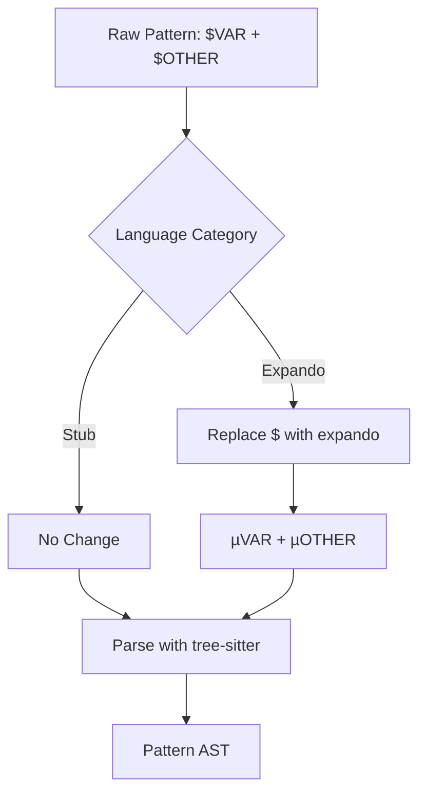
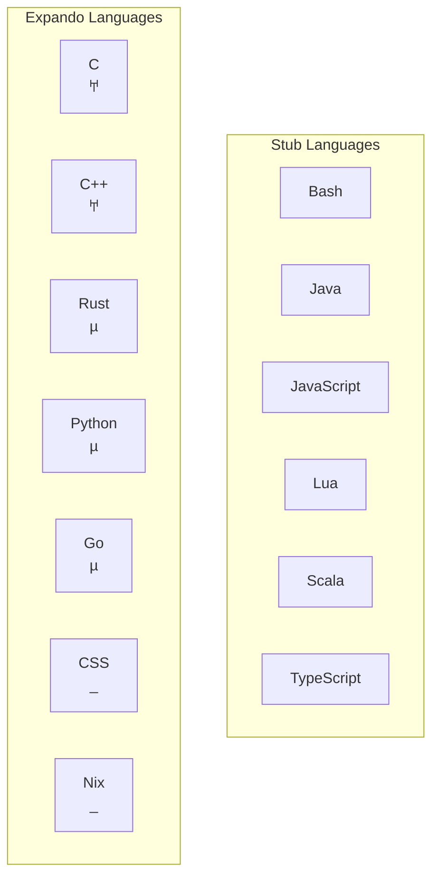
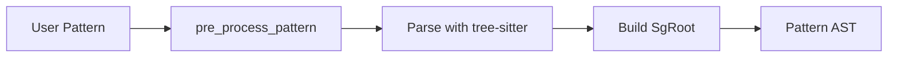

> **Source:** https://deepwiki.com/ast-grep/ast-grep/4.2-pattern-preprocessing

# Pattern Preprocessing

This document explains the pattern preprocessing system used in ast-grep to adapt the `$VAR` meta-variable syntax across different programming languages. Pattern preprocessing translates user-provided patterns into language-specific valid syntax before parsing with tree-sitter. For general information about language support, see [Supported Languages](/ast-grep/ast-grep/4.1-supported-languages). For information about pattern matching after preprocessing, see [Pattern Matching System](/ast-grep/ast-grep/2.2-pattern-matching-system).

## Overview

ast-grep provides a unified `$VAR` syntax for meta-variables across all supported languages. However, different programming languages have different rules for valid identifiers:

- Some languages (e.g., Bash, JavaScript, Java) treat `$` as a valid identifier character
- Other languages (e.g., Python, Rust, C/C++) do not allow `$` in identifiers
- Some languages (e.g., PHP, Nix) use `$` for special language constructs

When a language cannot parse `$` as part of an identifier, ast-grep must preprocess the pattern by replacing `$` with an alternative **expando character** that is valid in that language's identifier syntax but uncommon in typical code.

**Sources:** [crates/language/src/lib.rs1-10](https://github.com/ast-grep/ast-grep/blob/3ae01aec/crates/language/src/lib.rs#L1-L10)

## Language Categories

Languages in ast-grep fall into two categories based on their preprocessing requirements:

### Stub Languages

Languages where `$` is already valid in identifiers require no preprocessing. These use the `impl_lang!` macro:

| Language | Reason `$` is Valid |
|----------|---------------------|
| Bash | Shell variable syntax uses `$` |
| Java | `$` allowed in identifiers per JLS |
| JavaScript | `$` commonly used (jQuery convention) |
| JSON | No identifier concept; uses string matching |
| Lua | `$` is a valid identifier character |
| Scala | `$` allowed in identifiers |
| Solidity | `$` permitted in identifiers |
| TypeScript/TSX | Inherits JavaScript's rules |
| YAML | No identifier concept; uses string matching |

Implementation:

```rust
impl_lang!(Js, "JavaScript", lang_js(), ["js", "jsx", "javascript"]);
```

### Expando Languages

Languages where `$` is not valid in identifiers require preprocessing via the `impl_lang_expando!` macro. Each language defines its own expando character:

| Language | Expando Character | Rationale |
|----------|-------------------|-----------|
| C | `𐀀` (U+10000) | Unicode letter in Linear B Syllabary |
| C++ | `𐀀` (U+10000) | Unicode letter allowed per C++ standard |
| C# | `µ` (U+00B5) | Letter Number category allowed |
| CSS | `_` | Underscore is safe; hyphens handled separately |
| Elixir | `µ` | Unicode letters permitted |
| Go | `µ` | Unicode Letter category allowed |
| Haskell | `µ` | Unicode syntax supported by GHC |
| HCL | `µ` | Unicode letters valid in Terraform |
| Kotlin | `µ` | Unicode identifiers supported |
| Nix | `_` | `$` reserved for string interpolation |
| PHP | `µ` | Unicode allowed in names (not variables) |
| Python | `µ` | XID_Start range per PEP 3131 |
| Ruby | `µ` | Unicode identifiers allowed |
| Rust | `µ` | XID_Start range per Rust reference |
| Swift | `µ` | Unicode identifiers per Swift spec |

**Sources:** [crates/language/src/lib.rs5-7](https://github.com/ast-grep/ast-grep/blob/3ae01aec/crates/language/src/lib.rs#L5-L7) [crates/language/src/lib.rs200-250](https://github.com/ast-grep/ast-grep/blob/3ae01aec/crates/language/src/lib.rs#L200-L250)

## Preprocessing Algorithm

### Pattern Transformation Flow



**Sources:** [crates/language/src/lib.rs92-111](https://github.com/ast-grep/ast-grep/blob/3ae01aec/crates/language/src/lib.rs#L92-L111)

### Core Preprocessing Logic

The `pre_process_pattern()` function implements a character-by-character state machine:

```rust
fn pre_process_pattern(&self, pattern: &str) -> Cow<'_, str> {
    let expando = self.expando_char();
    let mut dollar_count = 0;
    let mut ret = String::with_capacity(pattern.len());
    
    for c in pattern.chars() {
        if c == '$' {
            dollar_count += 1;
        } else {
            let should_replace = dollar_count > 0 
                && (c.is_uppercase() || c == '_' || dollar_count == 3);
            if should_replace {
                for _ in 0..dollar_count {
                    ret.push(expando);
                }
            } else {
                for _ in 0..dollar_count {
                    ret.push('$');
                }
            }
            dollar_count = 0;
            ret.push(c);
        }
    }
    // Handle trailing $ characters
    Cow::Owned(ret)
}
```

The algorithm recognizes three contexts requiring replacement:

1. **Named meta-variables**: `$NAME` where NAME starts with uppercase or underscore
2. **Anonymous multiple**: `$$$` for matching multiple nodes
3. **Anonymous single**: `$$` for matching a single node (when count is appropriate)

**Sources:** [crates/language/src/lib.rs92-111](https://github.com/ast-grep/ast-grep/blob/3ae01aec/crates/language/src/lib.rs#L92-L111)

### Implementation Details

The preprocessing function is defined at [crates/language/src/lib.rs92-111](https://github.com/ast-grep/ast-grep/blob/3ae01aec/crates/language/src/lib.rs#L92-L111):

Key behaviors:

- Accumulates consecutive `$` characters in `dollar_count`
- When a non-`$` character is encountered, decides whether to replace based on:
  - Character is uppercase letter or underscore
  - OR exactly three `$` characters (ellipsis)
- Uses `std::borrow::Cow` to avoid allocation when no replacement occurs
- Returns owned string only when transformation is needed

**Sources:** [crates/language/src/lib.rs92-111](https://github.com/ast-grep/ast-grep/blob/3ae01aec/crates/language/src/lib.rs#L92-L111)

## Macro-Based Implementation

### The `impl_lang_expando!` Macro

Languages requiring preprocessing use the `impl_lang_expando!` macro defined at [crates/language/src/lib.rs115-147](https://github.com/ast-grep/ast-grep/blob/3ae01aec/crates/language/src/lib.rs#L115-L147):

```rust
macro_rules! impl_lang_expando {
  ($lang:ident, $parser:ident, $expando:expr) => {
    pub struct $lang;
    impl Language for $lang {
      fn expando_char(&self) -> char { $expando }
      // ... generated implementations
    }
  };
}
```

This macro generates:

- A zero-sized type for the language
- Implementation of `Language` trait with custom `expando_char()`
- Implementation of `pre_process_pattern()` that uses the expando character
- Standard implementations for `kind_to_id()`, `field_to_id()`, and `build_pattern()`

```rust
// Example usage
impl_lang_expando!(Rust, Rust, 'µ');
impl_lang_expando!(Python, Python, 'µ');
impl_lang_expando!(C, C, '𐀀');
impl_lang_expando!(Cpp, Cpp, '𐀀');
impl_lang_expando!(Css, Css, '_');
impl_lang_expando!(Nix, Nix, '_');
```

**Sources:** [crates/language/src/lib.rs115-147](https://github.com/ast-grep/ast-grep/blob/3ae01aec/crates/language/src/lib.rs#L115-L147)

### Language Type Hierarchy



**Sources:** [crates/language/src/lib.rs64-90](https://github.com/ast-grep/ast-grep/blob/3ae01aec/crates/language/src/lib.rs#L64-L90) [crates/language/src/lib.rs115-147](https://github.com/ast-grep/ast-grep/blob/3ae01aec/crates/language/src/lib.rs#L115-L147) [crates/language/src/lib.rs254-283](https://github.com/ast-grep/ast-grep/blob/3ae01aec/crates/language/src/lib.rs#L254-L283)

## Preprocessing Examples

### Python Example

For Python, which uses `µ` as the expando character:

| Original Pattern | Preprocessed Pattern | Explanation |
|-----------------|---------------------|-------------|
| `$VAR = 0` | `µVAR = 0` | Named meta-variable |
| `if ($COND):` | `if (µCOND):` | Named in expression |
| `$$$BODY` | `µµµBODY` | Ellipsis meta-variable |
| `print($var)` | `print($var)` | Lowercase; no replacement |
| `$$` | `$$` | Anonymous; no uppercase follows |

**Sources:** [crates/language/src/python.rs](https://github.com/ast-grep/ast-grep/blob/3ae01aec/crates/language/src/python.rs) [crates/language/src/lib.rs230](https://github.com/ast-grep/ast-grep/blob/3ae01aec/crates/language/src/lib.rs#L230-L230)

### C++ Example

For C++, which uses `𐀀` (Linear B character U+10000):

| Original Pattern | Preprocessed Pattern | Explanation |
|-----------------|---------------------|-------------|
| `$A->b()` | `𐀀A->b()` | Named meta-variable |
| `template <typename $T>` | `template <typename 𐀀T>` | Named in template |
| `if (a) { $$$BODY }` | `if (a) { 𐀀𐀀𐀀BODY }` | Ellipsis |

Test validation at [crates/language/src/cpp.rs10-25](https://github.com/ast-grep/ast-grep/blob/3ae01aec/crates/language/src/cpp.rs#L10-L25):

```rust
#[test]
fn test_cpp_preprocessing() {
    let lang = Cpp;
    assert_eq!(lang.pre_process_pattern("$A"), "𐀀A");
    assert_eq!(lang.pre_process_pattern("$$$A"), "𐀀𐀀𐀀A");
}
```

**Sources:** [crates/language/src/cpp.rs10-25](https://github.com/ast-grep/ast-grep/blob/3ae01aec/crates/language/src/cpp.rs#L10-L25) [crates/language/src/lib.rs202-203](https://github.com/ast-grep/ast-grep/blob/3ae01aec/crates/language/src/lib.rs#L202-L203)

### Nix Example

For Nix, which uses `_` as the expando character because `$` is reserved for string interpolation (`"${pkgs.hello}"`):

| Original Pattern | Preprocessed Pattern | Explanation |
|-----------------|---------------------|-------------|
| `$A + $B` | `_A + _B` | Binary operation |
| `{ $A = $B; }` | `{ _A = _B; }` | Attribute set |
| `let $A = $B; in $C` | `let _A = _B; in _C` | Let binding |
| `[ $$$ITEMS ]` | `[ ___ITEMS ]` | List ellipsis |

Test validation at [crates/language/src/nix.rs10-28](https://github.com/ast-grep/ast-grep/blob/3ae01aec/crates/language/src/nix.rs#L10-L28):

```rust
#[test]
fn test_nix_preprocessing() {
    let lang = Nix;
    assert_eq!(lang.pre_process_pattern("$A"), "_A");
    assert_eq!(lang.pre_process_pattern("$A + $B"), "_A + _B");
    assert_eq!(lang.pre_process_pattern("$$$ITEMS"), "___ITEMS");
}
```

**Sources:** [crates/language/src/nix.rs10-34](https://github.com/ast-grep/ast-grep/blob/3ae01aec/crates/language/src/nix.rs#L10-L34) [crates/language/src/lib.rs224](https://github.com/ast-grep/ast-grep/blob/3ae01aec/crates/language/src/lib.rs#L224-L224)

## Integration with Pattern Building

### Pattern Construction Pipeline

The `Language::build_pattern()` method coordinates this process at [crates/language/src/lib.rs137-139](https://github.com/ast-grep/ast-grep/blob/3ae01aec/crates/language/src/lib.rs#L137-L139):



The `Language::pre_process_pattern()` is called by `PatternBuilder` before parsing. For expando languages, this is implemented at [crates/language/src/lib.rs134-136](https://github.com/ast-grep/ast-grep/blob/3ae01aec/crates/language/src/lib.rs#L134-L136):

```rust
fn pre_process_pattern(&self, pattern: &str) -> Cow<'_, str> {
    replace_meta_var(pattern, '$', self.expando_char())
}
```

For stub languages (using `impl_lang!`), the default implementation returns the pattern unchanged.

**Sources:** [crates/language/src/lib.rs134-139](https://github.com/ast-grep/ast-grep/blob/3ae01aec/crates/language/src/lib.rs#L134-L139) [crates/language/src/lib.rs80-82](https://github.com/ast-grep/ast-grep/blob/3ae01aec/crates/language/src/lib.rs#L80-L82)

### SupportLang Enum Integration

The `SupportLang` enum at [crates/language/src/lib.rs456-469](https://github.com/ast-grep/ast-grep/blob/3ae01aec/crates/language/src/lib.rs#L456-L469) delegates to individual language implementations:

```rust
impl SupportLang {
    fn pre_process_pattern(&self, pattern: &str) -> Cow<'_, str> {
        execute_lang_method!(self, pre_process_pattern, pattern)
    }
}
```

The `execute_lang_method!` macro at [crates/language/src/lib.rs414-445](https://github.com/ast-grep/ast-grep/blob/3ae01aec/crates/language/src/lib.rs#L414-L445) dispatches to the appropriate language implementation:

```rust
macro_rules! execute_lang_method {
    ($self:expr, $method:ident, $($arg:expr),*) => {
        match $self {
            SupportLang::Bash => Bash.$method($($arg),*),
            SupportLang::Rust => Rust.$method($($arg),*),
            // ... all languages
        }
    };
}
```

This design allows the enum to provide a unified interface while delegating to language-specific implementations that may or may not perform preprocessing.

**Sources:** [crates/language/src/lib.rs456-469](https://github.com/ast-grep/ast-grep/blob/3ae01aec/crates/language/src/lib.rs#L456-L469) [crates/language/src/lib.rs414-445](https://github.com/ast-grep/ast-grep/blob/3ae01aec/crates/language/src/lib.rs#L414-L445)

## Why Unicode?

The expando character must satisfy three requirements:

1. **Be a valid identifier character** in the target language
2. **Never appear in real code** (low collision probability)
3. **Not conflict with language syntax**

### Unicode Character Selection

**µ (U+00B5) - Micro Sign**
- Valid in: Python, Rust, Go, C#, Ruby, Swift, Kotlin, Elixir, Haskell, PHP
- Category: Letter Number (Unicode category Lm)
- Rarely typed intentionally
- Satisfies XID_Start requirements in most languages

**𐀀 (U+10000) - Linear B Syllable**
- Valid in: C, C++
- Category: Other Letter (Unicode category Lo)
- From Supplementary Multilingual Plane (4-byte UTF-8)
- Extremely unlikely to appear in source code
- Allowed in C/C++ identifiers per language standards

**_ (Underscore)**
- Valid in: CSS, Nix
- Category: Connector Punctuation (Unicode category Pc)
- Common in identifiers but unambiguous with `$`
- Used when Unicode characters may not be valid

**Sources:** [crates/language/src/lib.rs202-237](https://github.com/ast-grep/ast-grep/blob/3ae01aec/crates/language/src/lib.rs#L202-L237)

## Performance Considerations

The preprocessing implementation uses `std::borrow::Cow<'_, str>` to optimize for cases where no transformation is needed:

- **Stub languages**: Always return `Cow::Borrowed` (zero allocation)
- **Expando languages with no meta-variables**: Return `Cow::Borrowed` when pattern contains no `$VAR` patterns
- **Expando languages with meta-variables**: Return `Cow::Owned` with transformed string

The function pre-allocates the result vector with the input length as capacity, minimizing reallocations during character-by-character processing.

**Sources:** [crates/language/src/lib.rs92-111](https://github.com/ast-grep/ast-grep/blob/3ae01aec/crates/language/src/lib.rs#L92-L111)
