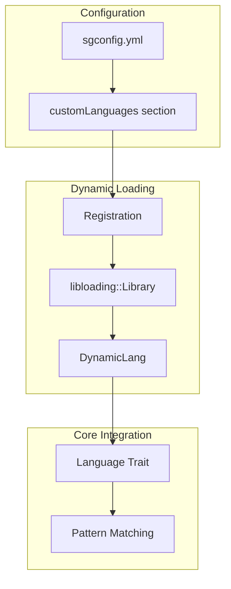
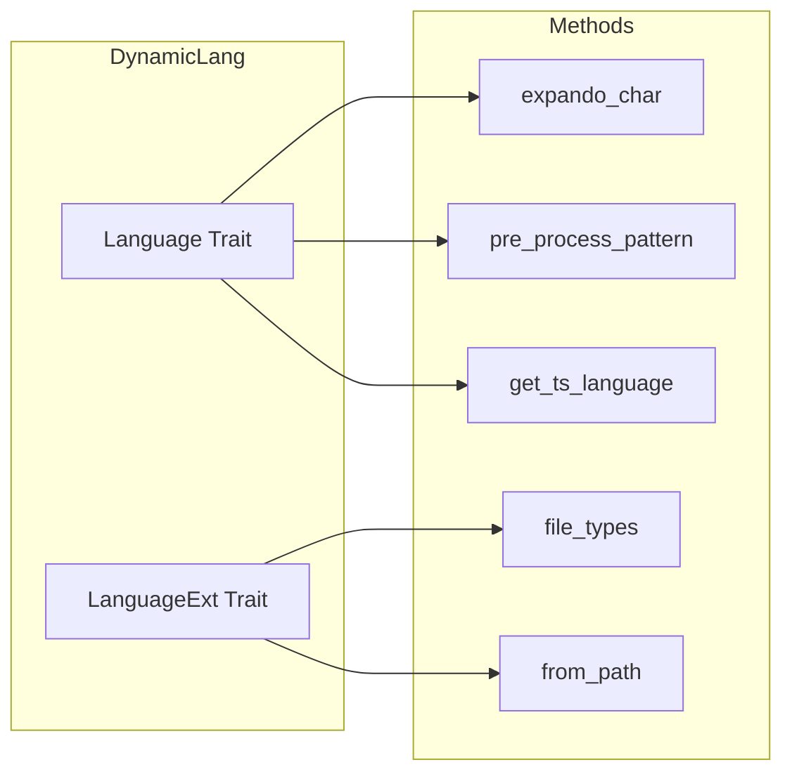
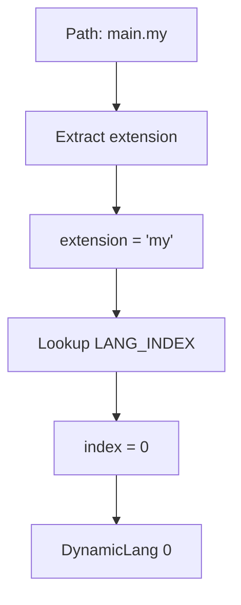

> **Source:** https://deepwiki.com/ast-grep/ast-grep/4.3-dynamic-language-loading

# Dynamic Language Loading

This document covers the dynamic language loading system in ast-grep, which enables runtime loading of tree-sitter parsers from shared libraries. This system allows ast-grep to support additional programming languages without requiring recompilation of the core tool.

For information about the built-in language support that comes pre-compiled with ast-grep, see [Supported Languages](/ast-grep/ast-grep/4.1-supported-languages). For information about how pattern syntax is adapted for different languages, see [Pattern Preprocessing](/ast-grep/ast-grep/4.2-pattern-preprocessing).

## Purpose and Architecture

The dynamic language loading system provides a mechanism to extend ast-grep's language support by loading tree-sitter parsers from external shared libraries (.so, .dll, .dylib files) at runtime. This system is implemented in the `ast-grep-dynamic` crate and integrates with the core `Language` trait system.

**System Architecture**



**Sources:** [crates/dynamic/src/lib.rs23-276](https://github.com/ast-grep/ast-grep/blob/3ae01aec/crates/dynamic/src/lib.rs#L23-L276)

## Core Components

### DynamicLang Struct

The `DynamicLang` struct represents a dynamically loaded tree-sitter language. It uses an index-based approach to reference language data stored in global static variables.

```rust
#[derive(Clone, Copy, Debug, PartialEq, Eq, Hash, Serialize, Deserialize)]
pub struct DynamicLang(usize);
```

The struct is a thin wrapper around an index that references:

- The loaded `Library` instance
- The `TSLanguage` instance
- Configuration metadata (expando char, extensions)

**Sources:** [crates/dynamic/src/lib.rs23-29](https://github.com/ast-grep/ast-grep/blob/3ae01aec/crates/dynamic/src/lib.rs#L23-L29) [crates/dynamic/src/lib.rs94-101](https://github.com/ast-grep/ast-grep/blob/3ae01aec/crates/dynamic/src/lib.rs#L94-L101)

### Registration Configuration

The `Registration` struct defines the configuration needed to register a new dynamic language:

| Field | Type | Purpose |
|-------|------|---------|
| `lang_name` | `String` | Human-readable language name |
| `lib_path` | `PathBuf` | Path to shared library file |
| `symbol` | `String` | Function symbol name in library |
| `meta_var_char` | `Option<char>` | Meta-variable character (default: '$') |
| `expando_char` | `Option<char>` | Expando character for parsing |
| `extensions` | `Vec<String>` | File extensions for this language |

**Sources:** [crates/dynamic/src/lib.rs146-154](https://github.com/ast-grep/ast-grep/blob/3ae01aec/crates/dynamic/src/lib.rs#L146-L154)

### Inner Storage Structure

```rust
struct Inner {
    lang: NativeTS,
    expando: char,
    extensions: Vec<String>,
    #[allow(dead_code)]
    library: Library, // must keep alive
}
```

The `Inner` struct stores all data for a registered language. The `library` field must be retained to prevent the shared library from being unloaded.

**Sources:** [crates/dynamic/src/lib.rs31-41](https://github.com/ast-grep/ast-grep/blob/3ae01aec/crates/dynamic/src/lib.rs#L31-L41)

## Language Registration Process

The registration process involves loading shared libraries and storing language metadata in global static variables.

**Registration Flow**


### Registration Implementation

```rust
impl Registration {
    pub fn register(&self) -> Result<DynamicLang, DynamicError> {
        let path = self.lib_path.canonicalize()?;
        let lib = unsafe { Library::new(&path)? };
        let lang = unsafe { load_ts_language(&lib, &self.symbol)? };
        // Store in global, return index
    }
}
```

**Sources:** [crates/dynamic/src/lib.rs160-169](https://github.com/ast-grep/ast-grep/blob/3ae01aec/crates/dynamic/src/lib.rs#L160-L169) [crates/dynamic/src/lib.rs176-197](https://github.com/ast-grep/ast-grep/blob/3ae01aec/crates/dynamic/src/lib.rs#L176-L197)

## Language Loading Mechanics

### Unsafe Library Loading

The core language loading function `load_ts_language` handles the unsafe operations required to load and call functions from shared libraries:

```rust
unsafe fn load_ts_language(
    lib: &Library,
    symbol: &str,
) -> Result<NativeTS, DynamicError> {
    // Get symbol from library
    let func: Symbol<unsafe extern "C" fn() -> NativeTS> = 
        lib.get(symbol.as_bytes())?;
    
    // Call function to get language
    let lang = func();
    
    // Validate ABI version
    if lang.abi_version() != TREE_SITTER_ABI_VERSION {
        return Err(DynamicError::IncompatibleVersion);
    }
    
    Ok(lang)
}
```

Key steps:

1. **Canonicalize the library path** - Ensure absolute path for consistent loading
2. **Load the shared library** - Use `libloading::Library::new()`
3. **Extract the tree-sitter language function symbol** - Get the exported function
4. **Call the function to get the `NativeTS` instance** - Invoke symbol
5. **Validate ABI version compatibility** - Ensure tree-sitter ABI matches
6. **Retain the library reference** - Prevent cleanup while in use

**Sources:** [crates/dynamic/src/lib.rs120-139](https://github.com/ast-grep/ast-grep/blob/3ae01aec/crates/dynamic/src/lib.rs#L120-L139)

### Global Storage

Two static mutable variables store the registered languages:

```rust
static DYNAMIC_LANG: Lazy<RwLock<Vec<Inner>>> = Lazy::new(Default::default);
static LANG_INDEX: Lazy<RwLock<HashMap<String, usize>>> = Lazy::new(Default::default);
```

- `DYNAMIC_LANG`: Stores the actual language data and library references
- `LANG_INDEX`: Maps file extensions to language indices for file type detection

**Sources:** [crates/dynamic/src/lib.rs143-144](https://github.com/ast-grep/ast-grep/blob/3ae01aec/crates/dynamic/src/lib.rs#L143-L144)

## Language Trait Implementation

The `DynamicLang` struct implements both the `Language` and `LanguageExt` traits to integrate with ast-grep's core functionality.

**Trait Implementation Map**



### Key Implementations

```rust
impl Language for DynamicLang {
    fn expando_char(&self) -> char {
        DYNAMIC_LANG.read()[self.0].expando
    }
    
    fn get_ts_language(&self) -> NativeTS {
        DYNAMIC_LANG.read()[self.0].lang.clone()
    }
}

impl LanguageExt for DynamicLang {
    fn extensions(&self) -> Vec<&str> {
        DYNAMIC_LANG.read()[self.0]
            .extensions.iter().map(|s| s.as_str()).collect()
    }
}
```

**Sources:** [crates/dynamic/src/lib.rs208-276](https://github.com/ast-grep/ast-grep/blob/3ae01aec/crates/dynamic/src/lib.rs#L208-L276)

## File Type Detection

The system provides file type detection through extension mapping:

1. **Registration**: Extensions are mapped to language indices during registration
2. **Lookup**: `from_path()` extracts file extension and looks up corresponding language
3. **Types Integration**: `file_types()` builds ignore-compatible type patterns

**File Extension Resolution**



### Implementation

```rust
impl DynamicLang {
    pub fn from_path(path: &Path) -> Option<Self> {
        let ext = path.extension()?.to_str()?;
        let index = LANG_INDEX.read().get(ext).copied()?;
        Some(DynamicLang(index))
    }
    
    pub fn file_types(&self) -> Result<ignore::Types> {
        let mut builder = TypesBuilder::new();
        for ext in self.extensions() {
            builder.add("custom", format!("*.{}", ext))?;
        }
        Ok(builder.build()?)
    }
}
```

**Sources:** [crates/dynamic/src/lib.rs247-262](https://github.com/ast-grep/ast-grep/blob/3ae01aec/crates/dynamic/src/lib.rs#L247-L262) [crates/dynamic/src/lib.rs42-55](https://github.com/ast-grep/ast-grep/blob/3ae01aec/crates/dynamic/src/lib.rs#L42-L55)

## Error Handling

The system defines specific error types for different failure modes:

| Error Type | Description |
|------------|-------------|
| `NotConfigured` | Target dynamic library not configured |
| `OpenLib` | Failed to load shared library |
| `ReadSymbol` | Cannot read symbol from library |
| `IncompatibleVersion` | Tree-sitter ABI version mismatch |
| `GetLibPath` | Cannot get absolute path of library |

### Error Display

```rust
impl Display for DynamicError {
    fn fmt(&self, f: &mut Formatter<'_>) -> fmt::Result {
        match self {
            Self::NotConfigured => write!(f, "Dynamic language not configured"),
            Self::OpenLib(e) => write!(f, "Cannot open library: {}", e),
            Self::ReadSymbol(e) => write!(f, "Cannot read symbol: {}", e),
            Self::IncompatibleVersion => write!(f, "ABI version mismatch"),
            Self::GetLibPath(e) => write!(f, "Cannot get lib path: {}", e),
        }
    }
}
```

**Sources:** [crates/dynamic/src/lib.rs103-115](https://github.com/ast-grep/ast-grep/blob/3ae01aec/crates/dynamic/src/lib.rs#L103-L115)

## Safety Considerations

The dynamic language loading system involves several unsafe operations that require careful handling:

### Memory Safety

- **Library Retention**: The `Library` instance must be retained in the `Inner` struct to prevent symbol cleanup
- **Static Lifetime**: Loaded languages have static lifetime through global storage
- **ABI Compatibility**: Version checks ensure tree-sitter ABI compatibility

### Thread Safety

- **Global Mutation**: Registration modifies global static variables and should be called once during initialization
- **Read Access**: Runtime access to languages is read-only and thread-safe
- **RwLock Protection**: Global storage uses `RwLock` for concurrent access

### Safety Warnings

- Dynamic libraries run with full process permissions
- Only load parsers from trusted sources
- Invalid parsers may crash the process
- Always validate ABI version before use

**Sources:** [crates/dynamic/src/lib.rs117-119](https://github.com/ast-grep/ast-grep/blob/3ae01aec/crates/dynamic/src/lib.rs#L117-L119) [crates/dynamic/src/lib.rs158-159](https://github.com/ast-grep/ast-grep/blob/3ae01aec/crates/dynamic/src/lib.rs#L158-L159) [crates/dynamic/src/lib.rs132-134](https://github.com/ast-grep/ast-grep/blob/3ae01aec/crates/dynamic/src/lib.rs#L132-L134)

## Configuration Example

Define custom languages in `sgconfig.yml`:

```yaml
customLanguages:
  mylang:
    libraryPath: ./parsers/libtree-sitter-mylang.so
    extensions: [ml, myl]
    expandoChar: µ  # optional
    metaVarChar: $  # optional, defaults to $
```

## Building Custom Parsers

### tree-sitter CLI

```bash
# Generate parser
tree-sitter generate

# Compile for distribution
gcc -shared -fPIC src/parser.c -o libtree-sitter-mylang.so
```

### Platform Support

| Platform | Extension | Notes |
|----------|-----------|-------|
| Linux | `.so` | ELF shared object |
| macOS | `.dylib` | Mach-O dynamic library |
| Windows | `.dll` | PE dynamic library |

### Directory Structure

```
tree-sitter-mylang/
├── grammar.js
├── src/
│   ├── parser.c
│   ├── scanner.c
│   └── tree_sitter/
│       └── parser.h
└── bindings/
    └── rust/
```
