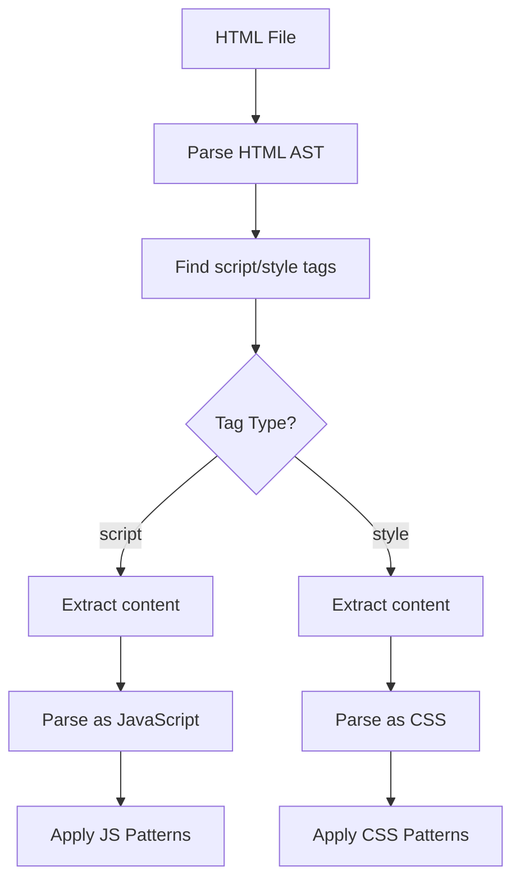
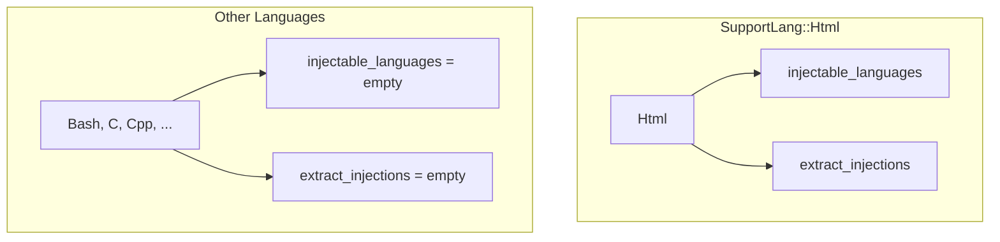
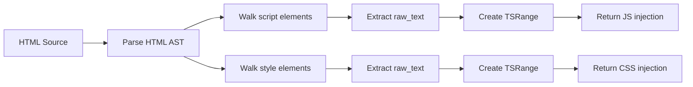
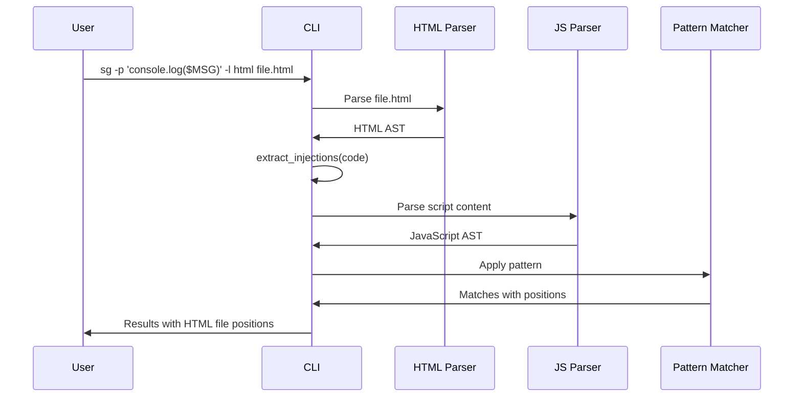

> **Source:** https://deepwiki.com/ast-grep/ast-grep/4.4-language-injection

# Language Injection

Language injection allows matching patterns in embedded languages,such as JavaScript inside HTML `<script>` tags or CSS in `<style>` tags.

## Purpose and Scope

This document explains the language injection system in ast-grep. Language injection allows one host language file to contain embedded code from other languages. ast-grep can parse and match patterns in these embedded languages while maintaining awareness of the host context.

For general language support information, see [Language Support](/ast-grep/ast-grep/4-language-support). For information about how pattern syntax is adapted across languages, see [Pattern Preprocessing](/ast-grep/ast-grep/4.2-pattern-preprocessing).

## Overview

Languages like HTML often contain embedded code in other languages:

- **JavaScript** in `<script>` tags
- **CSS** in `<style>` tags
- **TypeScript** in `<script lang="ts">` attributes

ast-grep's injection system allows pattern matching in these embedded languages while preserving the context of the host document.

**Injection Processing Flow**



**Sources:** [crates/language/src/lib.rs474-483](https://github.com/ast-grep/ast-grep/blob/3ae01aec/crates/language/src/lib.rs#L474-L483) [crates/language/src/lib.rs45](https://github.com/ast-grep/ast-grep/blob/3ae01aec/crates/language/src/lib.rs#L45-L45)

## LanguageExt Trait Methods

The `LanguageExt` trait extends the `Language` trait with injection-related methods:

```rust
pub trait LanguageExt: Language {
    fn injectable_languages(&self) -> Vec<SupportLang>;
    fn extract_injections(&self, code: &str) -> Vec<(SupportLang, String, StdResult<TSRange>)>;
}
```

| Method | Purpose |
|--------|---------|
| `injectable_languages()` | Returns list of languages that can be injected into this host language |
| `extract_injections()` | Extracts embedded code ranges from the host source |
| `file_types()` | Builds ignore-compatible type patterns |
| `from_path()` | Attempts to detect language from file path extension |

**Sources:** [crates/language/src/lib.rs45-55](https://github.com/ast-grep/ast-grep/blob/3ae01aec/crates/language/src/lib.rs#L45-L55)

### injectable_languages()

Returns the list of languages that can be embedded in this host language. For HTML, this returns `[JavaScript, TypeScript, Css]`. For other languages, this returns an empty vector.

```rust
fn injectable_languages(&self) -> Vec<SupportLang> {
    match self {
        SupportLang::Html => vec![SupportLang::JavaScript, SupportLang::TypeScript, SupportLang::Css],
        _ => vec![],
    }
}
```

**Sources:** [crates/language/src/lib.rs474-483](https://github.com/ast-grep/ast-grep/blob/3ae01aec/crates/language/src/lib.rs#L474-L483)

### extract_injections()

Analyzes the source code and returns a vector of tuples containing:

- **Language**: The injected language type
- **String**: The extracted source code
- **TSRange**: Byte range information for mapping positions

**Sources:** [crates/language/src/lib.rs474-483](https://github.com/ast-grep/ast-grep/blob/3ae01aec/crates/language/src/lib.rs#L474-L483)

## Implementation in SupportLang

The `SupportLang` enum implements injection support through delegation:

**Injection Support Architecture**



**Implementation Map**

| Language | injectable_languages() | extract_injections() |
|----------|----------------------|---------------------|
| HTML | [JavaScript, TypeScript, CSS] | Extracts from script/style tags |
| All others | [] | Returns empty Vec |

The `execute_lang_method!` macro at [crates/language/src/lib.rs414-445](https://github.com/ast-grep/ast-grep/blob/3ae01aec/crates/language/src/lib.rs#L414-L445) dispatches these method calls to the appropriate language implementation:

```rust
impl LanguageExt for SupportLang {
    fn injectable_languages(&self) -> Vec<SupportLang> {
        execute_lang_method!(self, injectable_languages)
    }
    
    fn extract_injections(&self, code: &str) -> Vec<...> {
        execute_lang_method!(self, extract_injections)
    }
}
```

**Sources:** [crates/language/src/lib.rs471-483](https://github.com/ast-grep/ast-grep/blob/3ae01aec/crates/language/src/lib.rs#L471-L483)

## HTML Language Implementation

The HTML language provides the most complete injection implementation, supporting JavaScript, TypeScript, and CSS extraction.

### HTML Injection Implementation

The implementation at [crates/language/src/lib.rs474-483](https://github.com/ast-grep/ast-grep/blob/3ae01aec/crates/language/src/lib.rs#L474-L483) provides:

1. **Language Identification**: Returns `[JavaScript, TypeScript, Css]` as injectable languages
2. **Content Extraction**: Identifies and extracts content from `<script>` and `<style>` tags
3. **Range Tracking**: Maintains byte position mapping for accurate diagnostic reporting

### HTML Processing Flow



### Supported Injection Points

| HTML Element | Injected Language | Extraction Method |
|--------------|-------------------|-------------------|
| `<script>` | JavaScript | Element's raw text content |
| `<script type="module">` | JavaScript | Element's raw text content |
| `<style>` | CSS | Element's raw text content |

**Sources:** [crates/language/src/lib.rs474-483](https://github.com/ast-grep/ast-grep/blob/3ae01aec/crates/language/src/lib.rs#L474-L483)

## Integration with Tree-Sitter

The injection system integrates with tree-sitter at the parsing layer:

1. **Primary Parse**: The host language (HTML) is parsed with its tree-sitter parser
2. **Node Identification**: AST nodes representing injection points (`script_element`, `style_element`) are identified
3. **Content Extraction**: The text content of these nodes is extracted using tree-sitter's `utf8_text()` method
4. **Secondary Parse**: The extracted content is parsed with the injected language's parser
5. **Pattern Matching**: ast-grep patterns are applied to the secondary AST

This architecture ensures that pattern matching has access to proper AST structure for the injected language, maintaining the precision that distinguishes ast-grep from regex-based search tools.

**Sources:** High-level architecture diagrams (Diagram 6)

## Language Feature Flags

Injection support requires the appropriate language parsers to be compiled in:

- **HTML Injection**: Requires `tree-sitter-html`, `tree-sitter-javascript`, and `tree-sitter-css` features
- **TypeScript in HTML**: Additionally requires `tree-sitter-typescript` feature

The feature flags are defined in `Cargo.toml` at [crates/language/Cargo.toml1-80](https://github.com/ast-grep/ast-grep/blob/3ae01aec/crates/language/Cargo.toml#L1-L80):

```toml
[features]
default = ["builtin-parser"]
builtin-parser = [
    "tree-sitter-html",
    "tree-sitter-javascript",
    "tree-sitter-typescript",
    "tree-sitter-css",
    # ... other languages
]
```

**Sources:** [crates/language/Cargo.toml1-80](https://github.com/ast-grep/ast-grep/blob/3ae01aec/crates/language/Cargo.toml#L1-L80)

## Pattern Matching with Injections

When using ast-grep to match patterns in injected content, the process follows this sequence:

**Matching Flow with Injections**



### Example: Finding console.log in HTML

```html
<!DOCTYPE html>
<html>
<body>
    <script>
        console.log("hello world");  <!-- Matched here -->
    </script>
</body>
</html>
```

Running:

```bash
sg -p 'console.log($MSG)' -l html file.html
```

This will match the `console.log` statement, reporting its position within the context of the HTML file.

**Sources:** High-level architecture diagrams (Diagram 6)

## Current Support Matrix

| Host Language | Injectable Languages | Implementation Status |
|---------------|---------------------|----------------------|
| HTML | JavaScript | ✅ Implemented via `Html.extract_injections` |
| HTML | TypeScript | ✅ Implemented via `Html.extract_injections` |
| HTML | CSS | ✅ Implemented via `Html.extract_injections` |
| Vue SFC | JavaScript | Partial |
| Markdown | Various | Planned |
| Template literals | Various | Planned |

**Sources:** High-level architecture diagrams (Diagram 6)

## Extension Points

To add language injection support for a new language, developers must:

1. **Implement the LanguageExt trait** with `injectable_languages()` and `extract_injections()` methods for their respective language struct
2. **Add match arms in SupportLang** ensuring proper delegation through the `execute_lang_method!` macro
3. **Ensure required parsers are available** via feature flags in `Cargo.toml`
4. **Implement content extraction logic** that identifies injection points in the host language's AST

**Sources:** High-level architecture diagrams (Diagram 6)

## Use Cases

Language injection enables several important use cases:

1. **Web Development**: Searching for patterns in JavaScript/CSS embedded in HTML files
2. **Template Analysis**: Finding code patterns in templating languages (Vue, Svelte, etc.)
3. **Documentation**: Analyzing code examples in markdown documentation
4. **Configuration Files**: Parsing embedded scripts in configuration formats

The injection mechanism ensures that ast-grep can provide accurate AST-based matching even when source files contain multiple languages, maintaining the precision that distinguishes it from regex-based search tools.

**Sources:** High-level architecture diagrams (Diagram 6)
