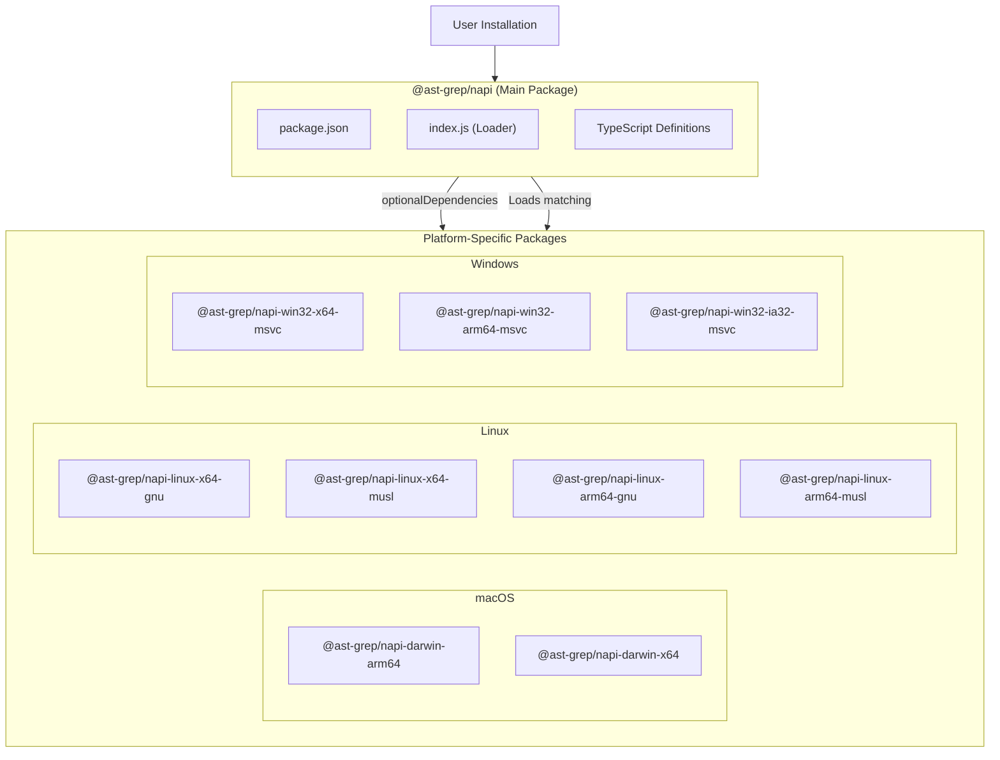
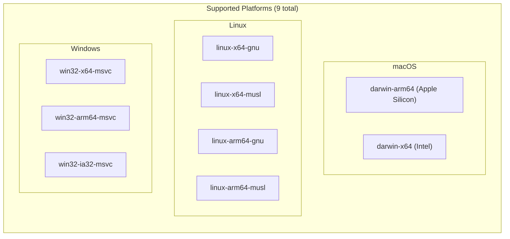
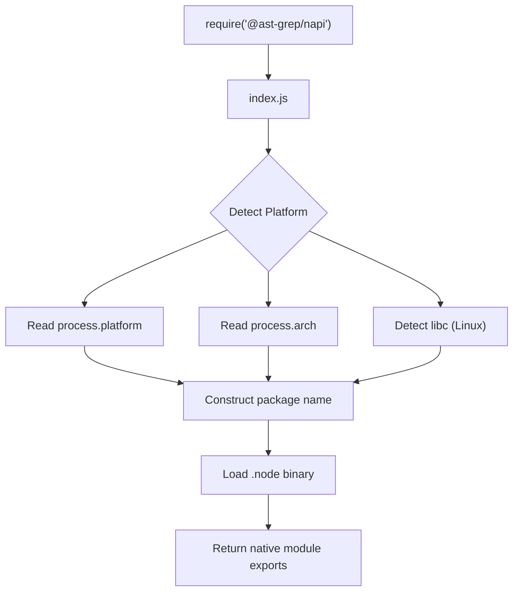
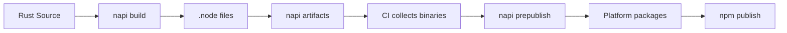

# Package Structure

> Relevant source files:
> - [crates/napi/npm/darwin-arm64/package.json](https://github.com/ast-grep/ast-grep/blob/3ae01aec/crates/napi/npm/darwin-arm64/package.json)
> - [crates/napi/npm/darwin-x64/package.json](https://github.com/ast-grep/ast-grep/blob/3ae01aec/crates/napi/npm/darwin-x64/package.json)
> - [crates/napi/npm/linux-x64-gnu/package.json](https://github.com/ast-grep/ast-grep/blob/3ae01aec/crates/napi/npm/linux-x64-gnu/package.json)
> - [crates/napi/npm/win32-arm64-msvc/package.json](https://github.com/ast-grep/ast-grep/blob/3ae01aec/crates/napi/npm/win32-arm64-msvc/package.json)
> - [crates/napi/npm/win32-ia32-msvc/package.json](https://github.com/ast-grep/ast-grep/blob/3ae01aec/crates/napi/npm/win32-ia32-msvc/package.json)
> - [crates/napi/npm/win32-x64-msvc/package.json](https://github.com/ast-grep/ast-grep/blob/3ae01aec/crates/napi/npm/win32-x64-msvc/package.json)
> - [crates/napi/package.json](https://github.com/ast-grep/ast-grep/blob/3ae01aec/crates/napi/package.json)
> - [crates/napi/yarn.lock](https://github.com/ast-grep/ast-grep/blob/3ae01aec/crates/napi/yarn.lock)

This document describes the npm package structure for `@ast-grep/napi`, the Node.js native bindings for ast-grep. It covers the dual-package architecture that enables cross-platform distribution of native Node.js modules.

For the JavaScript API exposed by these packages, see [NAPI API Reference](7.1-napi-api-reference.md). For async operations and threading, see [Async Operations](7.3-async-operations.md). For the CLI wrapper package, see [npm CLI Wrapper](../distribution/9.1-npm-cli-wrapper.md).

---

## Overview

The `@ast-grep/napi` package uses a **split package architecture** where a main package (`@ast-grep/napi`) depends on platform-specific packages as optional dependencies. When users install the main package, npm automatically installs only the platform-specific package that matches their operating system and CPU architecture, reducing download size and installation time.



**Sources:** [crates/napi/package.json1-81](https://github.com/ast-grep/ast-grep/blob/3ae01aec/crates/napi/package.json#L1-L81) [crates/napi/yarn.lock50-63](https://github.com/ast-grep/ast-grep/blob/3ae01aec/crates/napi/yarn.lock#L50-L63)

---

## Main Package Configuration

The main `@ast-grep/napi` package serves as the entry point and runtime loader for the native bindings. It does not contain the actual native code but delegates to platform-specific packages.

### Package Metadata

| Field | Value | Purpose |
|---|---|---|
| `name` | `@ast-grep/napi` | Package identifier on npm registry |
| `version` | `0.40.5` | Synchronized across all packages |
| `main` | `index.js` | Entry point that loads native module |
| `engines.node` | `>= 10` | Minimum Node.js version requirement |

**Sources:** [crates/napi/package.json2-38](https://github.com/ast-grep/ast-grep/blob/3ae01aec/crates/napi/package.json#L2-L38)

### Build Targets

The `napi.targets` array defines all platforms for which native binaries are built:

| Target | Description |
|---|---|
| `x86_64-apple-darwin` | macOS Intel |
| `aarch64-apple-darwin` | macOS Apple Silicon |
| `x86_64-unknown-linux-gnu` | Linux x64 (glibc) |
| `x86_64-unknown-linux-musl` | Linux x64 (musl) |
| `aarch64-unknown-linux-gnu` | Linux ARM64 (glibc) |
| `aarch64-unknown-linux-musl` | Linux ARM64 (musl) |
| `x86_64-pc-windows-msvc` | Windows x64 |
| `aarch64-pc-windows-msvc` | Windows ARM64 |
| `i686-pc-windows-msvc` | Windows 32-bit |

These Rust target triples map to the platform-specific npm packages described in the next section.

**Sources:** [crates/napi/package.json22-35](https://github.com/ast-grep/ast-grep/blob/3ae01aec/crates/napi/package.json#L22-L35)

### Included Files

The main package publishes only metadata and TypeScript definitions:

```json
{
  "files": [
    "index.js",
    "*.d.ts"
  ]
}
```

The actual `.node` binaries are published in the platform-specific packages, not the main package.

**Sources:** [crates/napi/package.json16-21](https://github.com/ast-grep/ast-grep/blob/3ae01aec/crates/napi/package.json#L16-L21)

---

## Platform-Specific Packages

Each platform-specific package contains a single precompiled `.node` file (the native Node.js addon) for a specific OS/CPU/libc combination. These packages use npm's platform constraints to ensure they only install on compatible systems.

### Supported Platforms



**Sources:** [crates/napi/yarn.lock5-63](https://github.com/ast-grep/ast-grep/blob/3ae01aec/crates/napi/yarn.lock#L5-L63)

### Platform Package Structure

Each platform package follows the same structure. For example, `@ast-grep/napi-darwin-arm64`:

| Field | Value | Description |
|---|---|---|
| `name` | `@ast-grep/napi-darwin-arm64` | Platform-specific package name |
| `os` | `["darwin"]` | Restricts to macOS only |
| `cpu` | `["arm64"]` | Restricts to ARM64 architecture |
| `main` | `ast-grep-napi.darwin-arm64.node` | Native binary entry point |
| `files` | `["ast-grep-napi.darwin-arm64.node"]` | Single binary file |

**Sources:** [crates/napi/npm/darwin-arm64/package.json1-31](https://github.com/ast-grep/ast-grep/blob/3ae01aec/crates/napi/npm/darwin-arm64/package.json#L1-L31)

### Platform Constraints by Package

The following table shows the exact constraints for each platform package:

| Package Name | OS | CPU | Libc | Binary Filename |
|---|---|---|---|---|
| `napi-darwin-arm64` | `darwin` | `arm64` | - | `ast-grep-napi.darwin-arm64.node` |
| `napi-darwin-x64` | `darwin` | `x64` | - | `ast-grep-napi.darwin-x64.node` |
| `napi-linux-x64-gnu` | `linux` | `x64` | `glibc` | `ast-grep-napi.linux-x64-gnu.node` |
| `napi-linux-x64-musl` | `linux` | `x64` | `musl` | `ast-grep-napi.linux-x64-musl.node` |
| `napi-linux-arm64-gnu` | `linux` | `arm64` | `glibc` | `ast-grep-napi.linux-arm64-gnu.node` |
| `napi-linux-arm64-musl` | `linux` | `arm64` | `musl` | `ast-grep-napi.linux-arm64-musl.node` |
| `napi-win32-x64-msvc` | `win32` | `x64` | - | `ast-grep-napi.win32-x64-msvc.node` |
| `napi-win32-arm64-msvc` | `win32` | `arm64` | - | `ast-grep-napi.win32-arm64-msvc.node` |
| `napi-win32-ia32-msvc` | `win32` | `ia32` | - | `ast-grep-napi.win32-ia32-msvc.node` |

**Sources:** [crates/napi/npm/darwin-arm64/package.json1-31](https://github.com/ast-grep/ast-grep/blob/3ae01aec/crates/napi/npm/darwin-arm64/package.json#L1-L31) [crates/napi/npm/darwin-x64/package.json1-31](https://github.com/ast-grep/ast-grep/blob/3ae01aec/crates/napi/npm/darwin-x64/package.json#L1-L31) [crates/napi/npm/linux-x64-gnu/package.json1-34](https://github.com/ast-grep/ast-grep/blob/3ae01aec/crates/napi/npm/linux-x64-gnu/package.json#L1-L34) [crates/napi/npm/win32-x64-msvc/package.json1-31](https://github.com/ast-grep/ast-grep/blob/3ae01aec/crates/napi/npm/win32-x64-msvc/package.json#L1-L31) [crates/napi/npm/win32-arm64-msvc/package.json1-31](https://github.com/ast-grep/ast-grep/blob/3ae01aec/crates/napi/npm/win32-arm64-msvc/package.json#L1-L31) [crates/napi/npm/win32-ia32-msvc/package.json1-31](https://github.com/ast-grep/ast-grep/blob/3ae01aec/crates/napi/npm/win32-ia32-msvc/package.json#L1-L31)

---

## Optional Dependencies Mechanism

The main package declares all platform packages as `optionalDependencies` in its lockfile. When npm/yarn installs the package, it:

1. Reads the `optionalDependencies` list from the main package
2. Filters the list to only include packages compatible with the current platform (based on `os`, `cpu`, and `libc` fields)
3. Installs only the matching package(s)
4. Skips incompatible packages without failing the installation

This is visible in the yarn.lock file structure:

```yaml
"@ast-grep/napi-darwin-arm64@*":
  version "0.40.5"
  resolved "https://registry.yarnpkg.com/@ast-grep/napi-darwin-arm64/-/napi-darwin-arm64-0.40.5.tgz"
  optional true

"@ast-grep/napi-darwin-x64@*":
  version "0.40.5"
  resolved "https://registry.yarnpkg.com/@ast-grep/napi-darwin-x64/-/napi-darwin-x64-0.40.5.tgz"
  optional true
```

**Sources:** [crates/napi/yarn.lock50-63](https://github.com/ast-grep/ast-grep/blob/3ae01aec/crates/napi/yarn.lock#L50-L63)

---

## Native Module Loading

The `index.js` file in the main package contains logic to detect the current platform and load the appropriate `.node` file from the installed platform-specific package. The napi-rs toolchain generates this loader automatically.

### Platform Detection Flow



**Sources:** [crates/napi/package.json6](https://github.com/ast-grep/ast-grep/blob/3ae01aec/crates/napi/package.json#L6-L6)

---

## Build and Publishing Workflow

The package structure is managed by the napi-rs CLI toolchain, which automates building, versioning, and publishing.

### Build Process



**Sources:** [crates/napi/package.json43-50](https://github.com/ast-grep/ast-grep/blob/3ae01aec/crates/napi/package.json#L43-L50)

### NPM Scripts

The main package defines scripts that orchestrate the build and publish process:

| Script | Command | Purpose |
|---|---|---|
| `build` | `napi build --no-const-enum --dts ignore.d.ts --platform --release` | Compile Rust to native module for current platform |
| `build:debug` | `napi build --no-const-enum --dts ignore.d.ts --platform` | Build debug version |
| `artifacts` | `napi artifacts` | Collect build artifacts from CI |
| `prepublishOnly` | `napi prepublish -t npm --no-gh-release` | Create platform packages before publishing |
| `version` | `napi version` | Update version across all packages |

**Sources:** [crates/napi/package.json43-50](https://github.com/ast-grep/ast-grep/blob/3ae01aec/crates/napi/package.json#L43-L50)

---

## Version Synchronization

All packages (main and platform-specific) share the same version number (`0.40.5` in the current release). This is enforced by the `napi version` script, which updates the version field in all `package.json` files simultaneously.

The version synchronization ensures:

- Users always get matching versions of the main package and platform binaries
- No version conflicts when resolving optional dependencies
- Simplified release management (one version number for all packages)

**Sources:** [crates/napi/package.json3](https://github.com/ast-grep/ast-grep/blob/3ae01aec/crates/napi/package.json#L3-L3) [crates/napi/npm/darwin-arm64/package.json3](https://github.com/ast-grep/ast-grep/blob/3ae01aec/crates/napi/npm/darwin-arm64/package.json#L3-L3) [crates/napi/npm/darwin-x64/package.json3](https://github.com/ast-grep/ast-grep/blob/3ae01aec/crates/napi/npm/darwin-x64/package.json#L3-L3) [crates/napi/npm/win32-x64-msvc/package.json3](https://github.com/ast-grep/ast-grep/blob/3ae01aec/crates/napi/npm/win32-x64-msvc/package.json#L3-L3)

---

## Summary

The `@ast-grep/napi` package structure implements a **platform-agnostic main package + platform-specific binaries** pattern that:

1. **Reduces download size**: Users only download binaries for their platform
2. **Simplifies installation**: No compilation required, binaries are prebuilt
3. **Supports 9 platforms**: Covering major OS/CPU/libc combinations
4. **Uses npm's native platform detection**: Via `os`, `cpu`, and `libc` constraints
5. **Automates versioning**: Single version number across all packages
6. **Leverages napi-rs tooling**: For build, package creation, and publishing

This architecture is standard for native Node.js modules and provides a better user experience than alternatives like post-install compilation or single-binary packages.

**Sources:** [crates/napi/package.json1-81](https://github.com/ast-grep/ast-grep/blob/3ae01aec/crates/napi/package.json#L1-L81) [crates/napi/yarn.lock50-63](https://github.com/ast-grep/ast-grep/blob/3ae01aec/crates/napi/yarn.lock#L50-L63) [crates/napi/npm/darwin-arm64/package.json1-31](https://github.com/ast-grep/ast-grep/blob/3ae01aec/crates/napi/npm/darwin-arm64/package.json#L1-L31)
