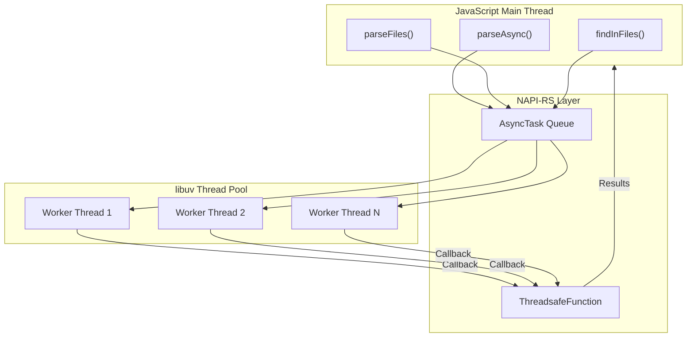
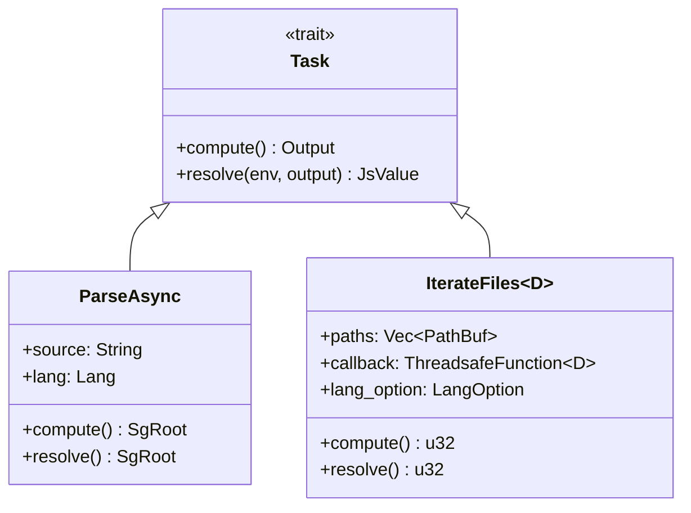
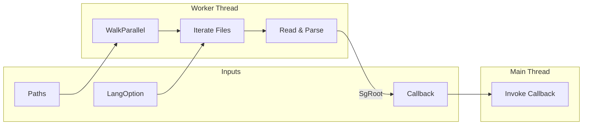
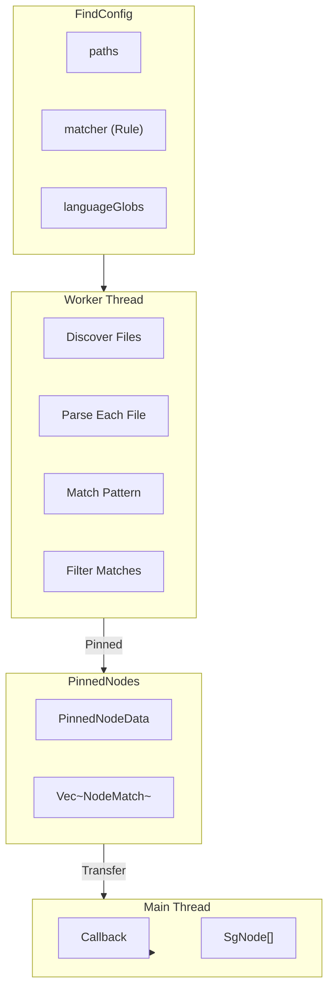

# Async Operations

> Relevant source files:
> - [crates/napi/__test__/index.spec.ts](https://github.com/ast-grep/ast-grep/blob/3ae01aec/crates/napi/__test__/index.spec.ts)
> - [crates/napi/index.d.ts](https://github.com/ast-grep/ast-grep/blob/3ae01aec/crates/napi/index.d.ts)
> - [crates/napi/index.js](https://github.com/ast-grep/ast-grep/blob/3ae01aec/crates/napi/index.js)
> - [crates/napi/src/find_files.rs](https://github.com/ast-grep/ast-grep/blob/3ae01aec/crates/napi/src/find_files.rs)
> - [crates/napi/src/lib.rs](https://github.com/ast-grep/ast-grep/blob/3ae01aec/crates/napi/src/lib.rs)
> - [crates/napi/src/sg_node.rs](https://github.com/ast-grep/ast-grep/blob/3ae01aec/crates/napi/src/sg_node.rs)

## Purpose and Scope

This document describes the asynchronous operations provided by the `@ast-grep/napi` Node.js bindings. These operations leverage Node.js's libuv thread pool to perform CPU-intensive parsing and searching tasks without blocking the JavaScript event loop.

For the general NAPI API reference, see [NAPI API Reference](7.1-napi-api-reference.md). For language-specific modules, see [Language Modules](7.4-language-modules.md).

## Overview

The NAPI bindings expose three categories of asynchronous operations:

| Operation | Purpose | Return Type | Key Use Case |
|---|---|---|---|
| `parseAsync` | Parse single file asynchronously | `Promise<SgRoot>` | Parsing large files without blocking |
| `parseFiles` | Discover and parse multiple files | `Promise<number>` with callbacks | Batch file processing |
| `findInFiles` | Search for patterns across files | `Promise<number>` with callbacks | Multi-file code search |

All async operations utilize NAPI-RS's `AsyncTask` mechanism and Node.js's worker thread pool. They are designed to maximize throughput when processing multiple files concurrently while maintaining JavaScript event loop responsiveness.



**Sources**: [crates/napi/src/lib.rs74-83](https://github.com/ast-grep/ast-grep/blob/3ae01aec/crates/napi/src/lib.rs#L74-L83) [crates/napi/src/find_files.rs17-73](https://github.com/ast-grep/ast-grep/blob/3ae01aec/crates/napi/src/find_files.rs#L17-L73)

## AsyncTask Architecture

The `Task` trait from NAPI-RS defines the async operation interface:



- **`compute()`**: Runs on worker thread, performs CPU-intensive work
- **`resolve()`**: Runs on main thread, converts Rust result to JavaScript value
- **`Output`**: Rust type produced by `compute()`
- **`JsValue`**: JavaScript type returned to caller

**Sources**: [crates/napi/src/find_files.rs22-34](https://github.com/ast-grep/ast-grep/blob/3ae01aec/crates/napi/src/find_files.rs#L22-L34) [crates/napi/src/find_files.rs45-73](https://github.com/ast-grep/ast-grep/blob/3ae01aec/crates/napi/src/find_files.rs#L45-L73)

## ParseAsync - Single File Parsing

The `parseAsync` function provides asynchronous parsing for individual source files. This is useful when parsing large files that might block the event loop if done synchronously.

### Implementation

The `ParseAsync` task is defined in [crates/napi/src/find_files.rs17-34](https://github.com/ast-grep/ast-grep/blob/3ae01aec/crates/napi/src/find_files.rs#L17-L34):

- **Struct fields**: Owns the source string and language identifier
- **`compute()`**: Moves ownership of source string, creates `JsDoc`, wraps in `AstGrep`
- **`resolve()`**: Passes through the `SgRoot` unchanged (already JavaScript-compatible)

### Usage Patterns

From the API surface [crates/napi/src/lib.rs74-83](https://github.com/ast-grep/ast-grep/blob/3ae01aec/crates/napi/src/lib.rs#L74-L83):

```typescript
// Using language-specific module
const sg = await js.parseAsync('console.log("hello")');

// Generic method with language parameter
const sg = await parseAsync('def foo(): pass', Lang.Python);
```

The language-specific modules use the `impl_lang_mod!` macro [crates/napi/src/lib.rs21-53](https://github.com/ast-grep/ast-grep/blob/3ae01aec/crates/napi/src/lib.rs#L21-L53) to generate `parseAsync` wrappers that bind the language parameter.

**Performance Note**: From the JSDoc comment [crates/napi/src/lib.rs75-78](https://github.com/ast-grep/ast-grep/blob/3ae01aec/crates/napi/src/lib.rs#L75-L78) `parseAsync` utilizes multiple CPU cores when processing **concurrent** sources. However, spawning excessive threads may backfire due to libuv's thread pool limits.

**Sources**: [crates/napi/src/lib.rs74-83](https://github.com/ast-grep/ast-grep/blob/3ae01aec/crates/napi/src/lib.rs#L74-L83) [crates/napi/src/find_files.rs17-34](https://github.com/ast-grep/ast-grep/blob/3ae01aec/crates/napi/src/find_files.rs#L17-L34) [crates/napi/__test__/index.spec.ts21-33](https://github.com/ast-grep/ast-grep/blob/3ae01aec/crates/napi/__test__/index.spec.ts#L21-L33)

## ParseFiles - Multi-File Processing

The `parseFiles` function discovers files recursively and parses each one, invoking a JavaScript callback for every successfully parsed file.

### Task Structure

The `IterateFiles<D>` generic task [crates/napi/src/find_files.rs38-73](https://github.com/ast-grep/ast-grep/blob/3ae01aec/crates/napi/src/find_files.rs#L38-L73) encapsulates the file iteration pattern:



- **`WalkParallel`**: From the `ignore` crate, provides parallel directory traversal
- **`LangOption`**: Either inferred from file extensions or specified explicitly
- **`ThreadsafeFunction<D>`**: Enables calling JavaScript from worker threads
- **`producer`**: Function pointer determining what to do with each entry

### ParseFiles Implementation

For `parseFiles` specifically [crates/napi/src/find_files.rs80-111](https://github.com/ast-grep/ast-grep/blob/3ae01aec/crates/napi/src/find_files.rs#L80-L111):

| Component | Type | Purpose |
|---|---|---|
| D (Generic) | `ThreadsafeFunction<SgRoot, ()>` | Callback receiving parsed trees |
| producer | `call_sg_root` | Creates `SgRoot` and invokes callback |
| Output | `u32` | Count of successfully processed files |

The `call_sg_root` function [crates/napi/src/find_files.rs114-131](https://github.com/ast-grep/ast-grep/blob/3ae01aec/crates/napi/src/find_files.rs#L114-L131):

1. Filters non-file entries
2. Reads file content as string
3. Infers language from file path
4. Creates `JsDoc` and `AstGrep<JsDoc>`
5. Wraps in `SgRoot` with filename
6. Calls `tsfn.call()` in **blocking mode**

### File Discovery Options

The `FileOption` struct [crates/napi/src/find_files.rs83-86](https://github.com/ast-grep/ast-grep/blob/3ae01aec/crates/napi/src/find_files.rs#L83-L86) allows customizing which files are discovered:

```typescript
interface FileOption {
  paths: string[];           // Directories/files to search
  languageGlobs?: Record<string, string[]>;  // Custom file extension mappings
}
```

**Sources**: [crates/napi/src/find_files.rs38-111](https://github.com/ast-grep/ast-grep/blob/3ae01aec/crates/napi/src/find_files.rs#L38-L111) [crates/napi/__test__/index.spec.ts165-205](https://github.com/ast-grep/ast-grep/blob/3ae01aec/crates/napi/__test__/index.spec.ts#L165-L205)

## FindInFiles - Pattern-Based Search

The `findInFiles` function combines file discovery with pattern matching, only invoking the callback when matches are found. This is more efficient than `parseFiles` when searching for specific patterns.

### Architecture



### Key Type Definitions

**FindConfig** [crates/napi/src/find_files.rs153-162](https://github.com/ast-grep/ast-grep/blob/3ae01aec/crates/napi/src/find_files.rs#L153-L162):

```typescript
interface FindConfig {
  paths: string[];
  matcher: {
    rule: object;       // Rule configuration
    utils?: object;     // Utility rules
  };
  languageGlobs?: Record<string, string[]>;
}
```

**FindInFiles Task Type** [crates/napi/src/find_files.rs143](https://github.com/ast-grep/ast-grep/blob/3ae01aec/crates/napi/src/find_files.rs#L143-L143):

```rust
type FindInFiles = IterateFiles<(ThreadsafeFunction<SgNode>, Rule<JsDoc>)>;
```

Note the tuple in the generic parameter: combines the callback function with the compiled rule.

### PinnedNodes Memory Safety

The `PinnedNodes` struct [crates/napi/src/find_files.rs145-150](https://github.com/ast-grep/ast-grep/blob/3ae01aec/crates/napi/src/find_files.rs#L145-L150) addresses a critical challenge: safely transferring AST nodes from Rust worker threads to JavaScript's main thread.

**Problem**: `NodeMatch` contains references to the `AstGrep` tree, which must remain valid when the callback executes.

**Solution**: `PinnedNodeData<JsDoc, Vec<NodeMatch>>` from `ast-grep-core` pins the tree data in memory, allowing safe transfer across thread boundaries. The wrapper type explicitly implements `Send` and `Sync` as `unsafe` because it guarantees the invariants externally.

### Callback Conversion

The `from_pinned_data` function [crates/napi/src/find_files.rs189-206](https://github.com/ast-grep/ast-grep/blob/3ae01aec/crates/napi/src/find_files.rs#L189-L206) unpacks the pinned data on the JavaScript main thread:

1. Extract raw `AstGrep` and `Vec<NodeMatch>` from `PinnedNodeData`
2. Create `SgRoot` reference
3. For each `NodeMatch`, create shared `SgNode` using `share_with()`
4. Use `readopt()` to restore tree-sitter node pointers
5. Return vector of `SgNode` instances to JavaScript

This conversion is specified as the `build_callback` parameter when creating the `ThreadsafeFunction` [crates/napi/src/find_files.rs169-172](https://github.com/ast-grep/ast-grep/blob/3ae01aec/crates/napi/src/find_files.rs#L169-L172)

**Sources**: [crates/napi/src/find_files.rs143-231](https://github.com/ast-grep/ast-grep/blob/3ae01aec/crates/napi/src/find_files.rs#L143-L231) [crates/napi/__test__/index.spec.ts230-341](https://github.com/ast-grep/ast-grep/blob/3ae01aec/crates/napi/__test__/index.spec.ts#L230-L341)

## ThreadsafeFunction and Callbacks

`ThreadsafeFunction` is the mechanism for invoking JavaScript functions from Rust worker threads. It's central to both `parseFiles` and `findInFiles`.

### Creation Pattern

From [crates/napi/src/find_files.rs93-96](https://github.com/ast-grep/ast-grep/blob/3ae01aec/crates/napi/src/find_files.rs#L93-L96) and [crates/napi/src/find_files.rs169-172](https://github.com/ast-grep/ast-grep/blob/3ae01aec/crates/napi/src/find_files.rs#L169-L172):

```rust
let tsfn = callback
    .build_threadsafe_function()
    .callee_handled()
    .build_callback(from_pinned_data)?
    .build()?;
```

**callee_handled()**: Indicates that the JavaScript callback handles errors internally (doesn't throw).

### Invocation Modes

The `call()` method accepts a `ThreadsafeFunctionCallMode`:

| Mode | Behavior | Use Case |
|---|---|---|
| `Blocking` | Waits if queue is full | Used in ast-grep [crates/napi/src/find_files.rs129](https://github.com/ast-grep/ast-grep/blob/3ae01aec/crates/napi/src/find_files.rs#L129-L129) |
| `NonBlocking` | Returns error if queue full | Not used in current implementation |

The blocking mode ensures that all files are processed, even if the JavaScript callback is slow. This prevents dropping results but can cause backpressure if callbacks don't keep up.

### Error Handling

Both `parseFiles` and `findInFiles` wrap the result in `Ok()` when calling the `ThreadsafeFunction`:

```rust
tsfn.call(Ok(data), ThreadsafeFunctionCallMode::Blocking);
```

This makes the first callback parameter an error (which is `null` on success), following Node.js error-first callback convention. JavaScript receives `(err, result)`.

**Sources**: [crates/napi/src/find_files.rs93-96](https://github.com/ast-grep/ast-grep/blob/3ae01aec/crates/napi/src/find_files.rs#L93-L96) [crates/napi/src/find_files.rs129](https://github.com/ast-grep/ast-grep/blob/3ae01aec/crates/napi/src/find_files.rs#L129-L129) [crates/napi/src/find_files.rs169-172](https://github.com/ast-grep/ast-grep/blob/3ae01aec/crates/napi/src/find_files.rs#L169-L172) [crates/napi/src/find_files.rs228](https://github.com/ast-grep/ast-grep/blob/3ae01aec/crates/napi/src/find_files.rs#L228-L228)

## Usage Examples

### Async Parsing

From [crates/napi/__test__/index.spec.ts21-33](https://github.com/ast-grep/ast-grep/blob/3ae01aec/crates/napi/__test__/index.spec.ts#L21-L33):

```typescript
import { js } from '@ast-grep/napi';

// Parse asynchronously
const sg = await js.parseAsync('console.log("hello world")');

// Search for pattern
const matches = sg.root().findAll('console.log($MSG)');
console.log(`Found ${matches.length} matches`);
```

### Batch File Processing

From [crates/napi/__test__/index.spec.ts173-183](https://github.com/ast-grep/ast-grep/blob/3ae01aec/crates/napi/__test__/index.spec.ts#L173-L183):

```typescript
import { parseFiles, Lang } from '@ast-grep/napi';

let count = 0;
await parseFiles(
  { paths: ['./src'] },
  Lang.TypeScript,
  (err, root) => {
    if (!err) {
      count++;
      // Process parsed file
      console.log(root.filename());
    }
  }
);
console.log(`Parsed ${count} files`);
```

### Pattern Search Across Files

From [crates/napi/__test__/index.spec.ts230-248](https://github.com/ast-grep/ast-grep/blob/3ae01aec/crates/napi/__test__/index.spec.ts#L230-L248):

```typescript
import { findInFiles, Lang } from '@ast-grep/napi';

await findInFiles(
  {
    paths: ['./src'],
    matcher: {
      rule: { pattern: 'console.log($MSG)' }
    }
  },
  Lang.JavaScript,
  (err, nodes) => {
    if (!err) {
      nodes.forEach(node => {
        console.log(`Found at ${node.filename()}:${node.range().start.line}`);
      });
    }
  }
);
```

### Custom Language Globs

From [crates/napi/__test__/index.spec.ts323-341](https://github.com/ast-grep/ast-grep/blob/3ae01aec/crates/napi/__test__/index.spec.ts#L323-L341):

```typescript
await parseFiles(
  {
    paths: ['./project'],
    languageGlobs: {
      typescript: ['.ts', '.tsx', '.mts'],
      javascript: ['.js', '.cjs', '.mjs']
    }
  },
  Lang.TypeScript,
  callback
);
```

**Sources**: [crates/napi/__test__/index.spec.ts21-341](https://github.com/ast-grep/ast-grep/blob/3ae01aec/crates/napi/__test__/index.spec.ts#L21-L341)

## Performance Considerations

### Thread Pool Sizing

The libuv thread pool (used by Node.js for async operations) has a default size of 4 threads. When using `parseAsync`, `parseFiles`, or `findInFiles` concurrently, consider:

- **Too few tasks**: Underutilizes CPU cores
- **Too many tasks**: Thread contention and context switching overhead
- **Tuning**: Set `UV_THREADPOOL_SIZE` environment variable (up to 1024)

From [crates/napi/src/lib.rs75-78](https://github.com/ast-grep/ast-grep/blob/3ae01aec/crates/napi/src/lib.rs#L75-L78):

> It utilize multiple CPU cores when **concurrent processing sources**. However, spawning excessive many threads may backfire.

### Callback Performance

The `countedPromise` test helper [crates/napi/__test__/index.spec.ts353-375](https://github.com/ast-grep/ast-grep/blob/3ae01aec/crates/napi/__test__/index.spec.ts#L353-L375) demonstrates handling asynchronous callbacks:

```typescript
function countedPromise() {
  let pending = 0;
  let resolve: () => void;
  const promise = new Promise<void>(r => { resolve = r; });
  
  return {
    increment: () => { pending++; },
    decrement: () => { if (--pending === 0) resolve(); },
    promise
  };
}
```

This pattern waits for all callbacks to complete before resolving, useful for testing and ensuring all work is done.

### Blocking Call Mode

Both `parseFiles` and `findInFiles` use `ThreadsafeFunctionCallMode::Blocking` [crates/napi/src/find_files.rs129](https://github.com/ast-grep/ast-grep/blob/3ae01aec/crates/napi/src/find_files.rs#L129-L129) [crates/napi/src/find_files.rs228](https://github.com/ast-grep/ast-grep/blob/3ae01aec/crates/napi/src/find_files.rs#L228-L228) This ensures reliable delivery but means:

- Slow JavaScript callbacks block Rust worker threads
- Worker threads wait if callback queue is full
- Consider lightweight callbacks that queue work for later processing

**Sources**: [crates/napi/src/lib.rs75-78](https://github.com/ast-grep/ast-grep/blob/3ae01aec/crates/napi/src/lib.rs#L75-L78) [crates/napi/src/find_files.rs129](https://github.com/ast-grep/ast-grep/blob/3ae01aec/crates/napi/src/find_files.rs#L129-L129) [crates/napi/src/find_files.rs228](https://github.com/ast-grep/ast-grep/blob/3ae01aec/crates/napi/src/find_files.rs#L228-L228) [crates/napi/__test__/index.spec.ts353-375](https://github.com/ast-grep/ast-grep/blob/3ae01aec/crates/napi/__test__/index.spec.ts#L353-L375)

## Platform-Specific Loading

The async operations are implemented in native code that must be loaded differently per platform. The [crates/napi/index.js](https://github.com/ast-grep/ast-grep/blob/3ae01aec/crates/napi/index.js) file handles this with extensive platform detection.

### Loading Strategy

The loading logic [crates/napi/index.js66-381](https://github.com/ast-grep/ast-grep/blob/3ae01aec/crates/napi/index.js#L66-L381) attempts multiple strategies:

1. **Environment override**: `NAPI_RS_NATIVE_LIBRARY_PATH`
2. **Platform-specific local**: `./ast-grep-napi.{platform}-{arch}.node`
3. **Platform-specific package**: `@ast-grep/napi-{platform}-{arch}`
4. **WASI fallback**: WebAssembly System Interface for maximum compatibility

For details on the package distribution strategy, see [Package Structure](7.2-package-structure.md).

**Sources**: [crates/napi/index.js66-395](https://github.com/ast-grep/ast-grep/blob/3ae01aec/crates/napi/index.js#L66-L395)
