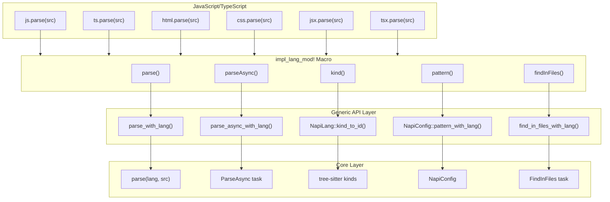
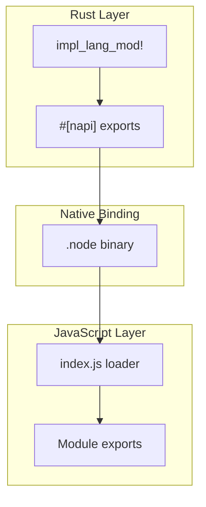

# Language Modules

> Relevant source files:
> - [crates/napi/__test__/index.spec.ts](https://github.com/ast-grep/ast-grep/blob/3ae01aec/crates/napi/__test__/index.spec.ts)
> - [crates/napi/index.d.ts](https://github.com/ast-grep/ast-grep/blob/3ae01aec/crates/napi/index.d.ts)
> - [crates/napi/index.js](https://github.com/ast-grep/ast-grep/blob/3ae01aec/crates/napi/index.js)
> - [crates/napi/src/find_files.rs](https://github.com/ast-grep/ast-grep/blob/3ae01aec/crates/napi/src/find_files.rs)
> - [crates/napi/src/lib.rs](https://github.com/ast-grep/ast-grep/blob/3ae01aec/crates/napi/src/lib.rs)
> - [crates/napi/src/sg_node.rs](https://github.com/ast-grep/ast-grep/blob/3ae01aec/crates/napi/src/sg_node.rs)

## Purpose and Scope

Language modules provide language-specific convenience APIs for JavaScript/TypeScript development. Each module exposes the same set of methods (`parse`, `parseAsync`, `kind`, `pattern`, `findInFiles`) pre-configured for a specific programming language, eliminating the need to pass language strings to the generic API functions.

For information about the general-purpose NAPI API that accepts language parameters, see [NAPI API Reference](7.1-napi-api-reference.md). For details on async operation mechanics, see [Async Operations](7.3-async-operations.md).

**Sources:** [crates/napi/src/lib.rs21-66](https://github.com/ast-grep/ast-grep/blob/3ae01aec/crates/napi/src/lib.rs#L21-L66) [crates/napi/index.d.ts1-15](https://github.com/ast-grep/ast-grep/blob/3ae01aec/crates/napi/index.d.ts#L1-L15)

## Module Generation Architecture

All language modules are generated using the `impl_lang_mod!` declarative macro, which creates identical API surfaces for each supported language.

### Macro Definition

The macro takes two parameters: a module name (used as the JavaScript export name) and a `SupportLang` enum variant:

```rust
macro_rules! impl_lang_mod {
    ($name:ident, $lang:ident) => {
        #[napi(js_name = $name)]
        pub mod $name {
            use super::*;

            #[napi]
            pub fn parse(src: String) -> Result<SgRoot> {
                parse_with_lang(SupportLang::$lang.to_string(), src)
            }

            #[napi]
            pub async fn parse_async(src: String) -> Result<SgRoot> {
                parse_async_with_lang(SupportLang::$lang.to_string(), src).await
            }

            #[napi]
            pub fn kind(kind_name: String) -> u16 {
                NapiLang::from(SupportLang::$lang).kind_to_id(&kind_name)
            }

            #[napi]
            pub fn pattern(pattern: String) -> NapiConfig {
                NapiConfig::pattern_with_lang(
                    pattern,
                    SupportLang::$lang.to_string(),
                )
            }

            #[napi(ts_args_type = "config: FindConfig, callback: (err: null | Error, nodes: SgNode[]) => void")]
            pub fn find_in_files(config: FindConfig, callback: JsFunction) -> Result<AsyncTask<FindInFiles>> {
                find_in_files_with_lang(SupportLang::$lang.to_string(), config, callback)
            }
        }
    };
}
```

**Sources:** [crates/napi/src/lib.rs21-53](https://github.com/ast-grep/ast-grep/blob/3ae01aec/crates/napi/src/lib.rs#L21-L53)

### Module Instantiation

Six language modules are instantiated at compile time:

| Module | SupportLang Variant | Primary Use Case |
|---|---|---|
| `html` | `Html` | HTML documents, Vue templates |
| `js` | `JavaScript` | JavaScript files |
| `jsx` | `JavaScript` | JSX/React files (uses JavaScript parser) |
| `ts` | `TypeScript` | TypeScript files |
| `tsx` | `Tsx` | TSX/React TypeScript files |
| `css` | `Css` | CSS stylesheets |

**Sources:** [crates/napi/src/lib.rs60-65](https://github.com/ast-grep/ast-grep/blob/3ae01aec/crates/napi/src/lib.rs#L60-L65) [crates/napi/index.js406-411](https://github.com/ast-grep/ast-grep/blob/3ae01aec/crates/napi/index.js#L406-L411)

### Architecture Diagram



**Sources:** [crates/napi/src/lib.rs21-66](https://github.com/ast-grep/ast-grep/blob/3ae01aec/crates/napi/src/lib.rs#L21-L66) [crates/napi/src/napi_lang.rs](https://github.com/ast-grep/ast-grep/blob/3ae01aec/crates/napi/src/napi_lang.rs)

## API Methods

Each language module provides five methods, all of which wrap their generic counterparts with a pre-configured language parameter.

### parse()

Synchronously parses source code into an `SgRoot` instance.

**Implementation:** Each module calls `parse_with_lang(SupportLang::$lang.to_string(), src)` which invokes the generic `parse()` function at [crates/napi/src/lib.rs69-72](https://github.com/ast-grep/ast-grep/blob/3ae01aec/crates/napi/src/lib.rs#L69-L72)

**Example:**

```typescript
import { js, ts, html } from '@ast-grep/napi';

// Parse JavaScript
const jsRoot = js.parse('const x = 1;');

// Parse TypeScript
const tsRoot = ts.parse('interface Foo { bar: string }');

// Parse HTML
const htmlRoot = html.parse('<div class="test">Hello</div>');
```

**Sources:** [crates/napi/src/lib.rs28-30](https://github.com/ast-grep/ast-grep/blob/3ae01aec/crates/napi/src/lib.rs#L28-L30) [crates/napi/__test__/index.spec.ts7-19](https://github.com/ast-grep/ast-grep/blob/3ae01aec/crates/napi/__test__/index.spec.ts#L7-L19)

### parseAsync()

Asynchronously parses source code in a background thread, returning a Promise.

**Implementation:** Delegates to `parse_async_with_lang()` which creates a `ParseAsync` task executed via NAPI's `AsyncTask` mechanism.

**Example:**

```typescript
import { js } from '@ast-grep/napi';

// Non-blocking parse for large files
const root = await js.parseAsync(largeSourceCode);

// Process multiple files concurrently
const results = await Promise.all([
  js.parseAsync(file1),
  js.parseAsync(file2),
  js.parseAsync(file3),
]);
```

**Sources:** [crates/napi/src/lib.rs32-35](https://github.com/ast-grep/ast-grep/blob/3ae01aec/crates/napi/src/lib.rs#L32-L35) [crates/napi/__test__/index.spec.ts21-33](https://github.com/ast-grep/ast-grep/blob/3ae01aec/crates/napi/__test__/index.spec.ts#L21-L33) [crates/napi/src/find_files.rs17-34](https://github.com/ast-grep/ast-grep/blob/3ae01aec/crates/napi/src/find_files.rs#L17-L34)

### kind()

Returns the numeric node kind ID for a given kind name in the language's grammar.

**Implementation:** Calls the language's `kind_to_id()` method via `NapiLang`.

**Example:**

```typescript
import { js, ts } from '@ast-grep/napi';

// Get kind IDs for filtering nodes
const identifierKind = js.kind('identifier');  // e.g., 198
const stringKind = js.kind('string');          // e.g., 12

// TypeScript-specific kinds
const interfaceKind = ts.kind('interface_declaration');
const typeKind = ts.kind('type_alias_declaration');
```

**Sources:** [crates/napi/src/lib.rs36-39](https://github.com/ast-grep/ast-grep/blob/3ae01aec/crates/napi/src/lib.rs#L36-L39) [crates/napi/__test__/index.spec.ts145-152](https://github.com/ast-grep/ast-grep/blob/3ae01aec/crates/napi/__test__/index.spec.ts#L145-L152)

### pattern()

Creates a `NapiConfig` object with a pattern rule for the specific language.

**Implementation:** Constructs a `NapiConfig` with the pattern as a JSON rule and the language pre-set.

**Example:**

```typescript
import { js, ts } from '@ast-grep/napi';

// Create language-specific pattern configs
const consolePattern = js.pattern('console.log($MSG)');
const interfacePattern = ts.pattern('interface $NAME { $$$BODY }');

// Use with find operations
const root = js.parse('console.log("test")');
const matches = root.root().find(consolePattern);
```

**Sources:** [crates/napi/src/lib.rs40-43](https://github.com/ast-grep/ast-grep/blob/3ae01aec/crates/napi/src/lib.rs#L40-L43) [crates/napi/src/lib.rs94-105](https://github.com/ast-grep/ast-grep/blob/3ae01aec/crates/napi/src/lib.rs#L94-L105)

### findInFiles()

Searches for pattern matches across multiple files asynchronously, invoking a callback for each file with matches.

**Implementation:** Creates a `FindInFiles` async task that walks the file system in parallel, parses files with the configured language, and invokes the callback with matching nodes.

**Example:**

```typescript
import { js } from '@ast-grep/napi';

await js.findInFiles(
  {
    paths: ['./src'],
    matcher: {
      rule: { pattern: 'console.log($MSG)' }
    }
  },
  (err, nodes) => {
    if (!err) {
      nodes.forEach(node => {
        console.log(`Found at ${node.filename()}:${node.range().start.line}`);
      });
    }
  }
);
```

**Sources:** [crates/napi/src/lib.rs44-50](https://github.com/ast-grep/ast-grep/blob/3ae01aec/crates/napi/src/lib.rs#L44-L50) [crates/napi/__test__/index.spec.ts230-248](https://github.com/ast-grep/ast-grep/blob/3ae01aec/crates/napi/__test__/index.spec.ts#L230-L248) [crates/napi/src/find_files.rs143-186](https://github.com/ast-grep/ast-grep/blob/3ae01aec/crates/napi/src/find_files.rs#L143-L186)

## Usage Patterns

### Language Modules vs Generic API

The language modules provide ergonomic shortcuts when working with a single language. The table below compares equivalent operations:

| Operation | Generic API | Language Module |
|---|---|---|
| Parse | `parse('JavaScript', src)` | `js.parse(src)` |
| Get kind | `kind('JavaScript', 'identifier')` | `js.kind('identifier')` |
| Pattern | `pattern('JavaScript', 'foo($A)')` | `js.pattern('foo($A)')` |
| Find in files | `findInFiles('JavaScript', config, cb)` | `js.findInFiles(config, cb)` |

**Sources:** [crates/napi/src/lib.rs69-119](https://github.com/ast-grep/ast-grep/blob/3ae01aec/crates/napi/src/lib.rs#L69-L119) [crates/napi/__test__/index.spec.ts1-462](https://github.com/ast-grep/ast-grep/blob/3ae01aec/crates/napi/__test__/index.spec.ts#L1-L462)

### File Discovery with Language Globs

The `findInFiles()` method respects the `languageGlobs` option to override default file extension matching:

```typescript
import { html } from '@ast-grep/napi';

// Parse Vue SFC files as HTML
await html.findInFiles(
  {
    paths: ['./src'],
    languageGlobs: {
      html: ['.vue', '.html', '.htm']
    },
    matcher: { rule: { pattern: '<script>$BODY</script>' } }
  },
  callback
);
```

This is particularly useful for:

- Parsing Vue SFC files with the HTML parser
- Treating custom extensions as TypeScript (e.g., `.mts`, `.cts`)
- Applying language parsers to non-standard file extensions

**Sources:** [crates/napi/__test__/index.spec.ts323-341](https://github.com/ast-grep/ast-grep/blob/3ae01aec/crates/napi/__test__/index.spec.ts#L323-L341) [crates/napi/src/find_files.rs152-162](https://github.com/ast-grep/ast-grep/blob/3ae01aec/crates/napi/src/find_files.rs#L152-L162)

### Multiple Languages with Different Modules

Each module operates independently with its own file extension defaults:

```typescript
import { js, ts, css } from '@ast-grep/napi';

// Search JavaScript files for console calls
await js.findInFiles({ paths: ['./src'], matcher: { rule: { pattern: 'console.log($A)' } } }, jsCallback);

// Search TypeScript files for interface declarations
await ts.findInFiles({ paths: ['./src'], matcher: { rule: { pattern: 'interface $NAME {$BODY}' } } }, tsCallback);

// Search CSS files for hardcoded colors
await css.findInFiles({ paths: ['./src'], matcher: { rule: { pattern: 'color: $COLOR' } } }, cssCallback);
```

**Sources:** [crates/napi/__test__/index.spec.ts290-303](https://github.com/ast-grep/ast-grep/blob/3ae01aec/crates/napi/__test__/index.spec.ts#L290-L303)

## Implementation Details

### Macro Expansion

The `impl_lang_mod!` macro expands to a module containing five NAPI-exported functions. For example, `impl_lang_mod!(js, JavaScript)` expands to:

```rust
#[napi(js_name = "js")]
pub mod js {
    use super::*;

    #[napi]
    pub fn parse(src: String) -> Result<SgRoot> {
        parse_with_lang(SupportLang::JavaScript.to_string(), src)
    }

    #[napi]
    pub async fn parse_async(src: String) -> Result<SgRoot> {
        parse_async_with_lang(SupportLang::JavaScript.to_string(), src).await
    }

    #[napi]
    pub fn kind(kind_name: String) -> u16 {
        NapiLang::from(SupportLang::JavaScript).kind_to_id(&kind_name)
    }

    #[napi]
    pub fn pattern(pattern: String) -> NapiConfig {
        NapiConfig::pattern_with_lang(pattern, SupportLang::JavaScript.to_string())
    }

    #[napi(ts_args_type = "config: FindConfig, callback: (err: null | Error, nodes: SgNode[]) => void")]
    pub fn find_in_files(config: FindConfig, callback: JsFunction) -> Result<AsyncTask<FindInFiles>> {
        find_in_files_with_lang(SupportLang::JavaScript.to_string(), config, callback)
    }
}
```

The macro relies on imported generic functions (`parse_with_lang`, `parse_async_with_lang`, etc.) which are aliased to avoid name conflicts at [crates/napi/src/lib.rs55-59](https://github.com/ast-grep/ast-grep/blob/3ae01aec/crates/napi/src/lib.rs#L55-L59)

**Sources:** [crates/napi/src/lib.rs21-53](https://github.com/ast-grep/ast-grep/blob/3ae01aec/crates/napi/src/lib.rs#L21-L53) [crates/napi/src/lib.rs55-59](https://github.com/ast-grep/ast-grep/blob/3ae01aec/crates/napi/src/lib.rs#L55-L59)

### Type Conversions

The module functions perform several type conversions:


1. **SupportLang → String**: The enum variant is converted to its string representation via `to_string()`
2. **String → NapiLang**: Generic functions parse the string using `FromStr` implementation
3. **NapiLang → tree_sitter::Language**: The `NapiLang` provides the tree-sitter parser instance

**Sources:** [crates/napi/src/lib.rs28-50](https://github.com/ast-grep/ast-grep/blob/3ae01aec/crates/napi/src/lib.rs#L28-L50) [crates/napi/src/napi_lang.rs](https://github.com/ast-grep/ast-grep/blob/3ae01aec/crates/napi/src/napi_lang.rs)

### JSX/JavaScript Aliasing

Note that both `js` and `jsx` modules use the same `SupportLang::JavaScript` variant, as JSX is handled by the JavaScript parser:

```rust
impl_lang_mod!(js, JavaScript);
impl_lang_mod!(jsx, JavaScript);  // Same parser, different export name
```

This allows users to choose a semantically appropriate module name while using the same underlying parser.

**Sources:** [crates/napi/src/lib.rs61-62](https://github.com/ast-grep/ast-grep/blob/3ae01aec/crates/napi/src/lib.rs#L61-L62)

### Export Structure

Language modules are exported in three layers:



1. **Rust binding**: Generated by `napi-rs` from the `#[napi]` module definitions
2. **JavaScript loader**: Platform-specific native binding loaded in [crates/napi/index.js395-411](https://github.com/ast-grep/ast-grep/blob/3ae01aec/crates/napi/index.js#L395-L411)
3. **TypeScript types**: Re-exported from language-specific type modules (implied by module structure)

**Sources:** [crates/napi/index.js406-411](https://github.com/ast-grep/ast-grep/blob/3ae01aec/crates/napi/index.js#L406-L411) [crates/napi/index.d.ts9](https://github.com/ast-grep/ast-grep/blob/3ae01aec/crates/napi/index.d.ts#L9-L9)
