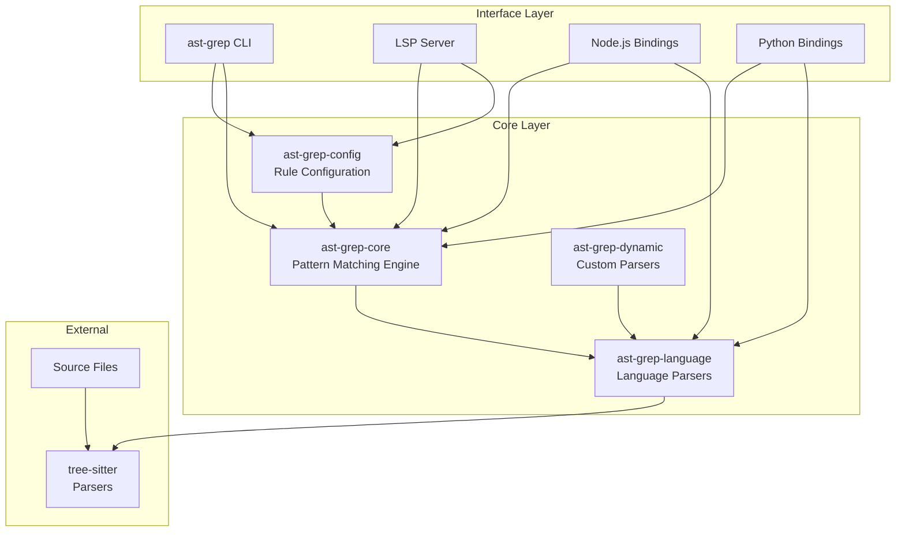
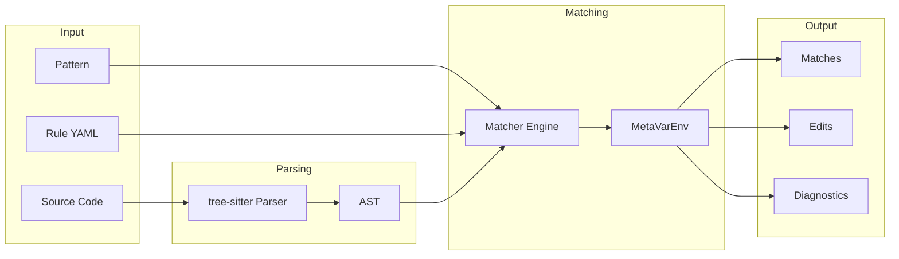

# Overview

> **Source:** https://deepwiki.com/ast-grep/ast-grep/1-overview

**Relevant source files:**

- [CHANGELOG.md](https://github.com/ast-grep/ast-grep/blob/3ae01aec/CHANGELOG.md)
- [Cargo.lock](https://github.com/ast-grep/ast-grep/blob/3ae01aec/Cargo.lock)
- [Cargo.toml](https://github.com/ast-grep/ast-grep/blob/3ae01aec/Cargo.toml)
- [crates/cli/Cargo.toml](https://github.com/ast-grep/ast-grep/blob/3ae01aec/crates/cli/Cargo.toml)
- [crates/cli/src/main.rs](https://github.com/ast-grep/ast-grep/blob/3ae01aec/crates/cli/src/main.rs)
- [crates/config/Cargo.toml](https://github.com/ast-grep/ast-grep/blob/3ae01aec/crates/config/Cargo.toml)
- [crates/core/Cargo.toml](https://github.com/ast-grep/ast-grep/blob/3ae01aec/crates/core/Cargo.toml)
- [crates/lsp/Cargo.toml](https://github.com/ast-grep/ast-grep/blob/3ae01aec/crates/lsp/Cargo.toml)
- [crates/napi/Cargo.toml](https://github.com/ast-grep/ast-grep/blob/3ae01aec/crates/napi/Cargo.toml)

## Purpose and Scope

This document provides a high-level introduction to **ast-grep**, a structural code search and transformation tool that operates on Abstract Syntax Trees (AST). ast-grep enables developers to search, lint, and rewrite code across multiple programming languages using declarative pattern matching instead of regular expressions.

This page covers the overall system architecture and explains how the major components fit together. For detailed information on specific subsystems, see:

- System architecture and crate organization: [System Architecture](./1.1-system-architecture.md)
- Core concepts and terminology: [Key Concepts](./1.2-key-concepts.md)
- Installation and initial setup: [Getting Started](./1.3-getting-started.md)

## What is ast-grep?

ast-grep is a multi-language code search and transformation tool built on tree-sitter parsers. Unlike text-based tools like `grep` or `sed`, ast-grep understands the syntactic structure of code, allowing pattern matching that respects language semantics. The tool supports 23+ programming languages through tree-sitter and can be extended with custom parsers.

The project provides four distinct interfaces to the core matching engine:

- **CLI tool** (`sg` / `ast-grep`): Command-line interface for interactive and batch operations
- **LSP server**: IDE integration via Language Server Protocol
- **Node.js bindings** (`@ast-grep/napi`): JavaScript/TypeScript API
- **Python bindings** (`ast_grep_py`): Python API

## High-Level Architecture

The following diagram shows the major components of ast-grep and their relationships:

**Sources**: [Cargo.toml1-40](https://github.com/ast-grep/ast-grep/blob/3ae01aec/Cargo.toml#L1-L40) [crates/cli/Cargo.toml1-66](https://github.com/ast-grep/ast-grep/blob/3ae01aec/crates/cli/Cargo.toml#L1-L66) [crates/core/Cargo.toml1-26](https://github.com/ast-grep/ast-grep/blob/3ae01aec/crates/core/Cargo.toml#L1-L26) [crates/config/Cargo.toml1-29](https://github.com/ast-grep/ast-grep/blob/3ae01aec/crates/config/Cargo.toml#L1-L29) [crates/lsp/Cargo.toml1-40](https://github.com/ast-grep/ast-grep/blob/3ae01aec/crates/lsp/Cargo.toml#L1-L40) [crates/napi/Cargo.toml1-37](https://github.com/ast-grep/ast-grep/blob/3ae01aec/crates/napi/Cargo.toml#L1-L37)

## Workspace Organization

ast-grep is organized as a Cargo workspace with eight primary crates:

| Crate | Purpose | Key Types |
|-------|---------|-----------|
| `ast-grep-core` | AST matching engine | `Matcher`, `Pattern`, `Node<'r, D>`, `Root<D>` |
| `ast-grep-config` | Rule parsing and validation | `RuleConfig`, `SerializableRuleCore`, `RuleCollection` |
| `ast-grep-language` | Language parser registry | `SupportLang`, `Language` trait, 23+ tree-sitter parsers |
| `ast-grep-dynamic` | Custom parser loading | `CustomLang`, `register_dynamic_language()` |
| `ast-grep-cli` | Command-line interface | `RunArg`, `ScanArg`, `Printer` trait |
| `ast-grep-lsp` | Language Server Protocol | LSP request handlers, `rule_finder` closure |
| `ast-grep-napi` | Node.js bindings | `SgRoot`, `SgNode`, `findInFiles()` |
| `ast-grep-pyo3` | Python bindings | `PyNode`, `PyRoot`, module initialization |

**Sources**: [Cargo.toml1-40](https://github.com/ast-grep/ast-grep/blob/3ae01aec/Cargo.toml#L1-L40) [Cargo.lock105-213](https://github.com/ast-grep/ast-grep/blob/3ae01aec/Cargo.lock#L105-L213)

## Core Engine (`ast-grep-core`)

The `ast-grep-core` crate provides the fundamental pattern matching and tree manipulation capabilities. It defines:

- **`Node<'r, D>`**: A borrowed reference to an AST node with lifetime `'r` bound to document `D`
- **`Root<D>`**: Owned wrapper around a parsed document implementing the `Doc` trait
- **`Matcher` trait**: Common interface for all matching operations (patterns, rules, constraints)
- **`Pattern`**: Concrete implementation for code pattern matching with meta-variables

The core is language-agnostic through the `Doc` trait, which abstracts over tree-sitter's `Tree` type but could support alternative parsers.

**Sources**: [crates/core/Cargo.toml1-26](https://github.com/ast-grep/ast-grep/blob/3ae01aec/crates/core/Cargo.toml#L1-L26) [Cargo.lock155-164](https://github.com/ast-grep/ast-grep/blob/3ae01aec/Cargo.lock#L155-L164)

## Configuration System (`ast-grep-config`)

The `ast-grep-config` crate handles rule definitions and validation:

- **Rule deserialization**: Parses YAML rule files into `SerializableRuleConfig` structures
- **Schema generation**: JSON schemas for IDE autocompletion (via `schemars` crate)
- **Rule compilation**: Converts serializable rules into runtime `RuleCore` matchers
- **Global utilities**: Manages reusable pattern components and transformations

**Sources**: [crates/config/Cargo.toml1-29](https://github.com/ast-grep/ast-grep/blob/3ae01aec/crates/config/Cargo.toml#L1-L29) [Cargo.lock140-152](https://github.com/ast-grep/ast-grep/blob/3ae01aec/Cargo.lock#L140-L152)

## Language Support (`ast-grep-language`)

The `ast-grep-language` crate provides:

- **`SupportLang` enum**: Enumeration of 23+ built-in languages (TypeScript, JavaScript, Python, Rust, Go, Java, C++, C#, etc.)
- **Language aliases**: Multiple file extensions per language (`.ts`/`.tsx`, `.js`/`.jsx`, `.py`/`.pyi`)
- **Parser registry**: Static registration of tree-sitter parsers
- **Expando characters**: Language-specific wildcard handling (e.g., `$` for C++, `µ` for others)

The crate compiles in tree-sitter parser bindings at build time, including `tree-sitter-typescript`, `tree-sitter-rust`, `tree-sitter-python`, etc.

**Sources**: [Cargo.lock180-212](https://github.com/ast-grep/ast-grep/blob/3ae01aec/Cargo.lock#L180-L212)

## User Interface Comparison

| Interface | Use Case | Distribution | Primary Consumer |
|-----------|----------|--------------|------------------|
| CLI (`sg`) | Interactive, CI/CD | npm, PyPI, crates.io, GitHub Releases | Developers |
| LSP | IDE integration | crates.io | Editors (VS Code, Neovim) |
| NAPI | Node.js programs | npm (`@ast-grep/napi`) | JS/TS tooling |
| PyO3 | Python programs | PyPI (`ast_grep_py`) | Python tooling |

**Sources**: [crates/cli/Cargo.toml19-66](https://github.com/ast-grep/ast-grep/blob/3ae01aec/crates/cli/Cargo.toml#L19-L66) [crates/lsp/Cargo.toml1-40](https://github.com/ast-grep/ast-grep/blob/3ae01aec/crates/lsp/Cargo.toml#L1-L40) [crates/napi/Cargo.toml1-37](https://github.com/ast-grep/ast-grep/blob/3ae01aec/crates/napi/Cargo.toml#L1-L37) [Cargo.lock249-261](https://github.com/ast-grep/ast-grep/blob/3ae01aec/Cargo.lock#L249-L261)

## Distribution and Packaging

ast-grep uses a **native compilation** strategy with multiple distribution channels:

### Rust Ecosystem

- Published to **crates.io** as `ast-grep` (CLI), `ast-grep-core`, `ast-grep-config`, etc.
- Installable via `cargo install ast-grep`

### JavaScript/Node.js Ecosystem

- **CLI wrapper**: `@ast-grep/cli` package downloads platform-specific binaries
- **Native bindings**: `@ast-grep/napi` with 9 platform-specific packages (linux-x64-gnu, darwin-arm64, win32-x64-msvc, etc.)
- Built with **napi-rs** for N-API compatibility

### Python Ecosystem

- **CLI wrapper**: `ast_grep_cli` package (maturin-built wheels)
- **Python bindings**: `ast_grep_py` (PyO3-based extension module)
- Published to **PyPI** with platform-specific wheels

### Binary Releases

- GitHub Releases provide raw binaries for 7-9 platforms
- Built using `cargo-zigbuild` for musl targets

**Sources**: [Cargo.toml1-40](https://github.com/ast-grep/ast-grep/blob/3ae01aec/Cargo.toml#L1-L40) [crates/napi/Cargo.toml21-26](https://github.com/ast-grep/ast-grep/blob/3ae01aec/crates/napi/Cargo.toml#L21-L26)

## Data Flow Overview

The following diagram illustrates how source code flows through the system:

## Key File Locations

| Component | Location | Description |
|-----------|----------|-------------|
| CLI entry point | `crates/cli/src/main.rs` | Binary `ast-grep` |
| CLI alias | `crates/cli/src/bin/alias.rs` | Binary `sg` |
| Core matcher | `crates/core/src/` | Matcher trait, Pattern, Node |
| Rule system | `crates/config/src/` | RuleConfig deserialization |
| Language registry | `crates/language/src/` | SupportLang enum |
| LSP server | `crates/lsp/src/` | tower-lsp integration |
| NAPI bindings | `crates/napi/src/` | JavaScript API |
| Python bindings | `crates/pyo3/src/` | Python API |
| Schema generator | `xtask/src/` | JSON schema generation |

**Sources**: [crates/cli/Cargo.toml19-26](https://github.com/ast-grep/ast-grep/blob/3ae01aec/crates/cli/Cargo.toml#L19-L26) [Cargo.toml1-6](https://github.com/ast-grep/ast-grep/blob/3ae01aec/Cargo.toml#L1-L6)

## Next Steps

For more information about specific subsystems:

- [System Architecture](./1.1-system-architecture.md): Detailed crate dependency graph and module organization
- [Key Concepts](./1.2-key-concepts.md): Understanding AST nodes, patterns, matchers, and rules
- [Getting Started](./1.3-getting-started.md): Installation instructions and basic usage examples

For implementation details on individual components:

- [Core Library](../core-library/2-core-library.md): Pattern matching and node manipulation APIs
- [Rule System](../rule-system/3-rule-system.md): Rule configuration format and execution
- [Language Support](../language-support/4-language-support.md): Adding new languages and parser configuration
- [CLI Tool](../cli-tool/5-cli-tool.md): Command-line interface and output formatting
- [Language Server Protocol](../lsp/6-language-server-protocol.md): LSP server for IDE integration
- [Node.js Integration](../nodejs-integration/7-nodejs-integration.md): JavaScript API and NAPI bindings
- [Python Integration](../python-integration/8-python-integration.md): Python API and PyO3 bindings
