# System Architecture

> **Source:** https://deepwiki.com/ast-grep/ast-grep/1.1-system-architecture

**Relevant source files:**

- [CHANGELOG.md](https://github.com/ast-grep/ast-grep/blob/3ae01aec/CHANGELOG.md)
- [Cargo.lock](https://github.com/ast-grep/ast-grep/blob/3ae01aec/Cargo.lock)
- [Cargo.toml](https://github.com/ast-grep/ast-grep/blob/3ae01aec/Cargo.toml)
- [crates/cli/Cargo.toml](https://github.com/ast-grep/ast-grep/blob/3ae01aec/crates/cli/Cargo.toml)
- [crates/config/Cargo.toml](https://github.com/ast-grep/ast-grep/blob/3ae01aec/crates/config/Cargo.toml)
- [crates/config/src/check_var.rs](https://github.com/ast-grep/ast-grep/blob/3ae01aec/crates/config/src/check_var.rs)
- [crates/config/src/rule_config.rs](https://github.com/ast-grep/ast-grep/blob/3ae01aec/crates/config/src/rule_config.rs)
- [crates/config/src/rule_core.rs](https://github.com/ast-grep/ast-grep/blob/3ae01aec/crates/config/src/rule_core.rs)
- [crates/core/Cargo.toml](https://github.com/ast-grep/ast-grep/blob/3ae01aec/crates/core/Cargo.toml)
- [crates/core/src/lib.rs](https://github.com/ast-grep/ast-grep/blob/3ae01aec/crates/core/src/lib.rs)
- [crates/core/src/matcher.rs](https://github.com/ast-grep/ast-grep/blob/3ae01aec/crates/core/src/matcher.rs)
- [crates/core/src/meta_var.rs](https://github.com/ast-grep/ast-grep/blob/3ae01aec/crates/core/src/meta_var.rs)
- [crates/core/src/node.rs](https://github.com/ast-grep/ast-grep/blob/3ae01aec/crates/core/src/node.rs)
- [crates/core/src/replacer.rs](https://github.com/ast-grep/ast-grep/blob/3ae01aec/crates/core/src/replacer.rs)
- [crates/lsp/Cargo.toml](https://github.com/ast-grep/ast-grep/blob/3ae01aec/crates/lsp/Cargo.toml)
- [crates/napi/Cargo.toml](https://github.com/ast-grep/ast-grep/blob/3ae01aec/crates/napi/Cargo.toml)

ast-grep follows a layered architecture where multiple interface crates (`ast-grep`, `ast-grep-lsp`, `ast-grep-napi`, `ast-grep-py`) are built on top of shared core libraries (`ast-grep-core`, `ast-grep-config`, `ast-grep-language`, `ast-grep-dynamic`). This design allows the same pattern matching engine and rule system to be reused across CLI, IDE, and programmatic interfaces.

The architecture centers around three key abstractions in `ast-grep-core`:

- `Root<D: Doc>`: Owns the parsed AST and source document [crates/core/src/node.rs49-112](https://github.com/ast-grep/ast-grep/blob/3ae01aec/crates/core/src/node.rs#L49-L112)
- `Node<'r, D: Doc>`: Provides borrowed views for tree traversal [crates/core/src/node.rs117-188](https://github.com/ast-grep/ast-grep/blob/3ae01aec/crates/core/src/node.rs#L117-L188)
- `Matcher` trait: Defines pattern matching behavior [crates/core/src/matcher.rs24-48](https://github.com/ast-grep/ast-grep/blob/3ae01aec/crates/core/src/matcher.rs#L24-L48)

**Sources:** [Cargo.toml1-40](https://github.com/ast-grep/ast-grep/blob/3ae01aec/Cargo.toml#L1-L40) [crates/core/src/node.rs1-573](https://github.com/ast-grep/ast-grep/blob/3ae01aec/crates/core/src/node.rs#L1-L573) [crates/core/src/matcher.rs1-141](https://github.com/ast-grep/ast-grep/blob/3ae01aec/crates/core/src/matcher.rs#L1-L141)

---

## Layered Architecture Overview

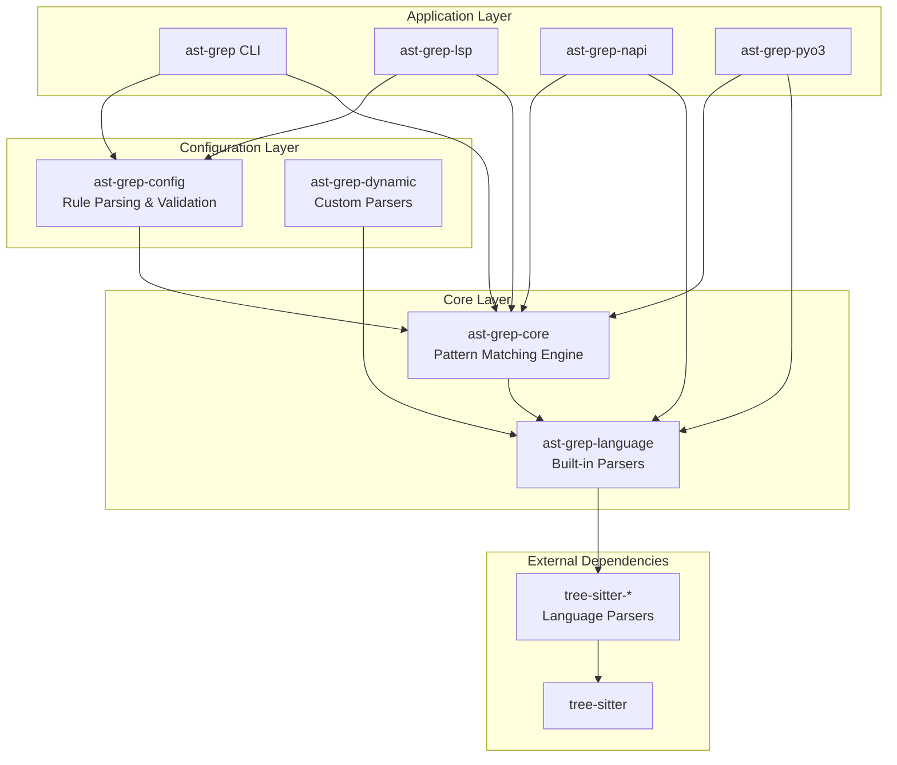

**Workspace Structure:**

The workspace is defined in [Cargo.toml1-7](https://github.com/ast-grep/ast-grep/blob/3ae01aec/Cargo.toml#L1-L7) with members in `crates/*` [Cargo.toml2-6](https://github.com/ast-grep/ast-grep/blob/3ae01aec/Cargo.toml#L2-L6) All crates share version `0.40.5` [Cargo.toml13](https://github.com/ast-grep/ast-grep/blob/3ae01aec/Cargo.toml#L13-L13)

| Crate | Key Types/Functions | Distribution |
|-------|---------------------|--------------|
| `ast-grep-core` | `Root<D>`, `Node<'r, D>`, `Matcher`, `Pattern` | crates.io |
| `ast-grep-config` | `RuleConfig<L>`, `RuleCore`, `SerializableRuleCore` | crates.io |
| `ast-grep-language` | `SupportLang`, `Language` trait, `LanguageExt` trait | crates.io |
| `ast-grep-dynamic` | `CustomLang`, `register_custom_language()` | crates.io |
| `ast-grep` (CLI) | `execute_main()`, `run_with_pattern()`, `run_with_config()` | crates.io, npm, PyPI |
| `ast-grep-lsp` | `Backend`, `run_language_server()` | crates.io |
| `ast-grep-napi` | `SgRoot`, `SgNode`, `parse()`, `findInFiles()` | npm |
| `ast-grep-py` | `PyRoot`, `PyNode`, Python module functions | PyPI |

**Sources:** [Cargo.toml1-40](https://github.com/ast-grep/ast-grep/blob/3ae01aec/Cargo.toml#L1-L40) [crates/core/src/node.rs1-573](https://github.com/ast-grep/ast-grep/blob/3ae01aec/crates/core/src/node.rs#L1-L573) [crates/config/src/rule_config.rs1-819](https://github.com/ast-grep/ast-grep/blob/3ae01aec/crates/config/src/rule_config.rs#L1-L819)

---

## Core Library Type Hierarchy

```mermaid
classDiagram
    class Root~D~ {
        +inner: D
        +root() Node~D~
        +edit(edit) Result
        +replace(node, text) Result
    }
    
    class Node~D~ {
        +inner: Node
        +lang: D::Lang
        +text() String
        +kind() String
        +children() Vec~Node~
        +parent() Option~Node~
        +matches(m) bool
    }
    
    class Matcher {
        &lt;&lt;trait&gt;&gt;
        +match_node_with_env(node, env) Option~NodeMatch~
        +potential_kinds() Option~BitSet~
    }
    
    class Pattern {
        +ast: Node
        +pattern_string: String
    }
    
    class RuleCore {
        +matcher: Box~dyn Matcher~
        +constraints: HashMap
        +transform: Option~Transform~
        +fix: Option~Fixer~
    }
    
    class MetaVarEnv {
        +single_matched: HashMap
        +multi_matched: HashMap
        +get_match(var) Option
        +insert(var, node)
    }
    
    class NodeMatch {
        +node: Node
        +env: MetaVarEnv
        +get_match(var) Option
    }
    
    Root "1" --> "*" Node : owns
    Node --> Root : borrows from
    Matcher &lt;|.. Pattern
    Matcher &lt;|.. RuleCore
    Matcher &lt;|.. KindMatcher
    Matcher &lt;|.. RegexMatcher
    Matcher --> MetaVarEnv : populates
    NodeMatch --> Node
    NodeMatch --> MetaVarEnv
```

**Key Type Relationships:**

1. **Ownership model:** `Root<D>` owns the document, `Node<'r, D>` borrows from it [crates/core/src/node.rs49-112](https://github.com/ast-grep/ast-grep/blob/3ae01aec/crates/core/src/node.rs#L49-L112)
2. **Pattern matching:** `Matcher` trait implemented by `Pattern`, `KindMatcher`, `RegexMatcher`, and all rule types [crates/core/src/matcher.rs24-48](https://github.com/ast-grep/ast-grep/blob/3ae01aec/crates/core/src/matcher.rs#L24-L48)
3. **Meta-variables:** `MetaVarEnv<'tree, D>` stores captured variables during matching [crates/core/src/meta_var.rs17-30](https://github.com/ast-grep/ast-grep/blob/3ae01aec/crates/core/src/meta_var.rs#L17-L30)
4. **Rule compilation:** `SerializableRuleCore` (YAML) → `RuleConfig` → `RuleCore` (executable) [crates/config/src/rule_config.rs200-265](https://github.com/ast-grep/ast-grep/blob/3ae01aec/crates/config/src/rule_config.rs#L200-L265)

**Sources:** [crates/core/src/node.rs1-573](https://github.com/ast-grep/ast-grep/blob/3ae01aec/crates/core/src/node.rs#L1-L573) [crates/core/src/matcher.rs1-141](https://github.com/ast-grep/ast-grep/blob/3ae01aec/crates/core/src/matcher.rs#L1-L141) [crates/core/src/meta_var.rs1-378](https://github.com/ast-grep/ast-grep/blob/3ae01aec/crates/core/src/meta_var.rs#L1-L378) [crates/config/src/rule_config.rs1-819](https://github.com/ast-grep/ast-grep/blob/3ae01aec/crates/config/src/rule_config.rs#L1-L819) [crates/config/src/rule_core.rs1-451](https://github.com/ast-grep/ast-grep/blob/3ae01aec/crates/config/src/rule_core.rs#L1-L451)

---

## Core Library Modules

### ast-grep-core

**Module Structure:**

| Module | Key Types | Purpose |
|--------|-----------|---------|
| `node` | `Root<D>`, `Node<'r, D>`, `Position` | AST ownership and traversal [crates/core/src/node.rs1-573](https://github.com/ast-grep/ast-grep/blob/3ae01aec/crates/core/src/node.rs#L1-L573) |
| `matcher` | `Matcher` trait, `Pattern`, `KindMatcher`, `RegexMatcher`, `NodeMatch` | Pattern matching abstractions [crates/core/src/matcher.rs1-141](https://github.com/ast-grep/ast-grep/blob/3ae01aec/crates/core/src/matcher.rs#L1-L141) |
| `meta_var` | `MetaVarEnv<'tree, D>`, `MetaVariable` enum | Variable capture system [crates/core/src/meta_var.rs1-378](https://github.com/ast-grep/ast-grep/blob/3ae01aec/crates/core/src/meta_var.rs#L1-L378) |
| `replacer` | `Replacer` trait, `TemplateFix`, `Edit` | Code generation and replacement [crates/core/src/replacer.rs1-114](https://github.com/ast-grep/ast-grep/blob/3ae01aec/crates/core/src/replacer.rs#L1-L114) |
| `source` | `Doc` trait, `Content` trait, `Edit` | Document abstraction [crates/core/src/source.rs1](https://github.com/ast-grep/ast-grep/blob/3ae01aec/crates/core/src/source.rs#L1) |
| `language` | `Language` trait | Language-specific behavior [crates/core/src/language.rs1](https://github.com/ast-grep/ast-grep/blob/3ae01aec/crates/core/src/language.rs#L1) |

**Core APIs:**

```rust
// Create a parsed document
let root = Root::new(source_text, lang);

// Get root node for traversal
let node = root.root();

// Pattern matching
let pattern = Pattern::new("let $A = $B", lang)?;
let matches: Vec<NodeMatch> = node.find_all(&pattern).collect();

// Code replacement
let new_text = node.replace(&pattern, "const $A = $B")?;
```

**Dependencies:**

- `tree-sitter` (0.26.3): Parser and AST [crates/core/Cargo.toml20](https://github.com/ast-grep/ast-grep/blob/3ae01aec/crates/core/Cargo.toml#L20-L20)
- `bit-set` (0.8.0): Efficient kind filtering [crates/core/Cargo.toml17](https://github.com/ast-grep/ast-grep/blob/3ae01aec/crates/core/Cargo.toml#L17-L17)
- `regex` (1.10.4): Text-based matching [crates/core/Cargo.toml18](https://github.com/ast-grep/ast-grep/blob/3ae01aec/crates/core/Cargo.toml#L18-L18)

**Sources:** [crates/core/src/node.rs1-573](https://github.com/ast-grep/ast-grep/blob/3ae01aec/crates/core/src/node.rs#L1-L573) [crates/core/src/matcher.rs1-141](https://github.com/ast-grep/ast-grep/blob/3ae01aec/crates/core/src/matcher.rs#L1-L141) [crates/core/src/meta_var.rs1-378](https://github.com/ast-grep/ast-grep/blob/3ae01aec/crates/core/src/meta_var.rs#L1-L378) [crates/core/src/replacer.rs1-114](https://github.com/ast-grep/ast-grep/blob/3ae01aec/crates/core/src/replacer.rs#L1-L114) [crates/core/Cargo.toml1-26](https://github.com/ast-grep/ast-grep/blob/3ae01aec/crates/core/Cargo.toml#L1-L26)

### ast-grep-config

**Module Structure:**

| Module | Key Types | Purpose |
|--------|-----------|---------|
| `rule_config` | `RuleConfig<L>`, `SerializableRuleConfig<L>`, `Severity` | Rule metadata and validation [crates/config/src/rule_config.rs1-819](https://github.com/ast-grep/ast-grep/blob/3ae01aec/crates/config/src/rule_config.rs#L1-L819) |
| `rule_core` | `RuleCore`, `SerializableRuleCore` | Compiled rule matcher [crates/config/src/rule_core.rs1-451](https://github.com/ast-grep/ast-grep/blob/3ae01aec/crates/config/src/rule_core.rs#L1-L451) |
| `rule` | `Rule` enum, `SerializableRule` | Pattern composition [crates/config/src/rule.rs1](https://github.com/ast-grep/ast-grep/blob/3ae01aec/crates/config/src/rule.rs#L1) |
| `fixer` | `Fixer`, `SerializableFixer` | Auto-fix templates [crates/config/src/fixer.rs1](https://github.com/ast-grep/ast-grep/blob/3ae01aec/crates/config/src/fixer.rs#L1) |
| `transform` | `Transform`, `Transformation` | Meta-variable manipulation [crates/config/src/transform.rs1](https://github.com/ast-grep/ast-grep/blob/3ae01aec/crates/config/src/transform.rs#L1) |
| `check_var` | `check_rule_with_hint()` | Meta-variable validation [crates/config/src/check_var.rs1-330](https://github.com/ast-grep/ast-grep/blob/3ae01aec/crates/config/src/check_var.rs#L1-L330) |

**Rule Compilation Pipeline:**

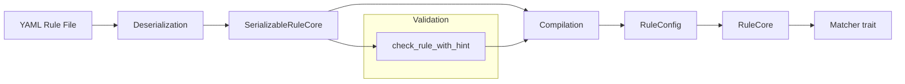

**Key APIs:**

```rust
// Load rule from YAML
let rule: RuleConfig<SupportLang> = RuleConfig::from_yaml(yaml_str)?;

// Compile to matcher
let matcher: RuleCore<_> = rule.core;

// Scan documents
let matches = RuleCollection::scan(&rules, &root);
```

**Dependencies:**

- `serde`/`serde_yaml`: YAML deserialization [crates/config/Cargo.toml23-24](https://github.com/ast-grep/ast-grep/blob/3ae01aec/crates/config/Cargo.toml#L23-L24)
- `schemars`: JSON Schema for rule validation [crates/config/Cargo.toml26](https://github.com/ast-grep/ast-grep/blob/3ae01aec/crates/config/Cargo.toml#L26-L26)
- `globset`: File pattern matching for `files`/`ignores` [crates/config/Cargo.toml21](https://github.com/ast-grep/ast-grep/blob/3ae01aec/crates/config/Cargo.toml#L21-L21)

**Sources:** [crates/config/src/rule_config.rs1-819](https://github.com/ast-grep/ast-grep/blob/3ae01aec/crates/config/src/rule_config.rs#L1-L819) [crates/config/src/rule_core.rs1-451](https://github.com/ast-grep/ast-grep/blob/3ae01aec/crates/config/src/rule_core.rs#L1-L451) [crates/config/src/check_var.rs1-330](https://github.com/ast-grep/ast-grep/blob/3ae01aec/crates/config/src/check_var.rs#L1-L330) [crates/config/Cargo.toml1-29](https://github.com/ast-grep/ast-grep/blob/3ae01aec/crates/config/Cargo.toml#L1-L29)

### ast-grep-language

**Language Categories:**

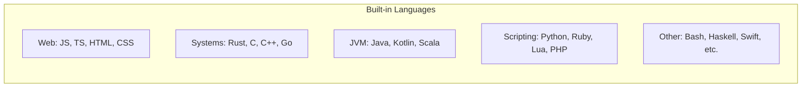

**Language Trait Implementation:**

```rust
pub trait Language: Clone {
    fn from_path(path: &Path) -> Option<Self>;
    fn from_file_suffix(file_suffix: &str) -> Option<Self>;
    fn get_ts_language(&self) -> TSLanguage;
    fn expando_char(&self) -> char;
    fn pre_process_pattern<'q>(&self, query: &'q str) -> Cow<'q, str>;
}
```

**Supported Languages:** Bash, C, C#, C++, CSS, Elixir, Go, Haskell, HCL, HTML, Java, JavaScript, JSON, Kotlin, Lua, Nix, PHP, Python, Ruby, Rust, Scala, Solidity, Swift, TypeScript, TSX, YAML [Cargo.lock187-211](https://github.com/ast-grep/ast-grep/blob/3ae01aec/Cargo.lock#L187-L211)

**Dependencies:**

- 20+ `tree-sitter-*` parsers [crates/language/Cargo.toml187-211](https://github.com/ast-grep/ast-grep/blob/3ae01aec/crates/language/Cargo.toml#L187-L211)
- `ignore`: File type detection [crates/language/Cargo.toml184](https://github.com/ast-grep/ast-grep/blob/3ae01aec/crates/language/Cargo.toml#L184-L184)

**Sources:** [crates/language/Cargo.toml180-212](https://github.com/ast-grep/ast-grep/blob/3ae01aec/crates/language/Cargo.toml#L180-L212) [Cargo.lock179-212](https://github.com/ast-grep/ast-grep/blob/3ae01aec/Cargo.lock#L179-L212)

### ast-grep-dynamic

**Custom Language Loading:**

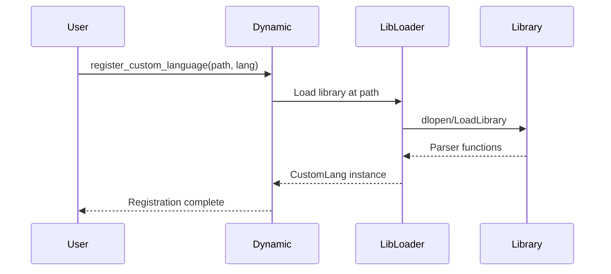

**Key APIs:**

```rust
// Register custom language at runtime
register_custom_language("mylang", "/path/to/parser.so")?;

// Use custom language
let lang = CustomLang::new("mylang");
let root = Root::new(source, lang);
```

**Library Discovery:** Searches for `{libraryPath}/ast-grep-{language}-{triple}.{ext}` where `triple` is the platform triple (e.g., `x86_64-unknown-linux-gnu`) [crates/dynamic/Cargo.toml174](https://github.com/ast-grep/ast-grep/blob/3ae01aec/crates/dynamic/Cargo.toml#L174-L174)

**Dependencies:**

- `libloading` (0.9.0): Dynamic library loading [Cargo.lock936-943](https://github.com/ast-grep/ast-grep/blob/3ae01aec/Cargo.lock#L936-L943)
- `target-triple`: Platform detection [crates/dynamic/Cargo.toml174](https://github.com/ast-grep/ast-grep/blob/3ae01aec/crates/dynamic/Cargo.toml#L174-L174)

**Sources:** [crates/dynamic/Cargo.toml166-177](https://github.com/ast-grep/ast-grep/blob/3ae01aec/crates/dynamic/Cargo.toml#L166-L177) [Cargo.lock936-943](https://github.com/ast-grep/ast-grep/blob/3ae01aec/Cargo.lock#L936-L943)

---

## Interface Layer Implementation

### How Interfaces Use Core Libraries

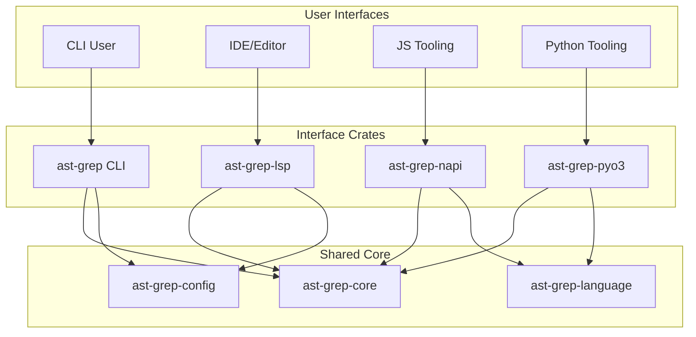

### CLI Binary (ast-grep)

**Command Execution Flow:**

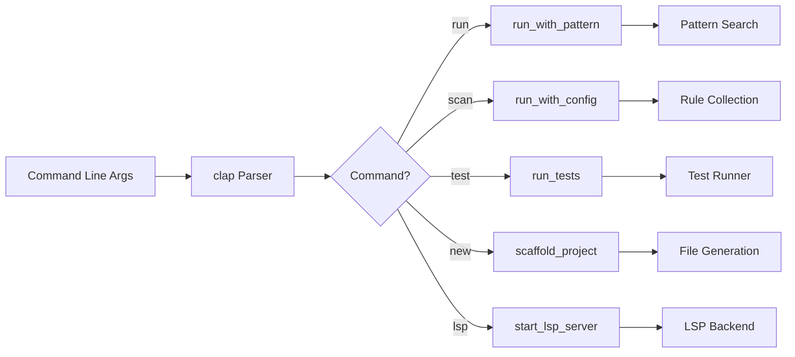

**Key Command Implementations:**

- **`run` command:** Ad-hoc pattern search using `Pattern::new()` [crates/cli/src/run.rs1](https://github.com/ast-grep/ast-grep/blob/3ae01aec/crates/cli/src/run.rs#L1)
- **`scan` command:** Rule-based analysis using `RuleCollection::scan()` [crates/cli/src/scan.rs1](https://github.com/ast-grep/ast-grep/blob/3ae01aec/crates/cli/src/scan.rs#L1)
- **`test` command:** Rule verification using test fixtures [crates/cli/src/test.rs1](https://github.com/ast-grep/ast-grep/blob/3ae01aec/crates/cli/src/test.rs#L1)
- **`new` command:** Project scaffolding [crates/cli/src/new.rs1](https://github.com/ast-grep/ast-grep/blob/3ae01aec/crates/cli/src/new.rs#L1)
- **`lsp` command:** Starts embedded LSP server [crates/cli/Cargo.toml32](https://github.com/ast-grep/ast-grep/blob/3ae01aec/crates/cli/Cargo.toml#L32-L32)

**Binary Targets:**

- `ast-grep`: Primary CLI [crates/cli/Cargo.toml20-21](https://github.com/ast-grep/ast-grep/blob/3ae01aec/crates/cli/Cargo.toml#L20-L21)
- `sg`: Short alias [crates/cli/Cargo.toml24-25](https://github.com/ast-grep/ast-grep/blob/3ae01aec/crates/cli/Cargo.toml#L24-L25)

**Dependencies:**

- `clap` (4.5.4): CLI parsing [crates/cli/Cargo.toml38](https://github.com/ast-grep/ast-grep/blob/3ae01aec/crates/cli/Cargo.toml#L38-L38)
- `ignore` (0.4.22): File traversal [crates/cli/Cargo.toml41](https://github.com/ast-grep/ast-grep/blob/3ae01aec/crates/cli/Cargo.toml#L41-L41)
- `inquire` (0.9.1): Interactive mode [crates/cli/Cargo.toml46](https://github.com/ast-grep/ast-grep/blob/3ae01aec/crates/cli/Cargo.toml#L46-L46)
- `serde-sarif` (0.8.0): SARIF output [crates/cli/Cargo.toml50](https://github.com/ast-grep/ast-grep/blob/3ae01aec/crates/cli/Cargo.toml#L50-L50)

**Sources:** [crates/cli/Cargo.toml1-66](https://github.com/ast-grep/ast-grep/blob/3ae01aec/crates/cli/Cargo.toml#L1-L66) [crates/cli/src/main.rs1](https://github.com/ast-grep/ast-grep/blob/3ae01aec/crates/cli/src/main.rs#L1) [crates/cli/src/lib.rs1](https://github.com/ast-grep/ast-grep/blob/3ae01aec/crates/cli/src/lib.rs#L1)

### Language Server (ast-grep-lsp)

**LSP Architecture:**

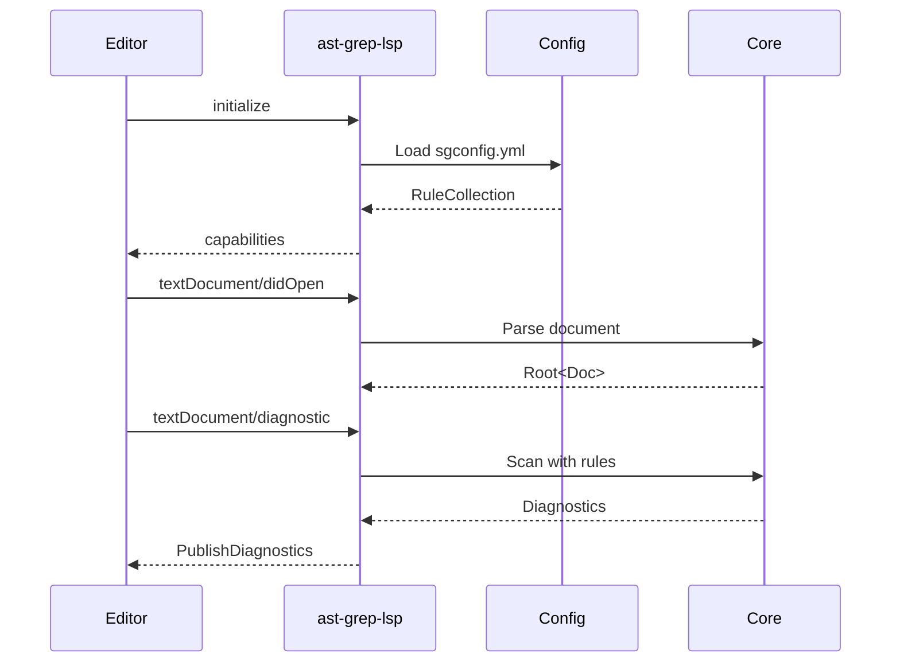

**Key APIs:**

```rust
// LSP server entry point
run_language_server(Backend::new());

// Diagnostic handling
async fn diagnostic(&self, params: DocumentDiagnosticParams) 
    -> Result<DocumentDiagnosticReport>
```

**Dependencies:**

- `tower-lsp-server` (0.23.0): LSP protocol [crates/lsp/Cargo.toml26](https://github.com/ast-grep/ast-grep/blob/3ae01aec/crates/lsp/Cargo.toml#L26-L26)
- `dashmap` (6.0.0): Concurrent rule cache [crates/lsp/Cargo.toml23](https://github.com/ast-grep/ast-grep/blob/3ae01aec/crates/lsp/Cargo.toml#L23-L23)

**Sources:** [crates/lsp/Cargo.toml1-40](https://github.com/ast-grep/ast-grep/blob/3ae01aec/crates/lsp/Cargo.toml#L1-L40)

### Node.js Bindings (ast-grep-napi)

**NAPI Class Structure:**

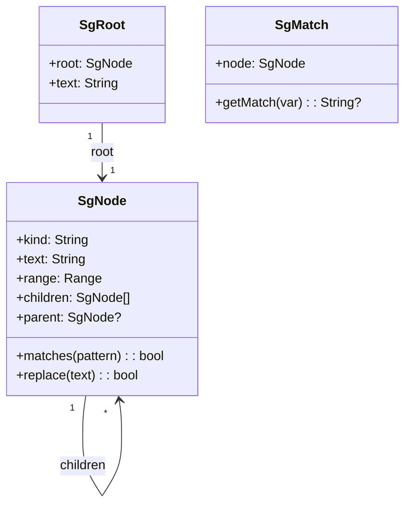

**Key Exports:**

```javascript
// Parse source code
const root = parse(sourceCode, 'typescript');
const node = root.root();

// Pattern matching
for (const match of node.findAll('let $A = $B')) {
    console.log(match.getMatch('A')); // variable name
    console.log(match.getMatch('B')); // value
}

// File search
const results = findInFiles('./src', {
    pattern: 'console.log($MSG)',
    language: 'javascript'
});
```

**Crate Configuration:**

- **Type:** `cdylib` for `.node` binaries [crates/napi/Cargo.toml34](https://github.com/ast-grep/ast-grep/blob/3ae01aec/crates/napi/Cargo.toml#L34-L34)
- **Language Feature:** `napi-lang` (reduced parser set) [crates/napi/Cargo.toml18](https://github.com/ast-grep/ast-grep/blob/3ae01aec/crates/napi/Cargo.toml#L18-L18)
- **Build:** `napi-build` for setup [crates/napi/Cargo.toml36-37](https://github.com/ast-grep/ast-grep/blob/3ae01aec/crates/napi/Cargo.toml#L36-L37)

**Dependencies:**

- `napi` (3.8.2): N-API bindings [crates/napi/Cargo.toml21](https://github.com/ast-grep/ast-grep/blob/3ae01aec/crates/napi/Cargo.toml#L21-L21)
- `napi-derive` (3.5.2): Derive macros [crates/napi/Cargo.toml22](https://github.com/ast-grep/ast-grep/blob/3ae01aec/crates/napi/Cargo.toml#L22-L22)

**Sources:** [crates/napi/Cargo.toml1-37](https://github.com/ast-grep/ast-grep/blob/3ae01aec/crates/napi/Cargo.toml#L1-L37) [Cargo.lock233-246](https://github.com/ast-grep/ast-grep/blob/3ae01aec/Cargo.lock#L233-L246)

### Python Bindings (ast-grep-py)

**Python Class Structure:**

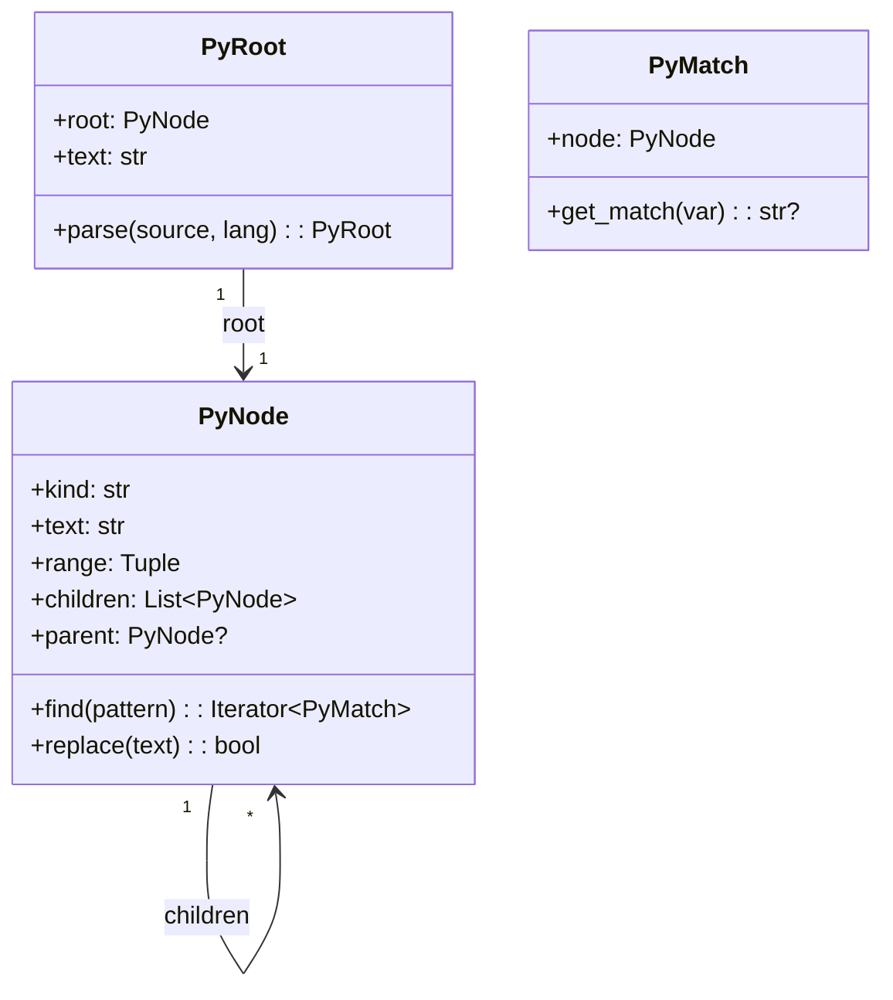

**Python API Example:**

```python
import ast_grep_py as ast_grep

# Parse source code
root = ast_grep.parse(source_code, 'python')
node = root.root()

# Pattern matching
for match in node.find_all('def $NAME($$$PARAMS)'):
    print(match.get_match('NAME'))  # function name
```

**Dependencies:**

- `pyo3` (0.27.2): Python FFI [Cargo.lock1212-1227](https://github.com/ast-grep/ast-grep/blob/3ae01aec/Cargo.lock#L1212-L1227)
- `pythonize` (0.27.0): Python/Rust serialization [Cargo.lock1274-1281](https://github.com/ast-grep/ast-grep/blob/3ae01aec/Cargo.lock#L1274-L1281)

**Sources:** [Cargo.lock248-260](https://github.com/ast-grep/ast-grep/blob/3ae01aec/Cargo.lock#L248-L260) [Cargo.lock1212-1281](https://github.com/ast-grep/ast-grep/blob/3ae01aec/Cargo.lock#L1212-L1281)

---

## Component Interaction Patterns

### Pattern Matching Flow

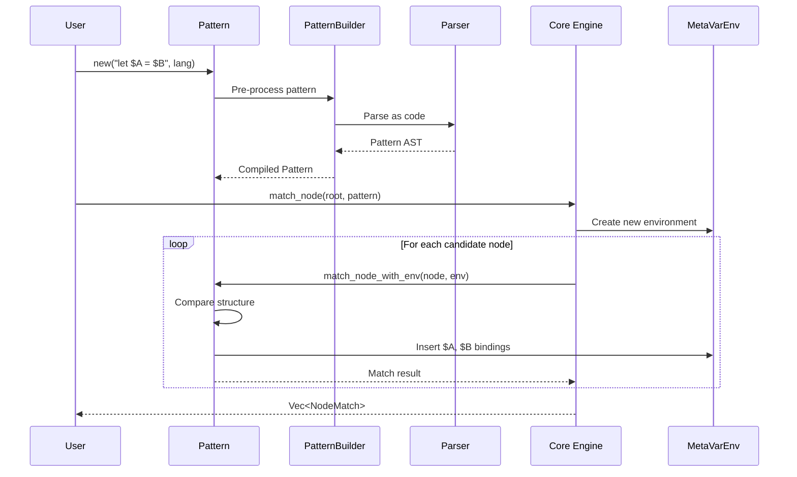

**Key Interaction Points:**

1. **Language preprocessing:** Pattern strings are transformed based on `Language::pre_process_pattern()` before parsing
2. **Ownership transfer:** `Root<D>` owns the document, `Node<'r, D>` borrows from it with lifetime `'r`
3. **Meta-variable capture:** `Matcher::match_node_with_env()` populates `MetaVarEnv` during matching
4. **Result packaging:** Successful matches return `NodeMatch<'tree, D>` containing both the node and environment

**Sources:** [crates/core/src/node.rs1-573](https://github.com/ast-grep/ast-grep/blob/3ae01aec/crates/core/src/node.rs#L1-L573) [crates/core/src/matcher.rs1-141](https://github.com/ast-grep/ast-grep/blob/3ae01aec/crates/core/src/matcher.rs#L1-L141) [crates/core/src/meta_var.rs1-378](https://github.com/ast-grep/ast-grep/blob/3ae01aec/crates/core/src/meta_var.rs#L1-L378)

### Rule-Based Scanning Flow

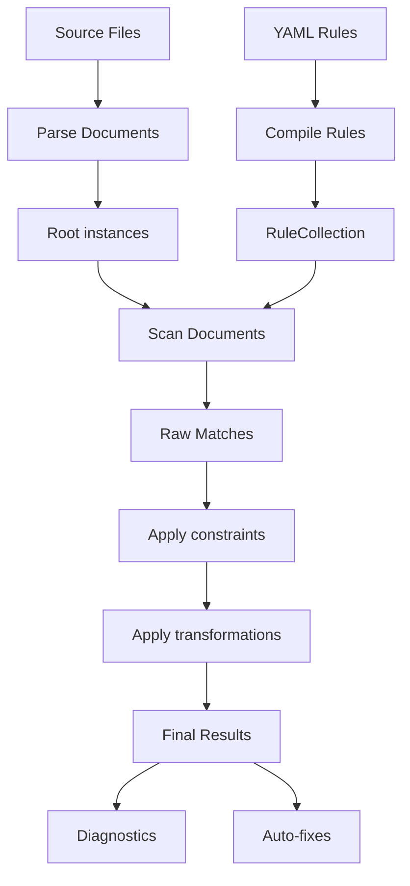

**Key Interaction Points:**

1. **Rule compilation:** YAML rules are validated and compiled into `RuleCore` matchers
2. **Batch scanning:** `RuleCollection::scan()` applies all rules to a document efficiently
3. **Message generation:** Rules use `Fixer` to interpolate meta-variables in messages
4. **Auto-fix generation:** `get_fixer()` produces code edits based on the `fix` template

**Sources:** [crates/config/src/rule_config.rs1-819](https://github.com/ast-grep/ast-grep/blob/3ae01aec/crates/config/src/rule_config.rs#L1-L819) [crates/config/src/rule_core.rs1-451](https://github.com/ast-grep/ast-grep/blob/3ae01aec/crates/config/src/rule_core.rs#L1-L451)

---

## Build Artifacts and Distribution

### Rust Library Crates

Four crates are published to crates.io for Rust developers:

- `ast-grep-core` (0.40.5)
- `ast-grep-config` (0.40.5)
- `ast-grep-language` (0.40.5)
- `ast-grep-dynamic` (0.40.5)

All share the workspace version [Cargo.toml13](https://github.com/ast-grep/ast-grep/blob/3ae01aec/Cargo.toml#L13-L13)

### Binary Distribution

**Platform Targets:** The CLI and LSP binaries are built for 8 platforms:

- Windows: x64 MSVC, IA32 MSVC, ARM64 MSVC
- macOS: x64 Intel, ARM64 Apple Silicon
- Linux: x64 GNU, ARM64 GNU, x64 MUSL

**Distribution Channels:**

- **npm:** `@ast-grep/cli` meta-package with platform-specific binaries
- **PyPI:** `ast_grep_cli` package with platform wheels
- **GitHub Releases:** Direct `.zip` downloads

**Sources:** Inferred from distribution strategy in high-level diagrams

### Native Module Distribution

**NAPI (Node.js):** 9 platform-specific packages with `.node` binaries:

- Published as `@ast-grep/napi` with optional dependencies for each platform
- Uses `optionalDependencies` with OS/CPU filtering

**PyO3 (Python):** 7 platform-specific wheels with Python extensions:

- Published as `ast_grep_py` to PyPI
- Uses `manylinux` specifications for Linux compatibility

**Sources:** [crates/napi/Cargo.toml1-37](https://github.com/ast-grep/ast-grep/blob/3ae01aec/crates/napi/Cargo.toml#L1-L37) Cargo.lock for pyo3 dependencies

---

## Workspace Configuration

### Shared Dependencies

The workspace defines common dependencies used across multiple crates [Cargo.toml23-40](https://github.com/ast-grep/ast-grep/blob/3ae01aec/Cargo.toml#L23-L40):

```toml
ast-grep-core = { path = "crates/core", version = "0.40.5" }
ast-grep-config = { path = "crates/config", version = "0.40.5" }
ast-grep-dynamic = { path = "crates/dynamic", version = "0.40.5" }
ast-grep-language = { path = "crates/language", version = "0.40.5" }
ast-grep-lsp = { path = "crates/lsp", version = "0.40.5" }

bit-set = "0.8.0"
ignore = "0.4.22"
regex = "1.10.4"
serde = { version = "1.0.200", features = ["derive"] }
serde_yaml = "0.9.33"
tree-sitter = "0.26.3"
thiserror = "2.0.0"
schemars = "1.0.0"
anyhow = "1.0.82"
dashmap = "6.0.0"
```

### Profile Configuration

**Release Profile:** Optimized for binary size with link-time optimization enabled [Cargo.toml9-10](https://github.com/ast-grep/ast-grep/blob/3ae01aec/Cargo.toml#L9-L10):

```toml
[profile.release]
lto = true
```

### Minimum Rust Version

All crates require Rust 1.79 or later (MSRV) [Cargo.toml20](https://github.com/ast-grep/ast-grep/blob/3ae01aec/Cargo.toml#L20-L20)

**Sources:** [Cargo.toml1-40](https://github.com/ast-grep/ast-grep/blob/3ae01aec/Cargo.toml#L1-L40)

---

## Key Abstractions and Trait Boundaries

The architecture is built around several key traits that define boundaries between layers:

**Core Traits (ast-grep-core):**

- `Matcher`: Defines pattern matching behavior. Implemented by `Pattern`, `KindMatcher`, `RegexMatcher`, and all rule constraint types.
- `Doc`: Abstracts over document types. Implemented by `StrDoc` for single-language files and `MultiLangDoc` for embedded languages.
- `Node<'tree, D: Doc>`: Represents an AST node with lifetime tied to the tree root.
- `Root<D: Doc>`: Owns the parsed AST and source text.

**Language Trait (ast-grep-language):**

- `Language`: Defines language-specific behavior including `expando_char()` and `pre_process_pattern()`. Implemented by `SupportLang` enum and `CustomLang` struct.

**Configuration Types (ast-grep-config):**

- `RuleConfig<L: Language>`: Runtime representation of a complete rule with metadata.
- `SerializableRuleCore`: YAML-deserializable rule definition.
- `RuleCollection<L: Language>`: Container for multiple rules with efficient scanning.

**Sources:** Inferred from dependency patterns and cited files

---

## Inter-Crate Communication Patterns

### Core to Language Layer

`ast-grep-language` depends on `ast-grep-core` to implement the `Language` trait for each supported language. Each language defines:

- `expando_char()`: Character used for meta-variable substitution
- `pre_process_pattern()`: Pattern transformation before parsing
- Language-specific tree-sitter parser instance

### Config to Core Translation

`ast-grep-config` translates YAML rule definitions into `ast-grep-core` types:

- `SerializableRuleConfig` → `RuleCore`
- Pattern strings → compiled `Matcher` instances
- Constraint definitions → relational rule AST

### Application Layer Integration

All user-facing binaries (CLI, LSP, NAPI, PyO3) follow a common pattern:

1. Use `ast-grep-language` to detect/load the appropriate language
2. Use `ast-grep-config` to load and validate rules (if applicable)
3. Use `ast-grep-core` to perform pattern matching and replacement
4. Format output according to the interface requirements

**Sources:** Inferred from dependency relationships in Cargo.toml files

---

## Feature Flags

### ast-grep-core

- `tree-sitter` (default): Enables tree-sitter support [crates/core/Cargo.toml22-23](https://github.com/ast-grep/ast-grep/blob/3ae01aec/crates/core/Cargo.toml#L22-L23)

### ast-grep-config

- `tree-sitter` (default): Enables tree-sitter integration [crates/config/Cargo.toml14-15](https://github.com/ast-grep/ast-grep/blob/3ae01aec/crates/config/Cargo.toml#L14-L15)

### ast-grep-language

- `builtin-parser` (default): Includes all 20+ language parsers
- `napi-lang`: Reduces binary size for NAPI by excluding some parsers [crates/napi/Cargo.toml18](https://github.com/ast-grep/ast-grep/blob/3ae01aec/crates/napi/Cargo.toml#L18-L18)

### ast-grep-napi

- `napi-noop-in-unit-test`: Disables NAPI initialization in unit tests to avoid symbol errors [crates/napi/Cargo.toml31](https://github.com/ast-grep/ast-grep/blob/3ae01aec/crates/napi/Cargo.toml#L31-L31)

**Sources:** [crates/core/Cargo.toml22-24](https://github.com/ast-grep/ast-grep/blob/3ae01aec/crates/core/Cargo.toml#L22-L24) [crates/config/Cargo.toml13-15](https://github.com/ast-grep/ast-grep/blob/3ae01aec/crates/config/Cargo.toml#L13-L15) [crates/napi/Cargo.toml28-31](https://github.com/ast-grep/ast-grep/blob/3ae01aec/crates/napi/Cargo.toml#L28-L31)
