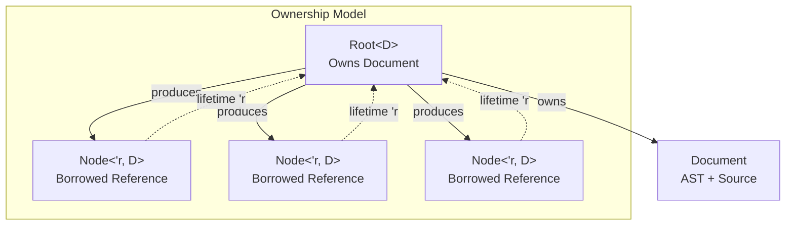
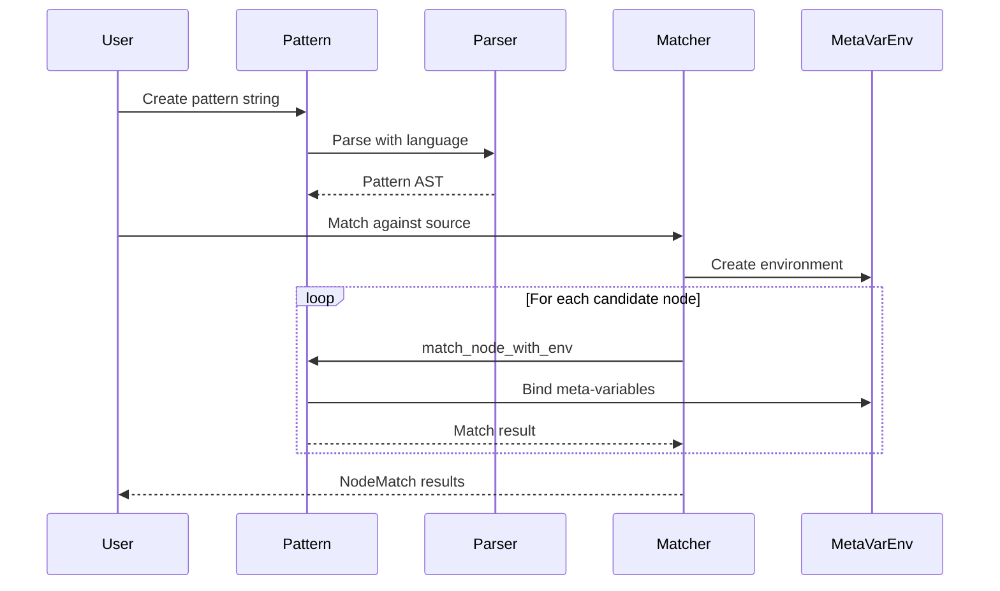
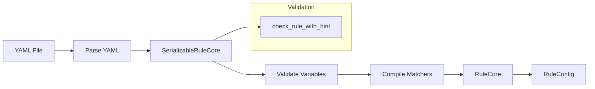
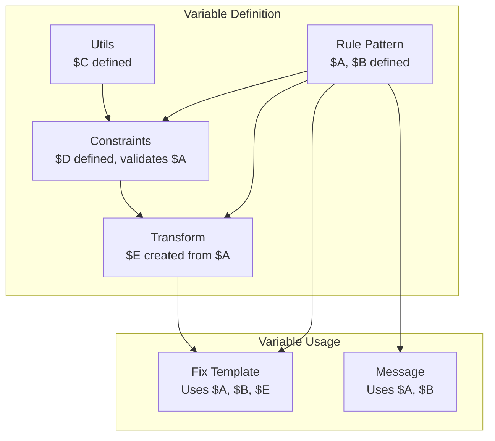
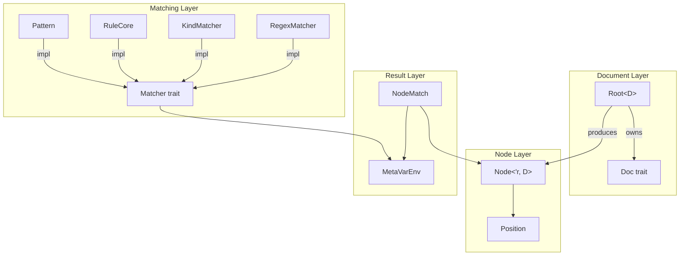

# Key Concepts

> **Source:** https://deepwiki.com/ast-grep/ast-grep/1.2-key-concepts

**Relevant source files:**

- [crates/config/src/check_var.rs](https://github.com/ast-grep/ast-grep/blob/3ae01aec/crates/config/src/check_var.rs)
- [crates/config/src/rule_config.rs](https://github.com/ast-grep/ast-grep/blob/3ae01aec/crates/config/src/rule_config.rs)
- [crates/config/src/rule_core.rs](https://github.com/ast-grep/ast-grep/blob/3ae01aec/crates/config/src/rule_core.rs)
- [crates/core/src/lib.rs](https://github.com/ast-grep/ast-grep/blob/3ae01aec/crates/core/src/lib.rs)
- [crates/core/src/matcher.rs](https://github.com/ast-grep/ast-grep/blob/3ae01aec/crates/core/src/matcher.rs)
- [crates/core/src/meta_var.rs](https://github.com/ast-grep/ast-grep/blob/3ae01aec/crates/core/src/meta_var.rs)
- [crates/core/src/node.rs](https://github.com/ast-grep/ast-grep/blob/3ae01aec/crates/core/src/node.rs)
- [crates/core/src/replacer.rs](https://github.com/ast-grep/ast-grep/blob/3ae01aec/crates/core/src/replacer.rs)
- [crates/language/Cargo.toml](https://github.com/ast-grep/ast-grep/blob/3ae01aec/crates/language/Cargo.toml)
- [crates/language/src/cpp.rs](https://github.com/ast-grep/ast-grep/blob/3ae01aec/crates/language/src/cpp.rs)
- [crates/language/src/go.rs](https://github.com/ast-grep/ast-grep/blob/3ae01aec/crates/language/src/go.rs)
- [crates/language/src/lib.rs](https://github.com/ast-grep/ast-grep/blob/3ae01aec/crates/language/src/lib.rs)
- [crates/language/src/nix.rs](https://github.com/ast-grep/ast-grep/blob/3ae01aec/crates/language/src/nix.rs)
- [crates/language/src/parsers.rs](https://github.com/ast-grep/ast-grep/blob/3ae01aec/crates/language/src/parsers.rs)
- [crates/language/src/scala.rs](https://github.com/ast-grep/ast-grep/blob/3ae01aec/crates/language/src/scala.rs)

## Purpose and Scope

This page defines the fundamental concepts and abstractions used throughout ast-grep. It covers the core data structures for representing AST nodes, the pattern matching system, meta-variables, and the rule configuration system. For information about language support and parsers, see [Language Support](../language-support/4-language-support.md). For details on the CLI tool's usage, see [CLI Tool](../cli-tool/5-cli-tool.md).

---

## AST Node Representation

ast-grep represents Abstract Syntax Trees using a two-level ownership model: `Root<D>` owns the parsed tree and source text, while `Node<'r, D>` provides a lightweight reference with lifetime `'r` tied to the root.

### Core Types

The **`Root<D>`** type is defined at [crates/core/src/node.rs47-52](https://github.com/ast-grep/ast-grep/blob/3ae01aec/crates/core/src/node.rs#L47-L52):

```rust
pub struct Root<D: Doc> {
    inner: D,
}
```

`Root` owns the document (implementing the `Doc` trait) which contains both the tree-sitter AST and the source text. It provides the entry point for tree traversal via `root()` method and mutation operations like `edit()` and `replace()`.

The **`Node<'r, D>`** type is defined at [crates/core/src/node.rs115-120](https://github.com/ast-grep/ast-grep/blob/3ae01aec/crates/core/src/node.rs#L115-L120):

```rust
pub struct Node<'r, D: Doc> {
    inner: Node<'r>,
    lang: D::Lang,
    // ...
}
```

Each `Node` holds a reference to the underlying tree-sitter node (`inner`) and a reference back to the owning `Root`. This design ensures nodes cannot outlive their source tree while allowing cheap cloning for tree traversal.

The **`Position`** type represents locations in source code at [crates/core/src/node.rs11-23](https://github.com/ast-grep/ast-grep/blob/3ae01aec/crates/core/src/node.rs#L11-L23):

```rust
pub struct Position {
    pub line: usize,        // 0-indexed
    pub column: usize,      // 0-indexed, character-based
    pub byte_offset: usize, // byte position in source
}
```

Positions use byte-based offsets internally but expose character-based columns via the `column()` method, which is an O(n) operation to handle multi-byte Unicode characters correctly.

### Document Abstraction

The `Doc` trait abstracts over different document representations and parsing backends. The key requirement is that it provides:

- A root AST node via `root_node()`
- Access to source text via `get_source()` and `get_node_text()`
- Language information via `get_lang()`
- Edit operations via `do_edit()`

This abstraction allows ast-grep to work with tree-sitter parsers while keeping the core API parser-agnostic.

**Ownership Model Diagram:**



**Sources:** [crates/core/src/node.rs47-120](https://github.com/ast-grep/ast-grep/blob/3ae01aec/crates/core/src/node.rs#L47-L120) [crates/core/src/lib.rs28](https://github.com/ast-grep/ast-grep/blob/3ae01aec/crates/core/src/lib.rs#L28-L28)

---

## Patterns and Meta-Variables

Patterns are the primary mechanism for matching AST nodes. A pattern is source code with **meta-variables** (placeholders starting with `$`) that match arbitrary subtrees.

### Meta-Variable Syntax

Meta-variables are defined by the `MetaVariable` enum at [crates/core/src/meta_var.rs223-233](https://github.com/ast-grep/ast-grep/blob/3ae01aec/crates/core/src/meta_var.rs#L223-L233):

- **Single meta-variable**: `$VAR` matches a single AST node (captured)
- **Named anonymous**: `$$VAR` matches a single node (not captured in output)
- **Multiple meta-variable**: `$$$VARS` matches zero or more sibling nodes
- **Anonymous wildcards**: `$_` or `$$_` match without capturing, `$$$` matches multiple

Example pattern matching a variable declaration:

```javascript
// Pattern: let $NAME = $VALUE
// Source:  let x = 123
// Matches: $NAME = "x", $VALUE = "123"
```

This pattern matches `let x = 123`, capturing `x` as `$NAME` and `123` as `$VALUE`.

Meta-variable extraction is implemented at [crates/core/src/meta_var.rs235-271](https://github.com/ast-grep/ast-grep/blob/3ae01aec/crates/core/src/meta_var.rs#L235-L271) via `extract_meta_var()`. The function validates that:

- Single/double `$` prefix followed by uppercase letter or underscore
- Triple `$$$` prefix for multi-capture
- Only alphanumeric and underscore characters in the name

### Pattern Preprocessing

Languages handle meta-variable syntax differently based on whether `$` is a valid identifier character. This is managed by the `Language` trait at [crates/core/src/language.rs](https://github.com/ast-grep/ast-grep/blob/3ae01aec/crates/core/src/language.rs):

**Stub Languages** (e.g., Bash, Java, JavaScript, Lua): `$` is already valid in identifiers, so patterns use `$` directly.

**Expando Languages** (e.g., Python, Rust, C/C++, Go): `$` is not valid, so patterns are preprocessed at [crates/language/src/lib.rs92-111](https://github.com/ast-grep/ast-grep/blob/3ae01aec/crates/language/src/lib.rs#L92-L111) by `pre_process_pattern()`, which replaces `$VAR` with `µVAR` or `𐀀VAR` based on `expando_char()`.

For example, in Rust:

- Pattern: `$A + $B`
- Preprocessed: `µA + µB`
- Parsed as valid Rust identifiers

This allows uniform `$VAR` syntax across all languages while respecting each language's identifier rules.

### Pattern Implementation

The `Pattern` type at [crates/core/src/matcher.rs21](https://github.com/ast-grep/ast-grep/blob/3ae01aec/crates/core/src/matcher.rs#L21-L21) is created by parsing pattern strings with the target language's parser via `PatternBuilder` at [crates/core/src/matcher.rs21](https://github.com/ast-grep/ast-grep/blob/3ae01aec/crates/core/src/matcher.rs#L21-L21) The pattern AST is then compared structurally against candidate nodes during matching.

Meta-variables are stored in `MetaVarEnv` at [crates/core/src/meta_var.rs17-21](https://github.com/ast-grep/ast-grep/blob/3ae01aec/crates/core/src/meta_var.rs#L17-L21) during matching:

```rust
pub struct MetaVarEnv<'tree, D: Doc> {
    single_matched: HashMap<String, Node<'tree, D>>,
    multi_matched: HashMap<String, Vec<Node<'tree, D>>>,
    // ...
}
```

When a pattern node contains a meta-variable like `$A`, the matcher at [crates/core/src/meta_var.rs89-94](https://github.com/ast-grep/ast-grep/blob/3ae01aec/crates/core/src/meta_var.rs#L89-L94):

1. Checks if `$A` is already bound in `single_matched`
2. If yes, verifies the candidate node matches exactly via `does_node_match_exactly()`
3. If no, binds `$A` to the candidate node

**Pattern Matching Flow:**



**Sources:** [crates/core/src/matcher.rs1-22](https://github.com/ast-grep/ast-grep/blob/3ae01aec/crates/core/src/matcher.rs#L1-L22) [crates/core/src/matcher.rs73-87](https://github.com/ast-grep/ast-grep/blob/3ae01aec/crates/core/src/matcher.rs#L73-L87) [crates/core/src/meta_var.rs17-271](https://github.com/ast-grep/ast-grep/blob/3ae01aec/crates/core/src/meta_var.rs#L17-L271) [crates/language/src/lib.rs92-111](https://github.com/ast-grep/ast-grep/blob/3ae01aec/crates/language/src/lib.rs#L92-L111)

---

## The Matcher Trait

The `Matcher` trait at [crates/core/src/matcher.rs24-48](https://github.com/ast-grep/ast-grep/blob/3ae01aec/crates/core/src/matcher.rs#L24-L48) defines the core matching interface:

```rust
pub trait Matcher<D: Doc> {
    fn match_node_with_env<'tree>(
        &self,
        node: Node<'tree, D>,
        env: &mut MetaVarEnv<'tree, D>,
    ) -> Option<Node<'tree, D>>;
    
    fn potential_kinds(&self) -> Option<BitSet> { ... }
}
```

The `match_node_with_env` method takes a candidate node and a mutable meta-variable environment. If the match succeeds, it returns the matched node (which may differ from the input for matchers like `Has`) and updates the environment with captured variables.

### Matcher Implementations

**Pattern Matcher** ([crates/core/src/matcher.rs21](https://github.com/ast-grep/ast-grep/blob/3ae01aec/crates/core/src/matcher.rs#L21-L21)):

- Matches based on AST structure and meta-variables
- Implements via `Pattern::new(pattern_str, language)`
- Returns the node if structure matches and all meta-variables can be bound consistently

**KindMatcher** ([crates/core/src/matcher.rs19](https://github.com/ast-grep/ast-grep/blob/3ae01aec/crates/core/src/matcher.rs#L19-L19)):

- Matches nodes by their `kind` string (e.g., "function_declaration", "identifier")
- Efficient filtering using pre-computed `BitSet` of kind IDs
- Used internally by rules with `kind` field

**RegexMatcher** ([crates/core/src/matcher.rs22](https://github.com/ast-grep/ast-grep/blob/3ae01aec/crates/core/src/matcher.rs#L22-L22)):

- Matches nodes whose text content satisfies a regular expression
- Used by rules with `regex` field
- Operates on the node's `text()` representation

**String Matcher** ([crates/core/src/matcher.rs73-87](https://github.com/ast-grep/ast-grep/blob/3ae01aec/crates/core/src/matcher.rs#L73-L87)):

- Convenience implementation allowing `&str` to be used as a matcher
- Automatically creates a `Pattern` with the node's language

### NodeMatch

`NodeMatch` at [crates/core/src/matcher.rs20](https://github.com/ast-grep/ast-grep/blob/3ae01aec/crates/core/src/matcher.rs#L20-L20) wraps a successful match result:

```rust
pub struct NodeMatch<'tree, D: Doc> {
    node: Node<'tree, D>,
    env: MetaVarEnv<'tree, D>,
}
```

It combines the matched node with the meta-variable environment, providing access to:

- The matched node via `get_node()`
- Individual captured variables via `get_env().get_match("VAR")`
- Transformed variables via `get_env().get_transformed("VAR")`

**Matcher Hierarchy:**

```mermaid
classDiagram
    class Matcher~D~ {
        &lt;&lt;trait&gt;&gt;
        +match_node_with_env()
        +potential_kinds()
    }
    
    class Pattern {
        +ast: Node
        +pattern_string: String
    }
    
    class KindMatcher {
        +kind_id: u16
        +bit_set: BitSet
    }
    
    class RegexMatcher {
        +regex: Regex
    }
    
    class RuleCore {
        +matcher: Box~dyn Matcher~
        +constraints: HashMap
    }
    
    Matcher &lt;|.. Pattern
    Matcher &lt;|.. KindMatcher
    Matcher &lt;|.. RegexMatcher
    Matcher &lt;|.. RuleCore
```

**Sources:** [crates/core/src/matcher.rs24-71](https://github.com/ast-grep/ast-grep/blob/3ae01aec/crates/core/src/matcher.rs#L24-L71) [crates/core/src/matcher.rs19-22](https://github.com/ast-grep/ast-grep/blob/3ae01aec/crates/core/src/matcher.rs#L19-L22)

---

## Rules and Configuration

Rules are the declarative configuration format for defining complex matching logic with constraints, transformations, and fixes. There are three key types representing rules at different stages:

### SerializableRuleCore

`SerializableRuleCore` at [crates/config/src/rule_core.rs44-60](https://github.com/ast-grep/ast-grep/blob/3ae01aec/crates/config/src/rule_core.rs#L44-L60) is the deserialized representation from YAML:

```yaml
rule:
  pattern: var $VAR = $VALUE
constraints:
  VAR:
    regex: "^[a-z]+$"
transform:
  VAR_UPPER:
    uppercase: $VAR
fix: let $VAR_UPPER = $VALUE
```

**Fields:**

- `rule`: The primary matching pattern (required)
- `constraints`: Additional patterns that matched meta-variables must satisfy
- `utils`: Reusable sub-rules that can be referenced via `matches`
- `transform`: Meta-variable transformations (e.g., substring, replace, rewrite)
- `fix`: Code fix template using captured meta-variables

### RuleCore

`RuleCore` at [crates/config/src/rule_core.rs140-148](https://github.com/ast-grep/ast-grep/blob/3ae01aec/crates/config/src/rule_core.rs#L140-L148) is the compiled runtime representation:

```rust
pub struct RuleCore<D: Doc = StrDoc<SupportLang>> {
    matcher: Box<dyn Matcher<D>>,
    constraints: HashMap<String, RuleCore<D>>,
    transform: Option<Transform<D>>,
    fix: Option<Fixer<D>>,
}
```

It implements the `Matcher` trait, combining the primary rule with constraint checking and transformation application. The `potential_kinds()` optimization returns a `BitSet` of node kinds that could possibly match, enabling fast filtering during tree traversal.

### RuleConfig

`RuleConfig` at [crates/config/src/rule_config.rs199-202](https://github.com/ast-grep/ast-grep/blob/3ae01aec/crates/config/src/rule_config.rs#L199-L202) adds metadata for linting and CLI usage:

```rust
pub struct RuleConfig<L: Language> {
    id: String,
    message: String,
    severity: Severity,
    note: Option<String>,
    // ...
    core: RuleCore<StrDoc<L>>,
}
```

`SerializableRuleConfig` at [crates/config/src/rule_config.rs66-98](https://github.com/ast-grep/ast-grep/blob/3ae01aec/crates/config/src/rule_config.rs#L66-L98) includes:

- `id`: Unique rule identifier (e.g., "no-console-log")
- `language`: Target language (e.g., `TypeScript::Tsx`)
- `severity`: One of Hint, Info, Warning, Error, or Off
- `message`: User-facing description supporting meta-variable interpolation
- `labels`: Custom labels for meta-variables in diagnostic output
- `files`/`ignores`: Glob patterns for file filtering
- `url`: Documentation link
- `metadata`: Arbitrary extra information

**Rule Compilation Pipeline:**



**Sources:** [crates/config/src/rule_core.rs44-148](https://github.com/ast-grep/ast-grep/blob/3ae01aec/crates/config/src/rule_core.rs#L44-L148) [crates/config/src/rule_config.rs66-264](https://github.com/ast-grep/ast-grep/blob/3ae01aec/crates/config/src/rule_config.rs#L66-L264)

---

## Variable Scopes and Checking

Meta-variables have well-defined scopes across different rule sections. The variable checking system at [crates/config/src/check_var.rs21-48](https://github.com/ast-grep/ast-grep/blob/3ae01aec/crates/config/src/check_var.rs#L21-L48) ensures all referenced variables are properly defined.

### Variable Definition Hierarchy

Variables can be defined in multiple rule sections, with the following precedence:

1. **Primary rule**: Variables captured by the `rule` pattern (e.g., `pattern: $A = $B`)
2. **Utils**: Variables from matched utility rules via `matches`
3. **Constraints**: Additional variables captured by constraint patterns
4. **Transform**: New variables created by transformations

### Variable Usage Rules

**In constraints** ([crates/config/src/check_var.rs98-117](https://github.com/ast-grep/ast-grep/blob/3ae01aec/crates/config/src/check_var.rs#L98-L117)):

- Can reference variables from the primary rule or utils
- Can define new variables that will be available in later sections
- Constraint key (e.g., `A` in `constraints: { A: {...} }`) must match a variable defined in rule/utils

**In transform** ([crates/config/src/check_var.rs119-144](https://github.com/ast-grep/ast-grep/blob/3ae01aec/crates/config/src/check_var.rs#L119-L144)):

- Can reference variables from rule, utils, and constraints
- Must not redefine existing variables (checked at [crates/config/src/check_var.rs128-131](https://github.com/ast-grep/ast-grep/blob/3ae01aec/crates/config/src/check_var.rs#L128-L131))
- Transform key becomes a new synthetic variable

**In fix** ([crates/config/src/check_var.rs146-155](https://github.com/ast-grep/ast-grep/blob/3ae01aec/crates/config/src/check_var.rs#L146-L155)):

- Can reference any variable from rule, utils, constraints, or transform
- All referenced variables must be defined (enforced at compile time)

**Variable Scope Diagram:**



### Rewriter Variable Scoping

Rewriters are special rules used within `transform.rewrite` operations. They have unique scoping rules defined at [crates/config/src/check_var.rs50-66](https://github.com/ast-grep/ast-grep/blob/3ae01aec/crates/config/src/check_var.rs#L50-L66):

- Can access variables from the containing rule (passed as `upper_var`)
- Define their own local variables
- Must have a `fix` section (checked at [crates/config/src/check_var.rs40-42](https://github.com/ast-grep/ast-grep/blob/3ae01aec/crates/config/src/check_var.rs#L40-L42))
- Cannot pollute the outer rule's variable namespace

This allows rewriters to operate on meta-variables from the parent rule while maintaining their own internal variable bindings.

**Sources:** [crates/config/src/check_var.rs21-155](https://github.com/ast-grep/ast-grep/blob/3ae01aec/crates/config/src/check_var.rs#L21-L155) [crates/config/src/rule_config.rs136-184](https://github.com/ast-grep/ast-grep/blob/3ae01aec/crates/config/src/rule_config.rs#L136-L184)

---

## Matcher Extension Methods

The `MatcherExt` trait at [crates/core/src/matcher.rs50-71](https://github.com/ast-grep/ast-grep/blob/3ae01aec/crates/core/src/matcher.rs#L50-L71) provides convenience methods implemented for all `Matcher` types:

**`match_node()`** - Simple matching without pre-existing environment:

```rust
fn match_node<'tree>(&self, node: Node<'tree, D>) -> Option<NodeMatch<'tree, D>>;
```

**`find_node()`** - Depth-first search for first matching descendant:

```rust
fn find_node<'tree>(&self, node: Node<'tree, D>) -> Option<NodeMatch<'tree, D>>;
```

These methods are automatically available on all matcher types including `Pattern`, `RuleCore`, and `&str`.

### Relational Matching

The `Node` type provides relational matching methods at [crates/core/src/node.rs193-213](https://github.com/ast-grep/ast-grep/blob/3ae01aec/crates/core/src/node.rs#L193-L213) that combine traversal with matching:

- **`matches(m)`**: Tests if the node itself matches matcher `m`
- **`inside(m)`**: Tests if any ancestor matches `m`
- **`has(m)`**: Tests if any descendant matches `m`
- **`precedes(m)`**: Tests if any following sibling matches `m`
- **`follows(m)`**: Tests if any preceding sibling matches `m`

These correspond to the rule combinators `inside`, `has`, `precedes`, and `follows` used in YAML rules.

**Relational Matching Example:**

```yaml
rule:
  pattern: $FUNC($$$ARGS)
  inside:
    kind: function_declaration
```

**Sources:** [crates/core/src/matcher.rs50-71](https://github.com/ast-grep/ast-grep/blob/3ae01aec/crates/core/src/matcher.rs#L50-L71) [crates/core/src/node.rs193-213](https://github.com/ast-grep/ast-grep/blob/3ae01aec/crates/core/src/node.rs#L193-L213)

---

## Severity Levels

Rules have severity levels defined at [crates/config/src/rule_config.rs24-38](https://github.com/ast-grep/ast-grep/blob/3ae01aec/crates/config/src/rule_config.rs#L24-L38):

| Severity | Purpose | Use Case |
|----------|---------|----------|
| `Hint` (default) | Kind reminder | Code with potential improvement |
| `Info` | Suggestion | Optimization opportunities |
| `Warning` | Caution | Potential bugs or style violations |
| `Error` | Critical issue | Definite bugs or logic errors |
| `Off` | Disabled | Turn off specific rules |

Severity levels affect how matches are displayed in CLI output and reported in LSP diagnostics, but do not affect matching behavior.

**Sources:** [crates/config/src/rule_config.rs24-38](https://github.com/ast-grep/ast-grep/blob/3ae01aec/crates/config/src/rule_config.rs#L24-L38)

---

## Summary: Core Type Relationships



**Sources:** [crates/core/src/node.rs47-188](https://github.com/ast-grep/ast-grep/blob/3ae01aec/crates/core/src/node.rs#L47-L188) [crates/core/src/matcher.rs1-141](https://github.com/ast-grep/ast-grep/blob/3ae01aec/crates/core/src/matcher.rs#L1-L141) [crates/config/src/rule_core.rs140-279](https://github.com/ast-grep/ast-grep/blob/3ae01aec/crates/config/src/rule_core.rs#L140-L279) [crates/config/src/rule_config.rs199-264](https://github.com/ast-grep/ast-grep/blob/3ae01aec/crates/config/src/rule_config.rs#L199-L264)
