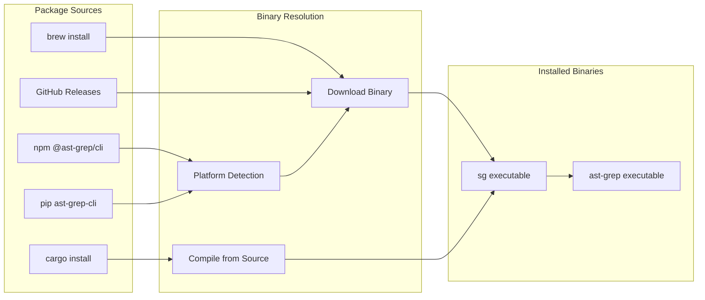
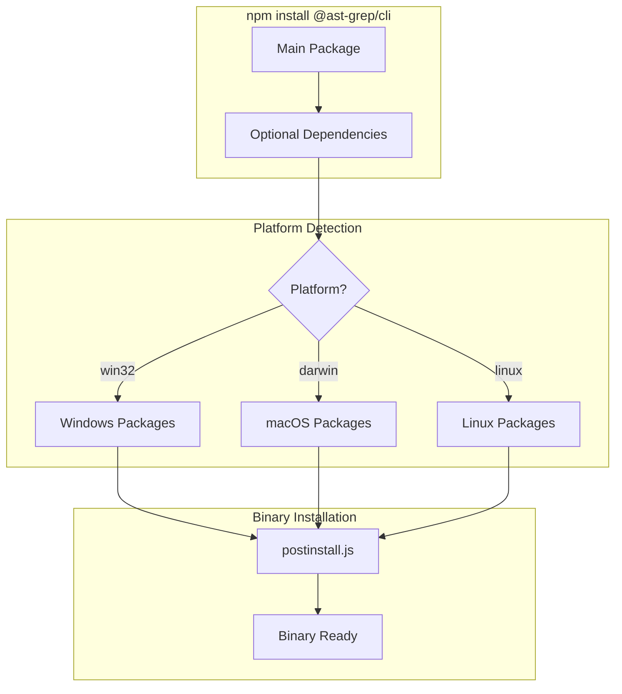
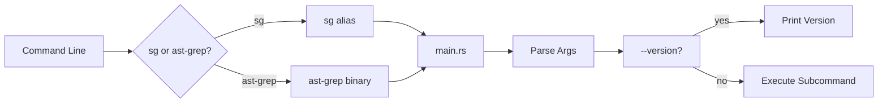
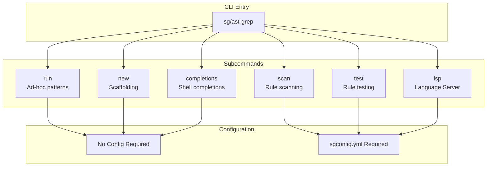

# Getting Started

> **Source:** https://deepwiki.com/ast-grep/ast-grep/1.3-getting-started

**Relevant source files:**

- [crates/cli/src/main.rs](https://github.com/ast-grep/ast-grep/blob/3ae01aec/crates/cli/src/main.rs)
- [npm/package.json](https://github.com/ast-grep/ast-grep/blob/3ae01aec/npm/package.json)
- [npm/platforms/darwin-arm64/package.json](https://github.com/ast-grep/ast-grep/blob/3ae01aec/npm/platforms/darwin-arm64/package.json)
- [npm/platforms/darwin-x64/package.json](https://github.com/ast-grep/ast-grep/blob/3ae01aec/npm/platforms/darwin-x64/package.json)
- [npm/platforms/linux-x64-gnu/package.json](https://github.com/ast-grep/ast-grep/blob/3ae01aec/npm/platforms/linux-x64-gnu/package.json)
- [npm/platforms/win32-x64-msvc/package.json](https://github.com/ast-grep/ast-grep/blob/3ae01aec/npm/platforms/win32-x64-msvc/package.json)

This document provides instructions for installing ast-grep and running your first commands. It covers installation from various package managers (npm, pip, cargo, and system package managers) and basic usage patterns to verify the installation.

For detailed documentation of CLI commands and options, see [Commands Overview](../cli-tool/5.1-commands-overview.md). For information about configuring ast-grep projects with rules, see [Project Configuration](../rule-system/3.5-project-configuration.md).

---

## Installation Methods

ast-grep is distributed through multiple package ecosystems to support different development environments. The tool is published as native binaries to avoid runtime dependencies and maximize performance.

### Installation Decision Matrix

| Method | Use Case | Platforms | Requires |
|--------|----------|-----------|----------|
| npm | Node.js projects, CI/CD | All | Node.js 12+ |
| pip | Python projects | All | Python 3.7+ |
| cargo | Rust projects, build from source | All | Rust toolchain |
| Homebrew | macOS system-wide | macOS | Homebrew |
| Scoop | Windows system-wide | Windows | Scoop |
| GitHub Releases | Direct binary download | All | None |

**Installation flow from package managers to executable binaries:**



**Sources:** [npm/package.json1-44](https://github.com/ast-grep/ast-grep/blob/3ae01aec/npm/package.json#L1-L44)

---

### Via npm

The `@ast-grep/cli` package provides pre-compiled native binaries for Node.js environments. The package uses optional dependencies to download the correct platform-specific binary during installation.

For project-local installation:

```bash
npm install @ast-grep/cli
npx ast-grep --version
```

For global installation:

```bash
npm install -g @ast-grep/cli
ast-grep --version
```

#### Platform-Specific Packages

The main `@ast-grep/cli` package [npm/package.json40-43](https://github.com/ast-grep/ast-grep/blob/3ae01aec/npm/package.json#L40-L43) provides two binary aliases (`sg` and `ast-grep`) and declares optional dependencies on platform-specific packages:

| Platform Package | OS | CPU | Additional Constraints |
|------------------|-----|-----|------------------------|
| `@ast-grep/cli-win32-x64-msvc` | Windows | x64 | - |
| `@ast-grep/cli-win32-ia32-msvc` | Windows | ia32 | - |
| `@ast-grep/cli-win32-arm64-msvc` | Windows | ARM64 | - |
| `@ast-grep/cli-darwin-x64` | macOS | x64 | - |
| `@ast-grep/cli-darwin-arm64` | macOS | ARM64 | - |
| `@ast-grep/cli-linux-x64-gnu` | Linux | x64 | glibc |
| `@ast-grep/cli-linux-arm64-gnu` | Linux | ARM64 | glibc |

The `postinstall.js` script [npm/package.json29](https://github.com/ast-grep/ast-grep/blob/3ae01aec/npm/package.json#L29-L29) detects the current platform and ensures the correct binary is available. Platform-specific packages use npm's `os`, `cpu`, and `libc` fields to restrict installation to compatible systems [npm/platforms/linux-x64-gnu/package.json4-12](https://github.com/ast-grep/ast-grep/blob/3ae01aec/npm/platforms/linux-x64-gnu/package.json#L4-L12):

```json
{
  "os": ["linux"],
  "cpu": ["x64"],
  "libc": ["glibc"]
}
```

**npm package resolution for platform-specific binaries:**



**Sources:** [npm/package.json1-44](https://github.com/ast-grep/ast-grep/blob/3ae01aec/npm/package.json#L1-L44) [npm/platforms/win32-x64-msvc/package.json1-30](https://github.com/ast-grep/ast-grep/blob/3ae01aec/npm/platforms/win32-x64-msvc/package.json#L1-L30) [npm/platforms/darwin-arm64/package.json1-30](https://github.com/ast-grep/ast-grep/blob/3ae01aec/npm/platforms/darwin-arm64/package.json#L1-L30) [npm/platforms/linux-x64-gnu/package.json1-33](https://github.com/ast-grep/ast-grep/blob/3ae01aec/npm/platforms/linux-x64-gnu/package.json#L1-L33) [npm/platforms/darwin-x64/package.json1-30](https://github.com/ast-grep/ast-grep/blob/3ae01aec/npm/platforms/darwin-x64/package.json#L1-L30)

---

### Via pip

The Python ecosystem provides two packages: `ast-grep-cli` (binary wrapper) and `ast_grep_py` (Python bindings). For command-line usage, install the CLI package:

```bash
pip install ast-grep-cli
ast-grep --version
```

This installs platform-specific wheels containing pre-compiled binaries. The package provides the same `sg` and `ast-grep` command-line tools.

For programmatic usage in Python code, install the library package (see [Python API](../python-integration/8.1-python-api.md)):

```bash
pip install ast_grep_py
```

---

### Via cargo

For Rust developers or to build from source, install using cargo:

```bash
cargo install ast-grep --locked
sg --version
```

This compiles ast-grep with all default language features enabled. To reduce compilation time or binary size, use feature flags to select specific languages:

```bash
# Minimal build with only TypeScript support
cargo install ast-grep --no-default-features --features=typescript --locked
```

The `--locked` flag ensures dependencies match the tested `Cargo.lock` versions.

---

### Via System Package Managers

#### Homebrew (macOS/Linux)

```bash
brew install ast-grep
sg --version
```

#### Scoop (Windows)

```bash
scoop install ast-grep
sg --version
```

#### From GitHub Releases

Download pre-compiled binaries directly from [GitHub Releases](https://github.com/ast-grep/ast-grep/releases):

1. Navigate to the latest release
2. Download the archive matching your platform (e.g., `ast-grep-x86_64-apple-darwin.zip`)
3. Extract the archive
4. Move the binary to a directory in your `PATH`

---

## Verifying Installation

After installation, verify that ast-grep is accessible and functional:

```bash
ast-grep --version
```

Or using the shorter alias:

```bash
sg --version
```

Both commands should display version information (e.g., `ast-grep 0.40.5`). The tool provides two command names for convenience:

- `ast-grep`: Full command name
- `sg`: Short alias for faster typing

**CLI entry point and version verification flow:**



**Sources:** [crates/cli/src/main.rs1-9](https://github.com/ast-grep/ast-grep/blob/3ae01aec/crates/cli/src/main.rs#L1-L9)

---

## Basic Usage Examples

### Simple Pattern Search

Search for a pattern in a single file:

```bash
sg -p 'console.log($$$)' -l javascript test.js
```

This searches `test.js` for all `console.log()` calls, where `$$$` matches any arguments.

### Recursive Directory Search

Search all JavaScript files in a directory:

```bash
sg -p 'var $VAR = $VALUE' -l js ./src
```

The `--lang` flag specifies the programming language. The pattern captures variable names as `$VAR` and their initializers as `$VALUE`.

### Interactive Replacement

Search and interactively apply fixes:

```bash
sg -p 'var $VAR = $VALUE' -r 'let $VAR = $VALUE' -l js --interactive ./src
```

This finds `var` declarations and prompts to replace them with `let`. The `--interactive` flag shows each match and asks for confirmation.

For comprehensive documentation of available commands, see [Commands Overview](../cli-tool/5.1-commands-overview.md).

---

## Command Structure

ast-grep provides several subcommands for different workflows:

| Command | Purpose | Requires Config |
|---------|---------|-----------------|
| `run` | Ad-hoc pattern search and replace | No |
| `scan` | Apply rule collections | Yes (sgconfig.yml) |
| `test` | Verify rule correctness | Yes (sgconfig.yml) |
| `new` | Scaffold projects, rules, tests | Optional |
| `lsp` | Start language server for IDE | Optional |
| `completions` | Generate shell completions | No |

**CLI command structure and configuration dependencies:**



**Sources:** [crates/cli/src/main.rs1-9](https://github.com/ast-grep/ast-grep/blob/3ae01aec/crates/cli/src/main.rs#L1-L9)

---

## Next Steps

### For Ad-Hoc Searches

If you want to perform one-off code searches without creating configuration files:

- Learn pattern syntax and meta-variables in [Key Concepts](./1.2-key-concepts.md)
- Explore the `run` command in detail at [Run Command](../cli-tool/5.2-run-command.md)

### For Rule-Based Analysis

If you want to create reusable rules for code quality checks:

- Set up a project configuration: [Project Configuration](../rule-system/3.5-project-configuration.md)
- Learn rule syntax: [Rule Configuration Format](../rule-system/3.1-rule-configuration-format.md)
- Test your rules: [Testing Rules](../rule-system/3.4-testing-rules.md)

### For IDE Integration

If you want diagnostics and quick fixes in your editor:

- Start the language server: [LSP Architecture](../lsp/6.1-lsp-architecture.md)
- Configure your editor: [Editor Integration](../lsp/6.2-editor-integration.md)

### For Programmatic Usage

If you want to integrate ast-grep into tools or scripts:

- Node.js: [NAPI API Reference](../nodejs-integration/7.1-napi-api-reference.md)
- Python: [Python API](../python-integration/8.1-python-api.md)
- Rust: [Core Library](../core-library/2-core-library.md)

---

## Troubleshooting

### Binary Not Found

If the `ast-grep` or `sg` command is not found after npm installation:

1. Verify the package is installed: `npm list -g @ast-grep/cli`
2. Check that npm's global bin directory is in your PATH
3. Try using npx: `npx ast-grep --version`

### Platform-Specific Issues

If installation fails with platform compatibility errors:

1. Check your Node.js version: `node --version` (requires 12.0.0+)
2. Verify your platform is supported (see Platform-Specific Packages table above)
3. For Linux, ensure you're using glibc (not musl) or use the cargo installation method

### Build from Source Issues

If cargo installation fails:

1. Update Rust toolchain: `rustup update`
2. Install required build dependencies for tree-sitter C parsers
3. Use `--locked` flag to match tested dependency versions

**Sources:** [npm/package.json10-11](https://github.com/ast-grep/ast-grep/blob/3ae01aec/npm/package.json#L10-L11) [npm/package.json31-39](https://github.com/ast-grep/ast-grep/blob/3ae01aec/npm/package.json#L31-L39)
