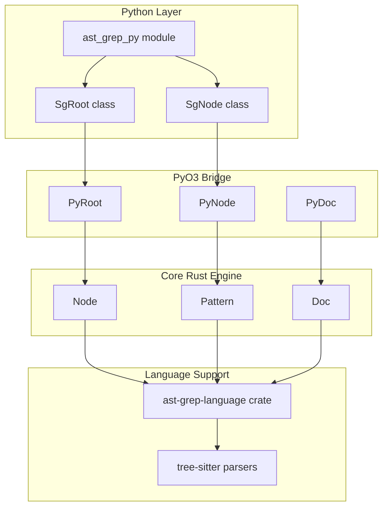
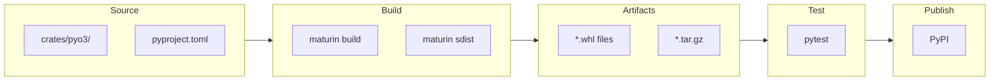
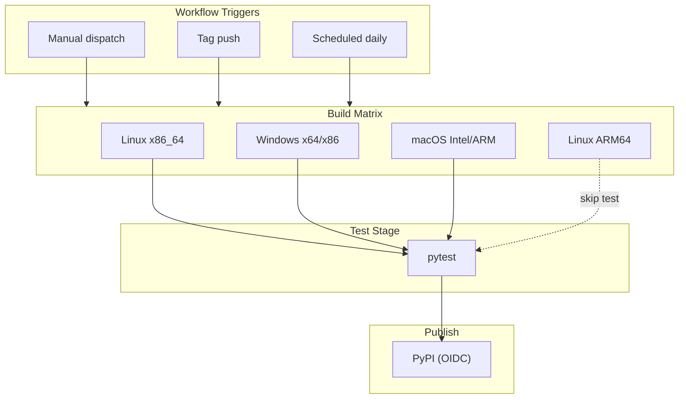

# Python Integration

> Relevant source files:
> - [.github/workflows/coverage.yaml](https://github.com/ast-grep/ast-grep/blob/3ae01aec/.github/workflows/coverage.yaml)
> - [.github/workflows/napi.yml](https://github.com/ast-grep/ast-grep/blob/3ae01aec/.github/workflows/napi.yml)
> - [.github/workflows/pyo3.yml](https://github.com/ast-grep/ast-grep/blob/3ae01aec/.github/workflows/pyo3.yml)
> - [.github/workflows/pypi.yml](https://github.com/ast-grep/ast-grep/blob/3ae01aec/.github/workflows/pypi.yml)
> - [.github/workflows/release.yml](https://github.com/ast-grep/ast-grep/blob/3ae01aec/.github/workflows/release.yml)
> - [rust-toolchain.toml](https://github.com/ast-grep/ast-grep/blob/3ae01aec/rust-toolchain.toml)

This page documents the Python integration for ast-grep, focusing on the PyO3-based native bindings that expose the core AST search and rewrite engine to Python. These bindings allow Python code to directly access ast-grep's pattern matching, AST traversal, and code transformation features, without invoking the CLI as a subprocess.

For the Node.js integration, see [Node.js Integration](../nodejs-integration/7-nodejs-integration.md). For the CLI tool, see [CLI Tool](../cli-tool/5-cli-tool.md).

## Overview

ast-grep provides two Python packages:

| Package | Purpose | Technology | Location |
|---|---|---|---|
| `ast_grep_py` | Native Python bindings | PyO3 + Maturin | [crates/pyo3/](https://github.com/ast-grep/ast-grep/blob/3ae01aec/crates/pyo3/) |
| `ast_grep_cli` | CLI wrapper (Python package) | Bundled binaries | Root directory |

- `ast_grep_py` exposes the core AST manipulation and pattern matching API to Python.
- `ast_grep_cli` is a Python package that wraps the CLI binary for subprocess-based usage.

The remainder of this page focuses on the native bindings (`ast_grep_py`).

Sources: [.github/workflows/pyo3.yml4-5](https://github.com/ast-grep/ast-grep/blob/3ae01aec/.github/workflows/pyo3.yml#L4-L5) [.github/workflows/pypi.yml21](https://github.com/ast-grep/ast-grep/blob/3ae01aec/.github/workflows/pypi.yml#L21-L21)

## Python Binding Architecture

### Diagram: Python Integration and Code Entities

This diagram shows the flow from Python code (`ast_grep_py`, `SgRoot`, `SgNode`) through the PyO3 bridge (`PyRoot`, `PyNode`, `PyDoc`) to the core Rust engine (`Node`, `Pattern`, `Doc`), and finally to language support via `ast-grep-language` and `tree-sitter` parsers.

Sources: [crates/pyo3/](https://github.com/ast-grep/ast-grep/blob/3ae01aec/crates/pyo3/) [.github/workflows/pyo3.yml54](https://github.com/ast-grep/ast-grep/blob/3ae01aec/.github/workflows/pyo3.yml#L54-L54)

## Build and Distribution Pipeline

### Diagram: Build and Distribution Flow with Code Entities

- Source code and configuration are located in `crates/pyo3/` and `pyproject.toml`.
- Wheels and source distributions are built using `maturin`.
- Artifacts are tested with `pytest` and uploaded to PyPI.

Sources: [.github/workflows/pyo3.yml46-54](https://github.com/ast-grep/ast-grep/blob/3ae01aec/.github/workflows/pyo3.yml#L46-L54) [.github/workflows/pyo3.yml5](https://github.com/ast-grep/ast-grep/blob/3ae01aec/.github/workflows/pyo3.yml#L5-L5)

## Cross-Platform Build Matrix

The Python bindings are built and tested for multiple platforms and Python versions using GitHub Actions. The build matrix covers:

| Platform/Target | Architecture | Container/Runner | Notes / Special Config |
|---|---|---|---|
| `x86_64-unknown-linux-gnu` | x86_64 | manylinux2_28 | Standard build |
| `aarch64-unknown-linux-gnu` | ARM64 | manylinux2_28 | Cross-compilation |
| `x64` (Windows) | x86_64 | windows-2022 | Full test execution |
| `x86` (Windows) | i686 | windows-2022 | Full test execution |
| `x86_64` (macOS) | Intel | macos-latest | Compatibility build |
| `aarch64` (macOS) | Apple Silicon | macos-latest | Full test execution |

- Linux builds use `manylinux2_28` for compatibility with tree-sitter requirements.
- Windows and macOS builds are tested for all supported Python versions.

Sources: [.github/workflows/pyo3.yml37-38](https://github.com/ast-grep/ast-grep/blob/3ae01aec/.github/workflows/pyo3.yml#L37-L38) [.github/workflows/pyo3.yml52](https://github.com/ast-grep/ast-grep/blob/3ae01aec/.github/workflows/pyo3.yml#L52-L52) [.github/workflows/pyo3.yml72](https://github.com/ast-grep/ast-grep/blob/3ae01aec/.github/workflows/pyo3.yml#L72-L72) [.github/workflows/pyo3.yml101](https://github.com/ast-grep/ast-grep/blob/3ae01aec/.github/workflows/pyo3.yml#L101-L101) [.github/workflows/pyo3.yml115](https://github.com/ast-grep/ast-grep/blob/3ae01aec/.github/workflows/pyo3.yml#L115-L115)

## Python Version Support

Wheels are built for Python versions 3.9, 3.10, 3.11, 3.12, and 3.13 for each supported platform.

Sources: [.github/workflows/pyo3.yml5](https://github.com/ast-grep/ast-grep/blob/3ae01aec/.github/workflows/pyo3.yml#L5-L5) [.github/workflows/pyo3.yml53](https://github.com/ast-grep/ast-grep/blob/3ae01aec/.github/workflows/pyo3.yml#L53-L53)

## Testing Infrastructure

Automated tests are run using `pytest` on built wheels for all major platforms and Python versions.

| Platform | Condition | Test Command |
|---|---|---|
| Linux x86_64 | Always | `pip install --no-index --find-links=dist ast_grep_py --force-reinstall && pytest` |
| Windows (x64/x86) | Always | `pip install --no-index --find-links=dist ast_grep_py --force-reinstall && pytest` |
| macOS aarch64 | Always | `pip install --no-index --find-links=dist ast_grep_py --force-reinstall && pytest` |
| Linux aarch64 | Skip | Cross-compilation target only |
| macOS x86_64 | Skip | Compatibility build only |

Sources: [.github/workflows/pyo3.yml58-61](https://github.com/ast-grep/ast-grep/blob/3ae01aec/.github/workflows/pyo3.yml#L58-L61) [.github/workflows/pyo3.yml87-90](https://github.com/ast-grep/ast-grep/blob/3ae01aec/.github/workflows/pyo3.yml#L87-L90)

## CI/CD Pipeline

The Python integration uses a multi-platform CI/CD pipeline with the following triggers and release process:

### Workflow Triggers

| Trigger Type | Configuration | Purpose |
|---|---|---|
| Manual Dispatch | `workflow_dispatch` + `need_release` | Manual test and release |
| Tag Push | `[0-9]+.*` pattern | Automatic release |
| Scheduled | Daily at 9 AM UTC | Regular build/test verification |

### Release Process

- Wheels and source distributions are built for all platforms and Python versions.
- Artifacts are uploaded to PyPI using trusted publishing (OIDC, no long-lived tokens).

#### Diagram: CI/CD and Release Flow

Sources: [.github/workflows/pyo3.yml145](https://github.com/ast-grep/ast-grep/blob/3ae01aec/.github/workflows/pyo3.yml#L145-L145) [.github/workflows/pyo3.yml147-148](https://github.com/ast-grep/ast-grep/blob/3ae01aec/.github/workflows/pyo3.yml#L147-L148) [.github/workflows/pyo3.yml156-159](https://github.com/ast-grep/ast-grep/blob/3ae01aec/.github/workflows/pyo3.yml#L156-L159)

## Package Configuration

The Python bindings use environment variables for consistent configuration:

| Variable | Value | Purpose |
|---|---|---|
| `PACKAGE_NAME` | `ast_grep_py` | Maturin package identifier |
| `PYTHON_VERSION` | `'3.9 3.10 3.11 3.12 3.13'` | Supported Python versions |
| `CARGO_INCREMENTAL` | `0` | Disable incremental compilation |
| `CARGO_TERM_COLOR` | `always` | Force colored output |

The package name uses underscores (`ast_grep_py`) instead of hyphens because maturin package naming conventions require underscore separators.

Sources: [.github/workflows/pyo3.yml4](https://github.com/ast-grep/ast-grep/blob/3ae01aec/.github/workflows/pyo3.yml#L4-L4) [.github/workflows/pyo3.yml5-9](https://github.com/ast-grep/ast-grep/blob/3ae01aec/.github/workflows/pyo3.yml#L5-L9)
