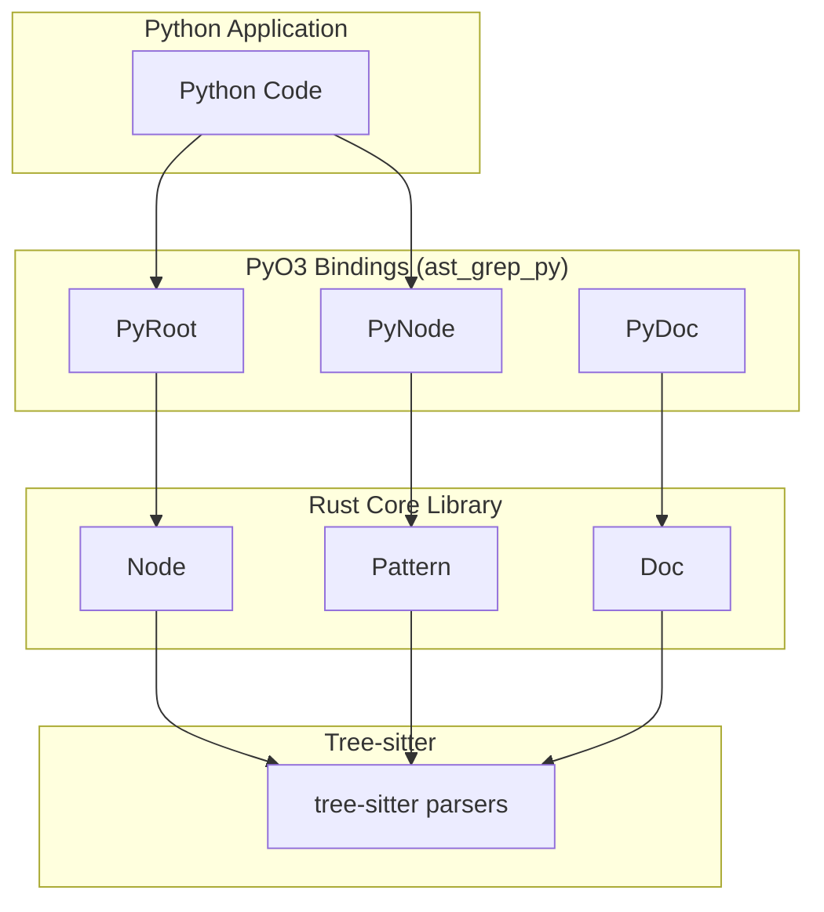
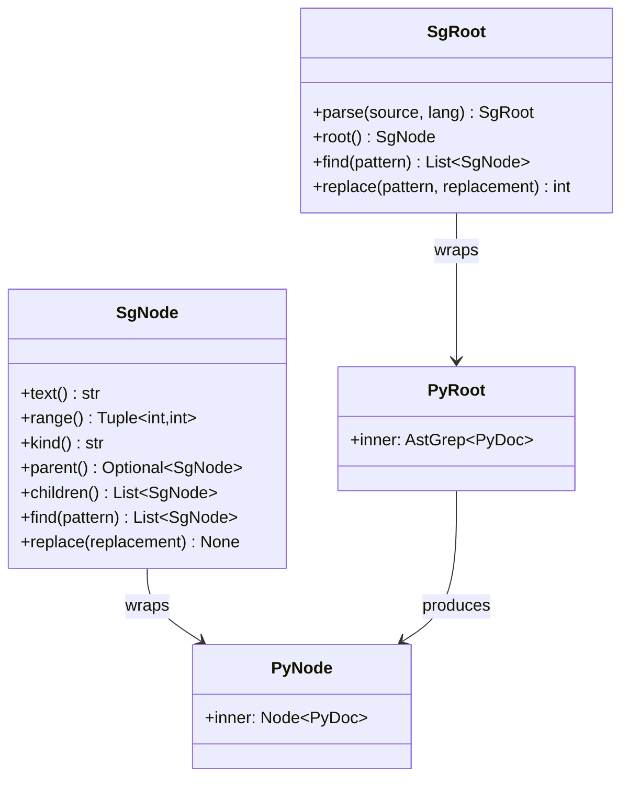
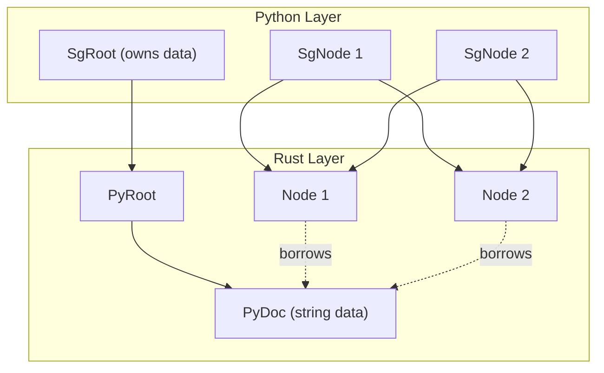

# PyO3 API Reference

> Relevant source files:
> - [.github/workflows/coverage.yaml](https://github.com/ast-grep/ast-grep/blob/3ae01aec/.github/workflows/coverage.yaml)
> - [.github/workflows/napi.yml](https://github.com/ast-grep/ast-grep/blob/3ae01aec/.github/workflows/napi.yml)
> - [.github/workflows/pyo3.yml](https://github.com/ast-grep/ast-grep/blob/3ae01aec/.github/workflows/pyo3.yml)
> - [.github/workflows/pypi.yml](https://github.com/ast-grep/ast-grep/blob/3ae01aec/.github/workflows/pypi.yml)
> - [.github/workflows/release.yml](https://github.com/ast-grep/ast-grep/blob/3ae01aec/.github/workflows/release.yml)
> - [rust-toolchain.toml](https://github.com/ast-grep/ast-grep/blob/3ae01aec/rust-toolchain.toml)

This document provides a precise reference for the Python API exposed by ast-grep via its PyO3 bindings, distributed as the `ast_grep_py` Python module. It covers the main classes, methods, and data structures available to Python users for AST parsing, pattern matching, and code manipulation. The focus is on the API surface, object model, and method semantics.

For information about Python package distribution, platform support, and wheel building, see [Python Package Distribution](8.2-package-distribution.md). For details on the Rust core library and its traits, see [Node and Document API](../core-library/2.1-node-and-document-api.md). For the JavaScript/TypeScript API, see [NAPI API Reference](../nodejs-integration/7.1-napi-api-reference.md).

---

## Purpose and Scope

- **Purpose:**  
  To document the Python API provided by the `ast_grep_py` module, including class structure, method signatures, and usage patterns for AST-based code search and rewrite in Python.
  
- **Scope:**
  - Python-facing classes and methods (e.g., `SgRoot`, `SgNode`)
  - How these map to Rust core abstractions (`Node`, `Doc`)
  - Supported operations: parsing, traversal, pattern matching, code replacement
  - Data encoding and memory model as it relates to Python
  - Excludes: build/distribution details, CLI usage, NAPI/JS API, and LSP integration

---

## System Context

The PyO3 bindings are a thin interface layer on top of the Rust core, exposing AST manipulation and pattern matching to Python. The bindings are implemented in the `crates/pyo3` directory and distributed as the `ast_grep_py` package on PyPI.

### Diagram: "PyO3 Binding Layer in ast-grep System"



**Sources:**

- [crates/pyo3/src/lib.rs](https://github.com/ast-grep/ast-grep/blob/3ae01aec/crates/pyo3/src/lib.rs)
- [crates/pyo3/src/node.rs](https://github.com/ast-grep/ast-grep/blob/3ae01aec/crates/pyo3/src/node.rs)
- [crates/pyo3/src/root.rs](https://github.com/ast-grep/ast-grep/blob/3ae01aec/crates/pyo3/src/root.rs)

---

## Main Python API Classes

The Python API exposes two primary classes:

| Python Class | Rust Implementation | Description |
|---|---|---|
| `SgRoot` | `PyRoot` | Entry point for parsing source code and managing the AST. Owns the document. |
| `SgNode` | `PyNode` | Represents a node in the AST. Provides traversal, pattern matching, and code manipulation methods. |

### Diagram: "Mapping of Python API Classes to Rust Entities"



**Sources:**

- [crates/pyo3/src/lib.rs](https://github.com/ast-grep/ast-grep/blob/3ae01aec/crates/pyo3/src/lib.rs)
- [crates/pyo3/src/node.rs](https://github.com/ast-grep/ast-grep/blob/3ae01aec/crates/pyo3/src/node.rs)
- [crates/pyo3/src/root.rs](https://github.com/ast-grep/ast-grep/blob/3ae01aec/crates/pyo3/src/root.rs)

---

## SgRoot: Entry Point for Parsing and Search

`SgRoot` is the main entry point for parsing source code and performing AST-based operations.

### Key Methods

| Method | Description |
|---|---|
| `parse(source: str, lang: str) -> SgRoot` | Parses the given source code string using the specified language. Returns an `SgRoot` instance. |
| `root() -> SgNode` | Returns the root AST node. |
| `find(pattern: str) -> List[SgNode]` | Finds all nodes matching the given pattern. |
| `replace(pattern: str, replacement: str) -> int` | Replaces all matches of the pattern with the replacement string. Returns the number of replacements. |

#### Example Usage

```python
import ast_grep_py as ast_grep

# Parse source code
root = ast_grep.SgRoot.parse("console.log('hello')", "javascript")

# Get root node
root_node = root.root()

# Find all console.log calls
matches = root.find("console.log($MSG)")
print(f"Found {len(matches)} matches")

# Replace console.log with console.info
count = root.replace("console.log($MSG)", "console.info($MSG)")
print(f"Replaced {count} occurrences")
```

**Sources:**

- [crates/pyo3/src/root.rs](https://github.com/ast-grep/ast-grep/blob/3ae01aec/crates/pyo3/src/root.rs)
- [crates/pyo3/src/lib.rs](https://github.com/ast-grep/ast-grep/blob/3ae01aec/crates/pyo3/src/lib.rs)

---

## SgNode: AST Node Operations

`SgNode` represents a node in the AST and provides methods for traversal, inspection, and manipulation.

### Key Methods

| Method | Description |
|---|---|
| `text() -> str` | Returns the source text corresponding to this node. |
| `range() -> Tuple[int, int]` | Returns the byte offset range of the node in the source. |
| `kind() -> str` | Returns the node's kind (tree-sitter type). |
| `parent() -> Optional[SgNode]` | Returns the parent node, or `None` if root. |
| `children() -> List[SgNode]` | Returns the list of child nodes. |
| `find(pattern: str) -> List[SgNode]` | Finds all descendant nodes matching the pattern. |
| `replace(replacement: str) -> None` | Replaces this node's text with the given replacement. |

#### Example Usage

```python
import ast_grep_py as ast_grep

# Parse source code
root = ast_grep.SgRoot.parse("function foo() { return 42; }", "javascript")
node = root.root()

# Inspect the node
print(f"Kind: {node.kind()}")
print(f"Text: {node.text()}")
print(f"Range: {node.range()}")

# Traverse children
for child in node.children():
    print(f"Child kind: {child.kind()}")

# Find nested patterns
functions = node.find("function $NAME($$$PARAMS) { $$$BODY }")
for func in functions:
    print(f"Function: {func.text()}")
```

**Sources:**

- [crates/pyo3/src/node.rs](https://github.com/ast-grep/ast-grep/blob/3ae01aec/crates/pyo3/src/node.rs)
- [crates/pyo3/src/lib.rs](https://github.com/ast-grep/ast-grep/blob/3ae01aec/crates/pyo3/src/lib.rs)

---

## Pattern Matching and Replacement

Pattern matching in the Python API uses the same meta-variable syntax and semantics as the Rust core. Patterns are specified as strings, and meta-variables are denoted with `$VAR` syntax.

- `find(pattern: str)` methods are available on both `SgRoot` and `SgNode`.
- `replace(pattern: str, replacement: str)` on `SgRoot` applies replacements globally.
- `replace(replacement: str)` on `SgNode` applies to a single node.

### Table: Pattern Matching Methods

| Class | Method Signature | Description |
|---|---|---|
| SgRoot | `find(pattern: str) -> List[SgNode]` | Find all matches in the document |
| SgNode | `find(pattern: str) -> List[SgNode]` | Find all matches in the subtree |
| SgRoot | `replace(pattern: str, replacement: str) -> int` | Replace all matches in the document |
| SgNode | `replace(replacement: str) -> None` | Replace this node's text |

**Sources:**

- [crates/pyo3/src/root.rs](https://github.com/ast-grep/ast-grep/blob/3ae01aec/crates/pyo3/src/root.rs)
- [crates/pyo3/src/node.rs](https://github.com/ast-grep/ast-grep/blob/3ae01aec/crates/pyo3/src/node.rs)

---

## Data Encoding and Memory Model

- The PyO3 bridge uses UTF-8 encoding for all source text, matching Python's native string representation.
- The `PyDoc` struct implements the `Doc` trait, providing the necessary abstraction for the Rust core to operate on Python strings.
- All AST nodes (`SgNode`) are wrappers around Rust-side `Node<'_, PyDoc>` objects, with memory managed by the owning `SgRoot` (`PyRoot`).

### Diagram: "Data Ownership and Lifetime in PyO3 API"



**Sources:**

- [crates/pyo3/src/lib.rs](https://github.com/ast-grep/ast-grep/blob/3ae01aec/crates/pyo3/src/lib.rs)
- [crates/pyo3/src/node.rs](https://github.com/ast-grep/ast-grep/blob/3ae01aec/crates/pyo3/src/node.rs)
- [crates/pyo3/src/root.rs](https://github.com/ast-grep/ast-grep/blob/3ae01aec/crates/pyo3/src/root.rs)

---

## Error Handling

- Most API methods raise Python exceptions (e.g., `ValueError`, `TypeError`) on invalid input or parse errors.
- Pattern syntax errors are surfaced as exceptions at the Python layer.

**Sources:**

- [crates/pyo3/src/lib.rs](https://github.com/ast-grep/ast-grep/blob/3ae01aec/crates/pyo3/src/lib.rs)
- [crates/pyo3/src/node.rs](https://github.com/ast-grep/ast-grep/blob/3ae01aec/crates/pyo3/src/node.rs)

---

## Supported Languages

- The `lang` argument to `SgRoot.parse` must be a supported language identifier (see [Supported Languages](../language-support/4.1-supported-languages.md)).
- Language support is provided via tree-sitter parsers integrated in the Rust core.

**Sources:**

- [crates/pyo3/src/lib.rs](https://github.com/ast-grep/ast-grep/blob/3ae01aec/crates/pyo3/src/lib.rs)

---

## Summary Table: Python API Surface

| Class | Method | Purpose |
|---|---|---|
| SgRoot | `parse(source, lang)` | Parse source code into AST |
| SgRoot | `root()` | Get root AST node |
| SgRoot | `find(pattern)` | Find all matches in document |
| SgRoot | `replace(pattern, repl)` | Replace all matches in document |
| SgNode | `text()` | Get node text |
| SgNode | `range()` | Get node byte range |
| SgNode | `kind()` | Get node kind/type |
| SgNode | `parent()` | Get parent node |
| SgNode | `children()` | Get child nodes |
| SgNode | `find(pattern)` | Find matches in subtree |
| SgNode | `replace(replacement)` | Replace this node's text |

**Sources:**

- [crates/pyo3/src/lib.rs](https://github.com/ast-grep/ast-grep/blob/3ae01aec/crates/pyo3/src/lib.rs)
- [crates/pyo3/src/node.rs](https://github.com/ast-grep/ast-grep/blob/3ae01aec/crates/pyo3/src/node.rs)
- [crates/pyo3/src/root.rs](https://github.com/ast-grep/ast-grep/blob/3ae01aec/crates/pyo3/src/root.rs)

---

## Additional Notes

- The PyO3 API is designed to closely mirror the Rust and NAPI APIs, enabling similar workflows across languages.
- All AST operations are performed in memory; no file I/O is handled by the API directly.
- For advanced rule-based matching and YAML configuration, use the CLI or Rust API (see [Rule System](../rule-system/3-rule-system.md)).

---

**Sources for this page:**

- [crates/pyo3/src/lib.rs](https://github.com/ast-grep/ast-grep/blob/3ae01aec/crates/pyo3/src/lib.rs)
- [crates/pyo3/src/node.rs](https://github.com/ast-grep/ast-grep/blob/3ae01aec/crates/pyo3/src/node.rs)
- [crates/pyo3/src/root.rs](https://github.com/ast-grep/ast-grep/blob/3ae01aec/crates/pyo3/src/root.rs)
- [crates/pyo3](https://github.com/ast-grep/ast-grep/blob/3ae01aec/crates/pyo3)
