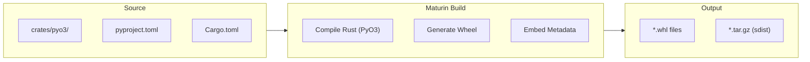
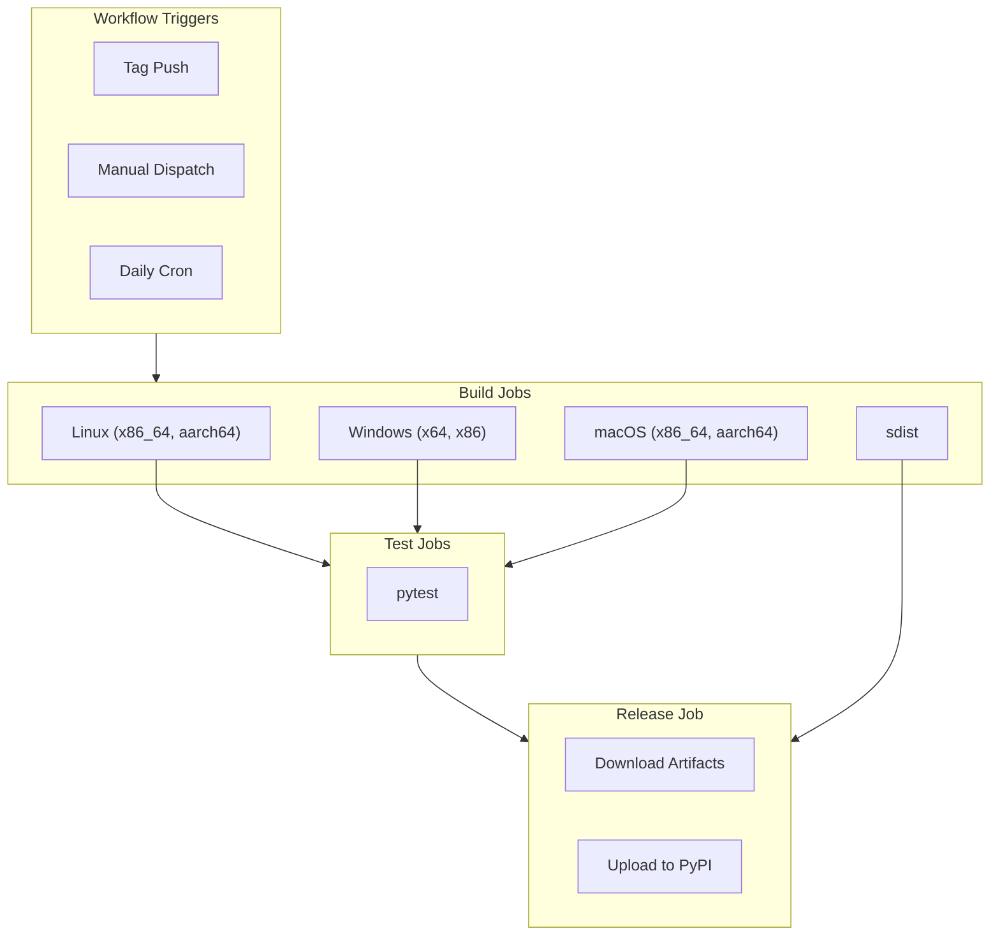
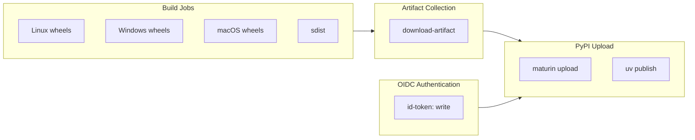
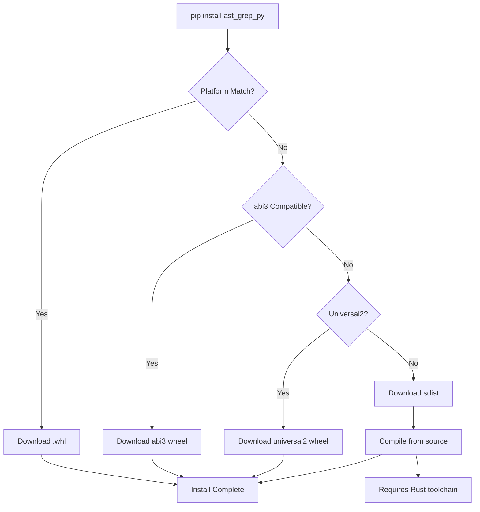

# Package Distribution

> Relevant source files:
> - [.github/workflows/coverage.yaml](https://github.com/ast-grep/ast-grep/blob/3ae01aec/.github/workflows/coverage.yaml)
> - [.github/workflows/napi.yml](https://github.com/ast-grep/ast-grep/blob/3ae01aec/.github/workflows/napi.yml)
> - [.github/workflows/pyo3.yml](https://github.com/ast-grep/ast-grep/blob/3ae01aec/.github/workflows/pyo3.yml)
> - [.github/workflows/pypi.yml](https://github.com/ast-grep/ast-grep/blob/3ae01aec/.github/workflows/pypi.yml)
> - [.github/workflows/release.yml](https://github.com/ast-grep/ast-grep/blob/3ae01aec/.github/workflows/release.yml)
> - [rust-toolchain.toml](https://github.com/ast-grep/ast-grep/blob/3ae01aec/rust-toolchain.toml)

## Purpose and Scope

This document explains how ast-grep's Python packages are built and distributed to PyPI. It covers the maturin-based wheel building process, the multi-platform compilation matrix (manylinux, Windows, macOS across x86_64/aarch64/i686), and the automated PyPI publishing workflow using trusted publishing. For Python API usage, see [Python API](8.1-python-api.md). For npm CLI distribution, see [npm CLI Wrapper](../distribution/9.1-npm-cli-wrapper.md).

---

## Package Overview

ast-grep distributes two distinct Python packages to PyPI:

| Package Name | Purpose | Build Tool | Source Location |
|---|---|---|---|
| `ast_grep_py` | Python bindings to ast-grep core functionality | maturin + PyO3 | `crates/pyo3/` |
| `ast_grep_cli` | CLI tool wrapper (sg command) | maturin | Root directory |

The `ast_grep_py` package provides programmatic access to AST matching and transformation capabilities from Python code. The `ast_grep_cli` package enables users to install the `sg` and `ast-grep` command-line tools via `pip install ast_grep_cli`.

**Sources:** [.github/workflows/pyo3.yml4](https://github.com/ast-grep/ast-grep/blob/3ae01aec/.github/workflows/pyo3.yml#L4-L4) [.github/workflows/pypi.yml21](https://github.com/ast-grep/ast-grep/blob/3ae01aec/.github/workflows/pypi.yml#L21-L21)

---

## Build System Architecture

**Maturin Build Process**

Maturin is a build tool for Rust-based Python packages that integrates with PyO3. The `PyO3/maturin-action@v1` GitHub Action [.github/workflows/pyo3.yml47](https://github.com/ast-grep/ast-grep/blob/3ae01aec/.github/workflows/pyo3.yml#L47-L47) executes the build process:



1. **Compilation**: Rust code compiled with PyO3 bindings for target platform (e.g., `x86_64-unknown-linux-gnu`)
2. **Wheel Generation**: Creates platform-specific wheels (e.g., `ast_grep_py-0.x.x-cp310-cp310-manylinux_2_28_x86_64.whl`)
3. **Metadata Embedding**: Embeds `pyproject.toml` metadata into wheel
4. **Source Distribution**: Generates `sdist` via `maturin sdist` command [.github/workflows/pyo3.yml138](https://github.com/ast-grep/ast-grep/blob/3ae01aec/.github/workflows/pyo3.yml#L138-L138)

Cross-compilation for non-host architectures (e.g., building `aarch64-unknown-linux-gnu` on `x86_64` runners) is handled by the maturin action's built-in support.

**Sources:** [.github/workflows/pyo3.yml46-54](https://github.com/ast-grep/ast-grep/blob/3ae01aec/.github/workflows/pyo3.yml#L46-L54) [.github/workflows/pypi.yml36-49](https://github.com/ast-grep/ast-grep/blob/3ae01aec/.github/workflows/pypi.yml#L36-L49) [.github/workflows/pyo3.yml136-140](https://github.com/ast-grep/ast-grep/blob/3ae01aec/.github/workflows/pyo3.yml#L136-L140)

---

## Platform Support Matrix

### ast_grep_py (Python Bindings)

| Platform | Architecture | Rust Target | Wheel Tag | Runner |
|---|---|---|---|---|
| Linux | x86_64 | `x86_64-unknown-linux-gnu` | `manylinux_2_28_x86_64` | `ubuntu-22.04` |
| Linux | aarch64 | `aarch64-unknown-linux-gnu` | `manylinux_2_28_aarch64` | `ubuntu-22.04` |
| macOS | x86_64 | `x86_64-apple-darwin` | `macosx_10_13_x86_64` | `macos-latest` |
| macOS | aarch64 | `aarch64-apple-darwin` | `macosx_11_0_arm64` | `macos-latest` |
| Windows | x64 | `x86_64-pc-windows-msvc` | `win_amd64` | `windows-latest` |
| Windows | x86 | `i686-pc-windows-msvc` | `win32` | `windows-latest` |

Python versions supported: 3.10, 3.11, 3.12, 3.13, 3.14 (as specified in [.github/workflows/pyo3.yml5](https://github.com/ast-grep/ast-grep/blob/3ae01aec/.github/workflows/pyo3.yml#L5-L5))

**Sources:** [.github/workflows/pyo3.yml35-38](https://github.com/ast-grep/ast-grep/blob/3ae01aec/.github/workflows/pyo3.yml#L35-L38) [.github/workflows/pyo3.yml72](https://github.com/ast-grep/ast-grep/blob/3ae01aec/.github/workflows/pyo3.yml#L72-L72) [.github/workflows/pyo3.yml106](https://github.com/ast-grep/ast-grep/blob/3ae01aec/.github/workflows/pyo3.yml#L106-L106)

### ast_grep_cli (CLI Wrapper)

| Platform | Architecture | Rust Target | Additional Notes |
|---|---|---|---|
| Linux | x86_64 | `x86_64-unknown-linux-gnu` | manylinux 2_28 |
| Linux | aarch64 | `aarch64-unknown-linux-gnu` | manylinux 2_28 |
| macOS | Universal | `universal2-apple-darwin` | Supports both Intel and Apple Silicon |
| macOS | x86_64 | `x86_64-apple-darwin` | Intel-only build |
| Windows | x64 | `x86_64-pc-windows-msvc` | Windows |
| Windows | x86 | `i686-pc-windows-msvc` | 32-bit support |
| Windows | aarch64 | `aarch64-pc-windows-msvc` | ARM64 support |

The CLI package uses Python 3.13 for building abi3 wheels, which are forward-compatible with newer Python versions.

**Sources:** [.github/workflows/pypi.yml22](https://github.com/ast-grep/ast-grep/blob/3ae01aec/.github/workflows/pypi.yml#L22-L22) [.github/workflows/pypi.yml97-103](https://github.com/ast-grep/ast-grep/blob/3ae01aec/.github/workflows/pypi.yml#L97-L103) [.github/workflows/pypi.yml134-136](https://github.com/ast-grep/ast-grep/blob/3ae01aec/.github/workflows/pypi.yml#L134-L136)

---

## CI/CD Build Pipeline

### Workflow Architecture

**pyo3.yml and pypi.yml Workflow Structure**



**Sources:** [.github/workflows/pyo3.yml15-27](https://github.com/ast-grep/ast-grep/blob/3ae01aec/.github/workflows/pyo3.yml#L15-L27) [.github/workflows/pypi.yml3-14](https://github.com/ast-grep/ast-grep/blob/3ae01aec/.github/workflows/pypi.yml#L3-L14) [.github/workflows/pyo3.yml32-167](https://github.com/ast-grep/ast-grep/blob/3ae01aec/.github/workflows/pyo3.yml#L32-L167) [.github/workflows/pypi.yml28-196](https://github.com/ast-grep/ast-grep/blob/3ae01aec/.github/workflows/pypi.yml#L28-L196)

### Build Job Configuration

**jobs.linux Configuration**

The `linux` job [.github/workflows/pyo3.yml32-66](https://github.com/ast-grep/ast-grep/blob/3ae01aec/.github/workflows/pyo3.yml#L32-L66) uses a strategy matrix with two targets:

- `x86_64-unknown-linux-gnu`
- `aarch64-unknown-linux-gnu`

Key configuration: `manylinux: "2_28"` [.github/workflows/pyo3.yml52](https://github.com/ast-grep/ast-grep/blob/3ae01aec/.github/workflows/pyo3.yml#L52-L52) is required because tree-sitter does not compile on older manylinux versions. The workflow runs on `ubuntu-22.04` and tests only on `x86_64-unknown-linux-gnu` [.github/workflows/pyo3.yml56-57](https://github.com/ast-grep/ast-grep/blob/3ae01aec/.github/workflows/pyo3.yml#L56-L57) because GitHub runners are x86_64.

**jobs.windows Configuration**

The `windows` job [.github/workflows/pyo3.yml68-100](https://github.com/ast-grep/ast-grep/blob/3ae01aec/.github/workflows/pyo3.yml#L68-L100) builds for `x64` and `x86` architectures. Python versions 3.10-3.14 are installed [.github/workflows/pyo3.yml78-83](https://github.com/ast-grep/ast-grep/blob/3ae01aec/.github/workflows/pyo3.yml#L78-L83) to build wheels for each version. Tests run on both architectures [.github/workflows/pyo3.yml91-95](https://github.com/ast-grep/ast-grep/blob/3ae01aec/.github/workflows/pyo3.yml#L91-L95)

**jobs.macos Configuration**

The `macos` job [.github/workflows/pyo3.yml102-129](https://github.com/ast-grep/ast-grep/blob/3ae01aec/.github/workflows/pyo3.yml#L102-L129) targets `x86_64` and `aarch64`. Tests run only on `aarch64` [.github/workflows/pyo3.yml120](https://github.com/ast-grep/ast-grep/blob/3ae01aec/.github/workflows/pyo3.yml#L120-L120) because `macos-latest` runners are ARM-based. The workflow uses `--find-interpreter` [.github/workflows/pyo3.yml117](https://github.com/ast-grep/ast-grep/blob/3ae01aec/.github/workflows/pyo3.yml#L117-L117) to detect available Python versions.

**jobs.sdist Configuration**

The `sdist` job [.github/workflows/pyo3.yml131-145](https://github.com/ast-grep/ast-grep/blob/3ae01aec/.github/workflows/pyo3.yml#L131-L145) runs on `ubuntu-latest` and executes `maturin sdist --out dist` [.github/workflows/pyo3.yml138-139](https://github.com/ast-grep/ast-grep/blob/3ae01aec/.github/workflows/pyo3.yml#L138-L139) to create source distributions.

**Sources:** [.github/workflows/pyo3.yml32-145](https://github.com/ast-grep/ast-grep/blob/3ae01aec/.github/workflows/pyo3.yml#L32-L145)

---

## Testing Strategy

**Platform-Specific Test Execution**

**Test Conditions by Platform:**

| Workflow | Job | Test Condition | Reason |
|---|---|---|---|
| pyo3.yml | linux | `matrix.target == 'x86_64-unknown-linux-gnu'` | Runner is x86_64 |
| pyo3.yml | windows | Tests run on `x64` and `x86` | Both match runner arch |
| pyo3.yml | macos | `matrix.target == 'aarch64'` | macos-latest is ARM |
| pypi.yml | linux | `startsWith(matrix.target, 'x86_64')` | Runner is x86_64 |
| pypi.yml | windows | `!startsWith(matrix.platform.target, 'aarch64')` | No ARM runners |

The `pip install` command uses `--no-index --find-links=dist` [.github/workflows/pyo3.yml60](https://github.com/ast-grep/ast-grep/blob/3ae01aec/.github/workflows/pyo3.yml#L60-L60) to force local wheel installation, ensuring the built artifact is tested rather than a PyPI version.

**Sources:** [.github/workflows/pyo3.yml55-61](https://github.com/ast-grep/ast-grep/blob/3ae01aec/.github/workflows/pyo3.yml#L55-L61) [.github/workflows/pyo3.yml91-95](https://github.com/ast-grep/ast-grep/blob/3ae01aec/.github/workflows/pyo3.yml#L91-L95) [.github/workflows/pyo3.yml120-124](https://github.com/ast-grep/ast-grep/blob/3ae01aec/.github/workflows/pyo3.yml#L120-L124) [.github/workflows/pypi.yml154-158](https://github.com/ast-grep/ast-grep/blob/3ae01aec/.github/workflows/pypi.yml#L154-L158) [.github/workflows/pypi.yml118-123](https://github.com/ast-grep/ast-grep/blob/3ae01aec/.github/workflows/pypi.yml#L118-L123)

---

## Source Distribution (sdist)

**sdist Build Process**

The `sdist` job [.github/workflows/pyo3.yml131-145](https://github.com/ast-grep/ast-grep/blob/3ae01aec/.github/workflows/pyo3.yml#L131-L145) uses `maturin sdist` [.github/workflows/pyo3.yml138](https://github.com/ast-grep/ast-grep/blob/3ae01aec/.github/workflows/pyo3.yml#L138-L138) to create source distributions. The tarball contains:

- Rust source code from `crates/pyo3/` or root directory
- `pyproject.toml` with package metadata
- `Cargo.toml` and `Cargo.lock` for build reproducibility

Users on unsupported platforms can install from source if Rust is available:

```bash
pip install ast-grep-py --no-binary :all:
```

The sdist artifact is uploaded with `name: wheels` [.github/workflows/pyo3.yml144](https://github.com/ast-grep/ast-grep/blob/3ae01aec/.github/workflows/pyo3.yml#L144-L144) to be collected alongside platform wheels in the release job.

**Sources:** [.github/workflows/pyo3.yml131-145](https://github.com/ast-grep/ast-grep/blob/3ae01aec/.github/workflows/pyo3.yml#L131-L145) [.github/workflows/pypi.yml29-49](https://github.com/ast-grep/ast-grep/blob/3ae01aec/.github/workflows/pypi.yml#L29-L49)

---

## PyPI Publishing

### Trusted Publishing Workflow

**jobs.release and jobs.upload-release Configuration**



**PyPI Trusted Publishing Mechanism:**

The `release` job [.github/workflows/pyo3.yml147-167](https://github.com/ast-grep/ast-grep/blob/3ae01aec/.github/workflows/pyo3.yml#L147-L167) uses OIDC-based authentication:

1. `permissions.id-token: write` [.github/workflows/pyo3.yml153](https://github.com/ast-grep/ast-grep/blob/3ae01aec/.github/workflows/pyo3.yml#L153-L153) grants OIDC token access
2. `PyO3/maturin-action@v1` [.github/workflows/pyo3.yml161](https://github.com/ast-grep/ast-grep/blob/3ae01aec/.github/workflows/pyo3.yml#L161-L161) with `command: upload` authenticates via OIDC
3. `args: --skip-existing *` [.github/workflows/pyo3.yml164](https://github.com/ast-grep/ast-grep/blob/3ae01aec/.github/workflows/pyo3.yml#L164-L164) prevents duplicate version errors

**Artifact Download Pattern:**

The `actions/download-artifact@v7` step [.github/workflows/pyo3.yml156](https://github.com/ast-grep/ast-grep/blob/3ae01aec/.github/workflows/pyo3.yml#L156-L156) uses:

- `pattern: wheels*` - matches `wheels`, `wheels-x86_64`, `wheels-aarch64`, etc.
- `merge-multiple: true` - combines all matching artifacts into single directory

The `pypi.yml` workflow [.github/workflows/pypi.yml189-190](https://github.com/ast-grep/ast-grep/blob/3ae01aec/.github/workflows/pypi.yml#L189-L190) uses `uv publish -v wheels/*` for faster publishing.

**Sources:** [.github/workflows/pyo3.yml147-167](https://github.com/ast-grep/ast-grep/blob/3ae01aec/.github/workflows/pyo3.yml#L147-L167) [.github/workflows/pypi.yml165-196](https://github.com/ast-grep/ast-grep/blob/3ae01aec/.github/workflows/pypi.yml#L165-L196)

---

## Environment Configuration

### Build Environment Variables

Both workflows set consistent environment variables for reproducible builds:

**Key Environment Settings:**

| Variable | Value | Purpose |
|---|---|---|
| `PACKAGE_NAME` | `ast_grep_py` / `ast_grep_cli` | PyPI package name (must use underscores) |
| `PYTHON_VERSION` | `3.10 3.11 3.12 3.13 3.14` | Supported Python versions |
| `CARGO_INCREMENTAL` | `0` | Disable incremental compilation for CI |
| `CARGO_NET_RETRY` | `10` | Retry failed network operations |
| `RUSTUP_MAX_RETRIES` | `10` | Retry failed rustup operations |

The Linux builds also set C compilation flags [.github/workflows/pypi.yml145-147](https://github.com/ast-grep/ast-grep/blob/3ae01aec/.github/workflows/pypi.yml#L145-L147):

```yaml
CFLAGS: "-Wl,--strip-all"
CXXFLAGS: "-Wl,--strip-all"
```

These flags ensure tree-sitter C/C++ code compiles correctly on older glibc versions.

**Sources:** [.github/workflows/pyo3.yml3-10](https://github.com/ast-grep/ast-grep/blob/3ae01aec/.github/workflows/pyo3.yml#L3-L10) [.github/workflows/pypi.yml20-26](https://github.com/ast-grep/ast-grep/blob/3ae01aec/.github/workflows/pypi.yml#L20-L26) [.github/workflows/pypi.yml145-147](https://github.com/ast-grep/ast-grep/blob/3ae01aec/.github/workflows/pypi.yml#L145-L147)

---

## Scheduled Builds and Releases

Both workflows include scheduled execution in addition to tag-based releases:

**Trigger Modes:**

| Trigger | Condition | Publishes to PyPI |
|---|---|---|
| Tag Push | Git tag matching `[0-9]+.*` | Yes (automatic) |
| Manual Dispatch | `workflow_dispatch` with `need_release: true` | Yes (if selected) |
| Manual Dispatch | `workflow_dispatch` with `need_release: false` | No (dry run) |
| Daily Cron | Every day at 9:00 AM UTC | No (testing only) |

The daily cron runs ensure the build pipeline remains functional even when no releases are being made. This catches breakages early, such as:

- Dependency updates that break compilation
- CI runner environment changes
- Tree-sitter grammar updates

The publishing logic checks `startsWith(github.event.ref, 'refs/tags') || inputs.need_release` [.github/workflows/pyo3.yml150](https://github.com/ast-grep/ast-grep/blob/3ae01aec/.github/workflows/pyo3.yml#L150-L150) to determine whether to upload to PyPI.

**Sources:** [.github/workflows/pyo3.yml15-27](https://github.com/ast-grep/ast-grep/blob/3ae01aec/.github/workflows/pyo3.yml#L15-L27) [.github/workflows/pypi.yml3-14](https://github.com/ast-grep/ast-grep/blob/3ae01aec/.github/workflows/pypi.yml#L3-L14)

---

## Working Directory Configuration

The `pyo3.yml` workflow sets a default working directory to simplify commands:

```yaml
defaults:
  run:
    working-directory: crates/pyo3
```

This means all `run` commands execute in `crates/pyo3/` by default, where the Python bindings live. The `maturin-action` uses an explicit `working-directory` parameter [.github/workflows/pyo3.yml54](https://github.com/ast-grep/ast-grep/blob/3ae01aec/.github/workflows/pyo3.yml#L54-L54) to override this when needed.

In contrast, the `pypi.yml` workflow operates from the repository root because the CLI binary is built from the root `Cargo.toml`.

**Sources:** [.github/workflows/pyo3.yml12-14](https://github.com/ast-grep/ast-grep/blob/3ae01aec/.github/workflows/pyo3.yml#L12-L14) [.github/workflows/pyo3.yml54](https://github.com/ast-grep/ast-grep/blob/3ae01aec/.github/workflows/pyo3.yml#L54-L54)

---

## Installation Process

**pip Wheel Resolution Flow**



**Wheel Selection Logic:**

1. **Exact platform match**: e.g., `cp313-cp313-manylinux_2_28_x86_64.whl` on Linux x86_64 with Python 3.13
2. **ABI3 compatibility**: `pypi.yml` builds abi3 wheels [.github/workflows/pypi.yml22](https://github.com/ast-grep/ast-grep/blob/3ae01aec/.github/workflows/pypi.yml#L22-L22) for Python 3.13+ compatibility
3. **Universal2 wheels**: `pypi.yml` builds `universal2-apple-darwin` [.github/workflows/pypi.yml82](https://github.com/ast-grep/ast-grep/blob/3ae01aec/.github/workflows/pypi.yml#L82-L82) for macOS Intel/ARM
4. **Source fallback**: If no wheel matches, pip downloads `sdist` and requires Rust toolchain

**Sources:** [.github/workflows/pyo3.yml46-54](https://github.com/ast-grep/ast-grep/blob/3ae01aec/.github/workflows/pyo3.yml#L46-L54) [.github/workflows/pypi.yml60-91](https://github.com/ast-grep/ast-grep/blob/3ae01aec/.github/workflows/pypi.yml#L60-L91) [.github/workflows/pypi.yml79-82](https://github.com/ast-grep/ast-grep/blob/3ae01aec/.github/workflows/pypi.yml#L79-L82)

---

## Relationship to Other Distribution Channels

The Python package distribution is one of four distribution strategies for ast-grep:

| Channel | Package Manager | Primary Audience | Build System |
|---|---|---|---|
| PyPI (this page) | pip | Python developers | maturin + PyO3 |
| npm ([#9.1](../distribution/9.1-npm-cli-wrapper.md)) | npm | Node.js developers | napi-rs |
| crates.io ([#9.3](../distribution/9.3-release-process.md)) | cargo | Rust developers | cargo |
| GitHub Releases ([#9.3](../distribution/9.3-release-process.md)) | Direct download | All users | cargo + cargo-zigbuild |

The Python packages are built from the same Rust codebase as the other distribution formats, ensuring feature parity across all platforms.

**Sources:** [.github/workflows/release.yml13-22](https://github.com/ast-grep/ast-grep/blob/3ae01aec/.github/workflows/release.yml#L13-L22) [.github/workflows/napi.yml1-162](https://github.com/ast-grep/ast-grep/blob/3ae01aec/.github/workflows/napi.yml#L1-L162)
