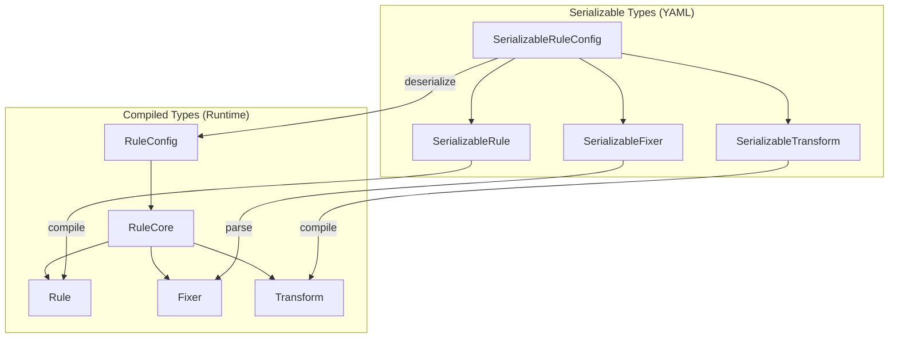

> **Source:** https://deepwiki.com/ast-grep/ast-grep/3-rule-system

# Rule System

The rule system provides a declarative YAML-based framework for defining custom linting rules and code transformations. It handles the complete lifecycle from YAML deserialization through validation, compilation, and runtime matching. Rules combine pattern matching, relational constraints, meta-variable transformations, and automated code fixes into a unified configuration format.

For details on the YAML configuration syntax, see [Rule Configuration Format](/ast-grep/ast-grep/3.1-rule-configuration-format). For information on testing rules, see [Testing Rules](/ast-grep/ast-grep/3.4-testing-rules). For CLI usage of rules via the `scan` command, see [Scan and Run Operations](/ast-grep/ast-grep/5.2-run-command).

## Overview

The rule system operates through distinct phases:

1. **Definition** - Rules are authored in YAML files and loaded from configured directories
2. **Deserialization** - YAML is parsed into `SerializableRuleConfig<L>` structs
3. **Validation** - Meta-variable usage is verified across all rule components
4. **Compilation** - Rules are compiled into executable `RuleCore` matchers
5. **Execution** - Rules are applied to AST nodes during scanning
6. **Reporting** - Matches produce diagnostics with severity levels and optional fixes

**Sources:** [crates/config/src/rule_config.rs58-98](https://github.com/ast-grep/ast-grep/blob/3ae01aec/crates/config/src/rule_config.rs#L58-L98) [crates/config/src/rule_core.rs44-60](https://github.com/ast-grep/ast-grep/blob/3ae01aec/crates/config/src/rule_core.rs#L44-L60)

## Core Type Hierarchy

The rule system uses two parallel type hierarchies: serializable types for YAML deserialization and compiled types for runtime execution.



**Sources:** [crates/config/src/rule_config.rs24-38](https://github.com/ast-grep/ast-grep/blob/3ae01aec/crates/config/src/rule_config.rs#L24-L38) [crates/config/src/rule_config.rs58-98](https://github.com/ast-grep/ast-grep/blob/3ae01aec/crates/config/src/rule_config.rs#L58-L98) [crates/config/src/rule_config.rs185-250](https://github.com/ast-grep/ast-grep/blob/3ae01aec/crates/config/src/rule_config.rs#L185-L250) [crates/config/src/rule_core.rs44-60](https://github.com/ast-grep/ast-grep/blob/3ae01aec/crates/config/src/rule_core.rs#L44-L60) [crates/config/src/rule_core.rs140-148](https://github.com/ast-grep/ast-grep/blob/3ae01aec/crates/config/src/rule_core.rs#L140-L148) [crates/config/src/fixer.rs68-73](https://github.com/ast-grep/ast-grep/blob/3ae01aec/crates/config/src/fixer.rs#L68-L73)

## Deserialization and Compilation

The compilation process transforms YAML definitions into executable matchers through a multi-stage pipeline.

### Deserialization Environment

The `DeserializeEnv<L>` provides context during rule compilation:

```rust
pub struct DeserializeEnv<L: Language> {
    lang: L,
    registration: RuleRegistration<L>,
    local: HashMap<String, RuleCore<L>>,
}
```

The environment carries:

- **Language instance** - For parsing patterns and generating fixes
- **RuleRegistration** - Registry of utility rules, global rules, and rewriters
- **Local context** - Utils defined within the current rule's scope

**Sources:** [crates/config/src/rule_core.rs63-71](https://github.com/ast-grep/ast-grep/blob/3ae01aec/crates/config/src/rule_core.rs#L63-L71) [crates/config/src/rule_core.rs187-192](https://github.com/ast-grep/ast-grep/blob/3ae01aec/crates/config/src/rule_core.rs#L187-L192)

### Compilation Pipeline


**Key compilation functions:**

| Function | Purpose | Error Type |
|----------|---------|------------|
| `get_deserialize_env()` | Loads utility rules into environment | `RuleCoreError::Utils` |
| `deserialize_rule()` | Converts `SerializableRule` to `Rule` | `RuleCoreError::Rule` |
| `get_constraints()` | Deserializes constraint rules | `RuleCoreError::Constraints` |
| `Transform::deserialize()` | Compiles transformations | `RuleCoreError::Transform` |
| `Fixer::parse()` | Parses fix templates | `RuleCoreError::Fixer` |
| `register_rewriters()` | Registers nested rewriter rules | `RuleConfigError::Rewriter` |
| `check_rule_with_hint()` | Validates meta-variable usage | `RuleCoreError::UndefinedMetaVar` |

**Sources:** [crates/config/src/rule_config.rs121-131](https://github.com/ast-grep/ast-grep/blob/3ae01aec/crates/config/src/rule_config.rs#L121-L131) [crates/config/src/rule_config.rs147-169](https://github.com/ast-grep/ast-grep/blob/3ae01aec/crates/config/src/rule_config.rs#L147-L169) [crates/config/src/rule_config.rs191-200](https://github.com/ast-grep/ast-grep/blob/3ae01aec/crates/config/src/rule_config.rs#L191-L200) [crates/config/src/rule_core.rs99-115](https://github.com/ast-grep/ast-grep/blob/3ae01aec/crates/config/src/rule_core.rs#L99-L115) [crates/config/src/rule_core.rs117-137](https://github.com/ast-grep/ast-grep/blob/3ae01aec/crates/config/src/rule_core.rs#L117-L137)

## Meta-Variable Validation

The `check_var` module enforces meta-variable scoping rules to ensure variables are defined before use. Different rule contexts have different validation requirements.

### Validation Contexts

**Variable scoping rules:**

| Component | Defines Variables | Requires Variables | Scope |
|-----------|-------------------|-------------------|-------|
| `rule` | Pattern meta-vars (`$A`, `$B`) | None | All subsequent stages |
| `utils` | Utility-defined meta-vars | None | All subsequent stages |
| `constraints` | Additional pattern meta-vars | Must match rule/util vars | All subsequent stages |
| `transform` | Transform keys (`A:`, `B:`) | `source` must be defined | Fix stage only |
| `fix` | None | All referenced vars must exist | None |
| `rewriters` | Local pattern vars | Inherits parent vars | Fix replacement only |

**Sources:** [crates/config/src/check_var.rs13-17](https://github.com/ast-grep/ast-grep/blob/3ae01aec/crates/config/src/check_var.rs#L13-L17) [crates/config/src/check_var.rs21-48](https://github.com/ast-grep/ast-grep/blob/3ae01aec/crates/config/src/check_var.rs#L21-L48) [crates/config/src/check_var.rs90-96](https://github.com/ast-grep/ast-grep/blob/3ae01aec/crates/config/src/check_var.rs#L90-L96) [crates/config/src/check_var.rs98-117](https://github.com/ast-grep/ast-grep/blob/3ae01aec/crates/config/src/check_var.rs#L98-L117) [crates/config/src/check_var.rs119-144](https://github.com/ast-grep/ast-grep/blob/3ae01aec/crates/config/src/check_var.rs#L119-L144) [crates/config/src/check_var.rs146-155](https://github.com/ast-grep/ast-grep/blob/3ae01aec/crates/config/src/check_var.rs#L146-L155)

### Variable Flow Example

Consider this rule:

```yaml
rule:
  pattern: console.log($MSG)
transform:
  UPPER:
    source: $MSG
    uppercase: true
fix: logger.info($UPPER)
```

The validation flow:

1. Pattern defines `$MSG`
2. Transform requires `$MSG` (exists ✓), defines `$UPPER`
3. Fix references `$UPPER` (exists ✓)

**Sources:** [crates/config/src/check_var.rs76-88](https://github.com/ast-grep/ast-grep/blob/3ae01aec/crates/config/src/check_var.rs#L76-L88)

## Runtime Execution

Once compiled, `RuleCore` implements the `Matcher` trait for runtime pattern matching.

### Matching Pipeline

The `do_match()` method coordinates the complete matching process:

```rust
fn do_match(&self, node: Node<D>) -> Option<NodeMatch<D>> {
    // 1. Apply primary rule matcher
    let node_match = self.rule.match_node_with_env(node)?;
    
    // 2. Apply constraints to captured variables
    self.match_constraints(&node_match)?;
    
    // 3. Apply transformations
    self.apply_transform(node_match)?;
    
    // 4. Return match with enriched environment
    Some(node_match)
}
```

**Performance optimization:** The `kinds` BitSet contains all potential AST node kinds that could match the rule. This allows early rejection of nodes without expensive pattern matching. The BitSet is computed during compilation via `rule.potential_kinds()`.

**Sources:** [crates/config/src/rule_core.rs218-244](https://github.com/ast-grep/ast-grep/blob/3ae01aec/crates/config/src/rule_core.rs#L218-L244) [crates/config/src/rule_core.rs267-279](https://github.com/ast-grep/ast-grep/blob/3ae01aec/crates/config/src/rule_core.rs#L267-L279)

### Constraint Matching

Constraints are secondary patterns applied to captured meta-variables:

```rust
fn match_constraints(&self, node_match: &NodeMatch<D>) -> Option<()> {
    for (var, constraint) in &self.constraints {
        let node = node_match.get_env().get_match(var)?;
        constraint.match_node_with_env(node)?;
    }
    Some(())
}
```

**Example:** If the main rule captures `$ARG`, and constraints specify `ARG: { regex: "^test" }`, the constraint matcher:

1. Retrieves the node bound to `$ARG`
2. Applies the regex rule to that node
3. Returns false if the regex doesn't match

**Sources:** [crates/config/src/rule_core.rs229-231](https://github.com/ast-grep/ast-grep/blob/3ae01aec/crates/config/src/rule_core.rs#L229-L231)

### Transformation Application

Transformations manipulate meta-variable values to create derived variables:

```rust
fn apply_transform(&self, node_match: &mut NodeMatch<D>) -> Option<()> {
    for (name, transform) in &self.transform {
        let result = transform.apply(&node_match)?;
        node_match.get_env_mut().insert_transformed(name, result);
    }
    Some(())
}
```

The `apply_transform()` method:

1. Iterates through transform definitions in dependency order
2. For each transform, retrieves the source variable(s)
3. Applies the transformation operation (substring, replace, rewrite)
4. Stores the result as a new meta-variable in the environment

For `rewrite` transformations that reference rewriters, the system:

1. Looks up the rewriter rule from `registration.get_rewriters()`
2. Applies the rewriter pattern to the source text
3. Uses the rewriter's fix template for replacement

**Sources:** [crates/config/src/rule_core.rs233-241](https://github.com/ast-grep/ast-grep/blob/3ae01aec/crates/config/src/rule_core.rs#L233-L241)

## Fix Generation

The `Fixer` struct generates code replacements using captured meta-variables.

### Fixer Structure

```rust
pub struct Fixer {
    template: String,
    expand_start: Option<Expansion>,
    expand_end: Option<Expansion>,
}
```

**Sources:** [crates/config/src/fixer.rs16-22](https://github.com/ast-grep/ast-grep/blob/3ae01aec/crates/config/src/fixer.rs#L16-L22) [crates/config/src/fixer.rs24-34](https://github.com/ast-grep/ast-grep/blob/3ae01aec/crates/config/src/fixer.rs#L24-L34) [crates/config/src/fixer.rs68-73](https://github.com/ast-grep/ast-grep/blob/3ae01aec/crates/config/src/fixer.rs#L68-L73)

### Range Expansion

Fixers can expand the replacement range beyond the matched node using `expand_start` and `expand_end`:

```yaml
fix:
  template: ""
  expandEnd:
    regex: ","
    stopBy: neighbor
```

**Use case:** When fixing `let a = 123,` to `let a = 456`, you can use `expand_end: { regex: ',', stopBy: neighbor }` to include the trailing comma in the replacement range.

**Sources:** [crates/config/src/fixer.rs181-194](https://github.com/ast-grep/ast-grep/blob/3ae01aec/crates/config/src/fixer.rs#L181-L194) [crates/config/src/fixer.rs196-226](https://github.com/ast-grep/ast-grep/blob/3ae01aec/crates/config/src/fixer.rs#L196-L226)

### Multiple Fixers

Rules can provide multiple alternative fixes using `SerializableFixer::List`:

```yaml
fix:
  - template: "const $A = $B"
    title: "Use const"
  - template: "let $A = $B"
    title: "Use let"
```

Each fixer in the list **must** have a `title` field. The CLI and LSP present these as selectable code actions.

**Sources:** [crates/config/src/fixer.rs103-132](https://github.com/ast-grep/ast-grep/blob/3ae01aec/crates/config/src/fixer.rs#L103-L132) [crates/config/src/fixer.rs42-46](https://github.com/ast-grep/ast-grep/blob/3ae01aec/crates/config/src/fixer.rs#L42-L46)

## Rewriter System

Rewriters are nested rules used within `rewrite` transformations to recursively transform code fragments.

### Rewriter Registration

```yaml
rule:
  pattern: $X = $Y
transform:
  FIXED:
    rewrite:
      source: $Y
      rewriters: [double-number]
rewriters:
  double-number:
    pattern: $N
    kind: number
    fix: ($N * 2)
```

**Key constraints:**

- Each rewriter **must** have a `fix` field (enforced at [crates/config/src/rule_config.rs158-160](https://github.com/ast-grep/ast-grep/blob/3ae01aec/crates/config/src/rule_config.rs#L158-L160))
- Rewriter IDs must be unique within a rule
- Transform `rewrite` operations must reference defined rewriters (checked at [crates/config/src/check_var.rs157-185](https://github.com/ast-grep/ast-grep/blob/3ae01aec/crates/config/src/check_var.rs#L157-L185))
- Rewriters can access variables from the parent rule scope (handled via `CheckHint::Rewriter`)

**Sources:** [crates/config/src/rule_config.rs147-169](https://github.com/ast-grep/ast-grep/blob/3ae01aec/crates/config/src/rule_config.rs#L147-L169) [crates/config/src/check_var.rs50-66](https://github.com/ast-grep/ast-grep/blob/3ae01aec/crates/config/src/check_var.rs#L50-L66) [crates/config/src/check_var.rs157-185](https://github.com/ast-grep/ast-grep/blob/3ae01aec/crates/config/src/check_var.rs#L157-L185)

### Rewriter Execution Flow

When a `rewrite` transformation executes:


**Example:**

For input `x = 42`, the rewriter:

1. Parses "42" as an AST fragment
2. Matches it with the `number` kind and captures `$N`
3. Generates replacement "($N * 2)" → "(42 * 2)"
4. Stores result in `$FIXED`

**Sources:** [crates/config/src/rule_core.rs233-241](https://github.com/ast-grep/ast-grep/blob/3ae01aec/crates/config/src/rule_core.rs#L233-L241)

## Error Handling

The rule system uses a hierarchical error type system:

```rust
enum RuleConfigError {
    RuleCore(RuleCoreError),
    Rewriter(RuleCoreError),
    MissingPotentialKinds,
}

enum RuleCoreError {
    UndefinedMetaVar(String),
    Utils(RuleCoreError),
    Rule(RuleCoreError),
    Constraints(RuleCoreError),
    Transform(RuleCoreError),
    Fixer(FixerError),
}

enum FixerError {
    MissingTitle,
}
```

**Common error scenarios:**

| Error | Cause | Detection Point |
|-------|-------|-----------------|
| `RuleCoreError::UndefinedMetaVar` | Variable used but not defined | Validation stage |
| `RuleConfigError::NoFixInRewriter` | Rewriter lacks `fix` field | Registration stage |
| `RuleConfigError::UndefinedRewriter` | Transform references unknown rewriter | Post-registration check |
| `RuleCoreError::Utils` | Invalid utility rule | Deserialization stage |
| `FixerError::MissingTitle` | List fixer without title | Fixer parsing |
| `RuleConfigError::MissingPotentialKinds` | Rule cannot determine node kinds | Compilation stage |

**Sources:** [crates/config/src/rule_config.rs40-56](https://github.com/ast-grep/ast-grep/blob/3ae01aec/crates/config/src/rule_config.rs#L40-L56) [crates/config/src/rule_core.rs23-39](https://github.com/ast-grep/ast-grep/blob/3ae01aec/crates/config/src/rule_core.rs#L23-L39) [crates/config/src/fixer.rs36-46](https://github.com/ast-grep/ast-grep/blob/3ae01aec/crates/config/src/fixer.rs#L36-L46)

## Severity Levels

Rules are classified by severity, controlling their presentation in output:

```rust
enum Severity {
    Error,
    Warning,
    Hint,
    Note,
    Off,
}
```

**Default:** `Severity::Hint` (defined at [crates/config/src/rule_config.rs27-29](https://github.com/ast-grep/ast-grep/blob/3ae01aec/crates/config/src/rule_config.rs#L27-L29))

**Usage in output:**

- Terminal printer colors diagnostics by severity
- LSP reports map to IDE diagnostic levels
- SARIF format includes severity in `level` property
- `Severity::Off` prevents rule from being applied

**Sources:** [crates/config/src/rule_config.rs24-38](https://github.com/ast-grep/ast-grep/blob/3ae01aec/crates/config/src/rule_config.rs#L24-L38)

## Message Interpolation

Rule messages can reference meta-variables captured during matching. The interpolation occurs in `get_message()`:

```rust
pub fn get_message(&self, env: &MetaVarEnv<D>) -> String {
    let bytes = self.message_template.generate_replacement(env)?;
    String::from_utf8_lossy(&bytes).into_owned()
}
```

**Implementation:** Messages are treated as fix templates without applying the fix. This allows the same interpolation logic to work for both messages and fixes.

**Note:** The `note` field (detailed documentation) **cannot** reference meta-variables. It is treated as static markdown content.

**Sources:** [crates/config/src/rule_config.rs213-221](https://github.com/ast-grep/ast-grep/blob/3ae01aec/crates/config/src/rule_config.rs#L213-L221)

## Integration Points

The rule system integrates with other ast-grep components:

| Component | Integration | Usage |
|-----------|-------------|-------|
| **CLI scan** | `RuleCollection` loads rules per language | [Scan and Run Operations](/ast-grep/ast-grep/5.2-run-command) |
| **LSP diagnostics** | Rules generate real-time diagnostics | [LSP Architecture](/ast-grep/ast-grep/6.1-lsp-architecture) |
| **Rule testing** | Test framework validates rule behavior | [Testing Rules](/ast-grep/ast-grep/3.4-testing-rules) |
| **NAPI** | JavaScript API compiles rules | [NAPI API Reference](/ast-grep/ast-grep/7.1-napi-api-reference) |
| **Python** | PyO3 bindings expose rule API | [PyO3 API Reference](/ast-grep/ast-grep/8.1-python-api) |

The rule configuration format is documented in detail at [Rule Configuration Format](/ast-grep/ast-grep/3.1-rule-configuration-format), including all YAML fields and their semantics.
