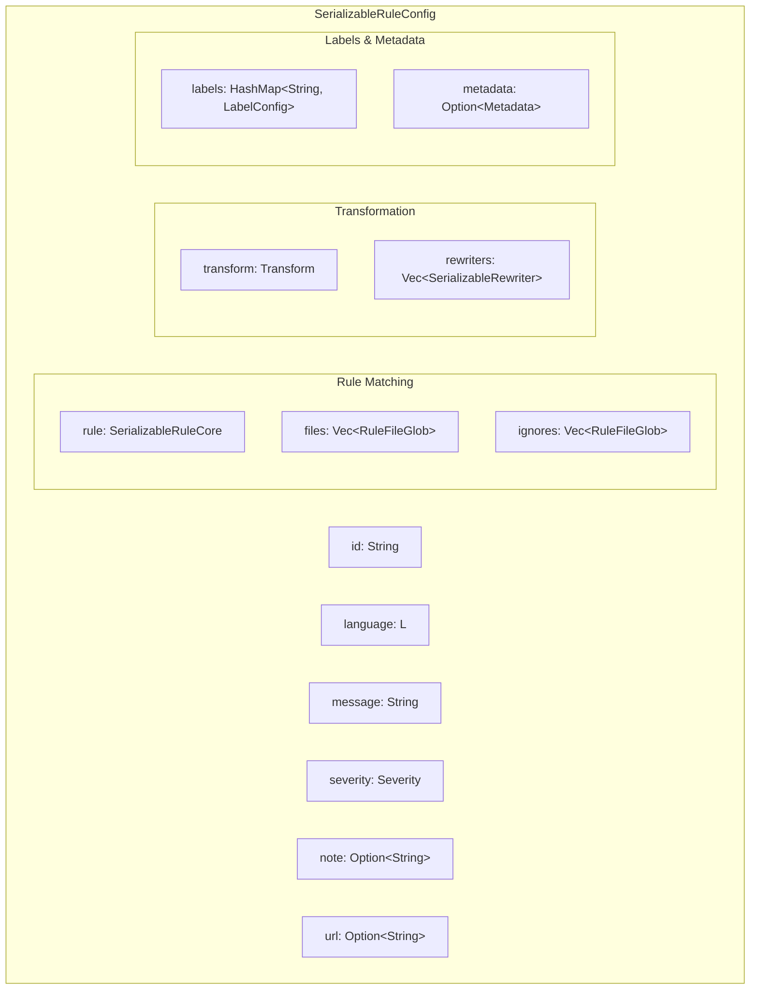
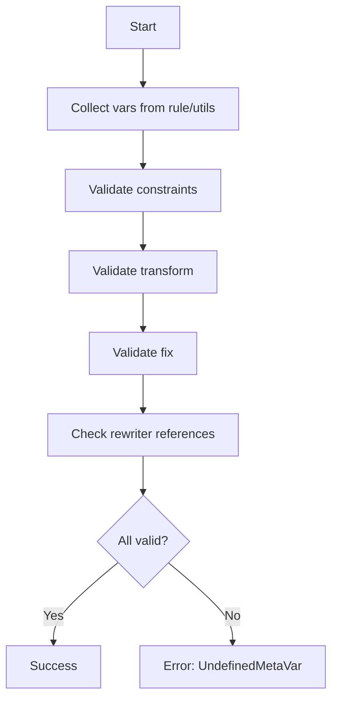

> **Source:** https://deepwiki.com/ast-grep/ast-grep/3.1-rule-configuration-format

# Rule Configuration Format

This document describes the YAML configuration format for defining rules in ast-grep. Rules are declarative specifications that identify code patterns and optionally provide automatic fixes. This page covers the top-level structure of a rule configuration file, including metadata fields, severity levels, file filtering, and the deserialization process.

For details about the rule matching components (`rule`, `constraints`, `utils`, `transform`, `fix`), see [Rule Components](/ast-grep/ast-grep/3.2-rule-components). For information about the transformation and rewriter system, see [Transformations and Rewriters](/ast-grep/ast-grep/3.3-validation-and-schema).

## YAML Structure Overview

The rule configuration format is represented by the `SerializableRuleConfig<L>` struct, which deserializes from YAML into a strongly-typed Rust structure. The diagram below shows the complete structure of a rule configuration file:



**Sources:** [crates/config/src/rule_config.rs68-98](https://github.com/ast-grep/ast-grep/blob/3ae01aec/crates/config/src/rule_config.rs#L68-L98)

## Required Fields

Every rule configuration must specify two required fields:

| Field | Type | Description |
|-------|------|-------------|
| `id` | `String` | Unique, descriptive identifier (e.g., `no-unused-variable`) |
| `language` | `L` | Target language to parse and match (e.g., `TypeScript`, `JavaScript`) |

The `language` field determines which tree-sitter parser is used and which file extensions are matched. The generic type parameter `L` implements the `Language` trait from `ast-grep-core`.

**Example:**

```yaml
id: no-console-log
language: JavaScript
rule:
  pattern: console.log($MSG)
```

**Sources:** [crates/config/src/rule_config.rs72-74](https://github.com/ast-grep/ast-grep/blob/3ae01aec/crates/config/src/rule_config.rs#L72-L74)

## Severity Levels

The `severity` field categorizes the importance of rule violations. It uses the `Severity` enum with five possible values:

| Value | Use Case |
|-------|----------|
| `hint` | Kind reminder for code with potential improvement (default) |
| `info` | Suggestion that code can be improved or optimized |
| `warning` | Code might produce bugs or violates best practices |
| `error` | Code produces bugs or has logic errors |
| `off` | Disables the rule entirely |

The severity field defaults to `hint` when not specified [rule_config.rs85](https://github.com/ast-grep/ast-grep/blob/3ae01aec/rule_config.rs#L85-L85)

**Sources:** [crates/config/src/rule_config.rs24-38](https://github.com/ast-grep/ast-grep/blob/3ae01aec/crates/config/src/rule_config.rs#L24-L38)

## Metadata Fields

Rules include several optional metadata fields that enhance diagnostics and documentation:

### Message and Note

- **`message: String`** - Main diagnostic message shown when the rule matches. It should be single-line and concise. Supports meta-variable interpolation (e.g., `"Found unused variable $VAR"`). Defaults to empty string [rule_config.rs80](https://github.com/ast-grep/ast-grep/blob/3ae01aec/rule_config.rs#L80-L80)
    
- **`note: Option<String>`** - Additional markdown text to elaborate on the message and provide potential fixes. Cannot reference meta-variables [rule_config.rs83](https://github.com/ast-grep/ast-grep/blob/3ae01aec/rule_config.rs#L83-L83)

### Labels

The `labels` field provides custom styling and messages for captured meta-variables in diagnostic output. It maps meta-variable names to `LabelConfig` objects that specify display properties.

```yaml
labels:
  MSG:
    message: "Logged message"
    style: primary
```

Label meta-variables must be defined in the `rule` or `constraints` sections, not in `transform`. The validation occurs in `SerializableRuleConfig::check_labels()` [rule_config.rs147-159](https://github.com/ast-grep/ast-grep/blob/3ae01aec/rule_config.rs#L147-L159)

**Example:**

### URL and Metadata

- **`url: Option<String>`** - Documentation link for the rule [rule_config.rs95](https://github.com/ast-grep/ast-grep/blob/3ae01aec/rule_config.rs#L95-L95)
    
- **`metadata: Option<Metadata>`** - Arbitrary YAML data stored as a `HashMap<String, serde_yaml::Value>`. The `Metadata` type wraps the HashMap to implement `JsonSchema` [rule_config.rs116-133](https://github.com/ast-grep/ast-grep/blob/3ae01aec/rule_config.rs#L116-L133)

**Sources:** [crates/config/src/rule_config.rs78-97](https://github.com/ast-grep/ast-grep/blob/3ae01aec/crates/config/src/rule_config.rs#L78-L97) [crates/config/src/rule_config.rs147-159](https://github.com/ast-grep/ast-grep/blob/3ae01aec/crates/config/src/rule_config.rs#L147-L159)

## File Filtering

Rules can be constrained to specific files using glob patterns. The `files` and `ignores` fields accept vectors of `RuleFileGlob` entries.

### RuleFileGlob Format

The `RuleFileGlob` enum supports two variants:

```rust
pub enum RuleFileGlob {
    Glob(String),
    Config {
        glob: String,
        case_insensitive: Option<bool>,
    },
}
```

The simple `Glob(String)` variant accepts just a glob pattern string. The `Config` variant provides additional control:

| Field | Type | Default | Description |
|-------|------|---------|-------------|
| `glob` | `String` | Required | The glob pattern |
| `case_insensitive` | `bool` | `false` | Whether matching is case-insensitive |

**Example with mixed formats:**

```yaml
files:
  - "src/**/*.ts"
  - glob: "test/**/*.spec.ts"
    case_insensitive: true
ignores:
  - "**/*.d.ts"
```

Test coverage demonstrates mixed format support [rule_config.rs868-897](https://github.com/ast-grep/ast-grep/blob/3ae01aec/rule_config.rs#L868-L897)

**Sources:** [crates/config/src/rule_config.rs90-112](https://github.com/ast-grep/ast-grep/blob/3ae01aec/crates/config/src/rule_config.rs#L90-L112) [crates/config/src/rule_config.rs786-897](https://github.com/ast-grep/ast-grep/blob/3ae01aec/crates/config/src/rule_config.rs#L786-L897)

## Rewriters

The `rewriters` field defines a list of reusable transformation templates referenced in the `transform` section. Each rewriter is a `SerializableRewriter` containing:

- An `id` for reference
- A `core: SerializableRuleCore` with its own `rule` and `fix`

Rewriters must have a `fix` field defined [rule_config.rs172-174](https://github.com/ast-grep/ast-grep/blob/3ae01aec/rule_config.rs#L172-L174) They are registered in a `RuleRegistration` and validated to ensure all referenced rewriters exist [rule_config.rs161-183](https://github.com/ast-grep/ast-grep/blob/3ae01aec/rule_config.rs#L161-L183)

For detailed information about rewriters, transformations, and how they work, see [Transformations and Rewriters](/ast-grep/ast-grep/3.3-validation-and-schema).

**Example:**

```yaml
rule:
  pattern: $X = $Y
transform:
  DOUBLED:
    rewrite:
      source: $Y
      rewriters: [double]
rewriters:
  double:
    id: double
    rule:
      kind: number
    fix: ($Y * 2)
```

**Sources:** [crates/config/src/rule_config.rs59-64](https://github.com/ast-grep/ast-grep/blob/3ae01aec/crates/config/src/rule_config.rs#L59-L64) [crates/config/src/rule_config.rs76](https://github.com/ast-grep/ast-grep/blob/3ae01aec/crates/config/src/rule_config.rs#L76-L76) [crates/config/src/rule_config.rs161-183](https://github.com/ast-grep/ast-grep/blob/3ae01aec/crates/config/src/rule_config.rs#L161-L183)

## Deserialization and Compilation Pipeline

The rule configuration goes through a multi-stage deserialization and compilation process before it can be used for matching:

### Deserialization Process

1. **YAML Parsing**: The YAML file is deserialized using `serde_yaml` with `singleton_map_recursive` support [rule_config.rs17](https://github.com/ast-grep/ast-grep/blob/3ae01aec/rule_config.rs#L17-L17)
    
2. **SerializableRuleConfig Creation**: The YAML structure maps to `SerializableRuleConfig<L>` fields [rule_config.rs68-98](https://github.com/ast-grep/ast-grep/blob/3ae01aec/crates/config/src/rule_config.rs#L68-L98)
    
3. **Compilation via `get_matcher()`**: The `SerializableRuleConfig::get_matcher()` method orchestrates compilation [rule_config.rs136-144](https://github.com/ast-grep/ast-grep/blob/3ae01aec/rule_config.rs#L136-L144):
    - Creates a `DeserializeEnv<L>` with the language and global rules
    - Compiles the core rule into a `RuleCore` via `SerializableRuleCore::get_matcher()` (see [Rule Components](/ast-grep/ast-grep/3.2-rule-components))
    - Registers rewriters and validates their usage
    - Validates that label variables are defined in rules/constraints
    - Checks that the matcher has potential kinds (required for optimization)
4. **RuleConfig Construction**: `RuleConfig::try_from()` wraps the serializable config with the compiled matcher [rule_config.rs205-214](https://github.com/ast-grep/ast-grep/blob/3ae01aec/rule_config.rs#L205-L214)

### DeserializeEnv and Global Rules

The `DeserializeEnv<L>` structure carries context during deserialization:

- The target language `L`
- A `RuleRegistration` holding global utilities and rewriters

Global rules are passed via `DeserializeEnv::with_globals()` [rule_config.rs140](https://github.com/ast-grep/ast-grep/blob/3ae01aec/rule_config.rs#L140-L140) and stored in a `GlobalRules` structure.

**Sources:** [crates/config/src/rule_config.rs136-184](https://github.com/ast-grep/ast-grep/blob/3ae01aec/crates/config/src/rule_config.rs#L136-L184) [crates/config/src/rule_config.rs205-225](https://github.com/ast-grep/ast-grep/blob/3ae01aec/crates/config/src/rule_config.rs#L205-L225) [crates/config/src/rule_config.rs17](https://github.com/ast-grep/ast-grep/blob/3ae01aec/rule_config.rs#L17-L17)

## Runtime Representation: RuleConfig

The `RuleConfig<L>` struct is the compiled runtime representation used for actual pattern matching:

```rust
pub struct RuleConfig<L: Language> {
    source: SerializableRuleConfig<L>,
    matcher: RuleCore<L>,
}
```

### Key Methods

**`get_message()`** [rule_config.rs227-235](https://github.com/ast-grep/ast-grep/blob/3ae01aec/rule_config.rs#L227-L235)

- Takes a `NodeMatch` (the matched AST node with captured variables)
- Uses `Fixer::with_transform()` to interpolate meta-variables in the message
- Returns the formatted diagnostic message string

**`get_fixer()`** [rule_config.rs236-244](https://github.com/ast-grep/ast-grep/blob/3ae01aec/rule_config.rs#L236-L244)

- Parses the `fix` field into a vector of `Fixer` objects
- Returns empty vector if no fix is specified
- Fixers generate replacement text for matched nodes

**`get_labels()`** [rule_config.rs245-251](https://github.com/ast-grep/ast-grep/blob/3ae01aec/rule_config.rs#L245-L251)

- Generates diagnostic labels from the `labels` configuration
- Falls back to default labels if not configured
- Returns `Vec<Label>` for displaying in diagnostics

The `RuleConfig` implements `Deref` to `SerializableRuleConfig`, providing access to all metadata fields [rule_config.rs253-258](https://github.com/ast-grep/ast-grep/blob/3ae01aec/rule_config.rs#L253-L258)

**Sources:** [crates/config/src/rule_config.rs199-264](https://github.com/ast-grep/ast-grep/blob/3ae01aec/crates/config/src/rule_config.rs#L199-L264)

## Variable Validation

Variable validation ensures that all meta-variables referenced in `constraints`, `transform`, `fix`, and `labels` are properly defined. The validation logic is implemented in `check_var.rs`.

### Validation Flow



### Variable Scopes

Variables can be defined in multiple locations:

| Scope | Defined In | Available To |
|-------|------------|--------------|
| Rule variables | `rule` patterns (e.g., `$A`, `$B`) | All sections |
| Utils variables | Local `utils` patterns | All sections |
| Constraint variables | `constraints` patterns | Later constraints, transform, fix |
| Transform variables | `transform` keys | Fix, labels (but not other transforms) |

### Validation Rules

1. **Constraints**: Keys in `constraints` must reference variables defined in `rule` or `utils` [check_var.rs107-115](https://github.com/ast-grep/ast-grep/blob/3ae01aec/check_var.rs#L107-L115)
    
2. **Transform**: Transform values must use variables from `rule`, `utils`, or `constraints`. Transform keys define new variables [check_var.rs126-142](https://github.com/ast-grep/ast-grep/blob/3ae01aec/check_var.rs#L126-L142)
    
3. **Fix**: All variables in `fix` must be defined somewhere (rule/utils/constraints/transform) [check_var.rs146-155](https://github.com/ast-grep/ast-grep/blob/3ae01aec/check_var.rs#L146-L155)
    
4. **Labels**: Label keys must reference node variables (from `rule`/`constraints`), not transform variables. This is validated separately in `SerializableRuleConfig::check_labels()` [rule_config.rs147-159](https://github.com/ast-grep/ast-grep/blob/3ae01aec/rule_config.rs#L147-L159)

### Special Case: Rewriters

Rewriters have special validation logic via `CheckHint::Rewriter` [check_var.rs39-45](https://github.com/ast-grep/ast-grep/blob/3ae01aec/check_var.rs#L39-L45):

- They can reference variables from the parent rule (passed as `upper_vars`)
- They must have a `fix` field [check_var.rs40-42](https://github.com/ast-grep/ast-grep/blob/3ae01aec/check_var.rs#L40-L42)
- Their variable validation includes the parent scope

The function `check_rewriters_in_transform()` ensures that all rewriter names used in `transform` sections are actually defined [check_var.rs157-185](https://github.com/ast-grep/ast-grep/blob/3ae01aec/check_var.rs#L157-L185)

**Example error cases:**

```yaml
# ERROR: $B not defined
rule:
  pattern: $A
fix: $B

# ERROR: $VAR not defined in rule
rule:
  pattern: console.log($MSG)
transform:
  UPPER:
    source: $VAR  # Should be $MSG
    uppercase: true
```

**Sources:** [crates/config/src/check_var.rs1-185](https://github.com/ast-grep/ast-grep/blob/3ae01aec/crates/config/src/check_var.rs#L1-L185) [crates/config/src/rule_config.rs147-159](https://github.com/ast-grep/ast-grep/blob/3ae01aec/crates/config/src/rule_config.rs#L147-L159)

## Example: Complete Rule Configuration

Here is a complete example demonstrating all major configuration fields:

```yaml
id: no-unused-variable
language: TypeScript
message: "Variable $VAR is declared but never used"
note: "Consider removing the variable or using it somewhere in your code."
severity: warning
url: "https://example.com/rules/no-unused-variable"

files:
  - "src/**/*.ts"
ignores:
  - "**/*.d.ts"

labels:
  VAR:
    message: "Unused variable"
    style: primary

rule:
  pattern: const $VAR = $VALUE

constraints:
  VAR:
    regex: "^[a-z]"

transform:
  UPPER_VAR:
    source: $VAR
    uppercase: true

fix: "const USED_$UPPER_VAR = $VALUE"

metadata:
  category: best-practices
  tags:
    - unused
    - variables
```

**Sources:** [crates/config/src/rule_config.rs68-98](https://github.com/ast-grep/ast-grep/blob/3ae01aec/crates/config/src/rule_config.rs#L68-L98)
