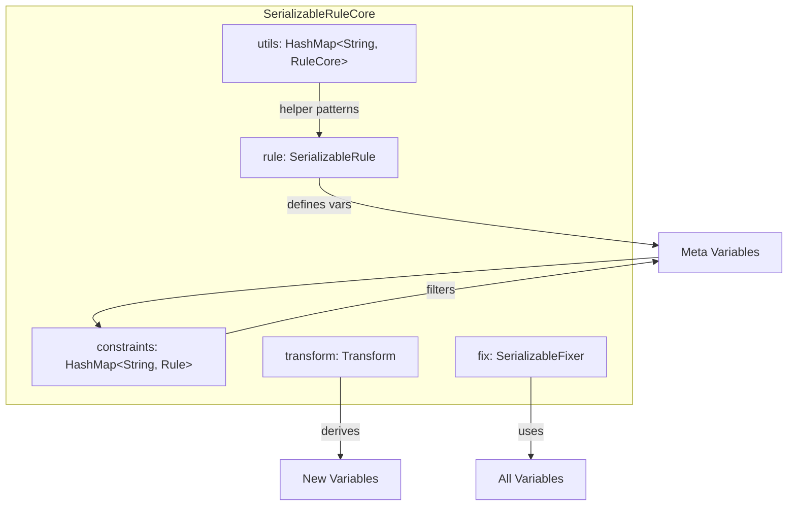
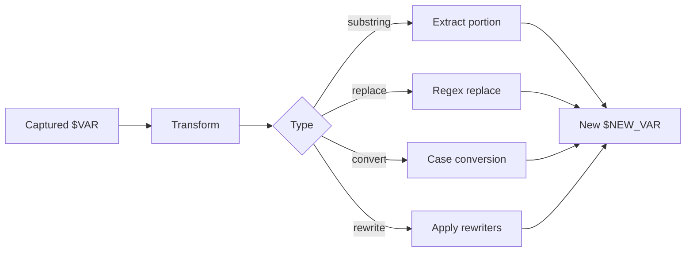
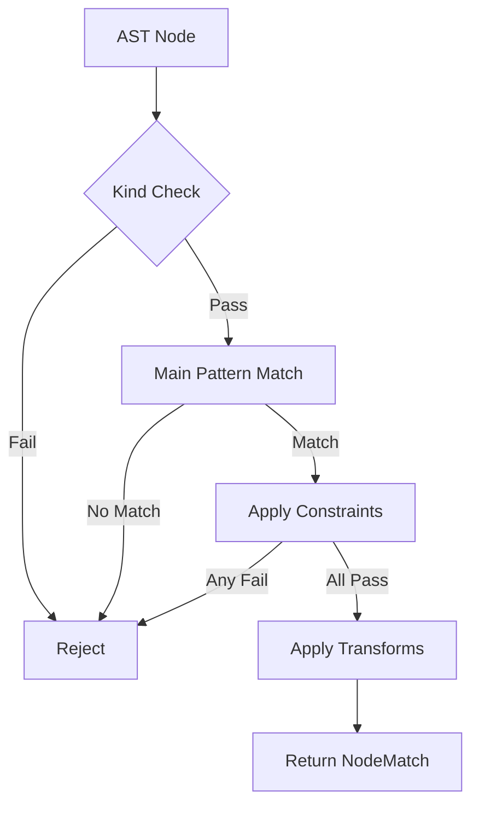

> **Source:** https://deepwiki.com/ast-grep/ast-grep/3.2-rule-components

# Rule Components

This document explains the individual components that make up an ast-grep rule and how they work together to match, filter, transform, and fix code. For information about the overall rule configuration format and metadata fields, see [Rule Configuration Format](/ast-grep/ast-grep/3.1-rule-configuration-format). For details on rule validation and schema generation, see [Validation and Schema](/ast-grep/ast-grep/3.3-validation-and-schema).

## Component Architecture

Rules in ast-grep are decomposed into orthogonal components, each serving a specific purpose in the matching and transformation pipeline. The core components are defined in the `SerializableRuleCore` structure, which represents the executable parts of a rule separate from its metadata.

### SerializableRuleCore Structure

```rust
pub struct SerializableRuleCore {
    pub rule: SerializableRule,           // Primary matching pattern
    pub constraints: Option<HashMap<String, SerializableRule>>,
    pub utils: Option<HashMap<String, SerializableRuleCore>>,
    pub transform: Option<Transform>,
    pub fix: Option<SerializableFixer>,
}
```



**Sources:** [crates/config/src/rule_core.rs44-60](https://github.com/ast-grep/ast-grep/blob/3ae01aec/crates/config/src/rule_core.rs#L44-L60) [crates/config/src/rule_config.rs58-64](https://github.com/ast-grep/ast-grep/blob/3ae01aec/crates/config/src/rule_config.rs#L58-L64) [crates/config/src/rule_config.rs68-99](https://github.com/ast-grep/ast-grep/blob/3ae01aec/crates/config/src/rule_config.rs#L68-L99)

## Main Pattern Component

The `rule` field defines the primary AST pattern to match. This is a `SerializableRule` that can take many forms (pattern, kind, regex, all, any, inside, has, etc.). The main pattern establishes the initial set of meta-variables that subsequent components can reference.

The `RuleCore` structure (the compiled version of `SerializableRuleCore`) uses the main pattern to perform the initial match and populate the `MetaVarEnv`:

| Component | Type | Purpose |
|-----------|------|---------|
| `rule` | `SerializableRule` | Primary matching pattern that defines what AST nodes to find |
| Compiled form | `Rule` in `RuleCore` | Executable matcher implementing the `Matcher` trait |
| Meta-variables | Captured in `$VAR` syntax | Variables that can be referenced in other components |

The main pattern is mandatory and must define at least one potential AST kind to match, enforced during rule compilation at [crates/config/src/rule_config.rs211-213](https://github.com/ast-grep/ast-grep/blob/3ae01aec/crates/config/src/rule_config.rs#L211-L213)

**Sources:** [crates/config/src/rule_core.rs46-47](https://github.com/ast-grep/ast-grep/blob/3ae01aec/crates/config/src/rule_core.rs#L46-L47) [crates/config/src/rule_core.rs140-148](https://github.com/ast-grep/ast-grep/blob/3ae01aec/crates/config/src/rule_core.rs#L140-L148)

## Constraints Component

Constraints provide additional filtering on already-captured meta-variables. Each constraint is a named rule that must match the text content or AST structure of a meta-variable defined in the main pattern or previous constraints.

**Constraint Matching Behavior:**

1. Constraints execute **after** the main pattern matches
2. Each constraint can access variables from the main pattern and other constraints
3. Constraints can define **new** meta-variables that are added to the environment
4. If any constraint fails, the entire match is rejected
5. Constraints are evaluated using `MetaVarEnv::match_constraints()` at [crates/config/src/rule_core.rs230](https://github.com/ast-grep/ast-grep/blob/3ae01aec/crates/config/src/rule_core.rs#L230-L230)

**Variable Scope Rules:**

The constraint key name must reference a meta-variable already defined. Validation occurs at [crates/config/src/check_var.rs98-117](https://github.com/ast-grep/ast-grep/blob/3ae01aec/crates/config/src/check_var.rs#L98-L117):

```yaml
rule: {pattern: $A = $B}
constraints:
  A: {regex: "let"}     # ✓ Valid: A is defined in main pattern
  B: {pattern: $C + $D} # ✓ Valid: B is defined, and defines new vars C, D
  E: {pattern: foo}     # ✗ Invalid: E is not defined anywhere
```

**Sources:** [crates/config/src/rule_core.rs49](https://github.com/ast-grep/ast-grep/blob/3ae01aec/crates/config/src/rule_core.rs#L49-L49) [crates/config/src/rule_core.rs73-88](https://github.com/ast-grep/ast-grep/blob/3ae01aec/crates/config/src/rule_core.rs#L73-L88) [crates/config/src/rule_core.rs229-232](https://github.com/ast-grep/ast-grep/blob/3ae01aec/crates/config/src/rule_core.rs#L229-L232) [crates/config/src/check_var.rs98-117](https://github.com/ast-grep/ast-grep/blob/3ae01aec/crates/config/src/check_var.rs#L98-L117)

## Utils Component

Utils (utility rules) are reusable rule definitions that can be referenced within the same rule via the `matches` operator. They enable composition and reduce duplication within complex rules.

| Property | Behavior |
|----------|----------|
| Scope | Local to the current rule only (not shared with other rules) |
| Registration | Added to `DeserializeEnv` during parsing at [crates/config/src/rule_core.rs64-71](https://github.com/ast-grep/ast-grep/blob/3ae01aec/crates/config/src/rule_core.rs#L64-L71) |
| Reference | Used via `matches: util-name` in rule, constraints, or nested utils |
| Meta-variables | Variables defined in utils are added to the environment |

**Utils vs. Global Rules:**

- **Utils** are defined in the same YAML file as the rule and are private to that rule
- **Global Rules** (see [Project Configuration](/ast-grep/ast-grep/3.5-project-configuration)) are defined in separate utility files and can be shared across all rules
- Both use the same `RuleRegistration` mechanism but at different scopes

**Example Structure:**

```yaml
utils:
  is-async:
    pattern: async $BODY
rule:
  matches: is-async
```

During compilation, utils are registered first at [crates/config/src/rule_core.rs64-71](https://github.com/ast-grep/ast-grep/blob/3ae01aec/crates/config/src/rule_core.rs#L64-L71) then verified at [crates/config/src/check_var.rs68-74](https://github.com/ast-grep/ast-grep/blob/3ae01aec/crates/config/src/check_var.rs#L68-L74)

**Sources:** [crates/config/src/rule_core.rs50-51](https://github.com/ast-grep/ast-grep/blob/3ae01aec/crates/config/src/rule_core.rs#L50-L51) [crates/config/src/rule_core.rs64-71](https://github.com/ast-grep/ast-grep/blob/3ae01aec/crates/config/src/rule_core.rs#L64-L71) [crates/config/src/check_var.rs68-74](https://github.com/ast-grep/ast-grep/blob/3ae01aec/crates/config/src/check_var.rs#L68-L74)

## Transform Component

The `transform` component manipulates meta-variable values to create new derived variables. Transformations are applied after matching and constraint validation, allowing you to process captured text before using it in messages or fixes.

### Transform Execution Flow



### Transformation Types

Each transformation defines a new meta-variable based on an existing one:

| Transform | Purpose | Example |
|-----------|---------|---------|
| `substring` | Extract portion of text | Extract first 3 chars of `$VAR` |
| `replace` | Text replacement | Replace "old" with "new" in `$VAR` |
| `convert` | Case conversion | Convert `$VAR` to `lowerCase`, `UPPER_CASE`, etc. |
| `rewrite` | Apply rewriter rules | Transform `$VAR` using sub-rules (see Rewriters section) |

### Variable Definition Rules

Transform variables are subject to strict scoping rules enforced at [crates/config/src/check_var.rs119-144](https://github.com/ast-grep/ast-grep/blob/3ae01aec/crates/config/src/check_var.rs#L119-L144):

1. Transform can only reference variables defined in `rule`, `constraints`, or `utils`
2. Transform variables **cannot** shadow existing variables (error: `AlreadyDefined`)
3. Transform variables become available for use in `fix` templates
4. Transform order matters for the `rewrite` transformation (cyclic dependencies are detected)

Transform application occurs at [crates/config/src/rule_core.rs233-242](https://github.com/ast-grep/ast-grep/blob/3ae01aec/crates/config/src/rule_core.rs#L233-L242) where the `Transform::apply_transform()` method modifies the `MetaVarEnv` in place.

**Sources:** [crates/config/src/rule_core.rs52-55](https://github.com/ast-grep/ast-grep/blob/3ae01aec/crates/config/src/rule_core.rs#L52-L55) [crates/config/src/rule_core.rs102-106](https://github.com/ast-grep/ast-grep/blob/3ae01aec/crates/config/src/rule_core.rs#L102-L106) [crates/config/src/rule_core.rs233-242](https://github.com/ast-grep/ast-grep/blob/3ae01aec/crates/config/src/rule_core.rs#L233-L242) [crates/config/src/check_var.rs119-144](https://github.com/ast-grep/ast-grep/blob/3ae01aec/crates/config/src/check_var.rs#L119-L144)

## Fix Component

The `fix` component specifies a template for automatically correcting matched code. Fix templates can reference meta-variables from the rule, constraints, and transforms.

### Fix Template Types

The `SerializableFixer` can be either:

1. **Simple String Template** - A string containing meta-variable references like `"$VAR.method()"`
2. **FixConfig Object** - A structured fix with multiple options (defined in the `Fixer` implementation)

The `Fixer` structure compiles fix templates into executable replacers at [crates/config/src/rule_core.rs90-97](https://github.com/ast-grep/ast-grep/blob/3ae01aec/crates/config/src/rule_core.rs#L90-L97):

```rust
pub struct Fixer {
    template: String,
    expand_start: Option<Expansion>,
    expand_end: Option<Expansion>,
}
```

### Variable Resolution

Fix templates access meta-variables through the `MetaVarEnv` populated during matching. The validation at [crates/config/src/check_var.rs146-155](https://github.com/ast-grep/ast-grep/blob/3ae01aec/crates/config/src/check_var.rs#L146-L155) ensures:

1. All referenced variables (`$VAR`) are defined in rule, constraints, or transform
2. Variables must be in scope at the time the fix executes
3. Transform variables are available for use in fix templates

The `RuleConfig::get_fixer()` method at [crates/config/src/rule_config.rs237-245](https://github.com/ast-grep/ast-grep/blob/3ae01aec/crates/config/src/rule_config.rs#L237-L245) creates the fixer with access to both the environment and transform definitions, allowing fix templates to use transformed variables.

**Sources:** [crates/config/src/rule_core.rs56-59](https://github.com/ast-grep/ast-grep/blob/3ae01aec/crates/config/src/rule_core.rs#L56-L59) [crates/config/src/rule_core.rs90-97](https://github.com/ast-grep/ast-grep/blob/3ae01aec/crates/config/src/rule_core.rs#L90-L97) [crates/config/src/rule_config.rs237-245](https://github.com/ast-grep/ast-grep/blob/3ae01aec/crates/config/src/rule_config.rs#L237-L245) [crates/config/src/check_var.rs146-155](https://github.com/ast-grep/ast-grep/blob/3ae01aec/crates/config/src/check_var.rs#L146-L155)

## Rewriters Component

Rewriters are specialized sub-rules used exclusively within the `rewrite` transformation. They enable complex code transformations by recursively applying rule-fix pairs to matched text.

### Rewriter Structure

```yaml
rewriters:
  - id: double-number
    rule:
      kind: number
    fix: ($Y * 2)
```

### Rewriter Requirements and Validation

Rewriters have strict requirements enforced at [crates/config/src/rule_config.rs162-184](https://github.com/ast-grep/ast-grep/blob/3ae01aec/crates/config/src/rule_config.rs#L162-L184):

| Requirement | Enforcement | Error Type |
|-------------|-------------|------------|
| Must have `fix` | [rule_config.rs173-175](https://github.com/ast-grep/ast-grep/blob/3ae01aec/rule_config.rs#L173-L175) | `RuleConfigError::NoFixInRewriter` |
| Must be defined before use | [check_var.rs157-185](https://github.com/ast-grep/ast-grep/blob/3ae01aec/check_var.rs#L157-L185) | `RuleConfigError::UndefinedRewriter` |
| All vars in fix must be defined | [check_var.rs39-66](https://github.com/ast-grep/ast-grep/blob/3ae01aec/check_var.rs#L39-L66) | `RuleCoreError::UndefinedMetaVar` |

### Variable Scope in Rewriters

Rewriters operate in a special variable scope that includes both their own captured variables and variables from the parent rule (the "upper vars"):

1. **Parent Variables** - Variables from the containing rule's pattern are accessible (passed via `CheckHint::Rewriter` at [crates/config/src/rule_config.rs178](https://github.com/ast-grep/ast-grep/blob/3ae01aec/crates/config/src/rule_config.rs#L178-L178))
2. **Local Variables** - Variables captured by the rewriter's own pattern
3. **Scoped Transform** - Rewriters can have their own `transform` component
4. **Recursive Rewriters** - Rewriters can reference other rewriters for multi-stage transformations

The validation at [crates/config/src/check_var.rs50-66](https://github.com/ast-grep/ast-grep/blob/3ae01aec/crates/config/src/check_var.rs#L50-L66) specifically handles rewriter variable scoping by accepting both locally-defined variables and parent variables.

### Rewriter Execution

When a `rewrite` transformation executes:

1. The source meta-variable's text is extracted
2. The rewriter rule is matched against that text
3. For each match, the rewriter's `fix` template generates replacement text
4. All replacements are applied to produce the transformed result
5. The result is stored as a new transformed variable

This process is managed by `Transform::apply_transform()` at [crates/config/src/rule_core.rs233-242](https://github.com/ast-grep/ast-grep/blob/3ae01aec/crates/config/src/rule_core.rs#L233-L242) which accesses registered rewriters via `registration.get_rewriters()`.

**Sources:** [crates/config/src/rule_config.rs59-64](https://github.com/ast-grep/ast-grep/blob/3ae01aec/crates/config/src/rule_config.rs#L59-L64) [crates/config/src/rule_config.rs76-77](https://github.com/ast-grep/ast-grep/blob/3ae01aec/crates/config/src/rule_config.rs#L76-L77) [crates/config/src/rule_config.rs162-184](https://github.com/ast-grep/ast-grep/blob/3ae01aec/crates/config/src/rule_config.rs#L162-L184) [crates/config/src/check_var.rs39-66](https://github.com/ast-grep/ast-grep/blob/3ae01aec/crates/config/src/check_var.rs#L39-L66) [crates/config/src/check_var.rs157-185](https://github.com/ast-grep/ast-grep/blob/3ae01aec/crates/config/src/check_var.rs#L157-L185)

## Component Compilation Flow

The transformation from serializable configuration to executable rule follows a multi-stage process:

### Compilation Steps

The compilation process at [crates/config/src/rule_config.rs137-145](https://github.com/ast-grep/ast-grep/blob/3ae01aec/crates/config/src/rule_config.rs#L137-L145) and [crates/config/src/rule_core.rs117-138](https://github.com/ast-grep/ast-grep/blob/3ae01aec/crates/config/src/rule_core.rs#L117-L138) follows this sequence:

1. **Parse YAML** - Deserialize into `SerializableRuleConfig<L>` using serde
2. **Create Environment** - Initialize `DeserializeEnv` with language and global rules
3. **Register Utils** - Add utility rules to the environment ([rule_core.rs64-71](https://github.com/ast-grep/ast-grep/blob/3ae01aec/rule_core.rs#L64-L71))
4. **Compile Rule** - Convert `SerializableRule` to executable `Rule` ([rule_core.rs100](https://github.com/ast-grep/ast-grep/blob/3ae01aec/rule_core.rs#L100-L100))
5. **Compile Constraints** - Convert constraint map ([rule_core.rs101](https://github.com/ast-grep/ast-grep/blob/3ae01aec/rule_core.rs#L101-L101))
6. **Compile Transform** - Convert transformations ([rule_core.rs102-106](https://github.com/ast-grep/ast-grep/blob/3ae01aec/rule_core.rs#L102-L106))
7. **Compile Fix** - Parse fix templates into `Fixer` objects ([rule_core.rs107](https://github.com/ast-grep/ast-grep/blob/3ae01aec/rule_core.rs#L107-L107))
8. **Register Rewriters** - Compile and register rewriter sub-rules ([rule_config.rs162-184](https://github.com/ast-grep/ast-grep/blob/3ae01aec/rule_config.rs#L162-L184))
9. **Validate** - Check variable consistency ([rule_core.rs128-136](https://github.com/ast-grep/ast-grep/blob/3ae01aec/rule_core.rs#L128-L136))
10. **Check Potential Kinds** - Ensure rule can match something ([rule_config.rs211-213](https://github.com/ast-grep/ast-grep/blob/3ae01aec/rule_config.rs#L211-L213))
11. **Create RuleConfig** - Wrap `RuleCore` with metadata

**Sources:** [crates/config/src/rule_config.rs137-145](https://github.com/ast-grep/ast-grep/blob/3ae01aec/crates/config/src/rule_config.rs#L137-L145) [crates/config/src/rule_config.rs206-215](https://github.com/ast-grep/ast-grep/blob/3ae01aec/crates/config/src/rule_config.rs#L206-L215) [crates/config/src/rule_core.rs62-138](https://github.com/ast-grep/ast-grep/blob/3ae01aec/crates/config/src/rule_core.rs#L62-L138)

## Component Interaction During Matching

When a compiled rule executes against an AST node, components interact in a specific sequence:



The matching logic is implemented in `RuleCore::do_match()` at [crates/config/src/rule_core.rs218-244](https://github.com/ast-grep/ast-grep/blob/3ae01aec/crates/config/src/rule_core.rs#L218-L244):

1. **Kind Optimization** - Filter by AST node kind using `BitSet` at [rule_core.rs224-228](https://github.com/ast-grep/ast-grep/blob/3ae01aec/rule_core.rs#L224-L228)
2. **Pattern Matching** - Apply main rule pattern at [rule_core.rs229](https://github.com/ast-grep/ast-grep/blob/3ae01aec/rule_core.rs#L229-L229)
3. **Constraint Validation** - Check all constraints at [rule_core.rs230-232](https://github.com/ast-grep/ast-grep/blob/3ae01aec/rule_core.rs#L230-L232)
4. **Transform Execution** - Apply transformations if defined at [rule_core.rs233-242](https://github.com/ast-grep/ast-grep/blob/3ae01aec/rule_core.rs#L233-L242)
5. **Return Match** - Provide `Node` with populated `MetaVarEnv`

Note that the `fix` component is **not** executed during matching—it's only used when generating code replacements after a match is confirmed.

**Sources:** [crates/config/src/rule_core.rs218-244](https://github.com/ast-grep/ast-grep/blob/3ae01aec/crates/config/src/rule_core.rs#L218-L244) [crates/config/src/rule_core.rs267-279](https://github.com/ast-grep/ast-grep/blob/3ae01aec/crates/config/src/rule_core.rs#L267-L279)

## Variable Validation

Variable consistency is enforced through the `check_var` module, which validates that all variable references can be resolved:

| Validation Check | Location | Error |
|-----------------|----------|-------|
| Constraint keys must be defined | [check_var.rs107-115](https://github.com/ast-grep/ast-grep/blob/3ae01aec/check_var.rs#L107-L115) | `UndefinedMetaVar` in "constraints" |
| Transform sources must exist | [check_var.rs134-142](https://github.com/ast-grep/ast-grep/blob/3ae01aec/check_var.rs#L134-L142) | `UndefinedMetaVar` in "transform" |
| Transform keys cannot shadow | [check_var.rs127-132](https://github.com/ast-grep/ast-grep/blob/3ae01aec/check_var.rs#L127-L132) | `Transform(AlreadyDefined)` |
| Fix variables must be defined | [check_var.rs146-155](https://github.com/ast-grep/ast-grep/blob/3ae01aec/check_var.rs#L146-L155) | `UndefinedMetaVar` in "fix" |
| Rewriter references must exist | [check_var.rs157-185](https://github.com/ast-grep/ast-grep/blob/3ae01aec/check_var.rs#L157-L185) | `UndefinedRewriter` |
| Utils must be defined before use | [check_var.rs68-74](https://github.com/ast-grep/ast-grep/blob/3ae01aec/check_var.rs#L68-L74) | Various `ReferentRuleError` types |

The validation entry point is `check_rule_with_hint()` at [crates/config/src/check_var.rs21-48](https://github.com/ast-grep/ast-grep/blob/3ae01aec/crates/config/src/check_var.rs#L21-L48) which dispatches to different validation strategies based on the `CheckHint` enum (Normal, Global, or Rewriter).

**Sources:** [crates/config/src/check_var.rs21-185](https://github.com/ast-grep/ast-grep/blob/3ae01aec/crates/config/src/check_var.rs#L21-L185) [crates/config/src/rule_core.rs128-136](https://github.com/ast-grep/ast-grep/blob/3ae01aec/crates/config/src/rule_core.rs#L128-L136)
