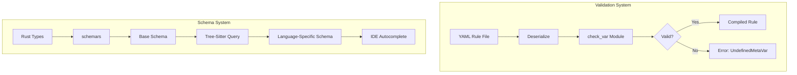
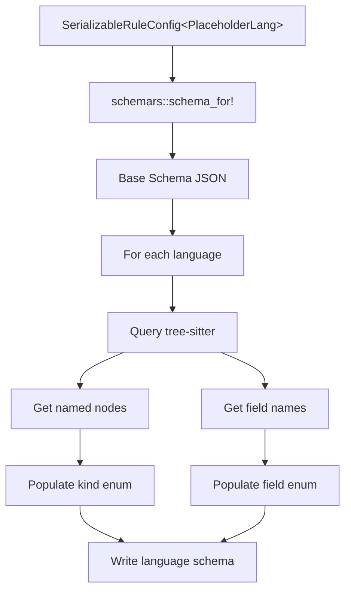

> **Source:** https://deepwiki.com/ast-grep/ast-grep/3.3-validation-and-schema

# Validation and Schema

This document describes the rule validation and schema generation systems in ast-grep. The validation system ensures that rules are correctly configured before execution, checking meta-variable consistency across rule components. The schema generation system produces JSON schemas that enable IDE autocompletion and validation for rule authors.

The validation system operates at two levels:

1. **Runtime validation** during rule parsing and construction (via `check_var` module)
2. **Static validation** via generated JSON schemas for IDE integration

For rule configuration format, see [Rule Configuration Format](/ast-grep/ast-grep/3.1-rule-configuration-format). For rule components, see [Rule Components](/ast-grep/ast-grep/3.2-rule-components).

## Overview



**Sources:** [crates/config/src/check_var.rs1-186](https://github.com/ast-grep/ast-grep/blob/3ae01aec/crates/config/src/check_var.rs#L1-L186) [crates/config/src/rule_config.rs136-146](https://github.com/ast-grep/ast-grep/blob/3ae01aec/crates/config/src/rule_config.rs#L136-L146) [crates/config/src/rule_core.rs99-137](https://github.com/ast-grep/ast-grep/blob/3ae01aec/crates/config/src/rule_core.rs#L99-L137)

## Validation System

The validation system ensures that all meta-variables referenced in rule components are properly defined. Validation occurs during rule construction, before any pattern matching begins.

### Meta-Variable Scoping Rules

Meta-variables in ast-grep rules follow strict scoping rules:

| Component | Defines Variables | Can Reference | Validation Location |
|-----------|-------------------|---------------|---------------------|
| `rule` | Named captures (`$VAR`) | - | Implicit via pattern parser |
| `utils` | Variables from utility patterns | - | [check_utils_defined68-73](https://github.com/ast-grep/ast-grep/blob/3ae01aec/check_utils_defined#L68-L73) |
| `constraints` | Additional named captures | Variables from `rule` and `utils` | [check_var_in_constraints98-116](https://github.com/ast-grep/ast-grep/blob/3ae01aec/check_var_in_constraints#L98-L116) |
| `transform` | New transformed variables | Variables from all above | [check_var_in_transform119-144](https://github.com/ast-grep/ast-grep/blob/3ae01aec/check_var_in_transform#L119-L144) |
| `fix` | - | All defined variables | [check_var_in_fix146-154](https://github.com/ast-grep/ast-grep/blob/3ae01aec/check_var_in_fix#L146-L154) |
| `rewriters` | Local variables (isolated scope) | Parent variables + local variables | [check_vars_in_rewriter50-66](https://github.com/ast-grep/ast-grep/blob/3ae01aec/check_vars_in_rewriter#L50-L66) |

**Sources:** [crates/config/src/check_var.rs1-186](https://github.com/ast-grep/ast-grep/blob/3ae01aec/crates/config/src/check_var.rs#L1-L186)

### Validation Entry Point

```rust
pub fn check_rule_with_hint(
    rule: &RuleCore,
    hint: CheckHint,
) -> Result<(), RuleCoreError> {
    // 1. Check utils are defined
    check_utils_defined(rule)?;
    
    // 2. Check variables in constraints
    check_var_in_constraints(rule)?;
    
    // 3. Check variables in transform
    check_var_in_transform(rule)?;
    
    // 4. Check variables in fix
    check_var_in_fix(rule)?;
}
```

**Sources:** [crates/config/src/rule_core.rs117-137](https://github.com/ast-grep/ast-grep/blob/3ae01aec/crates/config/src/rule_core.rs#L117-L137) [crates/config/src/rule_config.rs136-146](https://github.com/ast-grep/ast-grep/blob/3ae01aec/crates/config/src/rule_config.rs#L136-L146)

Validation is invoked from `SerializableRuleCore::get_matcher_with_hint()` at [crates/config/src/rule_core.rs121-137](https://github.com/ast-grep/ast-grep/blob/3ae01aec/crates/config/src/rule_core.rs#L121-L137) which calls `check_rule_with_hint()` at [crates/config/src/check_var.rs21-48](https://github.com/ast-grep/ast-grep/blob/3ae01aec/crates/config/src/check_var.rs#L21-L48) after constructing the `RuleCore`.

### CheckHint Validation Modes

The validation system uses `CheckHint` enum to determine validation strictness:

| Mode | Utils Check | Vars Check | Parent Vars | Use Case |
|------|-------------|------------|-------------|----------|
| `Global` | Skipped | Standard | No | Global utility rules (not yet registered) |
| `Normal` | Required | Standard | No | Regular rules in `sgconfig.yml` |
| `Rewriter` | Required | Enhanced | Yes | Rewriter sub-rules (can access parent vars) |

**Sources:** [crates/config/src/check_var.rs13-17](https://github.com/ast-grep/ast-grep/blob/3ae01aec/crates/config/src/check_var.rs#L13-L17) [crates/config/src/check_var.rs21-48](https://github.com/ast-grep/ast-grep/blob/3ae01aec/crates/config/src/check_var.rs#L21-L48)

### Constraint Validation

```rust
fn check_var_in_constraints(rule: &RuleCore) -> Result<(), RuleCoreError> {
    let mut defined_vars = rule.get_defined_vars();
    for (var_name, constraint) in &rule.constraints {
        // Validate constraint key exists
        if !defined_vars.contains(var_name) {
            return Err(RuleCoreError::UndefinedMetaVar(var_name, "constraints"));
        }
        // Add variables defined in constraint
        defined_vars.extend(constraint.get_defined_vars());
    }
    Ok(())
}
```

**Sources:** [crates/config/src/check_var.rs98-116](https://github.com/ast-grep/ast-grep/blob/3ae01aec/crates/config/src/check_var.rs#L98-L116)

The `check_var_in_constraints()` function performs two operations:

1. **Accumulates variables** defined in constraint rules (e.g., `constraints: { A: { pattern: $B + $C } }` adds `B` and `C`)
2. **Validates constraint keys** must reference already-defined variables

Example validation:

```yaml
# ✓ Valid
rule: {pattern: $A = $B}
constraints:
  A: {regex: "let"}  # A is defined

# ✗ Invalid
rule: {pattern: $A = $B}
constraints:
  C: {regex: "let"}  # C is NOT defined
```

**Sources:** [crates/config/src/check_var.rs98-116](https://github.com/ast-grep/ast-grep/blob/3ae01aec/crates/config/src/check_var.rs#L98-L116)

### Transform Validation

```rust
fn check_var_in_transform(rule: &RuleCore) -> Result<(), RuleCoreError> {
    let defined_vars = rule.get_all_defined_vars();
    for (key, transform) in &rule.transform {
        // Transform key cannot shadow existing var
        if defined_vars.contains(key) {
            return Err(RuleCoreError::Transform(AlreadyDefined));
        }
        // Transform source must exist
        if !defined_vars.contains(&transform.source) {
            return Err(RuleCoreError::UndefinedMetaVar(&transform.source, "transform"));
        }
    }
    Ok(())
}
```

**Sources:** [crates/config/src/check_var.rs119-144](https://github.com/ast-grep/ast-grep/blob/3ae01aec/crates/config/src/check_var.rs#L119-L144)

Transform validation at [crates/config/src/check_var.rs119-144](https://github.com/ast-grep/ast-grep/blob/3ae01aec/crates/config/src/check_var.rs#L119-L144) enforces two rules:

1. **No redefinition:** Transform keys cannot shadow variables from `rule`, `utils`, or `constraints`
2. **Source variables must exist:** Variables referenced in transform definitions must be previously defined

**Sources:** [crates/config/src/check_var.rs119-144](https://github.com/ast-grep/ast-grep/blob/3ae01aec/crates/config/src/check_var.rs#L119-L144)

### Fix Template Validation

```rust
fn check_var_in_fix(rule: &RuleCore) -> Result<(), RuleCoreError> {
    let all_vars = rule.get_all_defined_vars();
    for var in rule.fix.get_referenced_vars() {
        if !all_vars.contains(&var) {
            return Err(RuleCoreError::UndefinedMetaVar(&var, "fix"));
        }
    }
    Ok(())
}
```

**Sources:** [crates/config/src/check_var.rs146-154](https://github.com/ast-grep/ast-grep/blob/3ae01aec/crates/config/src/check_var.rs#L146-L154)

The `check_var_in_fix()` function at [crates/config/src/check_var.rs146-154](https://github.com/ast-grep/ast-grep/blob/3ae01aec/crates/config/src/check_var.rs#L146-L154) validates that fix templates only reference defined variables. This check is performed on all `Fixer` instances returned by `Fixer::parse()`.

Example:

```yaml
# ✓ Valid
rule: {pattern: $A = $B}
fix: "let $A = $B"  # Both A and B are defined

# ✗ Invalid
rule: {pattern: $A = $B}
fix: "let $C = $D"  # Neither C nor D are defined
```

**Sources:** [crates/config/src/check_var.rs146-154](https://github.com/ast-grep/ast-grep/blob/3ae01aec/crates/config/src/check_var.rs#L146-L154)

### Rewriter Validation

Rewriters are sub-rules used in transforms that have special scoping rules. They can access variables from their parent rule, creating a two-level validation process.

```rust
fn check_vars_in_rewriter(
    rule: &RuleCore,
    parent_vars: &HashSet<String>,
) -> Result<(), RuleCoreError> {
    let local_vars = rule.get_defined_vars();
    // Rewriters can access both parent vars and local vars
    let all_vars: HashSet<_> = parent_vars.union(&local_vars).collect();
    // Standard validation with expanded scope
    check_var_in_constraints_with_scope(rule, &all_vars)?;
    check_var_in_fix_with_scope(rule, &all_vars)?;
    Ok(())
}
```

**Sources:** [crates/config/src/check_var.rs50-66](https://github.com/ast-grep/ast-grep/blob/3ae01aec/crates/config/src/check_var.rs#L50-L66) [crates/config/src/rule_config.rs162-184](https://github.com/ast-grep/ast-grep/blob/3ae01aec/crates/config/src/rule_config.rs#L162-L184)

Rewriter validation occurs in two phases:

1. **Registration phase** ([rule_config.rs162-184](https://github.com/ast-grep/ast-grep/blob/3ae01aec/rule_config.rs#L162-L184)):
   - Each rewriter is validated with `CheckHint::Rewriter(parent_vars)`
   - Parent variables are passed so rewriters can reference them
   - Rewriters must have a `fix` field
2. **Transform reference validation** ([check_var.rs157-185](https://github.com/ast-grep/ast-grep/blob/3ae01aec/check_var.rs#L157-L185)):
   - Ensures all rewriters referenced in transforms are defined
   - Checks both top-level rules and nested rewriters

Example:

```yaml
# ✓ Valid - rewriter accesses parent var
rule: {pattern: $X = $Y}
transform:
  DOUBLED:
    rewrite:
      source: $Y  # Parent variable
      rewriters: [double]
rewriters:
  double:
    rule: {kind: number}
    fix: "($Y * 2)"  # Accesses $Y from parent
```

**Sources:** [crates/config/src/check_var.rs50-66](https://github.com/ast-grep/ast-grep/blob/3ae01aec/crates/config/src/check_var.rs#L50-L66) [crates/config/src/check_var.rs157-185](https://github.com/ast-grep/ast-grep/blob/3ae01aec/crates/config/src/check_var.rs#L157-L185) [crates/config/src/rule_config.rs162-184](https://github.com/ast-grep/ast-grep/blob/3ae01aec/crates/config/src/rule_config.rs#L162-L184)

### Label Validation

```rust
fn check_labels(labels: &HashMap<String, LabelConfig>, node_vars: &HashSet<String>) -> Result<()> {
    for var_name in labels.keys() {
        if !node_vars.contains(var_name) {
            return Err("Label variable must be defined in rule or constraints");
        }
    }
}
```

**Sources:** [crates/config/src/rule_config.rs148-160](https://github.com/ast-grep/ast-grep/blob/3ae01aec/crates/config/src/rule_config.rs#L148-L160)

Label validation at [crates/config/src/rule_config.rs148-160](https://github.com/ast-grep/ast-grep/blob/3ae01aec/crates/config/src/rule_config.rs#L148-L160) ensures that labels only reference variables that have actual AST node matches. Transform variables cannot be used for labels because they are computed values without corresponding source locations.

Example:

```yaml
# ✓ Valid
rule: {pattern: $VAR = $VAL}
labels:
  VAR: {message: "Variable name"}  # VAR has AST node

# ✗ Invalid
rule: {pattern: $VAR = $VAL}
transform:
  UPPER: {source: $VAR, uppercase: true}
labels:
  UPPER: {message: "Upper case"}  # UPPER is a transform, not a node
```

**Sources:** [crates/config/src/rule_config.rs148-160](https://github.com/ast-grep/ast-grep/blob/3ae01aec/crates/config/src/rule_config.rs#L148-L160)

### Error Types

The validation system produces structured errors through the `RuleCoreError` enum:

| Error Variant | Location | Meaning |
|---------------|----------|---------|
| `UndefinedMetaVar(String, &'static str)` | [rule_core.rs38](https://github.com/ast-grep/ast-grep/blob/3ae01aec/rule_core.rs#L38-L38) | Variable used but not defined; second parameter indicates location |
| `Transform(TransformError::AlreadyDefined)` | [rule_core.rs34](https://github.com/ast-grep/ast-grep/blob/3ae01aec/rule_core.rs#L34-L34) | Transform key shadows existing variable |
| `Transform(TransformError::Cyclic)` | [rule_core.rs34](https://github.com/ast-grep/ast-grep/blob/3ae01aec/rule_core.rs#L34-L34) | Circular dependency in transforms |
| `Fixer(FixerError::InvalidRewriter)` | [rule_core.rs36](https://github.com/ast-grep/ast-grep/blob/3ae01aec/rule_core.rs#L36-L36) | Rewriter missing required `fix` field |
| `Rule(RuleSerializeError)` | [rule_core.rs30](https://github.com/ast-grep/ast-grep/blob/3ae01aec/rule_core.rs#L30-L30) | Invalid rule syntax |
| `Constraints(RuleSerializeError)` | [rule_core.rs32](https://github.com/ast-grep/ast-grep/blob/3ae01aec/rule_core.rs#L32-L32) | Invalid constraint syntax |
| `Utils(RuleSerializeError)` | [rule_core.rs28](https://github.com/ast-grep/ast-grep/blob/3ae01aec/rule_core.rs#L28-L28) | Invalid utility rule syntax |

**Sources:** [crates/config/src/rule_core.rs23-39](https://github.com/ast-grep/ast-grep/blob/3ae01aec/crates/config/src/rule_core.rs#L23-L39) [crates/config/src/rule_config.rs40-56](https://github.com/ast-grep/ast-grep/blob/3ae01aec/crates/config/src/rule_config.rs#L40-L56)

## JSON Schema Generation

The schema generation system produces JSON schemas that enable IDE autocompletion and validation for rule authors. It generates both a generic schema and 23 language-specific schemas by interrogating tree-sitter grammars.

### Schema Generation Workflow



**Sources:** [xtask/src/schema.rs16-25](https://github.com/ast-grep/ast-grep/blob/3ae01aec/xtask/src/schema.rs#L16-L25) [xtask/src/schema.rs27-51](https://github.com/ast-grep/ast-grep/blob/3ae01aec/xtask/src/schema.rs#L27-L51) [xtask/src/schema.rs53-60](https://github.com/ast-grep/ast-grep/blob/3ae01aec/xtask/src/schema.rs#L53-L60)

## Base Schema Generation

The schema generation process begins with creating a base schema from the `SerializableRuleConfig` type using the `schemars` crate. A special `PlaceholderLang` type is used as the language type parameter to represent an arbitrary language.

### PlaceholderLang Type

The `PlaceholderLang` struct is a compile-time placeholder that implements the `Language` and `LanguageExt` traits but marks all methods as unreachable:

| Method | Implementation | Purpose |
|--------|----------------|---------|
| `schema_id()` | Returns `"Language"` | Identifies the schema type |
| `schema_name()` | Returns `"Language"` | Names the schema element |
| `json_schema()` | Returns string type schema | Defines JSON representation |
| `kind_to_id()` | `unreachable!()` | Only for schema generation |
| `field_to_id()` | `unreachable!()` | Only for schema generation |
| `build_pattern()` | `unreachable!()` | Only for schema generation |
| `get_ts_language()` | `unreachable!()` | Only for schema generation |

**Sources:** [xtask/src/schema.rs158-192](https://github.com/ast-grep/ast-grep/blob/3ae01aec/xtask/src/schema.rs#L158-L192)

### Base Schema Structure

The base schema is generated at [xtask/src/schema.rs17](https://github.com/ast-grep/ast-grep/blob/3ae01aec/xtask/src/schema.rs#L17-L17) using:

```rust
schema_for!(SerializableRuleConfig<PlaceholderLang>)
```

This produces a JSON schema with definitions for:

- `SerializableRuleConfig` - top-level rule structure
- `SerializableRule` - rule pattern components
- `Relation` - relational matchers (has, inside, etc.)
- `Language` - language identifier (placeholder)

The base schema is written to `schemas/rule.json` and serves as a starting point for all language-specific schemas.

**Sources:** [xtask/src/schema.rs16-25](https://github.com/ast-grep/ast-grep/blob/3ae01aec/xtask/src/schema.rs#L16-L25)

## Language-Specific Schema Generation

For each supported language, the system generates a tailored schema that includes language-specific node types, fields, and aliases. This process is orchestrated by `generate_lang_schemas()` which iterates through all 23 supported languages.

### Supported Languages Table

| Language | Schema File | Aliases Supported |
|----------|-------------|-------------------|
| Bash | `bash_rule.json` | Yes |
| C | `c_rule.json` | Yes |
| C++ | `cpp_rule.json` | Yes |
| C# | `csharp_rule.json` | Yes |
| CSS | `css_rule.json` | Yes |
| Elixir | `elixir_rule.json` | Yes |
| Go | `go_rule.json` | Yes |
| Haskell | `haskell_rule.json` | Yes |
| HTML | `html_rule.json` | Yes |
| Java | `java_rule.json` | Yes |
| JavaScript | `javascript_rule.json` | Yes |
| JSON | `json_rule.json` | Yes |
| Kotlin | `kotlin_rule.json` | Yes |
| Lua | `lua_rule.json` | Yes |
| PHP | `php_rule.json` | Yes |
| Python | `python_rule.json` | Yes |
| Ruby | `ruby_rule.json` | Yes |
| Rust | `rust_rule.json` | Yes |
| Scala | `scala_rule.json` | Yes |
| Swift | `swift_rule.json` | Yes |
| TSX | `tsx_rule.json` | Yes |
| TypeScript | `typescript_rule.json` | Yes |
| YAML | `yaml_rule.json` | Yes |

**Sources:** [xtask/src/schema.rs27-51](https://github.com/ast-grep/ast-grep/blob/3ae01aec/xtask/src/schema.rs#L27-L51)

### Schema Enrichment Process

The `add_lang_info_to_schema()` function performs four key modifications:

1. **Title Update** - Changes the schema title to identify the specific language [xtask/src/schema.rs68-69](https://github.com/ast-grep/ast-grep/blob/3ae01aec/xtask/src/schema.rs#L68-L69)
2. **Field Enum Population** - Adds valid field names to the `Relation.properties.field` enum [xtask/src/schema.rs74-88](https://github.com/ast-grep/ast-grep/blob/3ae01aec/xtask/src/schema.rs#L74-L88)
3. **Kind Enum Population** - Adds valid node kinds to both `Relation.properties.kind` and `SerializableRule.properties.kind` [xtask/src/schema.rs91-96](https://github.com/ast-grep/ast-grep/blob/3ae01aec/xtask/src/schema.rs#L91-L96)
4. **Language Enum Population** - Lists all language aliases and the primary language name [xtask/src/schema.rs99-113](https://github.com/ast-grep/ast-grep/blob/3ae01aec/xtask/src/schema.rs#L99-L113)

**Sources:** [xtask/src/schema.rs62-115](https://github.com/ast-grep/ast-grep/blob/3ae01aec/xtask/src/schema.rs#L62-L115)

## Tree-Sitter Interrogation

The system extracts metadata directly from tree-sitter grammar parsers to populate schema enums. This ensures that schemas always reflect the actual capabilities of each language's parser.

### Named Nodes Extraction

```rust
fn get_named_nodes(lang: &TsLanguage) -> Vec<serde_json::Value> {
    let mut nodes = BTreeSet::new();
    let count = lang.node_kind_count();
    for id in 0..count {
        if lang.node_kind_is_named(id) {
            if let Some(kind) = lang.node_kind_for_id(id) {
                nodes.insert(kind.to_string());
            }
        }
    }
    nodes.into_iter().map(Value::String).collect()
}
```

**Sources:** [xtask/src/schema.rs128-143](https://github.com/ast-grep/ast-grep/blob/3ae01aec/xtask/src/schema.rs#L128-L143)

The `get_named_nodes()` function at [xtask/src/schema.rs128-143](https://github.com/ast-grep/ast-grep/blob/3ae01aec/xtask/src/schema.rs#L128-L143) extracts named node types:

1. Queries `lang.node_kind_count()` to determine the total number of node types
2. For each node ID from 0 to count:
   - Checks if `lang.node_kind_is_named(id)` returns true
   - If named, retrieves the kind string via `lang.node_kind_for_id(id)`
3. Collects results in a `BTreeSet` for automatic sorting and deduplication
4. Converts to a vector of JSON string values

**Sources:** [xtask/src/schema.rs128-143](https://github.com/ast-grep/ast-grep/blob/3ae01aec/xtask/src/schema.rs#L128-L143)

### Field Names Extraction

```rust
fn get_fields(lang: &TsLanguage) -> Vec<serde_json::Value> {
    let mut fields = BTreeSet::new();
    let count = lang.field_count();
    for id in 1..=count {
        if let Some(field) = lang.field_name_for_id(id) {
            fields.insert(field.to_string());
        }
    }
    fields.into_iter().map(Value::String).collect()
}
```

**Sources:** [xtask/src/schema.rs145-156](https://github.com/ast-grep/ast-grep/blob/3ae01aec/xtask/src/schema.rs#L145-L156)

The `get_fields()` function at [xtask/src/schema.rs145-156](https://github.com/ast-grep/ast-grep/blob/3ae01aec/xtask/src/schema.rs#L145-L156) extracts field names:

1. Queries `lang.field_count()` to determine the total number of fields
2. Iterates from ID 1 to count (tree-sitter field IDs start at 1, not 0)
3. For each ID, calls `lang.field_name_for_id(id)`
4. Filters out `None` values (unused field IDs)
5. Collects in a `BTreeSet` for sorting and deduplication
6. Converts to a vector of JSON string values

**Sources:** [xtask/src/schema.rs145-156](https://github.com/ast-grep/ast-grep/blob/3ae01aec/xtask/src/schema.rs#L145-L156)

## Schema Structure and Usage

The generated schemas follow a hierarchical structure that enables rich IDE integration.

### Schema File Locations

| Schema Type | Path | Purpose |
|-------------|------|---------|
| Generic | `schemas/rule.json` | Base schema for any language |
| Language-specific | `schemas/{lang}_rule.json` | Enriched schema with node kinds and fields |

**Sources:** [xtask/src/schema.rs22](https://github.com/ast-grep/ast-grep/blob/3ae01aec/xtask/src/schema.rs#L22-L22) [xtask/src/schema.rs57](https://github.com/ast-grep/ast-grep/blob/3ae01aec/xtask/src/schema.rs#L57-L57)

### Integration with Rule Files

Rule files can specify a schema reference in their YAML to enable IDE validation and autocompletion:

```yaml
# yaml-language-server: $schema=https://ast-grep.github.io/schemas/typescript_rule.json
id: my-rule
language: typescript
rule:
  pattern: console.log($MSG)
```

IDEs that support JSON schema validation will then:

- Provide autocompletion for `kind` values (e.g., `function_declaration`, `class_declaration`)
- Provide autocompletion for `field` values (e.g., `name`, `body`, `params`)
- Validate that the `language` field contains a valid language name or alias
- Show inline documentation for schema properties

**Sources:** [xtask/src/schema.rs1-25](https://github.com/ast-grep/ast-grep/blob/3ae01aec/xtask/src/schema.rs#L1-L25)

## Execution and Testing

The schema generation is executed via the `xtask` workspace member, which is a common pattern in Rust projects for build-time automation tasks.

### Running Schema Generation

The schema generation is invoked via:

```bash
cargo xtask schema
```

This executes the `generate_schema()` function at [xtask/src/schema.rs16](https://github.com/ast-grep/ast-grep/blob/3ae01aec/xtask/src/schema.rs#L16-L16) which:

1. Generates the base generic schema
2. Calls `generate_lang_schemas()` to generate all 23 language-specific schemas
3. Writes output files to the `schemas/` directory

**Sources:** [xtask/src/schema.rs16-25](https://github.com/ast-grep/ast-grep/blob/3ae01aec/xtask/src/schema.rs#L16-L25)

### Test Coverage

The schema generation includes a unit test at [xtask/src/schema.rs199-202](https://github.com/ast-grep/ast-grep/blob/3ae01aec/xtask/src/schema.rs#L199-L202) that verifies the generation process completes without errors:

```rust
#[test]
fn test_schema_generation() {
    generate_schema().unwrap();
}
```

This test ensures that:

- All 23 languages can be processed
- Tree-sitter interrogation succeeds for all languages
- File I/O operations complete successfully
- JSON serialization produces valid output

**Sources:** [xtask/src/schema.rs194-203](https://github.com/ast-grep/ast-grep/blob/3ae01aec/xtask/src/schema.rs#L194-L203)
