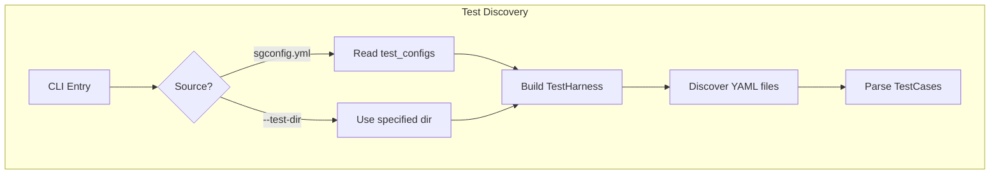
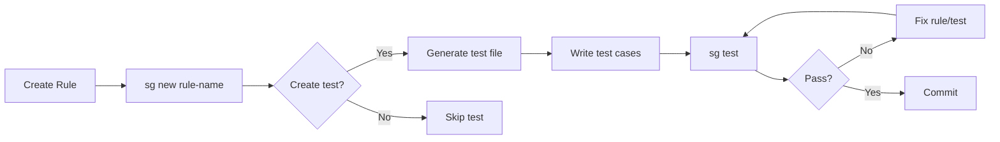

> **Source:** https://deepwiki.com/ast-grep/ast-grep/3.4-testing-rules

# Testing Rules

This document covers the rule testing system in ast-grep, which allows developers to verify that rules match expected code patterns correctly. The test command validates rules against code samples marked as `valid` (should not match) or `invalid` (should match), optionally comparing against saved snapshots.

For information about defining rules themselves, see [Rule Configuration Format](/ast-grep/ast-grep/3.1-rule-configuration-format) and [Rule Components](/ast-grep/ast-grep/3.2-rule-components). For information about running rules in production, see [Scan Command](/ast-grep/ast-grep/5.3-scan-command).

## Test Case Format

Test cases are defined in YAML files and specify an `id` matching a rule, along with code samples that should or should not trigger the rule.

### Basic Structure

The `TestCase` structure is defined at [crates/cli/src/verify/test_case.rs](https://github.com/ast-grep/ast-grep/blob/3ae01aec/crates/cli/src/verify/test_case.rs) and contains:

- **`id`**: Rule identifier to test against
- **`valid`**: Array of code strings that should NOT trigger the rule
- **`invalid`**: Array of code strings that SHOULD trigger the rule

Each string in `valid` and `invalid` represents a complete code snippet that will be parsed and matched against the rule.

**Example:**

```yaml
id: no-console-log
valid:
  - console.error('msg')
  - logger.log('msg')
invalid:
  - console.log('hello')
  - console.log('world')
```

**Sources:** [crates/cli/src/verify/test_case.rs](https://github.com/ast-grep/ast-grep/blob/3ae01aec/crates/cli/src/verify/test_case.rs) [crates/cli/src/new.rs277-286](https://github.com/ast-grep/ast-grep/blob/3ae01aec/crates/cli/src/new.rs#L277-L286)

## Test Configuration

Test directories are configured in `sgconfig.yml` through the `test_configs` field.

### TestConfig Structure

The `TestConfig` struct ([crates/cli/src/config.rs16-32](https://github.com/ast-grep/ast-grep/blob/3ae01aec/crates/cli/src/config.rs#L16-L32)) defines:

| Field | Type | Description |
|-------|------|-------------|
| `test_dir` | `PathBuf` | Directory containing test YAML files |
| `snapshot_dir` | `Option<PathBuf>` | Directory for snapshot files (relative to `test_dir`, defaults to `__snapshots__`) |

### Example Configuration

```yaml
# sgconfig.yml
rule_dirs:
  - rules
test_configs:
  - test_dir: tests
    snapshot_dir: __snapshots__
```

Multiple test directories can be configured, each with its own snapshot location.

**Sources:** [crates/cli/src/config.rs16-32](https://github.com/ast-grep/ast-grep/blob/3ae01aec/crates/cli/src/config.rs#L16-L32) [crates/cli/src/config.rs36-55](https://github.com/ast-grep/ast-grep/blob/3ae01aec/crates/cli/src/config.rs#L36-L55)

## Test Discovery and Execution

### Test Harness Architecture

The `TestHarness` struct ([crates/cli/src/verify/find_file.rs](https://github.com/ast-grep/ast-grep/blob/3ae01aec/crates/cli/src/verify/find_file.rs)) handles test discovery from either:

1. **Project configuration**: Reads from `test_configs` in `sgconfig.yml` ([crates/cli/src/verify.rs73](https://github.com/ast-grep/ast-grep/blob/3ae01aec/crates/cli/src/verify.rs#L73-L73))
2. **Direct directory**: Specified via `--test-dir` command-line argument ([crates/cli/src/verify.rs69-72](https://github.com/ast-grep/ast-grep/blob/3ae01aec/crates/cli/src/verify.rs#L69-L72))



### Parallel Test Execution

Tests execute in parallel using thread-based parallelism:

```rust
std::thread::scope(|s| {
    for harness in harnesses {
        s.spawn(move || harness.run_test());
    }
});
```

The number of threads is capped at 12 to avoid excessive resource usage ([crates/cli/src/verify.rs35-37](https://github.com/ast-grep/ast-grep/blob/3ae01aec/crates/cli/src/verify.rs#L35-L37)).

**Sources:** [crates/cli/src/verify.rs29-55](https://github.com/ast-grep/ast-grep/blob/3ae01aec/crates/cli/src/verify.rs#L29-L55) [crates/cli/src/verify.rs57-112](https://github.com/ast-grep/ast-grep/blob/3ae01aec/crates/cli/src/verify.rs#L57-L112) [crates/cli/src/verify/find_file.rs](https://github.com/ast-grep/ast-grep/blob/3ae01aec/crates/cli/src/verify/find_file.rs)

## Test Results and Verification

### CaseStatus Enum

The verification logic ([crates/cli/src/verify.rs144-157](https://github.com/ast-grep/ast-grep/blob/3ae01aec/crates/cli/src/verify.rs#L144-L157)) compares rule execution against expected behavior:

| Status | Condition | Meaning |
|--------|-----------|---------|
| `Validated` | Valid code + No match | ✅ Correctly passed |
| `Reported` | Invalid code + Match | ✅ Correctly failed |
| `Noisy` | Valid code + Match | ❌ False positive |
| `Missing` | Invalid code + No match | ❌ False negative |
| `Wrong` | Snapshot mismatch | ❌ Output changed |

### CaseResult Structure

Each `CaseResult` aggregates all status results for a single rule's test cases.

```rust
pub struct CaseResult {
    pub id: String,
    pub results: Vec<CaseStatus>,
}
```

### Verification Flow

The `verify_test_case_simple` function ([crates/cli/src/verify.rs144-157](https://github.com/ast-grep/ast-grep/blob/3ae01aec/crates/cli/src/verify.rs#L144-L157)) retrieves the rule by ID and delegates to either `verify_with_snapshot` or `verify_rule` on the `TestCase` instance.

**Sources:** [crates/cli/src/verify.rs144-157](https://github.com/ast-grep/ast-grep/blob/3ae01aec/crates/cli/src/verify.rs#L144-L157) [crates/cli/src/verify/case_result.rs](https://github.com/ast-grep/ast-grep/blob/3ae01aec/crates/cli/src/verify/case_result.rs) [crates/cli/src/verify/test_case.rs](https://github.com/ast-grep/ast-grep/blob/3ae01aec/crates/cli/src/verify/test_case.rs)

## Snapshot Testing

Snapshots capture the expected output of rules (matched code, fix suggestions, meta-variables) to detect regressions when rules are modified.

### Snapshot Structure

```rust
pub struct TestSnapshots {
    pub source: String,       // Original code snippet
    pub id: String,           // Rule ID
    pub snapshots: Vec<Snapshot>,
}

pub struct Snapshot {
    pub range: Range<usize>,  // Match location
    pub text: String,         // Matched text
    pub fixed: Option<String>,// Fix output (if any)
    pub vars: HashMap<String, String>, // Captured variables
}
```

### Snapshot Collection

The `SnapshotCollection` type is a `HashMap<String, TestSnapshots>` mapping rule IDs to their snapshots ([crates/cli/src/verify/snapshot.rs](https://github.com/ast-grep/ast-grep/blob/3ae01aec/crates/cli/src/verify/snapshot.rs)).

### Snapshot Update Strategies

The `SnapshotAction` enum ([crates/cli/src/verify/snapshot.rs](https://github.com/ast-grep/ast-grep/blob/3ae01aec/crates/cli/src/verify/snapshot.rs)) determines update behavior:

| Action | Flag | Behavior |
|--------|------|----------|
| `NoUpdate` | (default) | Fail on snapshot mismatch |
| `UpdateAll` | `--update-all` | Automatically update all mismatched snapshots |
| `Interactive` | `--interactive` | Prompt user for each snapshot change |

### Snapshot File Management

Snapshots are written using `write_merged_to_disk` ([crates/cli/src/verify.rs129-142](https://github.com/ast-grep/ast-grep/blob/3ae01aec/crates/cli/src/verify.rs#L129-L142)):

```rust
fn write_merged_to_disk(
    snapshot_collection: &SnapshotCollection,
    snapshot_dir: &Path,
) -> Result<()> {
    for (rule_id, snapshots) in snapshot_collection {
        let file = snapshot_dir.join(format!("{}.snap", rule_id));
        serde_yaml::to_writer(File::create(file)?, snapshots)?;
    }
}
```

**Sources:** [crates/cli/src/verify/snapshot.rs](https://github.com/ast-grep/ast-grep/blob/3ae01aec/crates/cli/src/verify/snapshot.rs) [crates/cli/src/verify.rs114-142](https://github.com/ast-grep/ast-grep/blob/3ae01aec/crates/cli/src/verify.rs#L114-L142)

## Test Reporting

### Reporter Trait System

The `Reporter` trait ([crates/cli/src/verify/reporter.rs](https://github.com/ast-grep/ast-grep/blob/3ae01aec/crates/cli/src/verify/reporter.rs)) defines the test output interface:

| Method | Purpose |
|--------|---------|
| `before_report` | Initialize reporting (print headers) |
| `report_failed_cases` | Display failing test cases |
| `collect_snapshot_action` | Determine snapshot update strategy |
| `report_summaries` | Print test statistics |
| `after_report` | Finalize and return overall result |

### DefaultReporter

Non-interactive reporter for CI/CD environments ([crates/cli/src/verify/reporter.rs](https://github.com/ast-grep/ast-grep/blob/3ae01aec/crates/cli/src/verify/reporter.rs)):

- Uses `update_all` flag to determine `SnapshotAction::UpdateAll` or `NoUpdate`
- Prints failing tests to `output` stream

### InteractiveReporter

Interactive reporter for development workflow ([crates/cli/src/verify/reporter.rs](https://github.com/ast-grep/ast-grep/blob/3ae01aec/crates/cli/src/verify/reporter.rs)):

- Prompts user to accept/reject each snapshot change
- Updates `should_accept_all` based on user choosing "accept all"

### TestResult Enum

The result type determines exit code:

```rust
pub enum TestResult {
    Success,
    RuleFail,
    MismatchSnapshotOnly,
}
```

- `Success` → `ExitCode::SUCCESS`
- `RuleFail` → Error with `ErrorContext::TestFail`
- `MismatchSnapshotOnly` → Error with `ErrorContext::TestSnapshotMismatch`

**Sources:** [crates/cli/src/verify/reporter.rs](https://github.com/ast-grep/ast-grep/blob/3ae01aec/crates/cli/src/verify/reporter.rs) [crates/cli/src/verify.rs96-111](https://github.com/ast-grep/ast-grep/blob/3ae01aec/crates/cli/src/verify.rs#L96-L111)

## Command-Line Interface

### TestArg Structure

```rust
pub struct TestArg {
    pub test_dir: Option<PathBuf>,      // -t, --test-dir
    pub config: Option<PathBuf>,        // -c, --config
    pub update_all: bool,               // -U, --update-all
    pub interactive: bool,              // -i, --interactive
    pub filter: Option<Regex>,          // -f, --filter
    pub skip_snapshot_tests: bool,      // --skip-snapshot-tests
    pub include_off: bool,              // --include-off
}
```

### Command Examples

| Command | Description |
|---------|-------------|
| `sg test` | Run all tests using project configuration |
| `sg test -t custom-tests` | Test from specific directory |
| `sg test -U` | Update all snapshots automatically |
| `sg test -i` | Interactively review snapshot changes |
| `sg test -f "no-console"` | Filter tests matching regex |
| `sg test --skip-snapshot-tests` | Validate syntax only, ignore outputs |
| `sg test --include-off` | Include rules with `severity: off` |

### Entry Point Flow

The `run_test_rule` function ([crates/cli/src/verify.rs200-215](https://github.com/ast-grep/ast-grep/blob/3ae01aec/crates/cli/src/verify.rs#L200-L215)) selects the appropriate reporter based on the `--interactive` flag, then delegates to `run_test_rule_impl` for execution.

**Sources:** [crates/cli/src/verify.rs169-198](https://github.com/ast-grep/ast-grep/blob/3ae01aec/crates/cli/src/verify.rs#L169-L198) [crates/cli/src/verify.rs200-215](https://github.com/ast-grep/ast-grep/blob/3ae01aec/crates/cli/src/verify.rs#L200-L215)

## Test Workflow Integration

### Rule Development Cycle



The `new` command ([crates/cli/src/new.rs270-274](https://github.com/ast-grep/ast-grep/blob/3ae01aec/crates/cli/src/new.rs#L270-L274)) can create test files alongside rules, prompting whether to create tests during rule creation.

### Test Directory Structure

```
project/
├── sgconfig.yml
├── rules/
│   ├── no-var.yaml
│   └── prefer-const.yaml
└── tests/
    ├── no-var-test.yaml
    ├── prefer-const-test.yaml
    └── __snapshots__/
        ├── no-var.snap
        └── prefer-const.snap
```

**Sources:** [crates/cli/src/new.rs232-275](https://github.com/ast-grep/ast-grep/blob/3ae01aec/crates/cli/src/new.rs#L232-L275) [crates/cli/src/new.rs277-319](https://github.com/ast-grep/ast-grep/blob/3ae01aec/crates/cli/src/new.rs#L277-L319)
