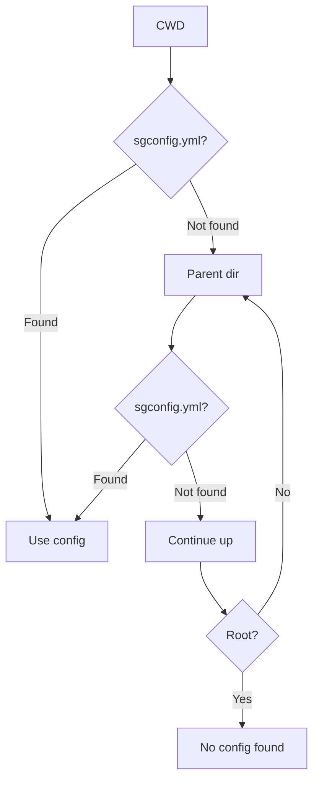
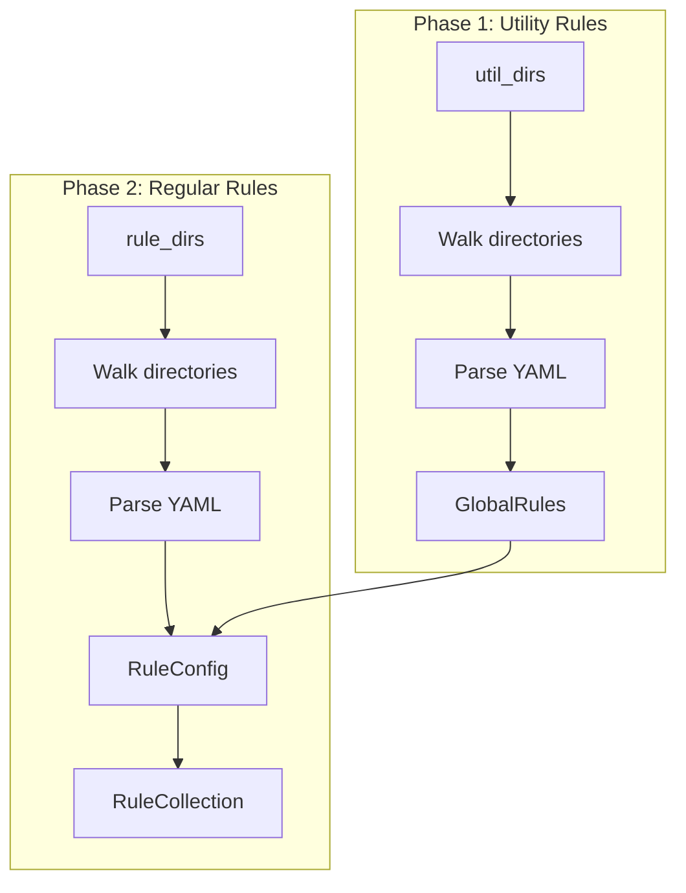
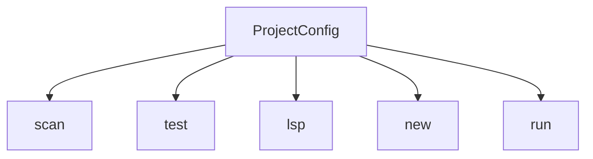

> **Source:** https://deepwiki.com/ast-grep/ast-grep/3.5-project-configuration

# Project Configuration

This document explains the project-level configuration system that defines the structure of an ast-grep project. The configuration file (`sgconfig.yml`) specifies directories for rules, tests, and utilities, and controls custom language settings. This document covers configuration discovery, file format, directory structure, and how the configuration integrates with CLI commands.

For information about individual rule file format and syntax, see [Rule Configuration Format](/ast-grep/ast-grep/3.1-rule-configuration-format). For testing configuration specifics, see [Testing Rules](/ast-grep/ast-grep/3.4-testing-rules).

## Configuration File Discovery

ast-grep searches for project configuration files by walking up the directory tree from the current working directory. It looks for either `sgconfig.yml` or `sgconfig.yaml` in each parent directory until one is found or the filesystem root is reached.



**Sources:** [crates/cli/src/config.rs266-285](https://github.com/ast-grep/ast-grep/blob/3ae01aec/crates/cli/src/config.rs#L266-L285)

The discovery process is initiated by `ProjectConfig::setup()`, which accepts an optional explicit path. If no path is provided, it uses the discovery mechanism:

```rust
pub fn setup(config_path: Option<PathBuf>) -> Result<Self> {
    let path = config_path.unwrap_or_else(|| discover_config()?);
    // Load and validate configuration
}
```

**Sources:** [crates/cli/src/config.rs70-109](https://github.com/ast-grep/ast-grep/blob/3ae01aec/crates/cli/src/config.rs#L70-L109)

## Configuration File Format

The configuration file is deserialized into the `AstGrepConfig` struct, which defines all project-level settings:

### AstGrepConfig Structure

| Field | Type | Required | Description |
|-------|------|----------|-------------|
| `rule_dirs` | `Vec<PathBuf>` | No | Directories containing rule YAML files |
| `test_configs` | `Option<Vec<TestConfig>>` | No | Test directory configurations |
| `util_dirs` | `Option<Vec<PathBuf>>` | No | Directories containing utility rules |
| `custom_languages` | `Option<HashMap<String, CustomLang>>` | No | Custom language parser definitions |
| `language_globs` | `Option<LanguageGlobs>` | No | Additional file patterns for languages |
| `language_injections` | `Vec<SerializableInjection>` | No | Embedded language configuration |

**Sources:** [crates/cli/src/config.rs34-55](https://github.com/ast-grep/ast-grep/blob/3ae01aec/crates/cli/src/config.rs#L34-L55)

### TestConfig Structure

| Field | Type | Required | Description |
|-------|------|----------|-------------|
| `test_dir` | `PathBuf` | Yes | Directory containing test YAML files |
| `snapshot_dir` | `Option<PathBuf>` | No | Directory for snapshot files (relative to `test_dir`) |

**Sources:** [crates/cli/src/config.rs16-32](https://github.com/ast-grep/ast-grep/blob/3ae01aec/crates/cli/src/config.rs#L16-L32)

### Example Configuration

```yaml
# sgconfig.yml
rule_dirs:
  - rules
  - custom-rules
test_configs:
  - test_dir: tests
    snapshot_dir: __snapshots__
util_dirs:
  - utils
language_globs:
  typescript:
    - "*.tsx"
    - "*.mts"
```

**Sources:** [crates/cli/src/config.rs34-55](https://github.com/ast-grep/ast-grep/blob/3ae01aec/crates/cli/src/config.rs#L34-L55)

## ProjectConfig Runtime Structure

After deserialization and validation, the configuration is transformed into `ProjectConfig`, which is used throughout the CLI:

```rust
pub struct ProjectConfig {
    pub project_dir: PathBuf,
    pub rule_dirs: Vec<PathBuf>,
    pub test_configs: Vec<TestConfig>,
    pub util_dirs: Vec<PathBuf>,
}
```

**Sources:** [crates/cli/src/config.rs57-109](https://github.com/ast-grep/ast-grep/blob/3ae01aec/crates/cli/src/config.rs#L57-L109)

The transformation happens in `ProjectConfig::setup()`:

- `rule_dirs`, `test_configs`, and `util_dirs` are extracted from `AstGrepConfig`
- `project_dir` is set to the parent directory of the config file
- Custom languages, globs, and injections are registered globally
- All paths in the config are interpreted relative to `project_dir`

**Sources:** [crates/cli/src/config.rs96-121](https://github.com/ast-grep/ast-grep/blob/3ae01aec/crates/cli/src/config.rs#L96-L121)

## Directory Structure

A typical ast-grep project follows this structure:

```
project-root/
├── sgconfig.yml          # Project configuration
├── rules/                # Rule directory
│   ├── no-console.yml
│   ├── security/
│   │   ├── no-eval.yml
│   │   └── xss-check.yml
│   └── .gitkeep
├── rule-tests/           # Test directory
│   ├── no-console-test.yml
│   ├── __snapshots__/    # Snapshot directory
│   │   └── no-eval-snapshot.yml
│   └── .gitkeep
└── utils/                # Utility rule directory
    ├── common-patterns.yml
    └── .gitkeep
```

The `new` command scaffolds this structure and creates `.gitkeep` files to ensure empty directories are tracked in version control:

**Sources:** [crates/cli/src/new.rs35-43](https://github.com/ast-grep/ast-grep/blob/3ae01aec/crates/cli/src/new.rs#L35-L43) [crates/cli/src/new.rs198-230](https://github.com/ast-grep/ast-grep/blob/3ae01aec/crates/cli/src/new.rs#L198-L230)

## Rule Loading Process

Rules are loaded in two phases: first utility rules, then regular rules. Utility rules can be referenced by regular rules using the `matches` operator.



**Sources:** [crates/cli/src/config.rs85-220](https://github.com/ast-grep/ast-grep/blob/3ae01aec/crates/cli/src/config.rs#L85-L220)

### Utility Rule Loading

Utility rules are loaded first and registered in `GlobalRules`:

1. **Build Walker**: Creates a `WalkBuilder` for each directory in `util_dirs` [config.rs123-131](https://github.com/ast-grep/ast-grep/blob/3ae01aec/config.rs#L123-L131)
2. **Filter Files**: Uses `config_file_type()` to find YAML files [config.rs143](https://github.com/ast-grep/ast-grep/blob/3ae01aec/config.rs#L143-L143)
3. **Parse YAML**: Deserializes utility rule configurations [config.rs155-157](https://github.com/ast-grep/ast-grep/blob/3ae01aec/config.rs#L155-L157)
4. **Register**: Calls `DeserializeEnv::parse_global_utils()` to create `GlobalRules` [config.rs160](https://github.com/ast-grep/ast-grep/blob/3ae01aec/config.rs#L160-L160)

**Sources:** [crates/cli/src/config.rs133-162](https://github.com/ast-grep/ast-grep/blob/3ae01aec/crates/cli/src/config.rs#L133-L162)

### Regular Rule Loading

Regular rules are loaded with access to the utility rules:

1. **Walk Directories**: Iterates through each `rule_dir` [config.rs175-176](https://github.com/ast-grep/ast-grep/blob/3ae01aec/config.rs#L175-L176)
2. **Read Files**: Uses `read_rule_file()` with `GlobalRules` context [config.rs191](https://github.com/ast-grep/ast-grep/blob/3ae01aec/config.rs#L191-L191)
3. **Generate IDs**: Assigns default IDs based on filename if not specified [config.rs247-258](https://github.com/ast-grep/ast-grep/blob/3ae01aec/config.rs#L247-L258)
4. **Validate Uniqueness**: Checks for duplicate rule IDs across all files [config.rs195-208](https://github.com/ast-grep/ast-grep/blob/3ae01aec/config.rs#L195-L208)
5. **Apply Overwrite**: Filters rules based on severity and patterns [config.rs211](https://github.com/ast-grep/ast-grep/blob/3ae01aec/config.rs#L211-L211)
6. **Build Collection**: Creates `RuleCollection` with compiled rules [config.rs212](https://github.com/ast-grep/ast-grep/blob/3ae01aec/config.rs#L212-L212)

**Sources:** [crates/cli/src/config.rs164-220](https://github.com/ast-grep/ast-grep/blob/3ae01aec/crates/cli/src/config.rs#L164-L220) [crates/cli/src/config.rs236-260](https://github.com/ast-grep/ast-grep/blob/3ae01aec/crates/cli/src/config.rs#L236-L260)

## Integration with CLI Commands

`ProjectConfig` is used across multiple CLI commands to access rules and project settings:



**Sources:** [crates/cli/src/verify.rs60-74](https://github.com/ast-grep/ast-grep/blob/3ae01aec/crates/cli/src/verify.rs#L60-L74) [crates/cli/src/lsp.rs10-28](https://github.com/ast-grep/ast-grep/blob/3ae01aec/crates/cli/src/lsp.rs#L10-L28) [crates/cli/src/new.rs148-230](https://github.com/ast-grep/ast-grep/blob/3ae01aec/crates/cli/src/new.rs#L148-L230)

### Scan Command

The `scan` command requires a `ProjectConfig` to load rules. It calls `find_rules()` to get a `RuleCollection` and `RuleTrace`:

```rust
let (collection, trace) = config.find_rules(None)?;
```

**Sources:** [crates/cli/src/config.rs85-91](https://github.com/ast-grep/ast-grep/blob/3ae01aec/crates/cli/src/config.rs#L85-L91)

### Test Command

The `test` command uses both rules and test configurations:

- Loads rules via `find_rules()` [verify.rs64](https://github.com/ast-grep/ast-grep/blob/3ae01aec/verify.rs#L64-L64)
- Discovers test files from `test_configs` [verify.rs69-74](https://github.com/ast-grep/ast-grep/blob/3ae01aec/verify.rs#L69-L74)
- Optionally uses `snapshot_dir` for snapshot testing [verify.rs71](https://github.com/ast-grep/ast-grep/blob/3ae01aec/verify.rs#L71-L71)

**Sources:** [crates/cli/src/verify.rs60-74](https://github.com/ast-grep/ast-grep/blob/3ae01aec/crates/cli/src/verify.rs#L60-L74)

### LSP Command

The language server uses `ProjectConfig` to provide diagnostics:

- Captures `project_dir` for file path resolution [lsp.rs17](https://github.com/ast-grep/ast-grep/blob/3ae01aec/lsp.rs#L17-L17)
- Creates a rule finder closure that calls `find_rules()` [lsp.rs20-23](https://github.com/ast-grep/ast-grep/blob/3ae01aec/lsp.rs#L20-L23)
- Reloads rules when configuration changes [lsp.rs26](https://github.com/ast-grep/ast-grep/blob/3ae01aec/lsp.rs#L26-L26)

**Sources:** [crates/cli/src/lsp.rs10-28](https://github.com/ast-grep/ast-grep/blob/3ae01aec/crates/cli/src/lsp.rs#L10-L28)

### New Command

The `new` command manages project structure:

- **Project**: Creates `sgconfig.yml` with default directories [new.rs198-230](https://github.com/ast-grep/ast-grep/blob/3ae01aec/new.rs#L198-L230)
- **Rule**: Selects from `rule_dirs` to create new rule files [new.rs247-275](https://github.com/ast-grep/ast-grep/blob/3ae01aec/new.rs#L247-L275)
- **Test**: Selects from `test_configs` to create test files [new.rs288-319](https://github.com/ast-grep/ast-grep/blob/3ae01aec/new.rs#L288-L319)
- **Util**: Selects from `util_dirs` to create utility rules [new.rs331-360](https://github.com/ast-grep/ast-grep/blob/3ae01aec/new.rs#L331-L360)

**Sources:** [crates/cli/src/new.rs148-360](https://github.com/ast-grep/ast-grep/blob/3ae01aec/crates/cli/src/new.rs#L148-L360)

## Custom Language Configuration

The `custom_languages` field allows registration of custom tree-sitter parsers not built into ast-grep:

```yaml
custom_languages:
  mylang:
    library_path: ./parsers/mylang.so
    extensions: [ml, myl]
```

After deserialization, `register_custom_language()` processes these definitions:

1. Calls `SgLang::register_custom_language()` with the project directory and custom language map [config.rs114](https://github.com/ast-grep/ast-grep/blob/3ae01aec/config.rs#L114-L114)
2. Language parsers are dynamically loaded at runtime
3. Custom languages can be used in rules like built-in languages

**Sources:** [crates/cli/src/config.rs112-121](https://github.com/ast-grep/ast-grep/blob/3ae01aec/crates/cli/src/config.rs#L112-L121)

## Language Globs and Injections

### Language Globs

Additional file patterns can be mapped to languages beyond their default extensions:

```yaml
language_globs:
  typescript:
    - "*.tsx"
    - "*.mts"
  javascript:
    - "*.cjs"
    - "*.mjs"
```

Registered via `SgLang::register_globs()` [config.rs117](https://github.com/ast-grep/ast-grep/blob/3ae01aec/config.rs#L117-L117)

### Language Injections

Embedded language support for multi-language files:

```yaml
language_injections:
  - host: html
    injected: javascript
    rule:
      kind: script_element
```

Registered via `SgLang::register_injections()` [config.rs119](https://github.com/ast-grep/ast-grep/blob/3ae01aec/config.rs#L119-L119)

**Sources:** [crates/cli/src/config.rs116-119](https://github.com/ast-grep/ast-grep/blob/3ae01aec/crates/cli/src/config.rs#L116-L119)

## Error Handling

Configuration-related errors are categorized using `ErrorContext`:

| Error | Condition | Error Code |
|-------|-----------|------------|
| `ProjectNotExist` | No sgconfig.yml found | Required for scan/test/lsp |
| `ReadConfiguration` | Cannot read config file | File permissions or missing |
| `ParseConfiguration` | Invalid YAML syntax | YAML format error |
| `DuplicateRuleId` | Same ID in multiple rules | Unique ID required |
| `InvalidGlobalUtils` | Utility rule parsing failed | Check utils syntax |
| `WalkRuleDir` | Cannot traverse directory | Check permissions |

**Sources:** Referenced in [crates/cli/src/config.rs](https://github.com/ast-grep/ast-grep/blob/3ae01aec/crates/cli/src/config.rs) error handling

## Rule ID Assignment

When rule files are loaded, IDs are assigned using this logic:

1. If `id` field is specified in YAML, use that value
2. Otherwise, derive from filename (without extension)
3. If multiple rules in one file, append index: `filename-0`, `filename-1`, etc.
4. Duplicate IDs across all files cause an error

**Sources:** [crates/cli/src/config.rs247-258](https://github.com/ast-grep/ast-grep/blob/3ae01aec/crates/cli/src/config.rs#L247-L258)

## Rule Statistics and Tracing

When rules are loaded, statistics are tracked via `RuleTrace`:

| Field | Description |
|-------|-------------|
| `effective_rule_count` | Rules included in collection |
| `skipped_rule_count` | Rules filtered by overwrite |
| `file_trace` | Per-file loading information |

The `RuleOverwrite` mechanism allows filtering rules by:

- Severity level (error, warning, hint, info)
- Rule ID patterns
- Command-line overrides

**Sources:** [crates/cli/src/config.rs214-219](https://github.com/ast-grep/ast-grep/blob/3ae01aec/crates/cli/src/config.rs#L214-L219) [crates/cli/src/config.rs222-234](https://github.com/ast-grep/ast-grep/blob/3ae01aec/crates/cli/src/config.rs#L222-L234)
