# Search Speed Optimisations

> **Proposal Document — Performance Improvements for ast-grep Search Pipeline**

**Relevant source files:**

- [crates/core/src/node.rs](https://github.com/ast-grep/ast-grep/blob/3ae01aec/crates/core/src/node.rs)
- [crates/core/src/matcher.rs](https://github.com/ast-grep/ast-grep/blob/3ae01aec/crates/core/src/matcher.rs)
- [crates/core/src/meta_var.rs](https://github.com/ast-grep/ast-grep/blob/3ae01aec/crates/core/src/meta_var.rs)
- [crates/cli/src/run.rs](https://github.com/ast-grep/ast-grep/blob/3ae01aec/crates/cli/src/run.rs)
- [crates/cli/src/scan.rs](https://github.com/ast-grep/ast-grep/blob/3ae01aec/crates/cli/src/scan.rs)
- [crates/cli/src/utils/input.rs](https://github.com/ast-grep/ast-grep/blob/3ae01aec/crates/cli/src/utils/input.rs)
- [crates/config/src/rule_core.rs](https://github.com/ast-grep/ast-grep/blob/3ae01aec/crates/config/src/rule_core.rs)
- [crates/lsp/Cargo.toml](https://github.com/ast-grep/ast-grep/blob/3ae01aec/crates/lsp/Cargo.toml)

This document describes eight architectural optimisations targeting the search-and-match hot path in ast-grep. Each optimisation is presented with its motivation, current behaviour, proposed design, affected crates, and expected impact. The optimisations span three layers of the system: the core matching engine (`ast-grep-core`), the CLI file pipeline (`ast-grep` CLI), and the rule evaluation system (`ast-grep-config`).

---

## Optimisation Overview

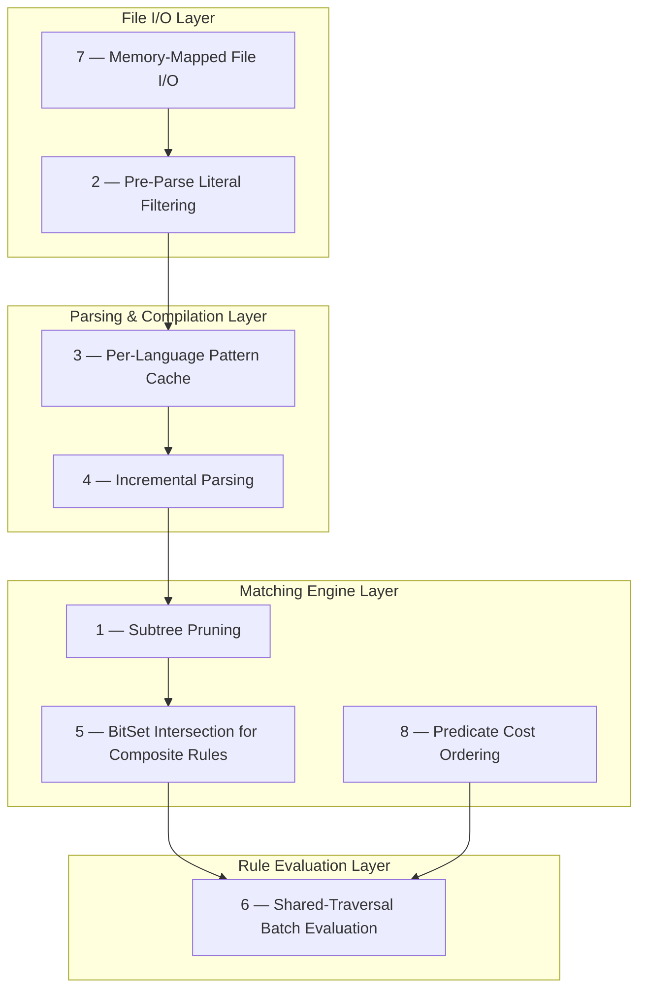

### Impact Summary

| # | Optimisation | Layer | Expected Speedup | Complexity | Priority |
|---|---|---|---|---|---|
| 1 | Subtree Pruning During DFS | Core | High | Medium | P0 |
| 2 | Pre-Parse Literal Filtering | CLI | Very High | Low | P0 |
| 3 | Per-Language Pattern Cache | CLI | Medium | Low | P0 |
| 4 | Incremental Parsing | Core / LSP | High (LSP) | High | P1 |
| 5 | BitSet Intersection for Composite Rules | Config | Medium | Low | P1 |
| 6 | Shared-Traversal Batch Evaluation | Config / CLI | High | Medium | P1 |
| 7 | Memory-Mapped File I/O | CLI | Medium | Low | P2 |
| 8 | Predicate Cost Ordering | Config | Low–Medium | Low | P2 |

**Sources:** [crates/core/src/node.rs319-336](https://github.com/ast-grep/ast-grep/blob/3ae01aec/crates/core/src/node.rs#L319-L336) [crates/core/src/matcher.rs24-48](https://github.com/ast-grep/ast-grep/blob/3ae01aec/crates/core/src/matcher.rs#L24-L48) [crates/cli/src/run.rs187-258](https://github.com/ast-grep/ast-grep/blob/3ae01aec/crates/cli/src/run.rs#L187-L258) [crates/cli/src/scan.rs226-278](https://github.com/ast-grep/ast-grep/blob/3ae01aec/crates/cli/src/scan.rs#L226-L278)

---

## 1. Subtree Pruning During DFS

### Motivation

The current `find_all` implementation performs a full depth-first traversal of every node in the AST. The `potential_kinds()` optimisation filters individual nodes by their kind ID, but it never skips an entire subtree. If a subtree root's kind is known to never contain a descendant of the target kind, the entire subtree can be bypassed.

### Current Behaviour

```rust
// crates/core/src/node.rs — find_all (simplified)
fn find_all<M: Matcher<D>>(&self, matcher: &M) -> impl Iterator<Item = NodeMatch<D>> {
    let kinds = matcher.potential_kinds();
    self.dfs().filter_map(move |node| {
        if let Some(k) = &kinds {
            if !k.contains(node.kind_id()) {
                return None; // skip this node, but still visit children
            }
        }
        matcher.match_node(node)
    })
}
```

The DFS iterator yields every node regardless. Even when a node is rejected by the kind check, its children are still visited.

### Proposed Design

#### 1.1 Reachable-Kinds Index

Build a compile-time (or lazily-initialised, per-grammar) lookup table mapping each node kind to the set of kinds that can appear as its descendants.

```rust
/// Precomputed per tree-sitter grammar.
/// reachable_kinds[kind_id] = BitSet of all kind IDs reachable as descendants.
struct ReachableKindsIndex {
    table: Vec<BitSet>,
}

impl ReachableKindsIndex {
    /// Built once per Language from the grammar's node-type metadata.
    fn build(lang: &impl Language) -> Self { /* ... */ }

    /// Returns true if `parent_kind` can contain `descendant_kind` anywhere below it.
    fn can_contain(&self, parent_kind: u16, descendant_kind: u16) -> bool {
        self.table[parent_kind as usize].contains(descendant_kind as usize)
    }

    /// Returns true if `parent_kind` can contain ANY kind in the target set.
    fn can_contain_any(&self, parent_kind: u16, target_kinds: &BitSet) -> bool {
        !self.table[parent_kind as usize].is_disjoint(target_kinds)
    }
}
```

#### 1.2 Pruning DFS Iterator

Replace the flat `dfs()` iterator with a pruning variant:

```rust
fn find_all_pruned<M: Matcher<D>>(
    &self,
    matcher: &M,
    index: &ReachableKindsIndex,
) -> impl Iterator<Item = NodeMatch<D>> {
    let target_kinds = matcher.potential_kinds();
    self.dfs_pruned(move |node| {
        if let Some(targets) = &target_kinds {
            // If this subtree cannot contain any target kind, skip entirely
            if !index.can_contain_any(node.kind_id(), targets) {
                return DfsAction::SkipSubtree;
            }
            // If this node itself is not a target kind, skip matching but visit children
            if !targets.contains(node.kind_id()) {
                return DfsAction::SkipNode;
            }
        }
        DfsAction::Visit
    })
}
```

#### Architecture Diagram

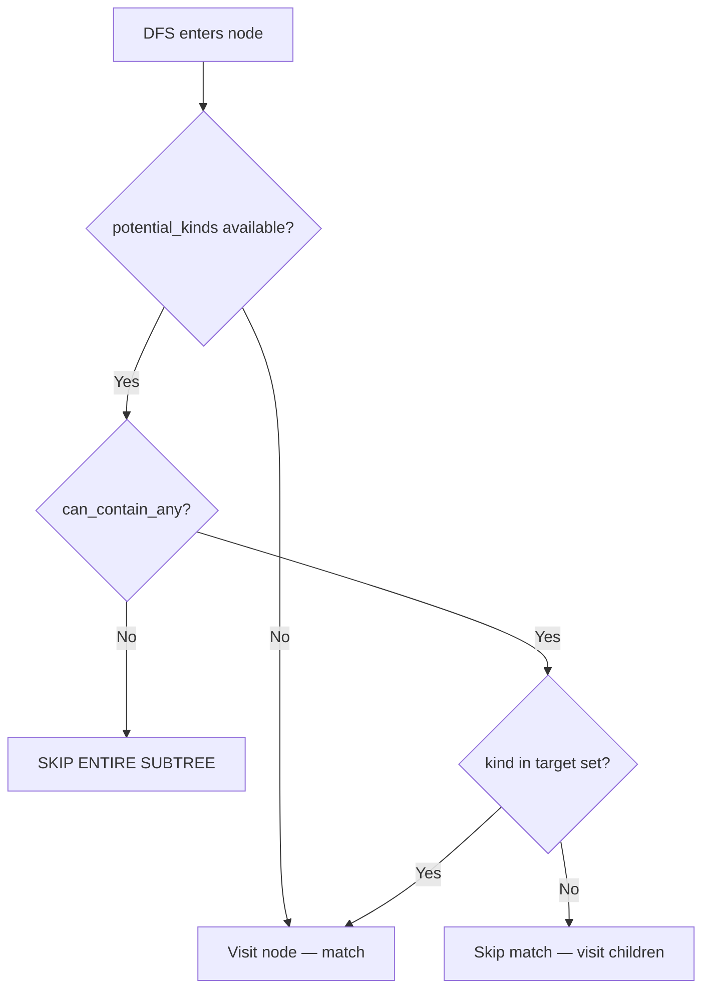

### Affected Crates

| Crate | Change |
|-------|--------|
| `ast-grep-core` | New `ReachableKindsIndex`, `dfs_pruned()` on `Node` |
| `ast-grep-language` | Build and cache index per `SupportLang` |
| `ast-grep-config` | Use pruned traversal in `CombinedScan` |

### Risks and Mitigations

- **Grammar metadata accuracy:** Tree-sitter's `node-types.json` may not capture all dynamic productions. Mitigation: fall back to full DFS when the index is unavailable.
- **Index memory:** One `BitSet` per kind (typically < 300 kinds × 300 bits ≈ 11 KB per language). Negligible.

**Sources:** [crates/core/src/node.rs311-336](https://github.com/ast-grep/ast-grep/blob/3ae01aec/crates/core/src/node.rs#L311-L336) [crates/core/src/matcher.rs37-41](https://github.com/ast-grep/ast-grep/blob/3ae01aec/crates/core/src/matcher.rs#L37-L41)

---

## 2. Pre-Parse Literal Filtering

### Motivation

Parsing a file into an AST via tree-sitter is the single most expensive per-file operation. Many files in a codebase will not contain the literal substrings present in the search pattern and can be rejected before parsing.

### Current Behaviour

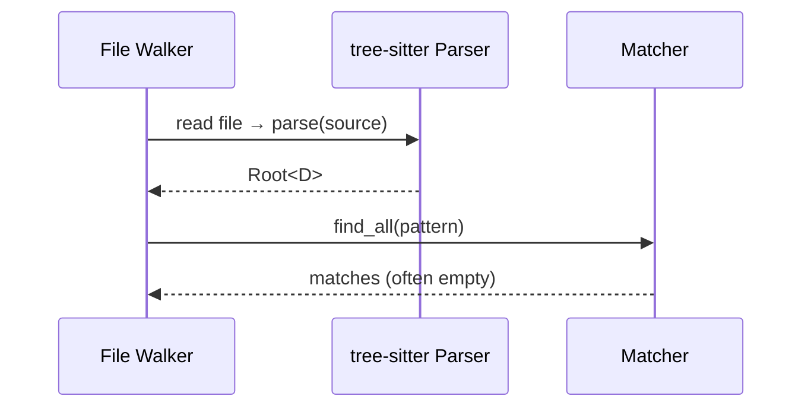

Every file matching the language extension is parsed, even if it cannot possibly contain the pattern.

### Proposed Design

#### 2.1 Literal Extraction from Patterns

At pattern compilation time, extract all literal (non-meta-variable) tokens from the pattern AST:

```rust
impl Pattern {
    /// Returns literal substrings that MUST appear in any file matching this pattern.
    fn required_literals(&self) -> Vec<&str> {
        self.ast.dfs()
            .filter(|n| n.is_leaf() && !n.is_meta_variable())
            .map(|n| n.text())
            .collect()
    }
}
```

For pattern `console.log($ARG)`, this produces `["console", ".", "log", "(", ")"]`.

#### 2.2 Pre-Parse Check

Before invoking tree-sitter, scan the raw file bytes for the presence of required literals:

```rust
fn should_parse(content: &[u8], literals: &[&str]) -> bool {
    literals.iter().all(|lit| {
        memchr::memmem::find(content, lit.as_bytes()).is_some()
    })
}
```

#### 2.3 Updated Pipeline

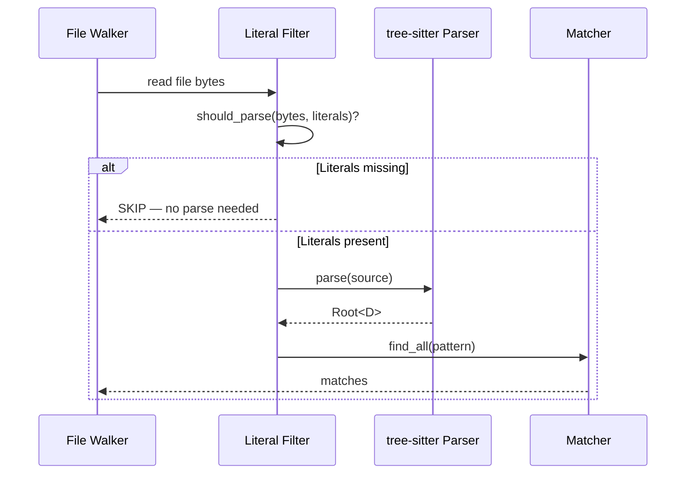

#### 2.4 Integration Points

| Component | Change |
|-----------|--------|
| `Pattern` | New `required_literals()` method |
| `RunWithSpecificLang` | Call `should_parse()` before `match_one_file()` |
| `RunWithInferredLang` | Call `should_parse()` before `match_one_file()` |
| `ScanWithConfig` | Call per-rule literal checks in `produce_item()` |
| `Worker` trait | Optional `pre_filter(&self, content: &[u8]) -> bool` hook |

### Performance Estimate

In a typical web project, a pattern like `console.log($ARG)` in JavaScript files:
- ~500 `.js` files scanned
- ~30 contain `"console"` → only these 30 are parsed
- **~94% of tree-sitter parse calls eliminated**

### Risks and Mitigations

- **False negatives:** Impossible. If a literal is missing, the pattern cannot match. The filter is conservative.
- **Overhead of byte scanning:** `memchr::memmem` operates at SIMD speed; ~2 orders of magnitude faster than tree-sitter parsing.
- **Patterns with no literals:** Patterns like `$A($B)` produce no required literals. The filter is simply skipped (no regression).

**Sources:** [crates/cli/src/run.rs370-393](https://github.com/ast-grep/ast-grep/blob/3ae01aec/crates/cli/src/run.rs#L370-L393) [crates/cli/src/run.rs260-344](https://github.com/ast-grep/ast-grep/blob/3ae01aec/crates/cli/src/run.rs#L260-L344)

---

## 3. Per-Language Pattern Cache for Inferred-Language Mode

### Motivation

When the user runs `sg run -p 'pattern'` without `--lang`, `RunWithInferredLang` detects the language from each file's extension and recompiles the `Pattern` for every file. If a codebase has 1 000 `.js` files, the identical JavaScript `Pattern` is compiled 1 000 times.

### Current Behaviour

```rust
// crates/cli/src/run.rs — RunWithInferredLang (simplified)
fn match_one_file(&self, path: &Path, content: &str) -> Result<Vec<MatchUnit>> {
    let lang = SgLang::from_path(path)?;
    let pattern = Pattern::new(&self.args.pattern, lang)?;  // compiled every time
    // ... match using pattern
}
```

### Proposed Design

Cache compiled patterns in a concurrent hash map keyed by language:

```rust
use dashmap::DashMap;  // already a workspace dependency

struct RunWithInferredLang {
    args: RunArg,
    pattern_cache: DashMap<SgLang, Pattern>,
}

impl RunWithInferredLang {
    fn get_or_compile_pattern(&self, lang: SgLang) -> Result<Pattern> {
        if let Some(cached) = self.pattern_cache.get(&lang) {
            return Ok(cached.clone());
        }
        let pattern = Pattern::new(&self.args.pattern, lang)?;
        self.pattern_cache.insert(lang, pattern.clone());
        Ok(pattern)
    }
}
```

### Architecture Diagram

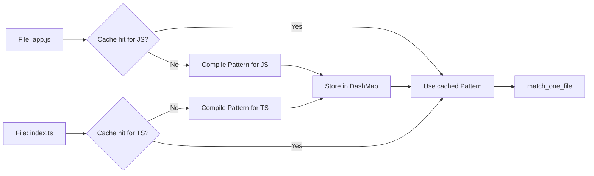

### Affected Crates

| Crate | Change |
|-------|--------|
| `ast-grep` (CLI) | `RunWithInferredLang` gains `DashMap<SgLang, Pattern>` field |

### Complexity

Low — `DashMap` is already in `Cargo.toml` as a workspace dependency. The change is roughly 15 lines of code.

**Sources:** [crates/cli/src/run.rs187-258](https://github.com/ast-grep/ast-grep/blob/3ae01aec/crates/cli/src/run.rs#L187-L258) [Cargo.toml23-40](https://github.com/ast-grep/ast-grep/blob/3ae01aec/Cargo.toml#L23-L40)

---

## 4. Incremental Parsing for LSP and Repeated Scans

### Motivation

The LSP server and repeated `scan` invocations on the same codebase re-parse every file from scratch. Tree-sitter natively supports incremental parsing: given an old parse tree and a description of the edit, it can reparse in O(edit size) rather than O(file size).

### Current Behaviour

```rust
// Every invocation creates a fresh Root
let root = Root::new(source_text, lang);  // full parse every time
```

In the LSP, every `textDocument/didChange` event triggers a complete reparse.

### Proposed Design

#### 4.1 Parse Cache

```rust
use dashmap::DashMap;
use std::path::PathBuf;

struct ParseCache {
    /// Maps file path → (last-known source text, parsed tree)
    entries: DashMap<PathBuf, CacheEntry>,
}

struct CacheEntry {
    source: String,
    tree: tree_sitter::Tree,
    version: u64,
}
```

#### 4.2 Incremental Reparse

```rust
impl ParseCache {
    fn parse_or_reuse(
        &self,
        path: &Path,
        new_source: &str,
        lang: &impl Language,
    ) -> Root<StrDoc> {
        if let Some(mut entry) = self.entries.get_mut(path) {
            if entry.source == new_source {
                // Source unchanged — reuse tree
                return Root::from_tree(entry.tree.clone(), new_source, lang);
            }
            // Compute edit from old → new source
            let edits = compute_tree_sitter_edits(&entry.source, new_source);
            let mut old_tree = entry.tree.clone();
            for edit in &edits {
                old_tree.edit(edit);
            }
            let mut parser = lang.new_parser();
            let new_tree = parser.parse(new_source, Some(&old_tree)).unwrap();
            entry.source = new_source.to_string();
            entry.tree = new_tree.clone();
            entry.version += 1;
            return Root::from_tree(new_tree, new_source, lang);
        }
        // First parse — no cache entry
        let root = Root::new(new_source, lang);
        self.entries.insert(path.to_path_buf(), CacheEntry {
            source: new_source.to_string(),
            tree: root.tree().clone(),
            version: 0,
        });
        root
    }
}
```

#### 4.3 Integration Points

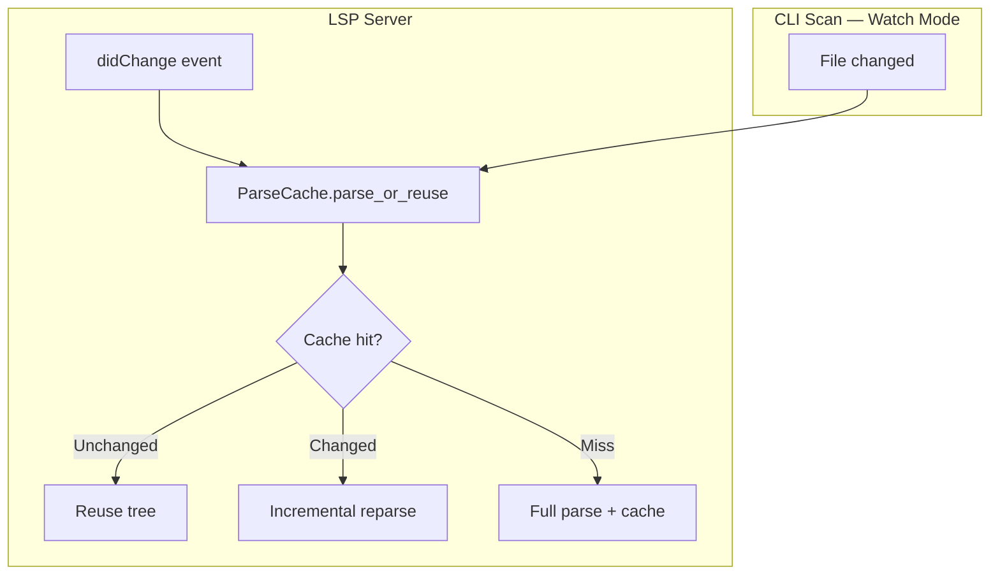

### Affected Crates

| Crate | Change |
|-------|--------|
| `ast-grep-core` | New `Root::from_tree()` constructor; expose `tree()` accessor |
| `ast-grep-lsp` | Integrate `ParseCache` into `Backend` |
| `ast-grep` (CLI) | Optional cache for future `--watch` mode |

### Risks and Mitigations

- **Memory usage:** Cached trees consume memory proportional to file count. Mitigation: LRU eviction policy with configurable max entries.
- **Cache invalidation:** File system changes between invocations. Mitigation: compare file modification time or content hash before reuse.
- **Thread safety:** `DashMap` handles concurrent access. Tree-sitter trees are `Send` but not `Sync`; cloning before use is required.

**Sources:** [crates/core/src/node.rs47-112](https://github.com/ast-grep/ast-grep/blob/3ae01aec/crates/core/src/node.rs#L47-L112) [crates/lsp/Cargo.toml](https://github.com/ast-grep/ast-grep/blob/3ae01aec/crates/lsp/Cargo.toml)

---

## 5. BitSet Intersection for Composite Rules

### Motivation

Composite rules using `all` / `any` / `not` combinators each independently compute `potential_kinds()`. When sub-matchers are combined with `all` (logical AND), the effective candidate set is the **intersection** of their individual BitSets. Currently, each sub-matcher is evaluated independently, potentially visiting nodes that another sub-matcher would have immediately rejected.

### Current Behaviour

```rust
// Conceptual — crates/config/src/rule.rs
enum Rule {
    All(Vec<Box<dyn Matcher>>),
    Any(Vec<Box<dyn Matcher>>),
    Not(Box<dyn Matcher>),
    // ...
}

impl Matcher for AllRule {
    fn potential_kinds(&self) -> Option<BitSet> {
        // Currently returns the first sub-matcher's kinds, or None
        self.rules.first()?.potential_kinds()
    }
}
```

### Proposed Design

Compute the tightest possible BitSet for composite rules:

```rust
impl Matcher for AllRule {
    fn potential_kinds(&self) -> Option<BitSet> {
        let mut result: Option<BitSet> = None;
        for rule in &self.rules {
            if let Some(kinds) = rule.potential_kinds() {
                result = Some(match result {
                    Some(existing) => {
                        let mut intersected = existing;
                        intersected.intersect_with(&kinds);
                        intersected
                    }
                    None => kinds,
                });
            }
        }
        result
    }
}

impl Matcher for AnyRule {
    fn potential_kinds(&self) -> Option<BitSet> {
        let mut result = BitSet::new();
        let mut all_have_kinds = true;
        for rule in &self.rules {
            match rule.potential_kinds() {
                Some(kinds) => result.union_with(&kinds),
                None => { all_have_kinds = false; break; }
            }
        }
        if all_have_kinds { Some(result) } else { None }
    }
}
```

### Truth Table

| Combinator | Operation on BitSets | Rationale |
|---|---|---|
| `all` (AND) | Intersection | A node must satisfy ALL sub-matchers, so it must be in every set |
| `any` (OR) | Union | A node can satisfy ANY sub-matcher, so it can be in any set |
| `not` | Passthrough (no narrowing) | Negation doesn't constrain what kinds CAN match |

### Architecture Diagram

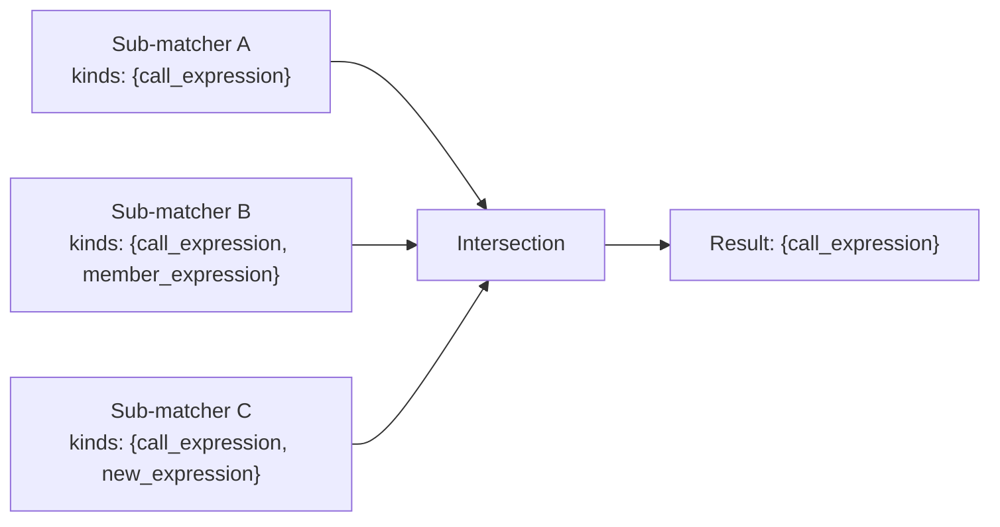

### Affected Crates

| Crate | Change |
|-------|--------|
| `ast-grep-config` | `AllRule::potential_kinds()`, `AnyRule::potential_kinds()` |

**Sources:** [crates/core/src/matcher.rs37-41](https://github.com/ast-grep/ast-grep/blob/3ae01aec/crates/core/src/matcher.rs#L37-L41) [crates/config/src/rule_core.rs1-451](https://github.com/ast-grep/ast-grep/blob/3ae01aec/crates/config/src/rule_core.rs#L1-L451)

---

## 6. Shared-Traversal Batch Rule Evaluation

### Motivation

The `scan` command applies a `RuleCollection` containing potentially hundreds of rules to each file. If each rule triggers its own DFS traversal, the same AST is walked N times for N rules. By grouping rules by their `potential_kinds()` and dispatching during a **single shared traversal**, the cost is reduced from O(N × nodes) to O(nodes × avg_rules_per_kind).

### Current Behaviour

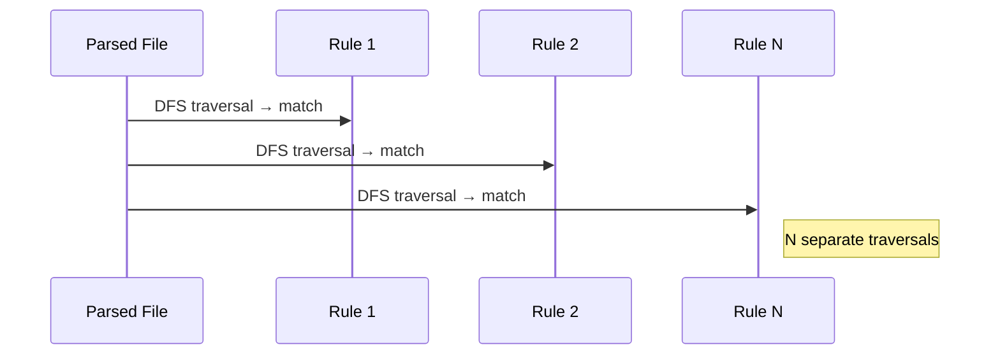

### Proposed Design

#### 6.1 Kind-Indexed Rule Dispatch Table

```rust
struct BatchScanner {
    /// Maps kind_id → list of rules interested in that kind
    dispatch: HashMap<u16, Vec<&RuleCore>>,
    /// Rules with no potential_kinds (match any kind)
    wildcard_rules: Vec<&RuleCore>,
}

impl BatchScanner {
    fn build(rules: &[RuleCore]) -> Self {
        let mut dispatch: HashMap<u16, Vec<&RuleCore>> = HashMap::new();
        let mut wildcard_rules = Vec::new();

        for rule in rules {
            match rule.potential_kinds() {
                Some(kinds) => {
                    for kind_id in kinds.iter() {
                        dispatch.entry(kind_id as u16)
                            .or_default()
                            .push(rule);
                    }
                }
                None => wildcard_rules.push(rule),
            }
        }

        Self { dispatch, wildcard_rules }
    }
}
```

#### 6.2 Single-Pass Evaluation

```rust
impl BatchScanner {
    fn scan_document(&self, root: &Root<impl Doc>) -> Vec<(RuleId, NodeMatch)> {
        let mut results = Vec::new();

        for node in root.root().dfs() {
            let kind_id = node.kind_id();

            // Check rules registered for this specific kind
            if let Some(rules) = self.dispatch.get(&kind_id) {
                for rule in rules {
                    if let Some(m) = rule.match_node(node.clone()) {
                        results.push((rule.id(), m));
                    }
                }
            }

            // Check wildcard rules (always)
            for rule in &self.wildcard_rules {
                if let Some(m) = rule.match_node(node.clone()) {
                    results.push((rule.id(), m));
                }
            }
        }

        results
    }
}
```

#### 6.3 Architecture Diagram

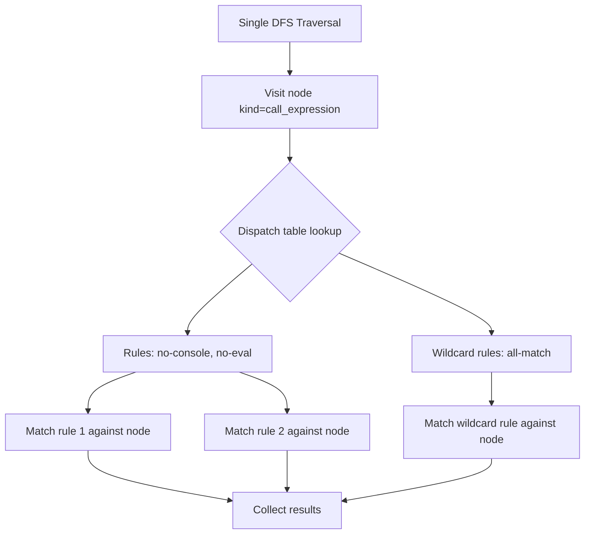

### Affected Crates

| Crate | Change |
|-------|--------|
| `ast-grep-config` | New `BatchScanner` type alongside `CombinedScan` |
| `ast-grep` (CLI) | `ScanWithConfig::produce_item()` uses `BatchScanner` |

### Performance Estimate

With 100 rules and an average of 5 kinds per rule across a grammar with ~300 kinds:
- Dispatch table density: ~1.7 rules per kind on average
- **Traversals reduced from 100 to 1**, with O(1) dispatch per node

**Sources:** [crates/cli/src/scan.rs226-278](https://github.com/ast-grep/ast-grep/blob/3ae01aec/crates/cli/src/scan.rs#L226-L278) [crates/config/src/rule_core.rs1-451](https://github.com/ast-grep/ast-grep/blob/3ae01aec/crates/config/src/rule_core.rs#L1-L451)

---

## 7. Memory-Mapped File I/O

### Motivation

The current file pipeline reads each file into a heap-allocated `String` via `std::fs::read_to_string()`. For large monorepos with thousands of files, this creates allocation pressure and unnecessary data copies. Memory mapping (`mmap`) lets the operating system map file pages directly into the process's address space, avoiding the user-space copy.

### Current Behaviour

```rust
// Typical file reading in the CLI walker
let content = std::fs::read_to_string(&path)?;
let root = Root::new(&content, lang);
```

### Proposed Design

#### 7.1 MmapDoc Implementation

```rust
use memmap2::Mmap;

struct MmapDoc {
    mmap: Mmap,
    lang: SupportLang,
    tree: tree_sitter::Tree,
}

impl Doc for MmapDoc {
    type Source = [u8];
    type Lang = SupportLang;

    fn get_source(&self) -> &[u8] {
        &self.mmap[..]
    }

    fn get_lang(&self) -> &SupportLang {
        &self.lang
    }
}
```

#### 7.2 File Size Threshold

Only use mmap for files above a configurable threshold (e.g., 64 KB). Small files are faster with `read_to_string()` due to mmap's per-call overhead (system call + page table setup).

```rust
const MMAP_THRESHOLD: u64 = 64 * 1024; // 64 KB

fn read_file(path: &Path) -> FileContent {
    let metadata = std::fs::metadata(path).unwrap();
    if metadata.len() >= MMAP_THRESHOLD {
        let file = std::fs::File::open(path).unwrap();
        let mmap = unsafe { Mmap::map(&file).unwrap() };
        FileContent::Mapped(mmap)
    } else {
        FileContent::Owned(std::fs::read_to_string(path).unwrap())
    }
}
```

#### Architecture Diagram

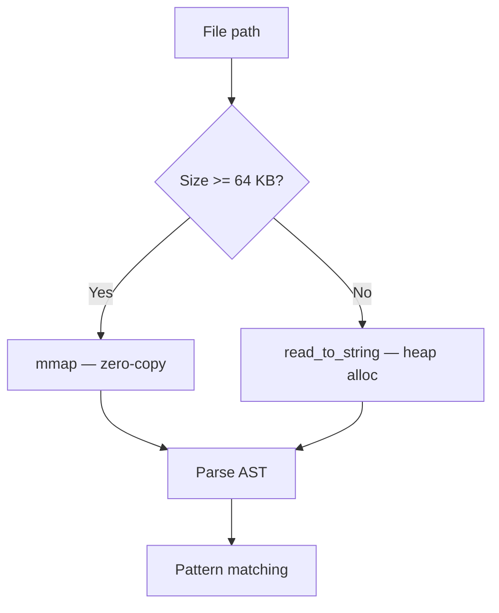

### Affected Crates

| Crate | Change |
|-------|--------|
| `ast-grep-core` | Potentially new `MmapDoc` or allow `&[u8]` source in `Doc` |
| `ast-grep` (CLI) | `read_file()` with threshold logic in `input.rs` |

### Dependencies

- `memmap2` crate (widely used, `unsafe` confined to the mmap call)

### Risks and Mitigations

- **Platform portability:** `memmap2` supports Linux, macOS, and Windows. No issues.
- **File mutation during read:** If another process modifies the file while it is mapped, undefined behaviour may occur. Mitigation: the walker already takes a snapshot of directory state; file changes during a scan are inherently racy regardless of I/O method.
- **UTF-8 validation:** `mmap` returns `&[u8]`, not `&str`. Tree-sitter accepts `&[u8]`, so this is fine for parsing. Text extraction methods on `Node` would need to handle the byte slice.

**Sources:** [crates/cli/src/utils/input.rs](https://github.com/ast-grep/ast-grep/blob/3ae01aec/crates/cli/src/utils/input.rs) [crates/core/src/node.rs47-112](https://github.com/ast-grep/ast-grep/blob/3ae01aec/crates/core/src/node.rs#L47-L112)

---

## 8. Predicate Cost Ordering in Rule Evaluation

### Motivation

YAML rules can combine multiple relational predicates (`has`, `inside`, `follows`, `precedes`) with structural matchers. These predicates have very different costs:

| Predicate | Cost | Reason |
|---|---|---|
| `kind` | O(1) | Single integer comparison |
| `regex` | O(n) on text | Regex engine on node text |
| `pattern` | O(subtree) | Full AST structural match |
| `has` | O(descendants) | DFS on children |
| `inside` | O(ancestors) | Walk up to root |
| `follows` / `precedes` | O(siblings) | Iterate siblings |

If an expensive predicate is evaluated before a cheap one that would have rejected the candidate, time is wasted.

### Current Behaviour

Predicates are evaluated in the order they appear in the YAML rule definition. There is no cost-based reordering.

### Proposed Design

#### 8.1 Predicate Cost Model

Assign a static cost estimate to each predicate type and sort sub-matchers by cost before evaluation:

```rust
trait CostEstimate {
    fn estimated_cost(&self) -> u32;
}

impl CostEstimate for KindMatcher {
    fn estimated_cost(&self) -> u32 { 1 }
}

impl CostEstimate for RegexMatcher {
    fn estimated_cost(&self) -> u32 { 10 }
}

impl CostEstimate for Pattern {
    fn estimated_cost(&self) -> u32 { 100 }
}

impl CostEstimate for HasRelation {
    fn estimated_cost(&self) -> u32 { 500 }
}

impl CostEstimate for InsideRelation {
    fn estimated_cost(&self) -> u32 { 200 }
}
```

#### 8.2 Rule Compilation with Sorting

During rule compilation (`SerializableRuleCore` → `RuleCore`), sort `all` sub-matchers by ascending cost:

```rust
impl RuleCore {
    fn compile(serializable: SerializableRuleCore) -> Self {
        let mut matchers = serializable.compile_matchers();
        matchers.sort_by_key(|m| m.estimated_cost());
        // First matcher evaluated = cheapest = most likely to reject early
        Self { matchers, /* ... */ }
    }
}
```

#### 8.3 Short-Circuit Evaluation

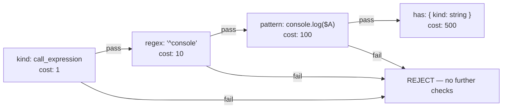

### Affected Crates

| Crate | Change |
|-------|--------|
| `ast-grep-core` | New `CostEstimate` trait |
| `ast-grep-config` | Sort sub-matchers during compilation in `rule_core.rs` |

### Risks and Mitigations

- **Static costs are approximations:** Actual cost depends on AST shape. Mitigation: use conservative estimates; even approximate ordering yields significant gains.
- **Rule semantics must not change:** Reordering is only valid for `all` (AND) rules where all predicates must pass. `any` (OR) rules should try cheapest first too, but stop at first success.

**Sources:** [crates/config/src/rule_core.rs1-451](https://github.com/ast-grep/ast-grep/blob/3ae01aec/crates/config/src/rule_core.rs#L1-L451) [crates/core/src/node.rs190-213](https://github.com/ast-grep/ast-grep/blob/3ae01aec/crates/core/src/node.rs#L190-L213)

---

## End-to-End Optimised Pipeline

The following diagram shows how all eight optimisations integrate into the search pipeline:

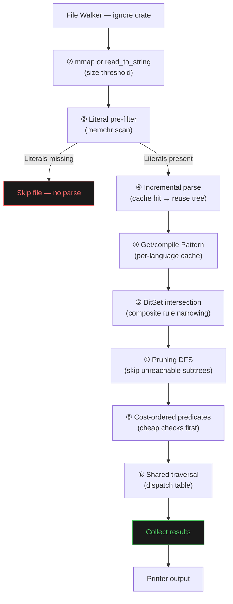

### Pipeline Stage Costs (Estimated)

| Stage | Without Optimisation | With Optimisation | Reduction |
|---|---|---|---|
| File I/O (1 000 files) | 1 000 × `read_to_string` | 1 000 × mmap (large) + read (small) | ~20% I/O time |
| Pre-filter | — | 1 000 × memchr scan | Eliminates ~90% of parses |
| Parsing | 1 000 × full parse | ~100 × parse (post-filter) + cache reuse | ~90% parse time |
| Pattern compile | 1 000 × compile (inferred lang) | ≤ 5 × compile (cached per lang) | ~99% compile time |
| DFS traversal | N rules × all nodes | 1 traversal × dispatch | ~(N-1)/N traversal time |
| Node matching | All nodes checked | Pruned + kind-filtered | ~50–80% match time |
| Predicate eval | Arbitrary order | Cheapest-first | ~30% predicate time |

---

## Implementation Roadmap

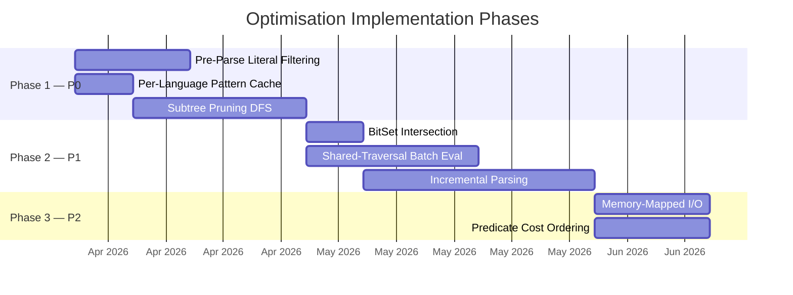

### Phase 1 — Quick Wins (P0)

Focus on the three optimisations with the highest impact-to-effort ratio:
1. **Pre-Parse Literal Filtering** — Eliminates the vast majority of parse calls.
2. **Per-Language Pattern Cache** — Trivial change using existing `DashMap` dependency.
3. **Subtree Pruning** — Reduces work inside the matching engine.

### Phase 2 — Core Engine (P1)

Deeper changes to the matching and rule evaluation architecture:
4. **BitSet Intersection** — Small, low-risk change with measurable impact.
5. **Shared-Traversal Batch Evaluation** — Significant restructuring of `CombinedScan`.
6. **Incremental Parsing** — Primarily benefits the LSP; requires new `ParseCache` type.

### Phase 3 — Polish (P2)

Lower-priority optimisations for marginal gains:
7. **Memory-Mapped I/O** — Adds a new dependency (`memmap2`); benefits large files.
8. **Predicate Cost Ordering** — Small change during rule compilation.

---

## Benchmarking Strategy

Each optimisation should be validated with benchmarks before and after implementation.

### Benchmark Suite

| Benchmark | Description | Measures |
|---|---|---|
| `bench_full_scan` | Scan a large open-source project (e.g., VS Code, ~30 000 files) with 50 rules | End-to-end wall time |
| `bench_single_pattern` | `sg run -p 'console.log($ARG)' -l js` on a 10 000 file repo | Single-pattern search time |
| `bench_inferred_lang` | `sg run -p 'console.log($ARG)'` without `--lang` on a mixed-language repo | Language inference overhead |
| `bench_parse_only` | Parse 1 000 files without matching | Tree-sitter parsing cost |
| `bench_match_only` | Match a pattern against 100 pre-parsed ASTs | Core matching cost |
| `bench_lsp_incremental` | Simulate 100 sequential edits in the LSP | Incremental parse latency |

### Metrics

- **Wall time** (primary metric)
- **CPU instructions** (via `perf stat` or `criterion`)
- **Peak RSS** (memory usage, especially for mmap and parse cache)
- **Files parsed** (counter to validate pre-filter effectiveness)
- **Nodes visited** (counter to validate pruning effectiveness)

---

## Compatibility and Migration Notes

All optimisations are **backward-compatible**. They do not change:
- CLI argument syntax
- YAML rule format
- Match semantics or output format
- Public API surface of `ast-grep-core` or `ast-grep-config`

The optimisations are purely internal performance improvements. Existing rules, configurations, and integrations will continue to work without modification.

**Sources:** [crates/core/src/node.rs1-573](https://github.com/ast-grep/ast-grep/blob/3ae01aec/crates/core/src/node.rs#L1-L573) [crates/core/src/matcher.rs1-141](https://github.com/ast-grep/ast-grep/blob/3ae01aec/crates/core/src/matcher.rs#L1-L141) [crates/cli/src/run.rs1-467](https://github.com/ast-grep/ast-grep/blob/3ae01aec/crates/cli/src/run.rs#L1-L467) [crates/cli/src/scan.rs1-533](https://github.com/ast-grep/ast-grep/blob/3ae01aec/crates/cli/src/scan.rs#L1-L533) [crates/config/src/rule_core.rs1-451](https://github.com/ast-grep/ast-grep/blob/3ae01aec/crates/config/src/rule_core.rs#L1-L451)
